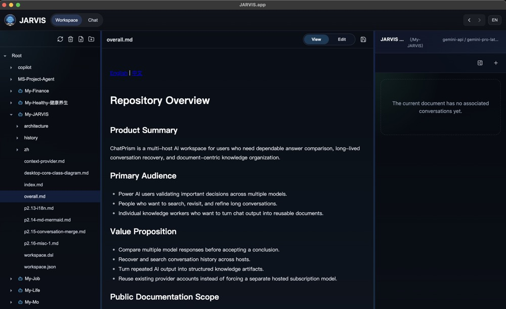
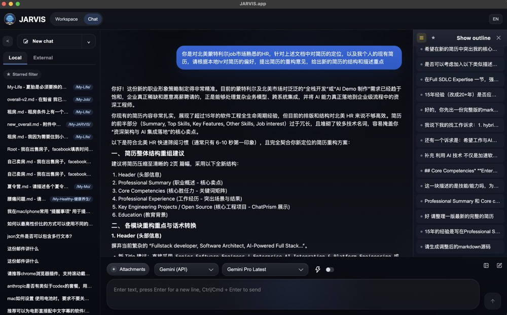

[English](README.md) | [中文](README.zh-CN.md)

# JARVIS

JARVIS 是一个围绕真实问题域持续演进 Markdown 文档的人机协作空间。它面向这样的场景：用户负责提供背景、约束和判断，AI 负责基于这些上下文提出方案、生成修改建议，并将可复用的产出直接沉淀回工作区文档。

JARVIS 不把对话视为一次性聊天记录，而是把文档作为协作的长期中心。它的目标是让人和 AI 共同维护上下文、持续迭代方案，并把讨论过程沉淀为结构化知识。

## 界面截图

## JARVIS 是什么

- 一个按问题域组织的工作区，由树形目录和 Markdown 文档构成。
- 一种目录可绑定专属 Agent 配置的人机协作模型。
- 一个以文档为中心的系统，让用户和 AI 共同编辑同一份文件，而不是只在聊天记录里消费上下文。
- 一座连接讨论与执行的桥梁：JARVIS 负责产出高层方案与知识文档，未来可以把明确方案移交给任务执行系统。

## 核心概念

### 问题域工作区

文档按问题域组织。一个目录代表一个工作范围，并可绑定一个特定 Agent。该 Agent 会以当前目录及其子目录中的文件作为主要上下文，与用户交流和协作创作。

### 柔性 Q/A 约定

JARVIS 使用的是约定，而不是强制格式：

- `Q` 表示用户的问题域、背景信息、约束条件与问题描述。
- `A` 表示候选方案、解法设计和后续迭代结果。

Q 和 A 存放在同一个 Markdown 文档中。随着对话深入，用户和 AI 都可以同时修改任一部分。系统底层并不强制校验这个结构，而是支持块级文档协作，让这种 Q/A 模式保持柔性。

### 上下文组装

用户提问时，系统可以从多层来源组装上下文：

- 当前活跃文档。
- 用户通过 `@` 显式引入的文件。
- Agent 根据目录范围和文档摘要自主挑选的相关文件。

这样可以让 AI 在长周期协作中持续获得上下文，而不必把所有信息都塞进单次对话。

### 块级 Diff 与合并

AI 不直接覆盖文档内容，而是面向活跃 Markdown 文档生成基于段落或块的变更计划。用户查看这些差异后，决定接受或拒绝，再将确认后的内容合并回文档。

### 保存即刷新摘要

任何文档保存动作，无论来自手工编辑还是确认合并，都会触发一次异步后台摘要刷新。摘要会作为后续上下文检索的索引，帮助 Agent 更准确地发现相关文件。

## 工作流程

1. 用户把需要共享的文档放入按问题域组织的树形工作区。
2. 为某个目录绑定对应的 Agent 配置。
3. 用户发起问题，并可通过 `@` 强制引入特定文件。
4. Agent 从活跃文档、显式引用文件和相关摘要中组装上下文。
5. Agent 在对话中给出分析与方案，并提出面向活跃文档的块级修改建议。
6. 用户审核差异并合并接受的修改。
7. 文档保存后，系统刷新摘要，为后续检索提供最新索引。

## 产品边界

- JARVIS 不是以任务执行为核心的系统，而是文本层面的知识与方案产出中枢。
- 它的核心协作对象是 Markdown 文档，而不是代码 AST 或强类型业务对象。
- Q/A 模式是用户最佳实践约定，不是系统强校验规则。

## 当前状态与风险

当前 README 的产品方向以 [docs/new_overall.md](docs/new_overall.md) 为准。仓库中仍有部分材料保留了更早期的“多宿主 AI 工作台”表述，因此这里应视为当前产品意图，而旧架构文档更多用于理解现有实现背景。

当前产品文档中已明确的关键风险包括：

- 摘要刷新需要防抖或队列机制，避免频繁保存导致状态冲突。
- 长文档场景下，模型可能更新了 `A` 却没有完整同步更新 `Q`。
- 摘要异步刷新失败需要可见的状态提示，避免系统静默依赖过期上下文。
- Markdown 的块级 Diff 颗粒度算法仍需工程验证。

## 文档入口

- 产品方向说明：[docs/new_overall.md](docs/new_overall.md)
- 架构总览：[ARCHITECTURE.zh-CN.md](ARCHITECTURE.zh-CN.md)
- 贡献指南：[CONTRIBUTING.zh-CN.md](CONTRIBUTING.zh-CN.md)
- 安全策略：[SECURITY.md](SECURITY.md)
- 仓库术语表：[GLOSSARY.md](GLOSSARY.md)
- 当前实现背景的 C4 设计源：[docs/workspace.dsl](docs/workspace.dsl)

## 许可证

本仓库采用 [MIT License](LICENSE) 发布。
