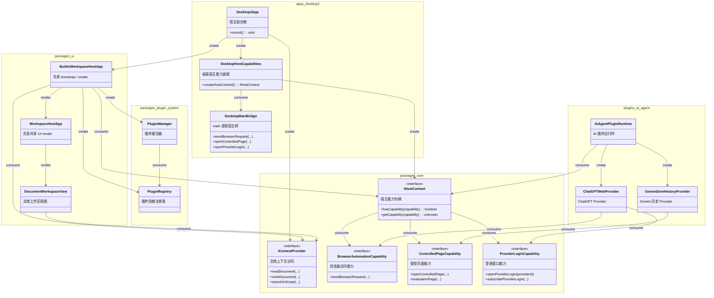

# App Desktop2

本文描述 `apps/desktop2` 的目标设计：Desktop 宿主只负责创建通用宿主能力与上下文访问能力，并将它们交给共享 UI 与插件系统消费；ChatGPT / Gemini 等业务能力仍归插件内部组织，不再由 app 直接依赖插件实现。

## Class Diagram

## Notes

* `Desktop2App`
  用途：`apps/desktop2` 的宿主组合根，负责创建 `IHostContext`、`IContextProvider` 与 UI 入口。
  被谁 consume：`BuiltinWorkspaceHostApp` consume 它交出的宿主能力与上下文能力。
  使用场景：Desktop renderer 启动时完成最外层组装，不直接感知 AI 插件实现。

* `DesktopHostCapabilities`
  用途：Desktop 宿主能力装配层，负责把浏览器访问、受控页面、登录窗口等桌面能力注册到 `IHostContext`。
  被谁 consume：由 `Desktop2App` create；由 UI / 插件通过 `IHostContext` 间接 consume。
  使用场景：宿主需要暴露 Electron main、preload、受控页面相关能力时，在这里完成收敛。

* `DesktopMainBridge`
  用途：main 进程侧的实际执行桥，承载 provider 请求转发、受控页面操作、登录窗口管理。
  被谁 consume：由 `DesktopHostCapabilities` consume。
  使用场景：保留 Desktop 必需的跨进程链路，但不把 main 进程实现直接暴露给 UI 或插件。

* `BrowserAutomationCapability`
  用途：通用浏览器访问能力，只表达“向宿主浏览器会话发请求”，不包含 ChatGPT/Gemini 历史等业务语义。
  被谁 consume：由 AI plugin 内部的 `ChatGPTWebProvider` 等具体 provider consume。
  使用场景：ChatGPT/Gemini provider 需要借助桌面宿主浏览器会话执行请求时使用。

* `ControlledPageCapability`
  用途：通用受控页面能力，只表达“打开页面、注入脚本、读取页面状态”等能力，不直接表达历史业务。
  被谁 consume：由 AI plugin 内部的 `GeminiDomHistoryProvider` 等具体历史 provider consume。
  使用场景：Gemini 历史、ChatGPT 页面信息等需要受控页面操作时使用。

* `ProviderLoginCapability`
  用途：通用登录窗口能力，只负责打开 provider 登录窗口与订阅登录状态事件。
  被谁 consume：由 AI plugin 内部的 `ChatGPTWebProvider` 等具体 provider consume。
  使用场景：需要触发 ChatGPT/Gemini 登录或监听登录完成事件时使用。

* `IContextProvider`
  用途：知识工作区上下文访问能力，负责目录树、文档读写、搜索与节点管理。
  被谁 consume：`BuiltinWorkspaceHostApp` 与 `DocumentWorkspaceView` consume。
  使用场景：Desktop 与 `web2` 一样，工作区主链继续通过 `IContextProvider` 驱动。

* `BuiltinWorkspaceHostApp`
  用途：共享 UI 宿主入口，负责 bootstrap、创建插件系统运行时并渲染共享工作区壳。
  被谁 consume：由 `Desktop2App` create。
  使用场景：保持 `apps/desktop2 -> packages/ui -> packages/plugin-system` 的主链不变。

* `ChatGPTWebProvider` / `GeminiDomHistoryProvider`
  用途：AI 插件内部的实际业务类。它们直接消费宿主提供的通用 capability，而不是要求 app 侧再额外包一层 facade。
  被谁 consume：由 `AiAgentPluginRuntime` create 并 consume。
  使用场景：Desktop 模式下直接使用宿主 capability；Web 模式下继续走 `web2` 当前路径。

## Dependency Constraints

* `apps/desktop2` 是并行新增宿主，不是对现有 `apps/desktop` 的立即替换；创建 `desktop2` 后，原有 `desktop app` 必须继续可用。

* `apps/desktop2` 只做宿主组合根与宿主能力装配，只依赖 `packages/ui`、`packages/core`、`packages/node` 等宿主合法层，不直接依赖 `packages/plugin-system` 或任何 `plugins/*`。

* Desktop 宿主向上层暴露的是通用浏览器 capability，例如浏览器访问、受控页面、登录窗口，而不是 `getHistory`、`provider executor` 之类业务化接口。

* ChatGPT / Gemini 的 provider、history、login 等业务行为仍然属于 AI 插件内部实现；宿主只提供 capability，不承担业务编排。

* 插件启用与装配必须继续留在 `BuiltinWorkspaceHostApp -> PluginManager -> PluginRegistry` 这条链路中，而不是回流到桌面宿主入口。

* `web2` 是宿主边界的主要参照：宿主负责暴露 capability 与 context，上层负责业务装配。Desktop 可以因为跨进程/受控页面差异而多出 capability，但不应多出 `app -> plugin` 的直接依赖。

## Refactor Plan

### Goal

将 `desktop2` 当前直接依赖 `plugin-system` / `plugins/ai-agent` 的桌面专用桥接，重构为“宿主暴露通用 capability，现有 provider/history 业务类直接消费这些 capability”的形态。目标不是删除 Desktop 专有链路，而是把它从 `app -> plugin` 依赖改造成 `app -> core capability`、`plugin -> core capability`。

### Step 1

在 `packages/core` 定义通用宿主浏览器 capability 契约。

文件：

* `packages/core/src/interfaces/IHostContext.ts`

* 新增 capability 相关接口文件，例如：

  * `packages/core/src/interfaces/BrowserAutomationCapability.ts`

  * `packages/core/src/interfaces/ControlledPageCapability.ts`

  * `packages/core/src/interfaces/ProviderLoginCapability.ts`

方法签名方向：

* `sendBrowserRequest(...): Promise<...>`

* `openControlledPage(...): Promise<...>`

* `evaluateInPage(...): Promise<...>`

* `openProviderLogin(providerId: string): Promise<void>`

* `subscribeProviderLogin(...): () => void`

内容：

* 在 `core` 中只定义宿主 capability，不定义 `history`、`provider` 这类业务语义接口。

* 将 capability key 注册进 `HostCapabilityKey`，保持对插件实现无编译期依赖。

### Step 2

将 `apps/desktop2` 的桌面桥接改为 capability 实现。

文件：

* `apps/desktop2/main/createDesktopMainHostContext.ts`

* `apps/desktop2/main/providerHost.ts`

* `apps/desktop2/main/preload.ts`

* `apps/desktop2/shared/proxyProtocol.ts`

* `apps/desktop2/src/context/createDesktop2HostContext.ts`

* `apps/desktop2/main/authIpc.ts`

* `apps/desktop2/main/authWindow.ts`

方法签名方向：

* `createDesktopMainHostContext(...)`

* `createDesktop2HostContext()`

内容：

* 让 Desktop main 继续保留 provider 请求转发、受控页面管理、登录窗口职责。

* 但 renderer 侧只通过 `chatprismDesktop` 与 `IHostContext` 暴露通用 capability。

* task-service 的写法继续对齐 `web2`：宿主只暴露 capability，不引用 task plugin API 类型。

### Step 3

保持 `packages/ui` 的 builtin runtime 入口统一，并优先走 capability-first。

文件：

* `packages/ui/src/bootstrap/createBuiltinWorkspaceRuntime.ts`

* `packages/ui/index.ts`

方法签名：

* `createBuiltinWorkspaceRuntime(options: CreateBuiltinWorkspaceRuntimeOptions)`

内容：

* 保持 `web2` / `desktop2` 统一入口形状。

* runtime 只感知 `hostContext` 是否提供某些 capability，不要求 app 传入 plugin 专属 class。

* 不让 `apps/*` 自己构造 provider proxy / history proxy。

### Step 4

将 `plugins/ai-agent` 改为消费宿主 capability，并把业务适配留在插件内部。

文件：

* `plugins/ai-agent/src/runtime/plugin/createAiAgentPlugin.ts`

* `plugins/ai-agent/api.ts`

方法签名方向：

* `createAiAgentPlugin(options: AiAgentPluginOptions)`

内容：

* 让 AI plugin 在 Desktop 模式下优先从 `IHostContext` 读取 `BrowserAutomationCapability`、`ControlledPageCapability`、`ProviderLoginCapability`。

* 让 `ChatGPTWebProvider`、`GeminiDomHistoryProvider` 等现有业务类直接消费这些 capability，而不是在它们前面再加一层额外 facade。

* `apps/desktop2` 不再直接 import `DesktopProxyProvider`、`DesktopHistoryProxy`、`createDesktopAiHostAdapter` 等插件实现。

### Step 5

删除 `desktop2` 中当前多出来的非法依赖，并收敛到与 `web2` 一致的宿主边界。

文件：

* `apps/desktop2/package.json`

* `apps/desktop2/src/runtime/createDesktop2RuntimeOptions.ts`

* `apps/desktop2/src/pluginConfig.ts`

* `apps/desktop2/main/contextIpc.ts`

* `apps/desktop2/src/env.d.ts`

* `apps/desktop2/main/contextIpc.test.ts`

* `apps/desktop2/src/utils/DesktopProxyProvider.test.ts`

* `apps/desktop2/src/utils/DesktopHistoryProxy.test.ts`

内容：

* 删除未接入主链的 `src/pluginConfig.ts` 遗留路径。

* 让 `createDesktop2RuntimeOptions()` 尽量收敛到 `web2` 同形：只传 `hostContext`、runtime 配置与 plugin enablement。

* capability 改造完成后，删除 `apps/desktop2` 对 `@packages/plugin-system`、`@plugins/*` 的直接依赖声明与源码 import，包括测试文件中的同类 import。

