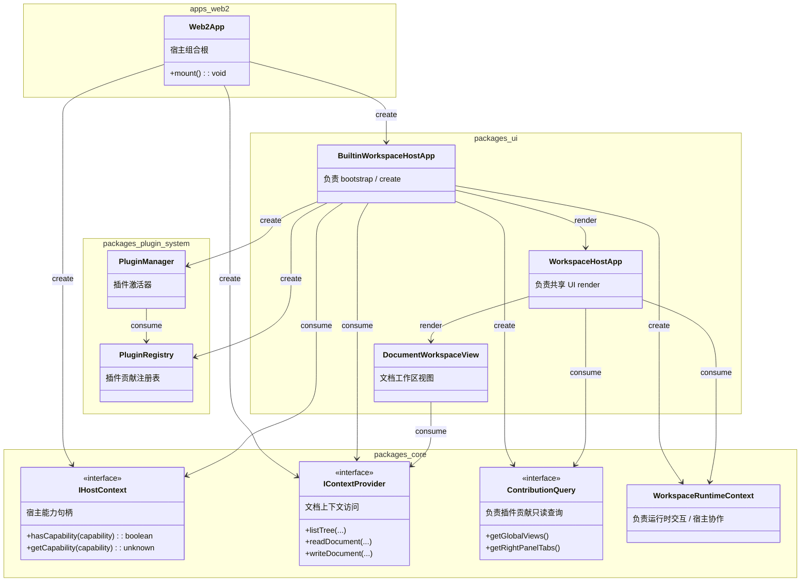

# App Web2

本文记录 `apps/web2` 的关键类及其协作关系，重点表达宿主层如何创建基础设施依赖，并将其交给共享 UI 壳层消费。

## Class Diagram

## Notes

* `Web2App`
  用途：`apps/web2` 的宿主组合根，负责读取宿主环境、创建宿主依赖，并把它们转交给 UI 入口。
  被谁 consume：它创建的 `IHostContext`、`IContextProvider` 和 `BuiltinWorkspaceHostApp` 会分别被后续 UI 层消费；`Web2App` 自身通常不被其他对象直接 consume。
  使用场景：Web 端启动时，先由 `Web2App` 完成 Vue app 挂载前的最外层组装。

* `IHostContext`
  用途：抽象宿主能力句柄，例如 `storage`、`http-client` 或其他运行环境能力查询接口。
  被谁 consume：由 `BuiltinWorkspaceHostApp` consume，并进一步用于 builtin runtime 初始化过程中向插件系统暴露宿主能力。
  使用场景：插件或运行时需要判断“当前宿主是否支持某项能力”时，通过 `IHostContext` 间接访问，而不是直接依赖浏览器全局对象。

* `IContextProvider`
  用途：抽象知识工作区的上下文访问能力，提供目录树、文档读写、节点管理等接口。
  被谁 consume：先由 `BuiltinWorkspaceHostApp` consume 并向共享 UI 继续传递，再由 `DocumentWorkspaceView` 直接 consume 执行文档树加载与文档读写。
  使用场景：打开 knowledge workspace、读取 markdown 文档、保存文档、重命名节点等场景都会经过 `IContextProvider`。

* `BuiltinWorkspaceHostApp`
  用途：`packages/ui` 暴露的 UI 宿主入口，定位是“负责 bootstrap / create”。它接收宿主依赖，初始化共享工作区运行时，并把结果接到真正负责渲染的共享工作区壳层上。
  被谁 consume：由 `Web2App` create；它内部 create `PluginRegistry`、`ContributionQuery`、`WorkspaceRuntimeContext`、`PluginManager`，并 consume `IHostContext`、`IContextProvider`。
  使用场景：Web2 启动后，需要先把宿主能力、上下文能力和插件系统整合成一个可供共享 UI 直接消费的运行时对象时，由它承担这层桥接责任。

* `PluginManager`
  用途：负责 builtin plugins 的激活流程，驱动插件注册、启用与运行时装配。
  被谁 consume：由 `BuiltinWorkspaceHostApp` create 并驱动；它继续 consume `PluginRegistry` 作为贡献收集目标。
  使用场景：应用启动时根据 enablement config 激活插件，并把插件贡献注册到统一注册表。

* `PluginRegistry`
  用途：保存各插件注册进来的视图、tab、workspace 扩展点等贡献。
  被谁 consume：由 `PluginManager` consume 并写入数据；由 `ContributionQuery` 作为只读查询视角对外暴露。
  使用场景：插件激活后把 global views、right panel tabs 等能力登记到这里，供 UI 查询。

* `ContributionQuery`
  用途：负责插件贡献只读查询，专门提供 global views、right panel tabs 等扩展点读取能力。
  被谁 consume：由 `WorkspaceHostApp` consume；它由 `BuiltinWorkspaceHostApp` create，底层通常读取 `PluginRegistry` 中已登记的贡献。
  使用场景：共享 UI 需要决定顶部工作区入口、右侧面板标签和其他扩展点渲染内容时，通过它读取当前已激活插件贡献。

* `WorkspaceRuntimeContext`
  用途：负责运行时交互 / 宿主协作，承载导航前钩子、宿主事件上报、全局错误状态等非贡献查询能力。
  被谁 consume：由 `WorkspaceHostApp` consume；它由 `BuiltinWorkspaceHostApp` create。
  使用场景：切换 workspace 路由、上报未处理错误、协调宿主与插件运行时状态时，通过它完成交互。

* `WorkspaceHostApp`
  用途：共享工作区壳，定位是“负责共享 UI render”。它不负责 bootstrap，只负责根据 `ContributionQuery` 与 `WorkspaceRuntimeContext` 装配顶层工作区界面。
  被谁 consume：由 `BuiltinWorkspaceHostApp` render；它内部 consume `ContributionQuery` 与 `WorkspaceRuntimeContext`，并 render `DocumentWorkspaceView`。
  使用场景：渲染顶部工作区切换、根据插件贡献显示全局视图、在 knowledge workspace 下挂载文档视图。

* `DocumentWorkspaceView`
  用途：知识工作区主视图，负责文档树、文档打开/编辑/保存等具体界面流程。
  被谁 consume：由 `WorkspaceHostApp` render；它直接 consume `IContextProvider`。
  使用场景：用户浏览目录树、打开文档、编辑 markdown、保存文档、执行节点增删改时都落在这一层。

* 简化原则：这里遵循“不过度为未来设计，需要时再拆分，否则按简单来、类越少越好”。因此当前删除仅用于打包结果的 `BuiltinWorkspaceRuntime`，但保留职责已经不同的 `ContributionQuery` 与 `WorkspaceRuntimeContext` 两个对象。

* `task` 是否出现由插件贡献决定，不由 `Web2App`、`IHostContext` 或 `IContextProvider` 决定；也就是说，task 是否进入 UI，取决于 `PluginManager -> PluginRegistry -> ContributionQuery` 这条链路最终暴露了什么贡献。

## Compatibility Principles

* `apps/web2` 是并行新增宿主，不是对现有 `apps/web` 的立即替换；创建 `web2` 后，原有 `web app` 必须继续可用。

* 任何为了 `web2` 引入的共享层改动，都应优先采用“新增兼容能力”而不是“直接替换旧入口”的方式落地。

* 过渡期内，`WorkspaceHostApp` 的既有消费形状必须继续可用；现有 `web` 至少应能继续通过 `contextProvider + contributionQuery + runtimeContext` 这条链路完成渲染。

* `web2` 可以通过 `BuiltinWorkspaceHostApp` 走新的 bootstrap 入口，但这不应强制要求旧 `web` 在同一阶段同步切换到新入口。

* 如果共享 bootstrap helper 发生调整，输出结果也必须保持对旧 `web` 的兼容性；不能为了让 `web2` 更干净，而让旧 `web` 的启动、构建或渲染链路失效。

