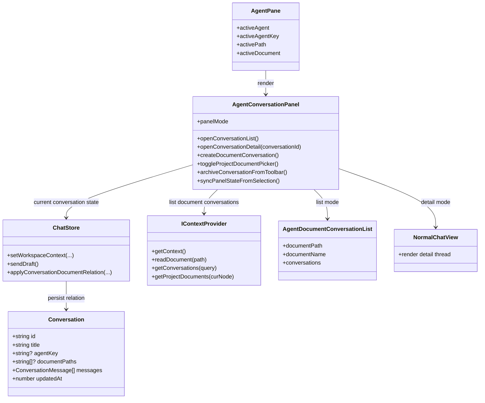
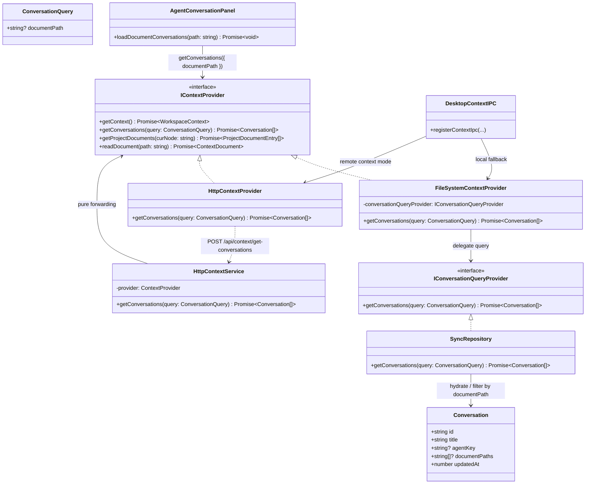

[English](context-provider.md) | [中文](zh/context-provider.zh-CN.md)

# Context Provider

This document summarizes the `IContextProvider` architecture used by the knowledge workspace. It focuses on how `AgentPane`, conversation lists, persistence, and scoped context queries work together.

## Workspace / Panel Relationship

## Context Query Flow

## Notes

* `Conversation.documentPaths` is the persisted basis for document-scoped conversation lookup.

* `IContextProvider.getConversations(query)` is the single query entry used by the workspace panel.

* `IContextProvider.getProjectDocuments(curNode)` is the scoped source of bindable project documents for the active agent or folder.

* `AgentConversationPanel` remains responsible for list/detail state and top-toolbar actions, while `IContextProvider` owns the data query.

* The right-hand panel toolbar is the single place for conversation-level actions in agent mode. It carries expand, create, rebind-document, and archive actions instead of placing archive controls in the input area.

* Rebind-document and archive actions are only shown when there is a current conversation.

* Rebind-document candidates come from `getProjectDocuments(curNode)` and are chosen within the current agent scope instead of reusing the middle pane's current document implicitly.

* The archive action reflects persisted archive state: unarchived or stale conversations appear highlighted and actionable, while already-archived conversations appear disabled.

