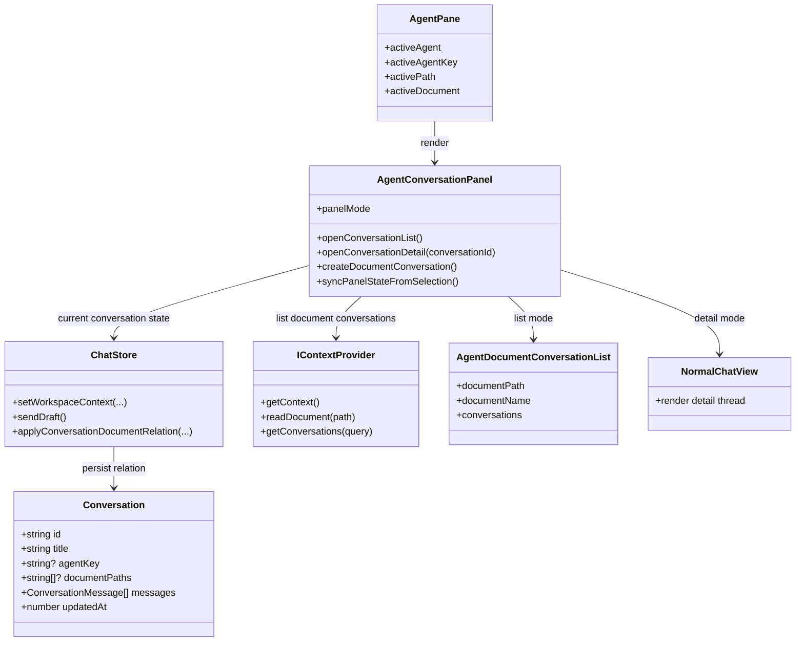
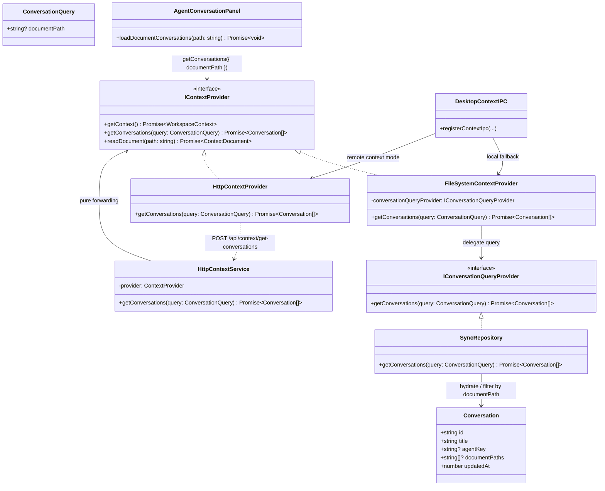

# Context Provider

这份文档汇总知识工作区 `IContextProvider` 相关的类图，重点说明右侧 `AgentPane`、会话列表、会话持久化和上下文查询之间的关系。

## Workspace / Panel Relationship

## Context Query Flow

## Notes

* `Conversation.documentPaths` is the persisted basis for document-scoped conversation lookup.

* `IContextProvider.getConversations(query)` is the single query entry used by the workspace panel.

* `AgentConversationPanel` stays responsible for list/detail state, while `IContextProvider` owns the data query.

