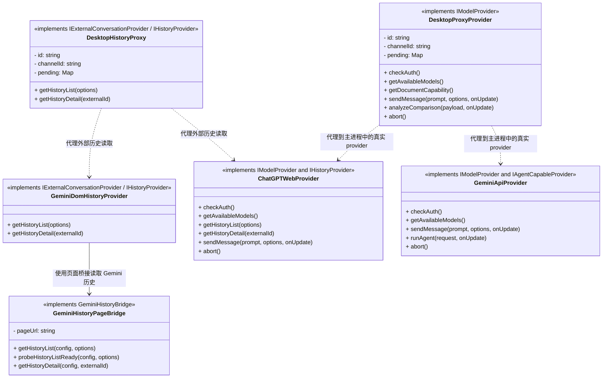
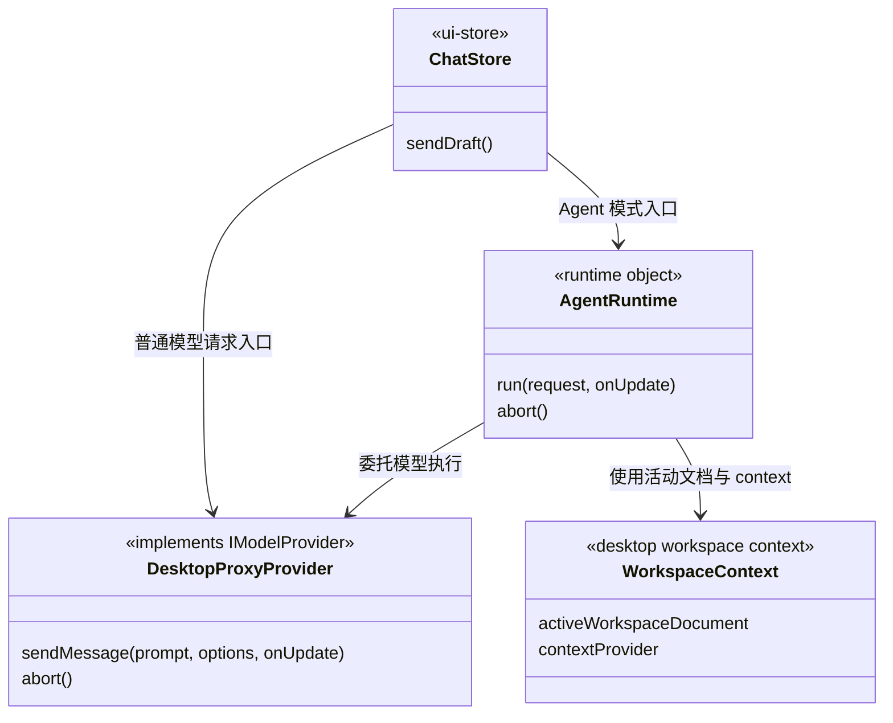
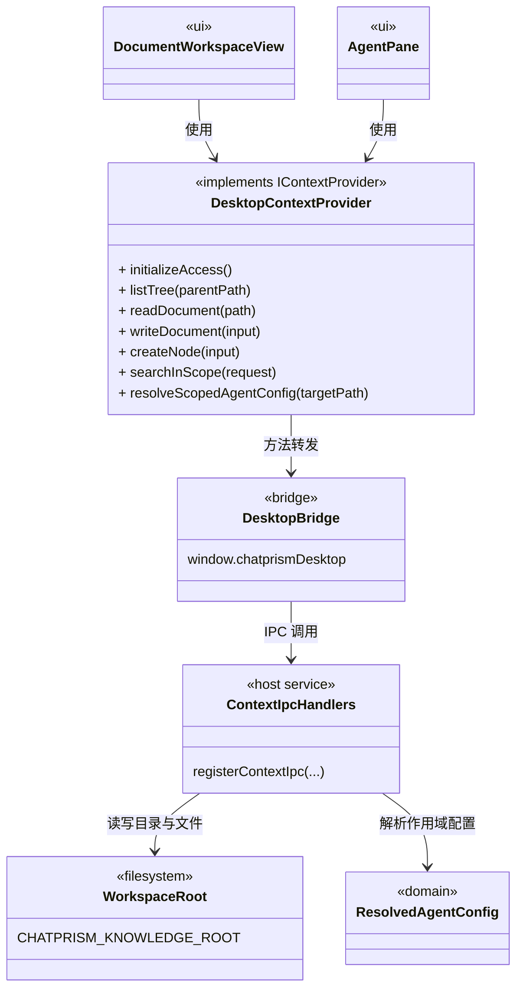
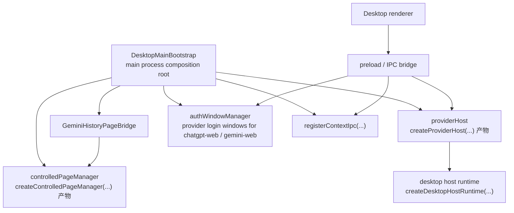

# Desktop App 核心实现视图

本文用多张 Mermaid 图描述 `Desktop App` 的不同核心类群与关键对象关系。

约束如下：

- 优先画核心实现类
- 不画接口类本体
- 不画局部类
- 对于不是显式类、但又是桌面架构关键节点的对象，使用关系图表达
- 在实现类说明中标注其主要实现/承担的接口职责

---

## 1. Provider / History 类图

这张图聚焦桌面端 renderer 代理类、Gemini 历史桥接，以及最终落到的真实 provider。

---

## 2. Agent 执行关系图

这张图不强求只画显式类，而是表达桌面端 Agent 相关的当前关键执行链路。

当前要点：

- renderer 侧普通发送流程仍主要落在 `useChatStore.sendDraft`
- agent 执行编排由 `createAgentRuntime(...)` 产物承载
- 真实 model provider 的实现落点已在“图 1 Provider / History 类图”中表达，这里不再重复展开

说明：

- 如果后续引入 `ConversationWorkflowController`，它应位于 `chatStore.sendDraft` 与 `agentRuntime` / `DesktopProxyProvider` 之间
- 真实 model provider 的实现链路见本文的 [1. Provider / History 类图](#1-provider--history-类图)
- 桌面 bridge / host / IPC 细节见本文的 [4. Host / IPC 关系图](#4-host--ipc-关系图)

---

## 3. Desktop ContextProvider 实现关系图

这张图聚焦桌面端 `ContextProvider` 是如何实现出来的。

当前桌面知识工作区的关键实现方式是：

- renderer 侧通过 `createDesktopContextProvider()` 返回桌面专用 provider 对象
- 该 provider 的方法通过 `window.chatprismDesktop` bridge 转发到主进程
- 主进程由 `registerContextIpc(...)` 注册的 IPC handlers 承载真实实现
- 真实实现再落到 workspace root 与作用域 agent 配置解析

说明：

- `DesktopContextProvider` 对应的是 `createDesktopContextProvider()` 返回对象
- `ContextIpcHandlers` 对应的是 `registerContextIpc(...)` 注册的一组主进程处理器
- 这张图的重点不是知识工作区如何“使用” context，而是桌面专用 `ContextProvider` 如何被实现出来

---

## 4. Host / IPC 关系图

这张图聚焦 Desktop host 的关键对象关系。

说明：

- 这里最重要的是宿主对象关系，而不是类继承关系
- `providerHost`、`controlledPageManager`、`authWindowManager` 虽然不是显式类，但它们是桌面端真实存在的核心运行对象
- `DesktopMainBootstrap` 表示主进程入口的装配职责，对应 `main/index.ts`
- `AuthWindowManager` 同时服务 `chatgpt-web` 与 `gemini-web`，但当前其“登录完成探测”逻辑主要是为 Gemini 历史页面准备的

---

## 5. 阅读建议

建议按下面顺序读这几张图：

1. `Provider / History 类图`
   - 看清 renderer 代理类与真实 provider 的关系
2. `Agent 执行关系图`
   - 看清 Agent 请求从聊天入口如何落到主进程真实 provider
3. `Knowledge / Context 关系图`
   - 看清桌面知识工作区如何通过 bridge 和 IPC 落到本地知识目录
4. `Host / IPC 关系图`
   - 看清 Electron 主进程如何把 provider、历史、受控页面与登录恢复串起来

## 6. 后续建议

如果后续继续细化桌面架构文档，下一步最值得补的是：

- `ConversationWorkflowController` 引入后的桌面对话执行类图
- `providerHost` 的内部处理流程时序图
- `GeminiHistoryPageBridge` 与 `controlledPageManager` 的协作时序图
