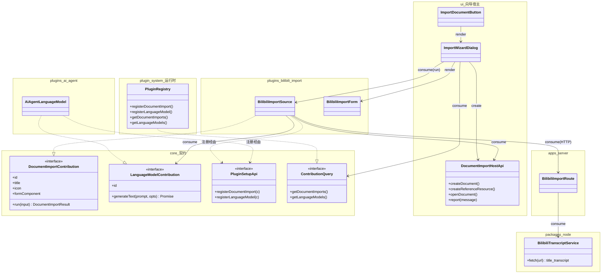

# 文档导入向导（B 站视频 → 文字稿 / 总结稿）

## 原始需求

需要实现一个 import 的向导，将各类资源导入成文档。具体导入的资源做成插件。目前需要实现的功能是：输入一个 B 站视频 URL，导入字幕 / 文字稿 / 总结稿。

> 经讨论后收敛：取消「字幕（带时间轴）」产物，本期产出**文字稿**与**总结稿**两种。

## 用户价值

把「看过、觉得有价值的视频」沉淀为自己的知识经验体系——不是收藏夹式归档，而是**提炼精华 → 落成可编辑、可被 Agent 检索的 Markdown 文档**。视频从一次性消费内容变成可持续编辑、可被问答与上下文检索的知识资产，契合 JARVIS「文档是人机协作持久中心」的定位。

## 详细需求

### 需求范围

- 一个**通用「导入向导」**：把外部资源转成工作区 Markdown 文档；「导入来源」由插件注册，向导框架本身与具体来源解耦。
- 本期落地第一个来源插件：**B 站视频**，产出**文字稿**（必选）+ **总结稿**（可选）。
- **总结稿**依赖「大模型能力」扩展点；存在总结稿时，文字稿落入 `references/` 作为其引用资源。
- 新增一个**通用「大模型能力」扩展点**（`core` 契约），可被 `ui` 或任意插件消费；由 `ai-agent` 插件注册实现；无任何插件注册时，「总结稿」不可用。
- 复用既有扩展点脚手架：将 `DocumentCreationFlowContribution` **重命名为 `DocumentImportContribution`**，本需求为其首个真实消费方。

### 非目标

- 不做批量 / 队列导入（本期单条 URL）。
- 不做字幕（带时间轴）产物。
- 不做手动粘贴文字稿兜底；取字幕失败即报错中止。
- 不做导入历史 / 管理页。
- 不做 B 站以外的来源插件（仅保证框架可扩展）。
- 不把 import 业务编排 / 总结 / 写文档下沉到 server（server 仅承担取字幕数据源职责）。

### 界面描述 (UI)

- **入口**：在文档树「新建文档」按钮旁新增 **「导入文档」按钮**，点击打开导入向导（模态对话框）。
- **向导（模态，3 步 + 顶部步骤指示器）**：
  1. **选择来源**：列出已注册导入来源（本期仅「B 站视频」，带图标 + 名称），单项可默认选中。
  2. **配置参数**（由来源插件提供的表单）：
     - 视频 URL 输入框（格式校验提示）。
     - 产物勾选：`☑ 文字稿`（固定勾选、不可取消）、`☐ 总结稿`。
     - 系统无「大模型能力」时，「总结稿」复选框**置灰禁用**，旁注「需启用提供大模型能力的插件」。
     - 目标目录：默认当前选中目录，可切换。
     - 文档标题：抓取后回填视频标题，可编辑。
  3. **执行与结果**：分阶段进度（取字幕 → 整理文字稿 →〔生成总结〕→ 写入文档）。
- **结果反馈**：
  - 成功 → 关闭向导、**打开导入的主文档**、`postPluginMessage` 成功提示。
  - 失败 → `postPluginMessage` 报错（含所处阶段），中止。

### 交互逻辑

1. 点「导入文档」→ 向导打开，停在「选择来源」。
2. 选「B 站视频」→ 进入配置步。
3. 填 URL / 选产物 / 选目录 / 确认标题 → 点「开始导入」。
4. 执行：调后端取字幕与标题 → 整理文字稿 →（若勾选）经「大模型能力」生成总结稿 → 写入文档（含 `references/` 引用资源）→ 刷新文档树。
5. 全部成功 → 关闭向导、打开主文档、成功提示。
6. 任一阶段失败 → 中止、报错。

### 产物组织（复用 `references/`）

- **只要文字稿**：目标目录生成 `<标题>.md`（普通文档）。
- **文字稿 + 总结稿**：目标目录生成 `<标题>.md` 作为**总结稿主文档**；**文字稿落入 `references/` 作为被引用资源**，总结稿正文以资源引用链接文字稿（复用受保护 `references/` 目录与链接重写能力）。
- 成功后打开的「主文档」：有总结稿则打开总结稿，否则打开文字稿。

## 推荐实现方案

### 职责切分（关键边界）

按 ARCHITECTURE「外部依赖访问归后端边界，业务逻辑归插件」原则拆分：

- **必须在 Node 后端（server）**：用 `yt-dlp` 子进程把 B 站视频转成文字稿数据。server 是**薄数据源**（`POST /import/bilibili` → `{ title, transcript }`），不决定产物数量 / 是否总结 / 文档组织。
- **仍在前端（插件 + 向导）**：向导流程编排、生成总结稿（经「大模型能力」扩展点，由前端 `ai-agent` 插件实现）、写文档落盘（复用既有 `contextProvider` / `documentWorkspace`）。
- **desktop 形态**：无独立部署 server，但同样经 `environment.contextBaseUrl` 访问各自的 Node 后端进程，取字幕路径统一。

> 前置依赖：运行后端的环境需安装 `yt-dlp` 二进制。e2e 按「不 mock、覆盖真实链路」会真实调用 yt-dlp 抓取稳定 BV，需挑稳定视频并放宽超时。

### 架构设计（按层职责）

| 层 | 改动 |
|---|---|
| `packages/core` | ① `DocumentCreationFlowContribution` → `DocumentImportContribution`，形状扩展为 `{ id, title, icon?, formComponent, run() }`；② 新增 `LanguageModelContribution`；③ `PluginSetupApi` / `ContributionQuery` 增 `registerDocumentImport` / `getDocumentImports` 与 `registerLanguageModel` / `getLanguageModels` |
| `packages/plugin-system` | `PluginRegistry` 与 scoped setup 同步改名 + 新增 LanguageModel 注册与聚合查询 |
| `packages/ui` | ① 「导入文档」按钮；② 导入向导模态宿主（消费 `getDocumentImports`、渲染来源 `formComponent`、编排 3 步）；③ 向 `run()` 注入「导入宿主能力」（建文档、建 `references/` 引用资源、`postPluginMessage` 反馈、打开文档）|
| `packages/node` | 新增 `BilibiliTranscriptService`（spawn `yt-dlp`，取标题 + 字幕，解析为纯文本文字稿）|
| `apps/server` | 新增 `POST /import/bilibili` 路由，复用 `BilibiliTranscriptService` |
| `plugins/bilibili-import`（新插件）| 注册一个 `DocumentImportContribution`：URL 表单组件、调后端取文字稿、（经注入的 `LanguageModel`）生成总结、产出文字稿 / 总结稿文档 |
| `plugins/ai-agent` | `setup` 中 `registerLanguageModel(...)`，用 runtime 轻量模型实现 `generateText` |
| `apps/*` | builtin 插件清单加入 `bilibili-import` |

关键接口形状（讨论确认）：

- `LanguageModelContribution.generateText(prompt, { system?, signal? }): Promise<string>`；消费方取 `getLanguageModels()` 首个可用者。
- `DocumentImportContribution.run(input)`：`input` 含来源表单产出的 `params`、`targetParentPath` 及注入的「导入宿主能力」；返回主文档路径与所有新建路径。

### 关键类 Mermaid 类图

类职责说明（简）：

- `DocumentImportContribution`（core 契约）：导入来源统一契约；提供配置表单组件与 `run()` 执行；由 `ImportWizardDialog` 消费。
- `LanguageModelContribution`（core 契约）：通用大模型能力；由 `ai-agent` 注册、被导入插件等消费；无注册则总结不可用。
- `ImportWizardDialog`（ui 向导宿主）：编排 3 步流程，创建并注入 `DocumentImportHostApi`，调用来源的 `run()`。
- `DocumentImportHostApi`（ui 注入能力）：封装建文档 / 建 `references/` 引用资源 / 打开文档 / 反馈，避免插件重造文档创建逻辑。
- `BilibiliImportSource`（插件）：B 站来源实现；调后端取文字稿、按勾选生成总结、产出文档。
- `BilibiliTranscriptService`（node）：spawn `yt-dlp`，把视频转为 `{ title, transcript }` 纯数据。

### 对全局类图 / 现有模块的影响

- `docs/workspace.dsl` 不直接修改；但前端宿主装配关系新增「导入文档」入口与向导宿主。
- `packages/core` 插件契约层新增 `LanguageModelContribution`，并将 `DocumentCreationFlowContribution` 改名为 `DocumentImportContribution`（影响 `PluginSetupApi` / `ContributionQuery` / `PluginRegistry` / `ui` service 与相关测试）。
- `packages/node` 与 `apps/server` 新增取字幕能力与路由，server 维持「薄数据源」定位。

## 验收标准

用于后续 e2e 测试验证需求实现是否完整、正确：

| 动作 | 预期响应 |
|-----|--------|
| 点击文档树「导入文档」按钮 | 打开导入向导模态，停在「选择来源」，列出「B 站视频」来源 |
| 选择「B 站视频」并进入配置步 | 显示 URL 输入、产物勾选（文字稿固定勾选）、目标目录、标题字段 |
| 系统无「大模型能力」注册时查看配置步 | 「总结稿」复选框置灰禁用并给出提示 |
| 系统有「大模型能力」注册时勾选「总结稿」 | 复选框可勾选 |
| 输入合法 B 站 URL、仅选文字稿、点开始导入 | 经后端 yt-dlp 取字幕，目标目录生成 `<标题>.md` 文字稿文档，向导关闭并打开该文档，提示成功 |
| 输入合法 URL、勾选总结稿、点开始导入 | 生成总结稿主文档 + `references/` 下文字稿引用资源，总结稿引用文字稿；打开总结稿主文档并提示成功 |
| 取字幕失败（无字幕 / yt-dlp 失败 / 接口异常）| 向导在执行步中止，报错并标明所处阶段，不产生残留文档 |
| 目标目录默认值 | 默认取当前选中目录，可在配置步切换 |
| 标题字段 | 抓取后回填视频标题，可编辑，作为文档名 |
| `ai-agent` 插件注册「大模型能力」 | `getLanguageModels()` 返回非空，导入向导总结能力可用 |
</content>
</invoke>
