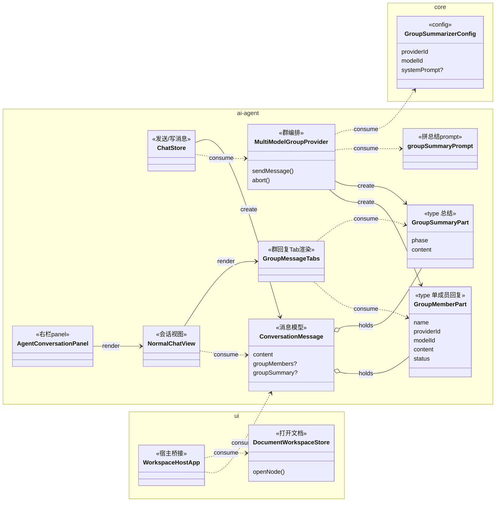

# Group 对话增强：成员观点 Tab 化 + 自动综合总结 + 切换上下文跟随

> 本文是 [group-conversation.md](group-conversation.md) 的增强设计，沿用其「一切收敛到 `IModelProvider` 契约、不改发送主链路」的核心原则。本期只做**呈现层 + 编排层增量**，不动群成员/DOM provider 链路本身。

## 原始需求

> 我想进一步增强 group 对话。
>
> 1. 有更好的 UI 来显示成员的对话，以使用户能快速清晰地看到不同 member 的观点。目前方式因为文字很长，要找到不同模型的输出相对麻烦。
> 2. 考虑有一个 model（类似主持人）可以综合总结所有成员的观点，互为补充完善，发现有冲突的部分。用户可选择默认观看总结即可，需要时再看每个 model 的回答详情。
> 3. 可以更方便地在目前右栏 panel 和全屏（chat 视图）之间切换，却不丢失上下文。

## 用户价值

* **需求 1**：把「在一条长气泡里翻找某个模型」降为「一眼看清每个成员立场」，降低多模型对比的认知成本。

* **需求 2**：把多模型的发散输出收敛成一份**可决策**的综合视图（共识 / 互补 / 冲突），契合产品「把讨论沉淀为结构化知识」的定位；用户默认只看总结，需要时再下钻细节。

* **需求 3**：右栏 panel 轻量跟读、全屏深入研读，按需切换且会话与关联文档一起跟随，不打断思路。

## 详细需求

### 需求范围

**需求边界**

* 需求 1+2：每一轮 group 回复用 **Tab 切换**呈现（`综合` + 每成员一个 Tab）；`综合` 由**预设级固定总结模型**在成员答完后**自动流式生成**，结构化呈现共识/互补/冲突，并标注成员来源可下钻。

* 需求 3：(a) 让 panel↔全屏的双向切换入口**位置/交互对称一致**；(b) 切换 workspace / panel↔全屏时**自动打开并聚焦会话关联文档**。

**非目标（本期不做）**

* 群编排策略升级（轮次调度 / auto-plan / 角色模板）。

* DOM provider 新增站点；Compare 功能改动。

* 发送主链路 / 持久化契约本质变更（仅做**可选字段**扩展，向后兼容旧会话）。

### 界面描述 (UI)

**群回复消息卡（Tab 化）**

```
┌─────────────────────────────────────────────┐
│ [● 综合] [○ ChatGPT] [○ Gemini] [○ Claude]   │ ← Tab 头；状态点：回答中/已完成/失败
├─────────────────────────────────────────────┤
│  〔综合 Tab〕                                  │
│   ▸ 共识：……                                  │
│   ▸ 互补：@ChatGPT 补充了…… / @Gemini 强调了…… │  ← @成员名为可点击 chip，跳转该成员 Tab
│   ▸ 冲突：@ChatGPT 主张X，@Gemini 主张Y        │
└─────────────────────────────────────────────┘
```

* **Tab 头**：第一个固定 `综合`，其后按预设顺序每成员一个 Tab；标签 \= 成员名 + 状态点。

* **综合 Tab**：三段（共识 / 互补 / 冲突），条目用 `@成员名` 标注来源，渲染为可点击 chip。

* **成员 Tab**：该成员完整 Markdown 原文。

* **单成员退化**：本轮实际参与成员 == 1 时，不显示 `综合` Tab，退化为普通气泡（与非 group 体验一致）。

* 历史已完成轮次各自保留一套 Tab，默认停在 `综合`。

**切换入口（需求 3a）**

* 全屏 chat 头部新增「收起到右栏」按钮，与 panel 既有「展开到全屏」按钮（`agent-conversation-expand`）**图标语言一致、位置对称**，形成顺手的双向入口。

### 交互逻辑

**群回复 + 自动总结（需求 1+2）**

1. 用户发送 → 各成员**并发流式**回答（现有链路不变）。
2. 流式期间：**默认停在第一个成员 Tab**（边发边看）；用户可随时点其他成员 Tab 实时围观；`综合` Tab 显示进度态（`ChatGPT ✓ / Gemini 回答中…`）。
3. 全部成员答完 **且参与成员 ≥ 2** → **预设级固定总结模型自动触发**，把各成员答案作为输入**流式**生成综合内容。
4. 总结完成 → 若用户**本轮未手动切过 Tab**，自动切到 `综合` Tab；否则保持用户当前 Tab。
5. 失败兜底：某成员失败 → 其 Tab 标红显示错误；总结仍对**已成功成员**综合（标注谁缺席）。参与成员 \=\= 1 时不触发总结。

**切换 + 文档跟随（需求 3）**

1. panel 点「展开」→ 进全屏，同一会话继续，并**自动打开该会话关联文档**。
2. 全屏点「收起」→ 回右栏 panel，保持会话 + 关联文档。
3. 切换 workspace / 会话时：若目标会话有 `documentIds`，**自动打开并聚焦第一个/主文档**；无关联或文档不存在则保持不动、不报错。

## 推荐实现方案

### 架构设计

沿用现有分层。**特性 A 基本内聚在** **`plugins/ai-agent`**（+1 处 `packages/core` 群预设配置）；**特性 B 跨 ai-agent 与** **`packages/ui`**（文档打开 `documentWorkspace.openNode` 与宿主壳 `WorkspaceHostApp` 在 ui 层）。

**A. 群回复 Tab 化 + 自动综合总结**

| 模块 / 文件                                      | 职责            | 改动                                                                                                                                             |
| -------------------------------------------- | ------------- | ---------------------------------------------------------------------------------------------------------------------------------------------- |
| `group/groupTypes.ts`                        | 群结构化类型        | 新增 `GroupMemberPart`（单成员回复：name/providerId/modelId/content/status/error）、`GroupSummaryPart`（总结：phase/content/error）                            |
| `interfaces/IModelProvider.ts`               | provider 流式契约 | `ProviderStreamUpdate` / `ProviderSendResult` 各加可选 `groupMembers?: GroupMemberPart[]`、`groupSummary?: GroupSummaryPart`                        |
| `interfaces/Conversation.ts`                 | 消息模型          | `ConversationMessage` 加可选 `groupMembers?`、`groupSummary?`（`content` 保留为扁平化兜底，供搜索/导出/旧渲染）                                                       |
| `store/chat.ts`                              | 发送/写消息        | onUpdate（约 3080-3090）把 `groupMembers` / `groupSummary` 一并写入 `lastMsg`                                                                          |
| `providers/model/MultiModelGroupProvider.ts` | 群编排           | 构建并流式发出 `groupMembers[]`；`Promise.all` 后若成员≥2，经 `resolveSummarizer` 解析总结模型 + `groupSummaryPrompt` 拼 prompt，流式写入 `groupSummary`；`abort` 透传成员+总结 |
| `group/groupSummaryPrompt.ts`（新）             | 拼总结 prompt    | 仿 `groupPrompt.ts`，注入各成员答案 + 「共识/互补/冲突 + `@成员名` 标注」指令                                                                                          |
| `packages/core/config.ts`                    | 群预设配置         | 新增 `groupSummarizers: Record<presetId, { providerId; modelId; systemPrompt? }>`（仿 `analyzer`）                                                  |
| `runtime/createModelProviderRuntime.ts`      | 注入依赖          | `getGroupConfig` 返回 `{ members, summarizer }`；注入 `resolveSummarizer`                                                                           |
| `components/GroupMessageTabs.vue`（新）         | 渲染 Tab        | props\=`groupMembers`/`groupSummary`；本地 `activeTab`；默认逻辑（流式停首成员、总结完成且未手切则切综合）；`@成员名`→可点击 chip 切 Tab；纯 Markdown 降级兜底                            |
| `views/NormalChatView.vue`                   | 消息渲染          | `v-if="message.groupMembers?.length"` → `GroupMessageTabs`，否则维持 `MarkdownContent`；单成员退化普通气泡                                                    |

**B. 切换体验 + 文档跟随**

| 模块 / 文件                                 | 职责       | 改动                                                                                                                                                                         |
| --------------------------------------- | -------- | -------------------------------------------------------------------------------------------------------------------------------------------------------------------------- |
| `components/AgentConversationPanel.vue` | 右栏 panel | 已有「展开」按钮 → `/chat`；统一其与全屏按钮的位置/图标                                                                                                                                          |
| `views/NormalChatView.vue`（或全屏头部）       | 全屏 chat  | 新增「收起到右栏」按钮 → `switchWorkspace('/')`                                                                                                                                       |
| `views/WorkspaceHostApp.vue`（ui 层）      | 宿主桥接     | 监听 `chatStore.currentConversation` → 取 `documentIds?.[0]` 解析 path → 调 `documentWorkspace.openNode(path)`；复用现有 `conversationLink`/`OpenConversationRequest` 反向链路同款 plumbing |
| `store/documentWorkspace.ts`（ui 层）      | 打开文档     | 复用既有 `openNode(path)`，无需新增 API                                                                                                                                             |

**关键取舍**

* 去掉容器类型，消息直挂 `groupMembers` + `groupSummary`（避免只做打包的 wrapper 对象）。

* `groupMembers`/`groupSummary` 入库使消息体变大——可接受；`content` 扁平兜底保证搜索/导出不破、旧会话无该字段走原渲染。

* `@成员名` 归因为 prompt 软约定，依赖总结模型输出格式——有纯 Markdown 降级兜底。

### 关键类 Mermaid 类图



> 说明：
>
> * `GroupMemberPart` 承载**单个成员**本轮回复，是成员 Tab 的数据源；`GroupSummaryPart` 是**主持人总结**那一份，是 `综合` Tab 的数据源——两者均由 `MultiModelGroupProvider` 编排时 `create`，挂在 `ConversationMessage` 上。
>
> * `GroupMessageTabs` 是新增的群回复渲染组件，由 `NormalChatView` 按 `message.groupMembers` 是否存在来 `render`；不影响普通消息渲染。
>
> * `WorkspaceHostApp` 是文档跟随的桥接点，消费当前会话的 `documentIds`，调用 `DocumentWorkspaceStore.openNode` 打开关联文档。

### 对全局类图的潜在影响

* `ConversationMessage` 新增两个可选字段（`groupMembers` / `groupSummary`），是既有消息模型的向后兼容扩展，不改变其在全局图中的位置与关系。

* 新增 `GroupMessageTabs` 组件，归属 ai-agent 呈现层，与现有 `MarkdownContent` 并列、被 `NormalChatView` 选择性挂载。

* `packages/core/config.ts` 新增 `groupSummarizers` 配置项，与既有 `analyzer` / `groupPresets` 同级。

## 验收标准

用于后续 e2e 测试验证需求实现是否完整、正确：

| 动作                         | 预期响应                                    |
| -------------------------- | --------------------------------------- |
| 群预设含 ≥2 成员，发送一个问题          | 出现带 Tab 头的群回复卡：`综合` + 每成员一个 Tab         |
| 成员流式回答期间                   | 默认停在第一个成员 Tab，可见其流式输出；`综合` Tab 显示各成员进度态 |
| 点击某成员 Tab（流式中）             | 切到该成员 Tab，实时围观其流式输出                     |
| 所有成员答完（≥2 成员）              | 预设级总结模型自动触发，`综合` Tab 流式生成共识/互补/冲突       |
| 总结完成且用户本轮未手动切 Tab          | 自动切到 `综合` Tab，呈现三段结构化视图                 |
| 总结完成前用户已手动切到成员 Tab         | 总结完成后保持在该成员 Tab，不强制跳走                   |
| 点击 `综合` 中的 `@成员名` chip     | 跳转到对应成员 Tab，定位其原文                       |
| 本轮仅 1 个成员参与（或 @单个成员）       | 不出现 `综合` Tab，退化为普通气泡，不触发总结              |
| 某成员失败、其余成功                 | 失败成员 Tab 标红显示错误；总结对已成功成员综合并标注缺席         |
| 旧的（无 groupMembers 字段）历史群会话 | 正常按原 Markdown 渲染，不报错                    |
| 在右栏 panel 点「展开」            | 进入全屏 chat，同一会话继续，并自动打开该会话关联文档           |
| 在全屏 chat 点「收起到右栏」          | 回到右栏 panel，保持同一会话与关联文档                  |
| 切换到一个有 `documentIds` 关联的会话 | 文档区自动打开并聚焦其第一个/主文档                      |
| 切换到无文档关联的会话                | 文档区保持不动，不报错                             |
| 会话关联文档已不存在                 | 不报错，文档区保持当前状态                           |

