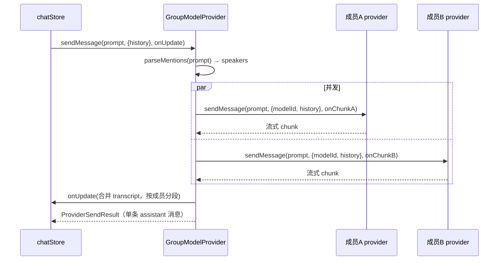
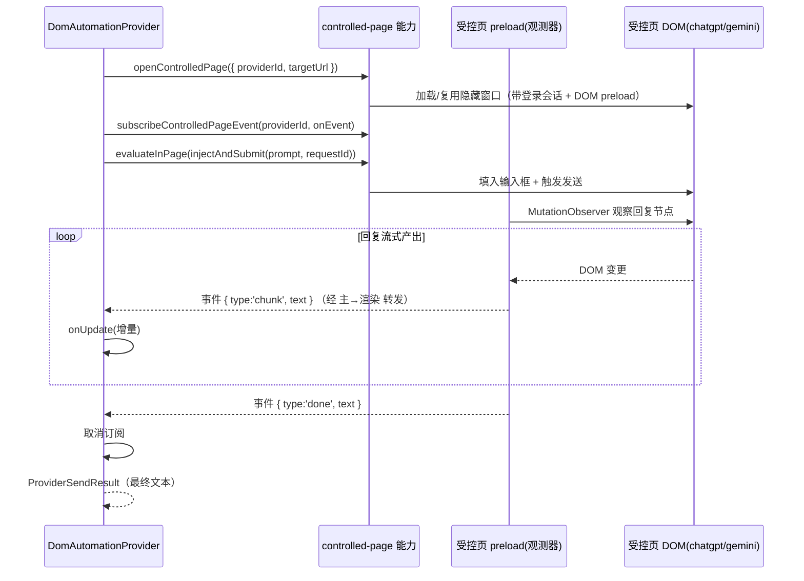

# 多模型同会话（Group Conversation）架构设计

> 目标：在 JARVIS 一个会话中让多个模型协作发言；并新增一条「DOM 自动化」模型 provider 链路（仅 desktop，覆盖 ChatGPT / Gemini），借鉴自开源项目 [openteam](https://github.com/afumu/openteam)。
>
> 本文档只描述架构与接缝，不含详细源码。实现入口参见 [ARCHITECTURE.zh-CN.md](archive/ARCHITECTURE.zh-CN.md)。

## 1. 背景与动机

| 来源 | 形态 | 与本设计的关系 |
|---|---|---|
| openteam `src/group/` | 多模型群聊「编排大脑」：成员模型、@路由、轮次、persona、共享上下文 | **借鉴**：抽出最小编排逻辑，落地为 `GroupModelProvider` |
| openteam `src/content/` | 各 AI 站点 DOM 适配（注入提问 / 观察回复） | **借鉴**：移植为 desktop 侧 `DomAutomationProvider` 的站点适配器 |
| JARVIS 现有 `ChatGPTWebProvider` | 复用 cookie + **逆向 HTTP 协议** 调网页后端 | 并列存在；DOM 链路是它「抗协议变更」的替代实现 |
| JARVIS 现有 `controlled-page` 能力 | desktop 每 provider 一个隐藏 `BrowserWindow` + `evaluateInPage` | **直接复用**：DOM 自动化的承载基础设施 |

两个特性彼此正交、可叠加：DOM provider 落地后，即可作为 Group 会话中的一个「成员」。

## 2. 总体架构

```mermaid
flowchart TB
    subgraph Store["chatStore（不改主链路）"]
        send["resolveSendTarget → provider.sendMessage()"]
    end

    subgraph Runtime["createModelProviderRuntime.getProvider()"]
        group["GroupModelProvider (id='group')"]
        codex["ChatGPTCodexProvider"]
        gapi["GeminiApiProvider"]
        domgpt["DomAutomationProvider (id='chatgpt-dom')"]
        domgem["DomAutomationProvider (id='gemini-dom')"]
    end

    subgraph Host["IHostContext 能力（desktop）"]
        cp["controlled-page<br/>openControlledPage / evaluateInPage<br/>+ subscribeControlledPageEvent（本期新增）"]
        login["provider-login"]
    end

    send --> group
    send --> codex
    send --> gapi
    send --> domgpt
    send --> domgem

    group -. "resolveMemberProvider(id), 并发" .-> codex
    group -. .-> gapi
    group -. .-> domgpt

    domgpt --> cp
    domgem --> cp
    domgpt --> login
```

核心设计原则：**一切都收敛到 `IModelProvider` 契约**（`sendMessage(prompt, options, onUpdate) => result`）。`GroupModelProvider` 和 `DomAutomationProvider` 都只是该契约的不同实现，store / 持久化 / 模型选择 UI / 发送主链路（[chat.ts](../plugins/ai-agent/src/store/chat.ts) `sendTarget.provider.sendMessage`）**完全不改**。

---

## 3. GroupModelProvider（多模型同会话）

### 3.1 定位与编排语义

- 实现 `IModelProvider`，`id = 'group'`，对上层是「一个 provider」。其 `sendMessage` 内部不调单个模型，而是把请求**编排分发**给一组成员模型。
- **成员可为任意 `IModelProvider`（核心不变量）**：成员经 `resolveMemberProvider(providerId) → runtime.getProvider(id)` 解析，返回统一的 `IModelProvider`。因此 `chatgpt-codex` / `gemini-api` / `chatgpt-dom` / `gemini-dom` 乃至未来任何新 provider 都能不加区分地作为成员，Group 侧无任何 provider 特判。反过来，`DomAutomationProvider` 等成员自身也是普通 `IModelProvider`，既可入群、也可在**非群聊对话**中单独作为模型使用（两者正交，互不依赖）。
- **成员来源**：会话内固定预设——预设只记录「哪些 providerId/modelId 入群」（在 `APP_CONFIG` 中定义团队预设，provider 直接读取）；预设引用的成员类型不受限。
- **编排策略（最小集）**：
  - 默认 **广播 + 并发**：预设内所有成员对当前问题并发回答（`Promise.all`）。
  - `@成员名`（可多个）：仅被点名成员回答，仍并发。
  - 同一轮并发，成员之间看不到对方「本轮」回复；**跨轮**可见上一轮全部发言（经 `history` 传入）。
  - 不含轮次调度 / auto-plan / 角色模板（后续可叠加）。

### 3.2 关键模块

```
plugins/ai-agent/src/group/
  groupTypes.ts        # GroupMember { providerId, modelId, name }、GroupConfig { members }
  mentionParser.ts     # parseMentions(text, members) → { targets, broadcast }
  MultiModelGroupProvider.ts   # 放在 providers/model/ 下，实现 IModelProvider
```

`MultiModelGroupProvider` 构造依赖（由 runtime 注入）：
- `resolveMemberProvider(providerId)`：解析成员子 provider 实例（复用 `runtime.getProvider(id, { fresh:true })`）。
- `getGroupConfig()`：读取当前会话绑定的团队预设。

### 3.3 编排流程



- **流式合并**：各成员的 `onChunk` 写入「按成员分段」的共享缓冲，每次回调把合并后的 transcript（形如 `### {成员名}\n{文本}` 分段）通过 `onUpdate` 推给 store。
- **abort**：透传到全部在跑的成员 provider。
- **返回值**：合并 transcript 作为单条 assistant 消息（MVP 展示折中；后续如需「每成员独立气泡」走独立 `GroupWorkflowController`，编排核心可复用）。

### 3.4 配置与注册接缝

- `APP_CONFIG.providers`（[config.ts](../packages/core/config.ts)）新增一条 `id:'group'` 伪 provider；其 `models` 列表即「团队预设」，`defaultModel` 为默认预设。固定预设的成员清单同样定义在 config。
- `createModelProviderRuntime.getProvider`（[createModelProviderRuntime.ts](../plugins/ai-agent/src/runtime/createModelProviderRuntime.ts)）内对 `providerId==='group'` 特判，构造 `MultiModelGroupProvider` 并注入上述依赖（不污染模块级 `DEFAULT_FACTORIES`）。

---

## 4. DomAutomationProvider（DOM 自动化，仅 desktop）

### 4.1 定位：DOM 自动化 vs 现有 HTTP 逆向

| | 现有 `ChatGPTWebProvider` | 新 `DomAutomationProvider` |
|---|---|---|
| 本质 | 复用 cookie + **逆向后端 HTTP 协议**（proof token / sha3 反爬） | **驱动真实页面**：注入提问、点发送、观察 DOM 流式回复 |
| 断裂点 | 站点改协议 / 强化反爬 | 站点改 DOM 结构 |
| Runtime | extension / web / desktop | **仅 desktop** |

二者并存，用户在模型选择器中各自可选（`chatgpt-dom` / `gemini-dom` 与 `chatgpt-web` 并列）。

### 4.2 复用现有 HostContext 能力（关键结论）

desktop 侧已有现成基础设施，**MVP 无需新增能力**：

| 能力 | 现有提供 | 在 DOM 自动化中的用途 |
|---|---|---|
| `controlled-page`.`openControlledPage` | [controlledPageManager.ts](../apps/desktop2/main/controlledPageManager.ts)：每 provider 一个隐藏 `BrowserWindow`，按 provider 会话分区（带登录 cookie），`backgroundThrottling:false` 保活以支持隐藏态 DOM 操作 | 确保目标站点页面（chatgpt.com / gemini.google.com）已加载且就绪 |
| `controlled-page`.`evaluateInPage` | 在受控页一次性执行 JS 并取回结果 | 注入提问到输入框并触发发送（一次性命令） |
| `controlled-page` 的 **per-provider preload** | [controlledPageIpc.ts](../apps/desktop2/main/controlledPageIpc.ts) 已支持 `preloadRegistry`（`providerId → preload 路径`），Gemini 历史抓取在用 | **观测脚本注入点**：在受控页内常驻 `MutationObserver`，主动推送回复增量（见 §4.3） |
| `provider-login` | [createDesktop2HostContext.ts](../apps/desktop2/src/context/createDesktop2HostContext.ts)：弹登录窗、订阅登录完成 | 首次未登录时引导用户在受控页登录 |

> 现有 Gemini DOM **历史抓取** provider 已经在用 `controlled-page` + 专属 preload 做侧栏展开 / 懒加载滚动 / 轮询，证明「受控页 + 注入脚本」链路在本仓已跑通、选择器与观察逻辑可参考复用。

### 4.3 本期新增能力：受控页事件订阅（替代轮询）

本期**不采用轮询**，而是新增「受控页事件订阅」能力，让受控页内常驻的 `MutationObserver` 把回复增量主动 push 上来。该能力的每一环在本仓都已有先例，属低风险拼装：

| 环节 | 复用的现有先例 | 新增内容 |
|---|---|---|
| 注入观测脚本 | `preloadRegistry`（per-provider preload，Gemini 历史在用） | 为 `chatgpt-dom` / `gemini-dom` 各注册一个 DOM preload，内含观测器 |
| 页 → 主 推送 | `console-message` 转发（[controlledPageIpc.ts](../apps/desktop2/main/controlledPageIpc.ts) 已有单向转发先例） | 受控页 preload 经 `ipcRenderer.send(事件通道, payload)` 上报结构化增量 |
| 主 → 渲染 推送 | `emitToRendererWindows` + `webContents.send`（[authIpc.ts](../apps/desktop2/main/authIpc.ts) 登录事件） | 主进程给增量打上 `providerId`，转发到 app 渲染窗口 |
| 渲染端订阅 | `onProviderLoginCompleted`（`ipcRenderer.on` + 返回取消订阅，[preload.ts](../apps/desktop2/main/preload.ts)） | preload 暴露 `subscribeControlledPageEvent(listener)` |
| HostContext 能力 | `ControlledPageCapability`（[ControlledPageCapability.ts](../packages/core/src/interfaces/ControlledPageCapability.ts)） | 扩展该接口：`subscribeControlledPageEvent(providerId, listener): () => void` |

**事件载荷（约定）**：`{ providerId, requestId, type: 'chunk' | 'done' | 'error', text?, message? }`。`requestId` 用于把推送对齐到具体一次 `sendMessage`，避免串话。

**openteam 可移植的观测核心**（放进 DOM preload，替换其 `chrome.runtime` 消息为 `ipcRenderer.send`）：
- `responseContainers.ts` → 定位最新助手回复节点（落到站点适配器选择器）
- `replyObserver.ts` → `MutationObserver` 主体
- `replyTracker.ts` → 累积文本 / 维护状态
- `replyTimeout.ts` + `replyCompensation.ts` → 结束判定（「停止生成」态消失 + 文本稳定窗口 + 超时兜底）
- `reportableReply.ts` → 整理为上述事件载荷
- `frameHandshake.ts` / `runtimeClient.ts` → 由 Electron IPC 取代，无需移植

**降级兜底**：若某站点观测器异常（选择器失配 / 长时间无 `done`），`DomAutomationProvider` 退回 `evaluateInPage` 轮询读取一次最终文本，保证不卡死。

### 4.4 模块结构

```
plugins/ai-agent/src/providers/model/dom/
  DomAutomationProvider.ts   # implements IModelProvider，统一驱动 + 事件订阅
  domTransport.ts            # 抽象：依赖 controlled-page 能力，封装 open/inject/submit/subscribe

apps/desktop2/                # desktop 专属（preload + capability 接线）
  main/preload/chatgptDomPreload.ts   # 受控页观测器（MutationObserver → ipcRenderer.send）
  main/preload/geminiDomPreload.ts    # 同上
  （main/controlledPageIpc.ts 扩展页→主→渲染的事件转发；preload.ts 暴露订阅方法）
```

- **站点适配器**（注入与选择器，落在 DOM preload 内）封装每站差异：
  - `targetUrl`：站点入口 URL。
  - `injectAndSubmit(prompt)`：定位输入框、填入、触发发送（经 `evaluateInPage` 一次性执行）。
  - 观测器：定位最新助手回复节点，`MutationObserver` 累积增量、判定结束，按事件载荷 `ipcRenderer.send` 推送。
- **`DomAutomationProvider`** 仅依赖 `controlled-page` 能力（`openControlledPage` / `evaluateInPage` / `subscribeControlledPageEvent`），不含站点知识与平台细节，保持是一个普通 `IModelProvider`。

### 4.5 发送时序与可观测性



按 [AGENTS.md](../AGENTS.md) 对「跨进程 / DOM 捕获 / 时序问题」的要求，需在三段链路（受控页 preload、主进程转发、渲染端 provider）各补观测点：受控页就绪、注入成功、`requestId` 绑定、首个 chunk、结束判定、超时/异常、降级触发。优先建链路日志，再做修复。

### 4.6 约束与风险

- **仅 desktop**：web 模式因 `X-Frame-Options`/CSP 无法跨域注入；extension 模式本期不做。产品上需接受「DOM provider 仅 desktop 可用」。
- **选择器脆性**：站点改版即失效，每站需长期维护；每个 adapter 应配 e2e（desktop 侧）锁定真实链路。
- **生成结束判定**：依赖每站的「停止生成」按钮态 / 文本稳定窗口，需定制并加观测。
- **登录态依赖**：受控页须已登录目标站点，复用 `provider-login` 引导。
- **合规**：DOM 驱动第三方站点须遵守各家 ToS（与现有 HTTP 式 provider 同等灰度）。

---

## 5. 两特性的组合关系

- `DomAutomationProvider` 落地后，其 `chatgpt-dom` / `gemini-dom` 可直接作为 `GroupModelProvider` 团队预设中的成员，**Group 侧零改动**。
- 因此推荐落地顺序：先用现有 `chatgpt-codex` + `gemini-api` 把 Group 链路跑通，再补 DOM transport 作为「抗协议变更」的成员来源。

## 6. 分阶段落地计划

| 阶段 | 内容 | 验证 |
|---|---|---|
| P1 | `GroupModelProvider`（并发 + @mention，固定预设；成员=codex+gemini-api） | 单测：广播/@定向/并发合并/abort 透传；`tsc --noEmit` / `lint` |
| P2 | **受控页事件订阅能力**（扩展 `ControlledPageCapability` + 页→主→渲染事件链）+ `DomAutomationProvider` + ChatGPT DOM preload/适配器 | desktop e2e：登录→提问→订阅推送流式→结束态；降级兜底路径 |
| P3 | Gemini DOM preload/适配器（复用 P2 能力与框架） | 同上 |

## 7. 验证策略

- 编码后按 [AGENTS.md](../AGENTS.md) 顺序：`lint` / `tsc --noEmit` / `test` → 构建 → dev 启动 → 探活 → 最小回归 → 范围回归。
- DOM provider 走 desktop e2e（真实链路，不 mock 站点），覆盖失败入口与成功态。
- Group provider 以单测覆盖编排分发逻辑（成员 provider 可 mock）。
