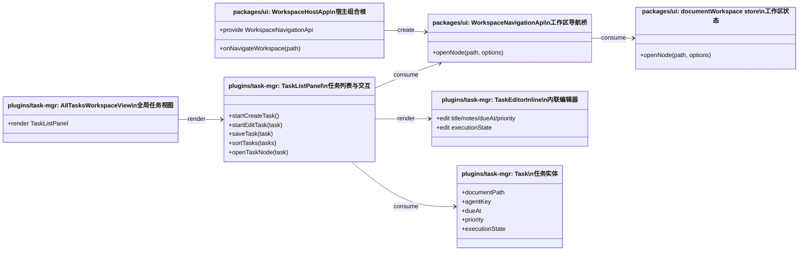

# Task Misc

## 原始需求

`task-misc` 希望为 task 插件增加如下功能：

* 在全局任务视图点击任务，可以回到 workspace 视图

* 编辑任务不会改变任务当前位置，看上去是 inline 编辑

* 在全局任务视图 `today` 中添加的任务，自动设置日期为今天

* 在任务详情支持为任务加上常用执行状态 `doing`，置于顶端；也支持简单时间段状态 `上午`、`下午`、`晚上`；这类状态与文档、agent 一样显示于底部，但需要用不同颜色区分

补充确认结果：

* 全局任务视图点击任务时：

  * 如果任务有关联文档，则切回主 workspace，并打开对应文档

  * 如果任务只有 agent/project 归属，则切回对应 agent/project workspace

* “inline 编辑”仅指进入编辑态时，编辑器就在当前 task row 原地展开，列表不要跳走

* `today` 视图新增任务时，只自动填“日期 = 今天”，不自动补具体时分

* `doing / 上午 / 下午 / 晚上` 属于互斥的执行状态，而不是通用标签

* 标记了执行状态的任务排在最前面，优先级高于现有日期排序

* workspace 导航能力统一抽象为上层 API：`WorkspaceNavigationApi.openNode(path, options)`，不把路由语义塞进 `documentWorkspace.openNode()`

## 详细需求

### 需求范围

* 在 `/all-tasks` 全局任务视图中，点击任务可返回主 workspace 语境

* 任务支持从全局任务视图原地进入编辑态，编辑器直接在当前 row 展开

* 在 `/all-tasks` 的 `today` 子集创建任务时，默认预填“日期 = 今天”，但时间保持为空

* 任务支持一个互斥的执行状态字段，取值范围为：

  * `doing`

  * `上午`

  * `下午`

  * `晚上`

* 任务列表按“是否设置执行状态”优先分层；带执行状态的任务整体排在无状态任务之前

* 带执行状态的任务在列表底部元信息区域展示，视觉上与文档 / agent 元信息区分颜色

* 全局任务点击回跳 workspace 时，允许附带目标 tab 和 tab 内详情键，用于恢复到任务相关上下文

### 非目标

* 不引入通用标签系统

* 不支持一个任务同时拥有多个执行状态

* 不支持用户自定义执行状态

* 不把执行状态扩展为复杂状态机、看板列、子任务、重复规则或提醒体系

* 不修改 `today / planned / all` 的查询语义

* 不把执行状态过滤或默认值逻辑下沉到 provider 查询层

* 不要求保存后强制保持任务原视觉位置不变

* 不扩展 `documentWorkspace.openNode()` 使其承担路由切换职责

* 不在本次设计中引入 `nodeId | path` 双目标协议；导航目标先统一使用 workspace path

### 界面描述 (UI)

#### 全局任务视图

* `/all-tasks` 继续作为顶层 workspace

* 列表中每条任务保留现有标题、备注摘要、日期、归属元信息等结构

* 点击任务 row 本身时，触发“回到 workspace”

* row 上仍保留编辑、完成、删除等轻操作入口

#### 原地编辑

* 编辑任务时，不跳转到详情页或面板外部

* 当前 task row 原地切换成编辑态，或在当前 row 位置展开内联编辑器

* 进入编辑态时，列表结构保持稳定，用户感知为“在这条任务上直接改”

#### 执行状态展示

* 执行状态在任务编辑区中提供一组轻量、互斥的状态选择

* `doing` 作为高频状态，放在执行状态入口中的优先位置

* `上午 / 下午 / 晚上` 与 `doing` 同组展示，均属于执行状态

* 当任务具有执行状态时，该状态显示在任务底部元信息区域

* 执行状态使用与文档 / agent 不同的颜色体系，避免误解为归属标签

### 交互逻辑

#### 1. 从全局任务回到 workspace

* 用户在 `/all-tasks` 点击任务

* 系统调用 `WorkspaceNavigationApi.openNode(path, options)` 恢复主 workspace 上下文

* 若任务有 `documentPath`，则使用该文档路径作为导航目标

* 若任务无 `documentPath` 但有 `agentKey`，则使用对应 agent/project owner path 作为导航目标

* `options` 中可包含：

  * `tab`：打开后激活的 workspace tab，例如 `tasks`

  * `detailKey`：tab 内的详情键，例如当前任务 id

#### 2. 原地进入编辑态

* 用户点击任务 row 上的编辑操作

* 当前 row 原地展开 `TaskEditorInline`

* 列表不切视图、不把该任务移到顶部后再编辑

* 用户保存或取消后，回到同一列表语境

#### 3. `today` 视图新增任务

* 用户位于 `/all-tasks` 的 `today` 子集

* 点击新增任务后，打开内联编辑器

* 新任务草稿默认填入“日期 = 今天”

* 时间字段保持为空，用户可按需补充具体时分

#### 4. 设置执行状态

* 用户在任务编辑区选择一个执行状态

* 执行状态互斥；选择新状态时替换旧状态

* 用户也可以清空执行状态，恢复为“无状态”

#### 5. 列表排序

* 列表先按“是否存在执行状态”分层：

  * 有执行状态的任务在前

  * 无执行状态的任务在后

* 两个分层内部继续沿用现有排序语义：

  * 有日期的任务按 `dueAt` 升序

  * 同日期任务按最近更新时间排序

  * 无日期任务排在有日期任务之后

## 推荐实现方案

### 架构设计

本次修改建议保持在 `task-mgr` 插件主导的边界内完成，但需要在 `packages/ui` 提供一个小型的 workspace 导航桥接能力。

#### 1. 扩展任务实体

* 在 `Task` 上新增 `executionState` 字段，而不是引入独立映射

* 推荐字段签名：

```ts
type TaskExecutionState = 'doing' | 'morning' | 'afternoon' | 'evening' | null;
```

* 该字段属于任务自身稳定属性，需要随任务一起持久化、跨宿主同步，并参与排序和展示

涉及模块：

* `plugins/task-mgr/src/contracts/Task.ts`

* `plugins/task-mgr/api.ts`

* `packages/core` / `packages/node` / server / facade 的任务桥接链路

* `packages/node/src/context/FileSystemTaskProvider.ts`

#### 2. 将 `TaskListPanel` 改为 row 内编辑模型

* 当前 `TaskListPanel` 采用面板级 `editingTask`，编辑器固定出现在列表顶部

* 推荐改为“row 级编辑”：

  * `TaskListPanel` 仍维护当前编辑状态

  * 当某个 task 正在编辑时，在该 task row 位置渲染 `TaskEditorInline`

  * 新建任务时，在当前列表语境中插入草稿行，而不是把编辑器固定放在面板顶部

这样可以满足“看上去是 inline 编辑”，同时保持 task 列表行为仍由 `TaskListPanel` 统一拥有。

#### 3. 新增上层导航 API，而不是扩展 `documentWorkspace.openNode()`

* 不建议让 `documentWorkspace.openNode()` 隐式承担“切回 workspace / 路由切换”的职责

* 推荐在 `packages/ui` 提供上层桥接：

```ts
interface WorkspaceNavigationApi {
  openNode(
    path: string,
    options?: {
      tab?: string | null;
      detailKey?: string | null;
    }
  ): Promise<void>;
}
```

职责划分：

* `WorkspaceNavigationApi.openNode(path, options)`

  * 负责切回 `/` workspace

  * 恢复目标节点

  * 激活目标 tab

  * 传递 `detailKey` 给 tab 内详情态

* `documentWorkspace.openNode(path, options)`

  * 只负责 workspace 内部节点打开，不承担路由语义

* `task-mgr` 插件

  * 只消费 `WorkspaceNavigationApi`，不直接拼接 router 或 `documentWorkspace` 的调用时序

#### 4. 排序与默认值保持在 UI 层

* 执行状态优先排序属于列表展示语义，应保留在 `TaskListPanel`

* `today` 子集创建任务时默认填“今天”属于入口默认值，应在创建草稿时处理

* 二者都不应下沉到 provider 查询层，否则会污染全局任务契约

## 增量补充：任务筛选与 Markdown 文档操作

### 原始需求

新增 3 项补充需求：

* 任务视图左侧 panel 新增过滤器：`已规划`、`未规划 / backlog`

* Markdown 编辑器“插入链接”支持上传新文件

* Markdown 编辑区新增按钮：`刷新当前文档`

补充确认结果：

* `已规划` 的定义为：任务 `executionState` 不为空

* `未规划 / backlog` 的定义为：任务没有日期，且 `executionState` 为空

* 上述两个过滤器显示在任务视图左侧 panel 中，作为新增入口，不替换现有入口

* `刷新当前文档` 的含义为：重新从文件系统读入当前文档内容

* 如果当前文档存在未保存修改，点击刷新时应先弹确认，明确告知会丢失未保存内容

### 详细需求

#### 需求范围

* 在全局任务视图左侧 panel 新增两个过滤入口：

  * `已规划`

  * `未规划 / backlog`

* 右侧任务列表在用户选择上述入口后，按对应过滤语义展示任务

* Markdown 编辑器“插入链接”流程支持在当前流程内上传一个新文件，并将其作为链接插入当前文档

* Markdown 编辑器新增“刷新当前文档”按钮，用于从文件系统重新读取当前文档内容

#### 非目标

* 不修改现有 `today / planned / all` 的既有筛选语义

* 不把“已规划 / backlog”做成与现有左侧入口互斥的替换式改版

* 不把“上传新文件”扩展为完整的资源管理器、批量上传器或任意目录上传工具

* 不把“刷新当前文档”做成单纯重新渲染编辑器

* 不在本次设计中扩展图片嵌入、附件预览、批量引用或更复杂的链接资源工作流

#### 界面描述 (UI)

##### 1. 任务视图左侧 panel

* 现有左侧快捷入口继续保留

* 在同一左侧 panel 中新增：

  * `已规划`

  * `未规划 / backlog`

* 每个入口继续沿用当前左侧卡片式快捷项风格，包含标题和简短说明

##### 2. Markdown 插入链接

* “插入链接”仍作为统一入口，不新增独立顶层工具栏按钮

* 在现有插链弹出面板中，资源相关区域增加“上传新文件”操作入口

* 上传完成后，新文件立即成为当前文档可选的链接目标

##### 3. 刷新当前文档

* 在当前文档编辑区顶部操作栏新增一个文档级按钮：`刷新当前文档`

* 该按钮与保存、查看模式切换等操作处于同一操作语境

* 当当前文档存在未保存修改时，点击后先弹确认对话

#### 交互逻辑

##### 1. 任务过滤

* 用户在任务视图左侧 panel 点击 `已规划`

* 系统按 `executionState !== null` 过滤任务，并更新右侧任务列表

* 用户点击 `未规划 / backlog`

* 系统按 `dueAt === null && executionState === null` 过滤任务，并更新右侧任务列表

##### 2. 插入链接并上传新文件

* 用户点击 Markdown 编辑器工具栏中的“插入链接”

* 系统打开现有插链面板

* 用户可继续选择已有文档 / 已有资源，或触发“上传新文件”

* 上传成功后，系统刷新当前可链接资源列表

* 系统将新文件对应的链接插入当前光标位置

##### 3. 刷新当前文档

* 用户点击“刷新当前文档”

* 若当前文档没有未保存修改，系统直接从文件系统重新读取当前文档内容，并更新编辑器显示

* 若当前文档存在未保存修改，系统先弹确认

* 用户确认后，系统丢弃当前未保存草稿，并从文件系统重新读取当前文档内容

* 用户取消后，不做任何修改

### 推荐实现方案

#### 架构设计

本次补充需求分成两条边界：

* 任务过滤继续留在 `task-mgr` 插件闭环内完成

* Markdown 插链增强与文档刷新属于 Markdown 工作区核心交互，应放在 `packages/ui`

#### 1. 扩展任务查询标签，但不改变既有 `planned` 语义

* 当前 `TaskQueryTag` 已存在 `all / today / planned`

* 本次应新增两个新 tag，用于承载新的左侧 panel 过滤入口

* 推荐内部 tag 语义：

  * `planned`：继续表示现有“未来日期任务”

  * `scheduled`：表示“执行状态不为空”，对应 UI 文案 `已规划`

  * `backlog`：表示“无日期且无执行状态”，对应 UI 文案 `未规划 / backlog`

涉及模块：

* `plugins/task-mgr/src/contracts/Task.ts`

* `apps/server/src/routes/context.ts`

* `packages/node/src/context/FileSystemTaskProvider.ts`

* `plugins/ai-agent/src/testing/createMockContextProvider.ts`

* `plugins/task-mgr/src/views/AllTasksWorkspaceView.vue`

* `packages/ui/src/i18n/messages/*.ts`

职责划分：

* `AllTasksWorkspaceView`

  * 负责左侧 panel 的快捷入口与当前选中 tag

* `TaskListPanel`

  * 继续只消费 `tag`，不直接拥有筛选入口 UI

* provider / server / mock provider

  * 对新 tag 保持一致的过滤语义

#### 2. 在 Markdown 插链流程中补“上传新文件”

* 现有插链 UI 已集中在 `DocumentEditorPane`

* 该组件应继续作为插链交互入口，但不直接承担工作区写文件与树同步职责

涉及模块：

* `packages/ui/src/components/DocumentEditorPane.vue`

* `packages/ui/src/views/DocumentWorkspaceView.vue`

* `packages/ui/src/store/documentWorkspace.ts`

职责划分：

* `DocumentEditorPane`

  * 渲染“上传新文件”操作入口

  * 触发上传动作

  * 在上传成功后继续走现有插链闭环

* `DocumentWorkspaceView`

  * 负责把工作区层面的上传能力与状态刷新能力传给编辑器

* `documentWorkspace`

  * 负责上传后的树刷新、可链接资源刷新，以及必要的工作区状态同步

设计约束：

* 上传新文件应归入现有资源链接语义，而不是重做一套新的插链模式

* 第一版只覆盖“上传后立即插入链接”闭环，不扩大为资源管理功能

#### 3. 在 store 中新增“重读当前文档”能力

* “刷新当前文档”不能直接复用 `openNode(activePath)`，因为现有 `openNode()` 会优先尝试 `flushActiveDocument()`，这与“丢弃未保存修改后重读文件”的需求相反

* 因此应在 `documentWorkspace` 中新增独立 action，专门表达“从文件系统重新加载当前文档”

推荐方法签名：

```ts
async reloadActiveDocument(options?: { force?: boolean }): Promise<void>
```

涉及模块：

* `packages/ui/src/store/documentWorkspace.ts`

* `packages/ui/src/views/DocumentWorkspaceView.vue`

* `packages/ui/src/components/DocumentEditorPane.vue`

职责划分：

* `documentWorkspace.reloadActiveDocument(...)`

  * 读取 `activePath`

  * 调用 `contextProvider.readDocument(activePath)`

  * 更新 `activeDocument`

  * 重置 `draftContent`

  * 清除当前 path 的 dirty 状态

  * 同步当前文档的 file-change / diff 展示状态

* `DocumentWorkspaceView`

  * 判断当前文档是否 dirty

  * 若 dirty，则先弹确认

  * 用户确认后调用 `reloadActiveDocument({ force: true })`

* `DocumentEditorPane`

  * 仅渲染按钮并发出 `refresh` 事件

#### 关键类 Mermaid 类图

```mermaid
classDiagram
direction LR

namespace "plugins/task-mgr" {
  class AllTasksWorkspaceView {
    <<任务筛选入口>>
  }
  class TaskListPanel {
    <<任务列表渲染>>
  }
  class TaskService {
    <<任务查询契约>>
  }
}

namespace "apps/server + packages/node" {
  class ContextRoute {
    <<任务查询路由>>
  }
  class FileSystemTaskProvider {
    <<任务过滤实现>>
  }
}

namespace "packages/ui" {
  class DocumentEditorPane {
    <<编辑器工具栏>>
  }
  class DocumentWorkspaceView {
    <<工作区视图桥接>>
  }
  class DocumentWorkspaceStore {
    <<文档状态与重读>>
  }
}

AllTasksWorkspaceView --> TaskListPanel : render
TaskListPanel --> TaskService : consume
ContextRoute --> TaskService : consume
FileSystemTaskProvider --> TaskService : consume
DocumentWorkspaceView --> DocumentEditorPane : render
DocumentWorkspaceView --> DocumentWorkspaceStore : consume
DocumentEditorPane --> DocumentWorkspaceView : consume
```

### 验收标准

| 动作 | 预期响应 |
|-----|--------|
| 在任务视图左侧 panel 点击 `已规划` | 右侧仅显示 `executionState` 不为空的任务 |
| 在任务视图左侧 panel 点击 `未规划 / backlog` | 右侧仅显示无日期且 `executionState` 为空的任务 |
| 在 Markdown 编辑器点击“插入链接”，再选择“上传新文件” | 上传成功后，当前文档插入指向新文件的链接 |
| 在 Markdown 编辑器点击“刷新当前文档”，且当前文档无未保存修改 | 编辑器重新显示文件系统中的最新内容 |
| 在 Markdown 编辑器点击“刷新当前文档”，且当前文档有未保存修改 | 系统先弹确认；确认后丢弃草稿并重读文件；取消则保持当前内容不变 |

### 关键类 Mermaid 类图



### 可能影响的模块

* `plugins/task-mgr/src/contracts/Task.ts`

* `plugins/task-mgr/src/components/TaskListPanel.vue`

* `plugins/task-mgr/src/components/TaskEditorInline.vue`

* `plugins/task-mgr/src/views/AllTasksWorkspaceView.vue`

* `packages/ui/src/views/WorkspaceHostApp.vue`

* `packages/ui/src/store/documentWorkspace.ts`

* `packages/node/src/context/FileSystemTaskProvider.ts`

## 验收标准

用于后续 e2e 测试验证需求的实现是否完整、正确：

| 动作                                                       | 预期响应                                         |
| -------------------------------------------------------- | -------------------------------------------- |
| 在 `/all-tasks` 点击一个关联文档的任务                               | 系统切回 `/` workspace，并打开该文档                    |
| 在 `/all-tasks` 点击一个仅关联 agent/project 的任务                 | 系统切回 `/` workspace，并进入对应 agent/project scope |
| 在 `/all-tasks` 点击任务的编辑操作                                 | 当前 task row 原地进入编辑态，列表不跳走                    |
| 在 `/all-tasks` 的 `today` 子集点击新增任务                        | 新任务编辑器默认填入今天日期，时间保持为空                        |
| 为任务设置 `doing` 状态                                         | 任务保存成功，并在列表中显示执行状态标记                         |
| 将任务状态从 `doing` 改为 `上午`                                   | 任务只保留 `上午` 状态，不再保留 `doing`                   |
| 清除任务执行状态                                                 | 任务恢复无状态，并回到无状态任务分层                           |
| 同时存在带执行状态任务和无状态任务                                        | 带执行状态任务整体排在无状态任务前面                           |
| 多个带执行状态任务同时存在                                            | 它们在状态分层内部继续按现有日期 / 更新时间规则排序                  |
| 从全局任务点击回 workspace 时附带 `tab=tasks` 和 `detailKey=task.id` | workspace 恢复到任务相关 tab，并将详情态定位到该任务            |
