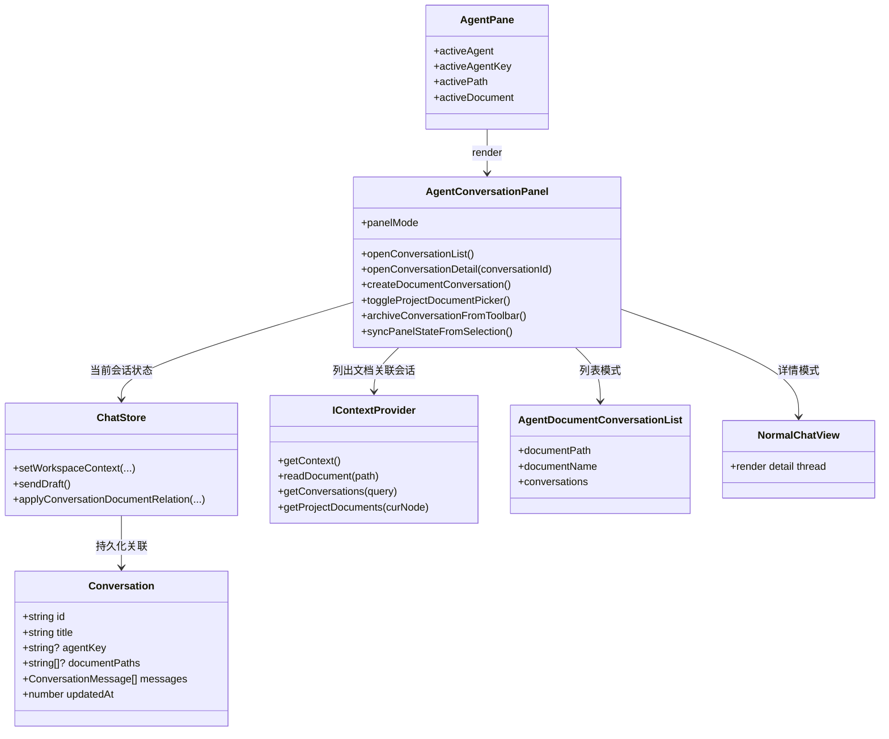
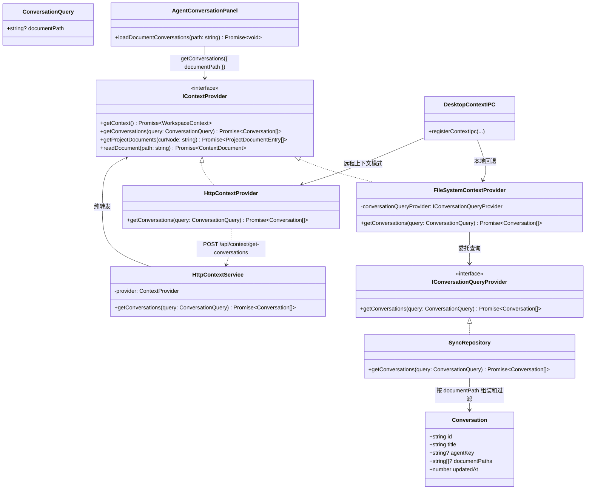

[English](../context-provider.md) | [中文](context-provider.zh-CN.md)

# Context Provider

本文汇总知识工作区中 `IContextProvider` 的架构关系，重点说明 `AgentPane`、会话列表、持久化和作用域上下文查询如何协作。

## Workspace / Panel Relationship

## Context Query Flow

## 说明

* `Conversation.documentPaths` 是按文档维度查询会话的持久化基础。

* `IContextProvider.getConversations(query)` 是工作区面板使用的统一查询入口。

* `IContextProvider.getProjectDocuments(curNode)` 是当前 agent 或目录作用域内可绑定文档的统一来源。

* `AgentConversationPanel` 负责列表/详情状态和顶部工具条动作，`IContextProvider` 负责数据查询。

* 在 agentMode 下，右侧面板顶部工具条是会话级操作的唯一入口，承载展开、新建对话、绑定文档、归档等动作；输入区不再承载归档入口。

* “绑定文档 / 归档”两个按钮仅在存在当前对话时显示。

* 绑定文档候选来自 `getProjectDocuments(curNode)`，在当前 agent 作用域内选择，而不是默认复用中间 panel 当前打开文档。

* 归档按钮需要反映持久化归档状态：未归档或已过期时高亮且可执行；已归档时显示为 disabled。
