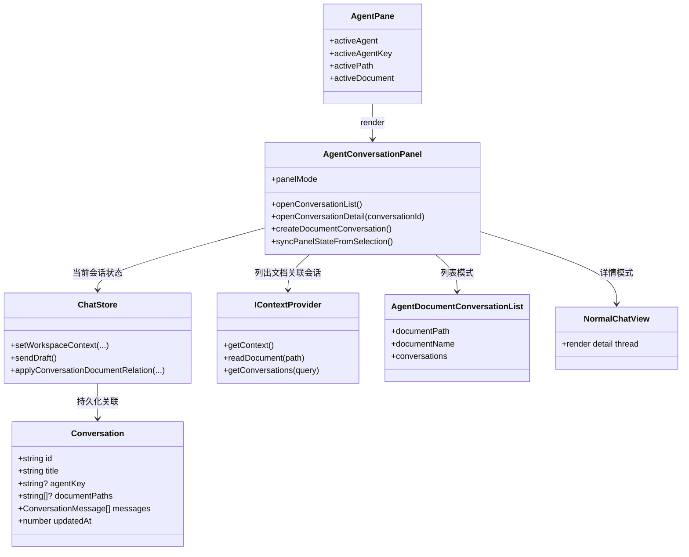
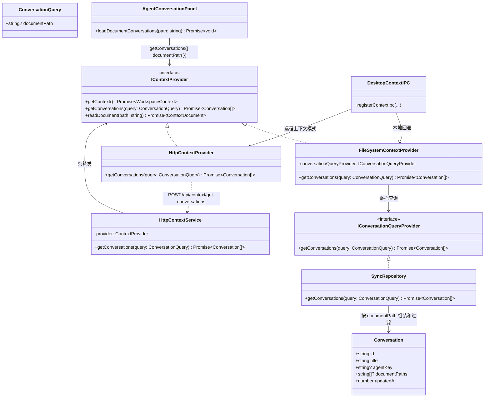

[English](../context-provider.md) | [中文](context-provider.zh-CN.md)

# Context Provider

本文汇总知识工作区中 `IContextProvider` 的架构关系，重点说明 `AgentPane`、会话列表、持久化和作用域上下文查询如何协作。

## Workspace / Panel Relationship

## Context Query Flow

## 说明

* `Conversation.documentPaths` 是按文档维度查询会话的持久化基础。

* `IContextProvider.getConversations(query)` 是工作区面板使用的统一查询入口。

* `AgentConversationPanel` 负责列表/详情状态，`IContextProvider` 负责数据查询。

