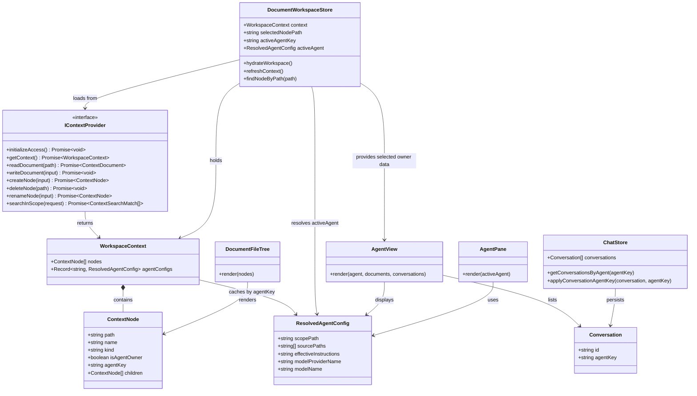

## Context

当前知识工作区的主链路把“目录树加载”“目录是否直绑 Agent”“当前路径生效的 Agent 是谁”“完整 Agent 配置从哪里取”拆散在多处：

- `documentWorkspace` 通过递归多次调用 `listTree(parentPath)` 拼装一棵前端侧的扁平树；
- `.agent.json` 在文件树中被隐藏，因此左侧图标和中间 Agent 视图如果想判断“目录是否直绑 Agent”，需要额外探测；
- 右侧 `AgentPane` 继续通过 `resolveScopedAgentConfig(path)` 单独解析当前路径的生效 Agent。

这种结构的直接问题是，左侧树、中间视图和右侧聊天虽然都依赖同一套 Agent 语义，却并不共享同一份上下文结果。随着本次要补齐目录级 Agent 视图、树图标和 Agent 会话归属，继续让 UI 自己递归拉树、自己推断目录 Agent 状态，成本会越来越高。

本次设计因此把知识工作区主数据入口收敛为一次性的 `getContext()` 调用：由 `ContextProvider` 统一返回完整目录树、每个节点的 `isAgentOwner + agentKey` 元数据，以及所有已解析的 `agentConfigs` 缓存。UI 不再自己推断 Agent，也不再按路径单独请求完整 Agent 配置。

约束条件：

- 所有文档需使用中文。
- 右侧现有 `AgentPane` 与 `NormalChatView` 保持不变，本次不重做三栏骨架。
- 中间 Agent 视图只在“当前选中目录 `isAgentOwner === true`”时出现，不包含继承命中的普通目录。
- 左侧树图标也只标记 `isAgentOwner === true` 的目录，不标记仅继承命中的目录。
- `agentKey` 表示节点当前生效的 Agent；该 Agent 可能来自真实目录配置，也可能来自 `ContextProvider` 内部默认兜底 Agent。
- UI 不感知“默认 Agent”概念，所有 Agent 一律通过 `agentKey + agentConfigs` 访问。
- `Conversation.agentKey` 记录知识工作区 Agent 链路中实际回答该会话的生效 Agent key。

## Goals / Non-Goals

**Goals:**

- 让知识工作区通过 `ContextProvider.getContext()` 一次拿到完整树和 Agent 配置缓存，不再递归多次拉目录。
- 让左侧树图标、中间 Agent 视图和右侧聊天上下文共享同一份节点 Agent 元数据。
- 将 `AgentView` 收敛为一个独立的能力边界，而不是散落在 `DocumentWorkspaceView`、`DocumentFileTree` 和 `AgentPane` 中的零散条件分支。
- 为 `Conversation` 增加可选 `agentKey`，使系统可以稳定按 Agent 聚合和恢复本地会话。
- 让 Agent 视图展示当前 Agent 元信息、提示词、模型、Markdown 文档列表和 Agent 会话列表。
- 保持旧会话和现有聊天链路兼容，不要求一次性迁移历史数据。

**Non-Goals:**

- 不修改 `.agent.json` schema，不新增显式 `agentId` 字段。
- 不改变最近父级 Agent 解析算法，也不重做继承/merge 规则。
- 不把完整 `ResolvedAgentConfig` 重复挂到每个树节点上。
- 不把外部历史预览纳入 Agent 会话列表。
- 不重构右侧 `AgentPane` 为新页面，也不调整顶层路由结构。

## Decisions

### 决策 1：`IContextProvider` 以 `getContext()` 作为知识工作区主入口

**选择**

在 `/Users/quanzhou/Workspace/ChatPrism/packages/core/src/interfaces/IContextProvider.ts` 中：

- `getContext(): Promise<WorkspaceContext>`

新增类型：

- `WorkspaceContext`
- `ContextNode.children?: ContextNode[]`
- `ContextNode.isAgentOwner?: boolean`
- `ContextNode.agentKey: string`

保留现有文档与文件操作接口：

- `readDocument(path: string): Promise<ContextDocument>`
- `writeDocument(input: WriteContextDocumentInput): Promise<void>`
- `createNode(input: CreateContextNodeInput): Promise<ContextNode>`
- `deleteNode(path: string): Promise<void>`
- `renameNode(input: RenameContextNodeInput): Promise<ContextNode>`
- `searchInScope(request: ContextSearchRequest): Promise<ContextSearchMatch[]>`

删除旧接口：

- `listTree(parentPath?: string): Promise<ContextNode[]>`

`WorkspaceContext` 结构为：

```ts
interface WorkspaceContext {
  nodes: ContextNode[]
  agentConfigs: Record<string, ResolvedAgentConfig>
}
```

**变更说明**

- `nodes` 返回完整目录树的根节点数组，而不是某一层级的子节点列表。
- `agentConfigs` 缓存所有可被节点引用的完整 Agent 配置；其中既包含真实 `.agent.json` 解析出来的 Agent，也包含 `ContextProvider` 内部默认兜底 Agent 对应项。
- UI 主链路改为消费 `getContext()`；不再依赖 `resolveScopedAgentConfig(path)` 获取当前 Agent。
- 目录树读取契约从“按父路径逐层枚举”切换为“一次返回完整树”，旧的 `listTree(parentPath)` 不再保留为公开接口。

涉及文件：

- `/Users/quanzhou/Workspace/ChatPrism/packages/core/src/interfaces/IContextProvider.ts`
- `/Users/quanzhou/Workspace/ChatPrism/packages/core/src/providers/context/HttpContextProvider.ts`
- `/Users/quanzhou/Workspace/ChatPrism/apps/server/src/services/httpContextService.ts`
- `/Users/quanzhou/Workspace/ChatPrism/apps/server/src/routes/context.ts`
- `/Users/quanzhou/Workspace/ChatPrism/apps/server/src/types/context.ts`
- `/Users/quanzhou/Workspace/ChatPrism/apps/desktop/main/contextIpc.ts`
- `/Users/quanzhou/Workspace/ChatPrism/apps/desktop/src/context/createDesktopContextProvider.ts`
- `/Users/quanzhou/Workspace/ChatPrism/packages/core/src/testing/createMockContextProvider.ts`

**备选方案**

- 方案 A：继续使用 `listTree(parentPath)`，由 UI 自己递归组树。缺点是请求多、状态分散，Agent 元数据也会继续散落在 UI 侧。
- 方案 B：保留 `resolveScopedAgentConfig(path)` 作为 UI 主入口。缺点是树、图标、视图和聊天仍然依赖不同数据源，无法彻底消除状态漂移。

### 决策 2：树节点只携带轻量 Agent 元数据，不重复挂完整配置

**选择**

`ContextNode` 收敛为轻量节点：

```ts
interface ContextNode {
  path: string
  name: string
  kind: 'file' | 'directory'
  updatedAt?: number
  hasChildren?: boolean
  parentPath?: string
  isAgentOwner?: boolean
  agentKey: string
  children?: ContextNode[]
}
```

语义固定为：

- `isAgentOwner === true` 表示“该目录自身直接存在 `.agent.json`”
- `agentKey` 表示“该节点当前生效的 Agent”
- `children` 表示完整子树

完整配置从 `WorkspaceContext.agentConfigs[agentKey]` 获取，而不是塞到 `ContextNode` 上。

**变更说明**

- 这样既能支持左侧树图标和中间视图判定，又避免在每个节点上重复携带 `instructions / tools / skills / sourcePaths`。
- 目录直绑 Agent 的视觉标识和节点当前生效 Agent 被拆成两个语义明确的字段，避免混淆。
- UI 永远只处理统一的 `agentKey`，不区分该 key 背后是目录 Agent 还是 provider 内部默认 Agent。

涉及文件：

- `/Users/quanzhou/Workspace/ChatPrism/packages/core/src/interfaces/IContextProvider.ts`
- `/Users/quanzhou/Workspace/ChatPrism/apps/server/src/providers/localFileContextProvider.ts`
- `/Users/quanzhou/Workspace/ChatPrism/packages/ui/src/components/DocumentFileTree.vue`
- `/Users/quanzhou/Workspace/ChatPrism/packages/ui/src/store/documentWorkspace.ts`

**备选方案**

- 方案 A：在每个节点上直接挂 `agentConfig`。缺点是整棵树载荷变重，同一 Agent 的配置会在大量节点上重复。
- 方案 B：只返回 `isAgentOwner`，不返回 `agentKey`。缺点是 UI 仍需自己推断当前生效 Agent，无法彻底去掉路径级解析。

### 决策 3：`ContextProvider` 统一负责完整树构建、Agent 归属计算和配置缓存

**选择**

在 `/Users/quanzhou/Workspace/ChatPrism/apps/server/src/providers/localFileContextProvider.ts` 中，`getContext()` 一次完成：

1. 扫描工作区目录
2. 构建完整树结构
3. 识别每个目录是否直接拥有 `.agent.json`，填充 `isAgentOwner`
4. 解析所有真实 `.agent.json`
5. 依据最近父级规则为每个节点计算 `agentKey`
6. 对未命中真实配置的节点分配 provider 内部默认 Agent key
7. 生成 `agentConfigs`

主要函数建议为：

- `getContext(): Promise<WorkspaceContext>`
- `buildContextTree(rootPath: string): Promise<ContextNode[]>`
- `collectAgentConfigs(nodes: ContextNode[]): Promise<Record<string, ResolvedAgentConfig>>`
- `assignEffectiveAgentKeys(nodes: ContextNode[], agentConfigs: Record<string, ResolvedAgentConfig>): ContextNode[]`

**变更说明**

- UI 不再单独探测 `.agent.json`，也不再针对某条路径调用 Agent 解析。
- `resolveScopedAgentConfig(path)` 与 `listTree(parentPath)` 都从知识工作区公开主接口中移除；后续需要目录遍历的内部逻辑统一基于 `getContext()` 返回的树结构实现。
- 对于 web / desktop / extension 三个宿主，renderer 最终都只消费同一个 `WorkspaceContext` 契约。
- “默认 Agent”仅存在于 provider 实现内部；对外只体现为某个稳定的 `agentKey` 及其在 `agentConfigs` 中对应的配置项。

涉及文件：

- `/Users/quanzhou/Workspace/ChatPrism/apps/server/src/providers/localFileContextProvider.ts`
- `/Users/quanzhou/Workspace/ChatPrism/apps/server/src/services/httpContextService.ts`
- `/Users/quanzhou/Workspace/ChatPrism/packages/core/src/providers/context/HttpContextProvider.ts`
- `/Users/quanzhou/Workspace/ChatPrism/apps/desktop/main/contextIpc.ts`
- `/Users/quanzhou/Workspace/ChatPrism/packages/core/src/testing/createMockContextProvider.ts`

**备选方案**

- 方案 A：让 `DocumentFileTree` 或 `documentWorkspace` 自己判断哪些目录是 Agent owner。缺点是 UI 变成了配置解析者。
- 方案 B：由 UI 遍历节点后按路径查 `agentConfigs`。缺点是节点本身缺少 `agentKey`，仍然无法避免前端推断。

### 决策 4：知识工作区 UI 全量改为消费 `WorkspaceContext`

**选择**

在 `/Users/quanzhou/Workspace/ChatPrism/packages/ui/src/store/documentWorkspace.ts` 中，将工作区状态收敛为：

- `context: WorkspaceContext | null`
- `selectedNodePath: string | null`
- `activeNode: ContextNode | null`
- `activeDocument: ContextDocument | null`
- `activeAgentKey: string | null`
- `activeAgent: ResolvedAgentConfig | null`
- `isAgentOwnerSelected: boolean`

主要方法建议为：

- `hydrateWorkspace(): Promise<void>`
- `refreshContext(): Promise<void>`
- `findNodeByPath(path: string): ContextNode | null`
- `flattenVisibleNodes(nodes: ContextNode[]): Array<{ node: ContextNode; depth: number }>`
- `findChildrenByPath(path: string): ContextNode[]`

渲染规则：

- 左侧 `DocumentFileTree` 根据节点的 `isAgentOwner` 显示 Agent 图标
- 中间 `DocumentWorkspaceView` 在选中目录且 `isAgentOwner === true` 时渲染 `AgentView`
- 右侧 `AgentPane` 通过 `activeAgentKey` 和 `context.agentConfigs[activeAgentKey]` 获取当前 Agent；不再有 UI 侧默认 Agent 分支

**变更说明**

- 中间 Agent 视图与左侧树图标共用同一份节点元数据，不再各自判断。
- 文档列表从选中目录节点的 `children` 子树中过滤 `.md/.markdown` 文件。
- 目录树即使以嵌套结构返回，`DocumentFileTree` 仍可在组件内部转换为可见行，不要求 UI 状态必须改成嵌套渲染组件。
- 原先任何依赖 `listTree(parentPath)` 的 UI 目录读取逻辑，都改为基于 `findNodeByPath()` / `findChildrenByPath()` 在内存树上完成，不再额外发 provider 请求。

涉及文件：

- `/Users/quanzhou/Workspace/ChatPrism/packages/ui/src/store/documentWorkspace.ts`
- `/Users/quanzhou/Workspace/ChatPrism/packages/ui/src/views/DocumentWorkspaceView.vue`
- `/Users/quanzhou/Workspace/ChatPrism/packages/ui/src/components/DocumentFileTree.vue`
- `/Users/quanzhou/Workspace/ChatPrism/packages/ui/src/components/AgentView.vue`
- `/Users/quanzhou/Workspace/ChatPrism/packages/ui/src/components/AgentPane.vue`

**备选方案**

- 方案 A：只替换左侧树数据来源，中间和右侧继续走路径解析。缺点是三块 UI 仍然不同步。
- 方案 B：把 `children` 树直接展开成 provider 侧扁平数组。缺点是失去“完整树引用”这一统一结构，也不符合本次要求。

### 决策 5：`AgentView` 作为独立 capability，由专门组件承载目录级 Agent 资产总览

**选择**

新增组件：

- `/Users/quanzhou/Workspace/ChatPrism/packages/ui/src/components/AgentView.vue`

建议 props：

- `agentKey: string`
- `agent: ResolvedAgentConfig`
- `ownerNode: ContextNode`
- `conversations: Conversation[]`

建议内部派生逻辑：

- `collectMarkdownDocuments(ownerNode: ContextNode): ContextNode[]`
- `buildAgentViewSections(agent: ResolvedAgentConfig): AgentViewSection[]`

`AgentView` 的职责固定为：

- 展示当前 Agent 的名称、作用域、模型和有效提示词
- 展示当前 Agent owner 目录子树中的 Markdown 文档列表
- 展示 `conversation.agentKey === agentKey` 的本地会话列表
- 触发“打开文档”“切换会话”这两类交互事件

`AgentView` 不承担的职责：

- 不负责判断当前是否应该显示自己
- 不负责从 provider 加载上下文
- 不直接发消息或承载聊天输入
- 不实现文件树图标逻辑

工作区中的接入方式：

- `/Users/quanzhou/Workspace/ChatPrism/packages/ui/src/views/DocumentWorkspaceView.vue`
  - 仅在选中目录节点且 `isAgentOwner === true` 时挂载 `AgentView`
- `/Users/quanzhou/Workspace/ChatPrism/packages/ui/src/components/AgentPane.vue`
  - 继续只承载右侧聊天 pane，不吸收 Agent 资产总览职责

**变更说明**

- 这样可以把“目录级 Agent 资产展示”提炼成独立 capability，并在后续 specs 中单独描述其显示条件、展示内容和交互行为。
- `knowledge-workspace` 只负责工作区壳层集成和挂载位置；`AgentView` 负责自身内容契约。
- `AgentView` 与 `AgentPane` 形成清晰分工：前者是目录级 Agent 资产视图，后者是会话与消息视图。

涉及文件：

- `/Users/quanzhou/Workspace/ChatPrism/packages/ui/src/components/AgentView.vue`
- `/Users/quanzhou/Workspace/ChatPrism/packages/ui/src/views/DocumentWorkspaceView.vue`
- `/Users/quanzhou/Workspace/ChatPrism/packages/ui/src/components/AgentPane.vue`
- `/Users/quanzhou/Workspace/ChatPrism/packages/ui/src/store/documentWorkspace.ts`
- `/Users/quanzhou/Workspace/ChatPrism/packages/ui/src/store/chat.ts`

**备选方案**

- 方案 A：把 Agent 资产总览继续塞进 `DocumentWorkspaceView.vue`。缺点是 capability 边界不清晰，规格和测试只能依附在工作区壳层上。
- 方案 B：把 Agent 资产列表并入 `AgentPane`。缺点是右侧聊天区域会同时承担目录总览和消息线程两类职责，耦合过重。

### 决策 6：会话持久化继续只保存单个 `agentKey`

**选择**

在 `/Users/quanzhou/Workspace/ChatPrism/packages/core/src/interfaces/IStorageProvider.ts` 中，为 `Conversation` 增加：

- `agentKey?: string`

在 `/Users/quanzhou/Workspace/ChatPrism/packages/ui/src/store/chat.ts` 中增加：

- `resolveConversationAgentKey(agentKey: string | null): string | undefined`
- `applyConversationAgentKey(conversation: Conversation, agentKey: string | null): void`
- `getConversationsByAgent(agentKey: string): Conversation[]`

写入规则：

- 当右侧 Agent 模式实际回答当前会话时，把当时的 `activeAgentKey` 写入会话
- 普通聊天工作区中的一般会话保持无 `agentKey`
- 已绑定会话后续继续保留原绑定，不因当前目录切换而重写

**变更说明**

- `agentKey` 是最小持久化模型，只承担会话归属标识职责。
- 在知识工作区 Agent 链路中，`Conversation.agentKey` 与节点 `agentKey` 语义完全一致，因此默认兜底 Agent 也会拥有自己的会话归属 key。
- 旧会话读取时 `agentKey` 缺省为 `undefined`，无需额外迁移。

涉及文件：

- `/Users/quanzhou/Workspace/ChatPrism/packages/core/src/interfaces/IStorageProvider.ts`
- `/Users/quanzhou/Workspace/ChatPrism/packages/core/src/providers/storage/IndexedDBStorageProvider.ts`
- `/Users/quanzhou/Workspace/ChatPrism/packages/core/src/providers/storage/SyncStorageProvider.ts`
- `/Users/quanzhou/Workspace/ChatPrism/packages/ui/src/store/chat.ts`

**备选方案**

- 方案 A：保存 `agentBinding` 快照对象。缺点是模型更重、快照易漂移。
- 方案 B：不保存 Agent 归属。缺点是 Agent 会话列表无法稳定恢复。

### 决策 7：简化 AgentConfig 继承为单一 Merge 模式并修复基底合并

**选择**

- 移除 `IAgentConfig` 中的 `inheritance`（之前有 `merge` / `override` 两种可选）。
- 任何层级的 `.agent.json` 天然按照 `merge` 往下合并。
- 解析逻辑在累积层级配置进行 `reduce` 时，不再从根部找到的第一份配置开始，而是固定把系统的 `fallback`（我们默认配置的兜底基底）作为 reduce 初始值传入并克隆。

**变更说明**

- 这样一举解决了旧系统子级无法合法继承全局 `fallback` 中 tools 等默认规则的问题。
- 子级如果只需小范围修改属性，只定义这几个属性就是“修改”；如果声明所有的属性就自然构成了“完全覆盖”（override）。
- 因此，`override` 在概念和物理代码中都被抛弃，减少了配置文件的复杂度与阅读理解成本。

涉及文件：

- `/Users/quanzhou/Workspace/JARVIS/packages/core/src/interfaces/IAgentConfig.ts`
- `/Users/quanzhou/Workspace/JARVIS/packages/core/src/agents/config/resolveScopedAgentConfig.ts`

**备选方案**

- 方案 A：保留 override 标记。缺点是用户负担增加，遇到问题排查更麻烦（容易被某些父节点的 override 打断）。

## Mermaid Class Diagram



## Risks / Trade-offs

- [风险] `getContext()` 一次返回完整树和所有 Agent 配置，首屏载荷会比逐层拉取更大 → 通过节点只保留轻量元数据、完整配置只放在 `agentConfigs` 中控制体积。
- [风险] `agentKey` 采用最终 `.agent.json` 路径或 provider 内部默认 key 作为身份键，配置文件重命名后新旧会话会分属不同键 → 这是当前无显式 `agentId` 前提下的可接受折中；后续若需要稳定跨重命名归属，再单独演进 schema。
- [风险] 旧会话没有 `agentKey`，Agent 视图里的历史列表在升级初期可能偏少 → 通过保持字段可选和无迁移策略，优先保证正确性而不是激进回填。
- [风险] 删除 `listTree(parentPath)` 后，原先依赖目录级枚举的逻辑需要一起迁移，否则会出现调用断裂 → 在本次变更中同步把 UI 目录访问和依赖该接口的知识工作区调用全部改到内存树辅助函数上。

## Migration Plan

1. 在 `/Users/quanzhou/Workspace/ChatPrism/packages/core/src/interfaces/IContextProvider.ts` 引入 `WorkspaceContext`、扩展 `ContextNode`，新增 `getContext()`。
2. 在 server / desktop / mock provider 侧实现 `getContext()`，返回完整树、`isAgentOwner`、`agentKey` 和 `agentConfigs`。
3. 更新 `/Users/quanzhou/Workspace/ChatPrism/packages/ui/src/store/documentWorkspace.ts`，从递归 `listTree()` 改为消费 `getContext()`，并补齐树遍历辅助函数以替代原来的逐层读取。
4. 更新 `/Users/quanzhou/Workspace/ChatPrism/packages/ui/src/components/DocumentFileTree.vue`、`/Users/quanzhou/Workspace/ChatPrism/packages/ui/src/views/DocumentWorkspaceView.vue` 和新的 `/Users/quanzhou/Workspace/ChatPrism/packages/ui/src/components/AgentView.vue`，统一基于节点元数据渲染树图标与 Agent 视图。
5. 在 `/Users/quanzhou/Workspace/ChatPrism/packages/core/src/interfaces/IStorageProvider.ts` 和 `/Users/quanzhou/Workspace/ChatPrism/packages/ui/src/store/chat.ts` 中补齐会话 `agentKey` 持久化。
6. 补齐 `packages/core`、`packages/ui`、`apps/server`、`apps/desktop` 的测试，验证完整树返回、Agent 元数据、Agent 视图判定和会话归属，包括默认兜底 Agent key 的一致性。

回滚策略：

- 若 `getContext()` 路径不稳定，可整体回退知识工作区上下文接口改动，恢复原有 UI 拉树方式，同时保留 `Conversation.agentKey` 改动。
- 若 `agentKey` 归属逻辑引发会话异常，可整体回退 `Conversation.agentKey` 相关修改；由于字段是新增可选项，不会破坏旧数据读取。

## Open Questions

- 当前没有阻塞性开放问题。本次方案即删除 `listTree(parentPath)` 旧接口；若还存在非知识工作区调用方依赖它，需要在实现阶段同步迁移到 `getContext()` 或基于树结构的内部辅助函数。
