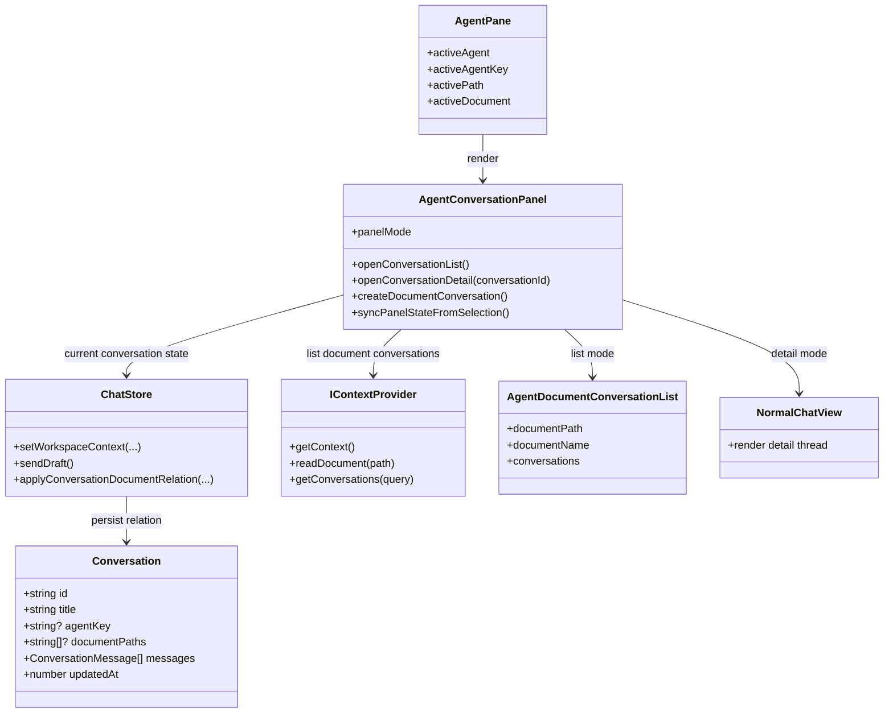
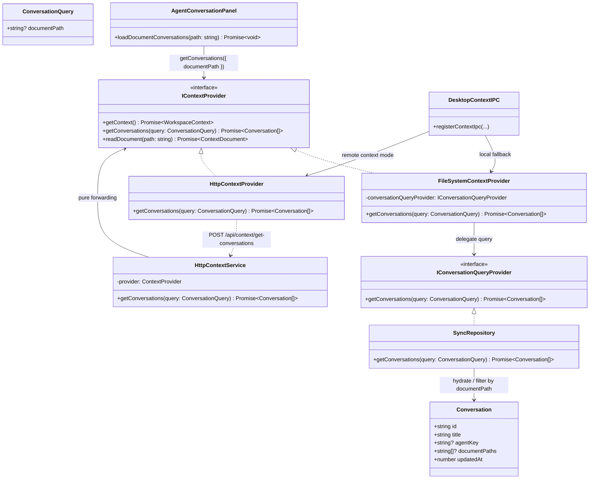

## Context

当前右侧 `AgentPane` 直接渲染 `NormalChatView`，其职责是围绕“当前生效 Agent”提供一个持续可聊天的详情视图。现有实现已经支持：

- 依据 `activePath` / `activeDocument` / `activeAgentKey` 将工作区上下文传入 `chatStore`
- 首轮请求在 provider 接受当前文档 MIME 时，把活动文档作为真实请求附件持久化到历史
- `AgentView` 在中间主面板按 `agentKey` 汇总目录级文档和本地会话

但右侧面板仍缺少一个以“当前选中文档”为中心的会话入口，导致用户只能在单条会话里继续聊天，无法先看与文档相关的对话列表，再进入具体详情。这个缺口已经不只是 UI 排版问题，而是要求系统定义新的会话级持久化字段，并把“如何读取某个文档关联的会话列表”纳入 `IContextProvider` 契约，而不是让 UI 直接依赖聊天存储实现。
此外，当前中间主面板 `AgentView` 已经能在绑定 Agent 的目录上展示该 Agent 的本地会话汇总，但右侧 `AgentPane` 仍然直接落到单条聊天详情，缺少与中间面板一致的目录级会话入口。右侧 assistant pane 需要在“文档选中”与“绑定 Agent 的目录选中”两种场景下都具备列表/详情双态，只是两者的数据来源不同。
另一个相邻缺口位于对话模式左侧 sidebar：虽然系统已经支持删除本地会话和问题级星标，但缺少整会话级 `starred` 元数据与顶部筛选入口，导致用户无法在左侧快速沉淀和回看一组重要会话。该能力应落在共享对话工作台与本地会话持久化层，而不是知识工作区专属逻辑里。

本次设计约束如下：

- 文档选中范围不再限定为 Markdown，任何工作区文档都采用同一套右侧列表/详情行为。
- 中间主面板 `AgentView` 不在本次变更范围内，目录级总览能力保持不变；但右侧 `AgentPane` 需要在目录选中时复用同一份 Agent 会话聚合结果。
- `NormalChatView` 不做结构性重构，继续作为详情视图复用。
- 会话与文档是多对多关系，但当前自动写入只在“首轮真实把当前文档作为附件发送”这一刻发生。
- `IContextProvider` 将承担文档相关会话列表的读取职责。
- 同步链路必须兼容新字段，但不引入数据库 migration。

## Goals / Non-Goals

**Goals:**

- 在右侧 AgentPanel 内新增统一的文档会话列表/详情双态交互。
- 选中任意文档时默认展示该文档关联的本地会话列表。
- 选中绑定 Agent 的目录时默认展示属于该 Agent 的本地会话列表。
- 对话模式左侧本地历史项支持整会话级星标，并支持顶部“全部 / 仅看星标”过滤。
- 为 `Conversation` 引入可向后兼容的 `documentPaths` 持久化字段。
- 为 `IContextProvider` 增加统一的会话只读查询接口，并支持按文档读取关联会话列表。
- 保证本地存储、同步存储和服务端同步载荷对 `documentPaths` 无损透传。
- 保持 `NormalChatView` 作为详情视图复用，避免拆解现有聊天逻辑。

**Non-Goals:**

- 不实现手工为会话增删文档关联的 UI。
- 不改变中间主面板 `AgentView` 现有按 `agentKey` 总览的定位或交互，只复用其目录级会话聚合语义。
- 不重构 `NormalChatView` 内部的消息线程、输入区或底部新建按钮语义。
- 不在本次变更中扩展外部历史列表的星标能力，星标仅作用于本地会话。
- 不新增数据库列，也不改变现有同步接口的基本结构。

## Decisions

### 1. 会话模型采用多文档关联，字段落在 `Conversation.documentPaths`

选择在核心会话模型上增加：

```ts
documentPaths?: string[];
```

而不是新增独立映射表或只记录单一 `documentPath`。

原因：

- 用户已经明确要求一个会话支持关联多个文档，单值字段会在后续手动关联场景下失效。
- `Conversation` 已经承载 `agentKey`、`modelSelection` 等会话级元数据，把文档关联放在同一级别最直接。
- 当前存储与同步链路都以整条 `Conversation` JSON 为主，新增可选数组字段的兼容成本最低。

备选方案：

- 单一 `documentPath`：不满足多文档关系。
- 单独维护关联索引：实现复杂度高，需要额外同步与一致性约束，超出本次范围。

涉及文件与签名：

- [Conversation.ts](/Users/quanzhou/Workspace/JARVIS/packages/core/src/interfaces/Conversation.ts)
  - `export interface Conversation { documentPaths?: string[]; }`
  - `export function cloneConversation(conversation: Conversation): Conversation`
  - `export function normalizeConversation(conversation: Conversation): Conversation`
- [sync.ts](/Users/quanzhou/Workspace/JARVIS/apps/server/src/types/sync.ts)
  - `export interface SyncConversation { documentPaths?: string[]; }`

变更描述：

- `normalizeConversation` 对 `documentPaths` 做字符串过滤、去重和旧数据兼容。
- 服务端同步类型允许该字段缺省，并在 JSON 解析阶段保持透传。

### 2. 文档相关会话列表由 `IContextProvider` 统一读取，而不是由 UI 直接查询聊天 store

新增接口：

```ts
getConversations(query: ConversationQuery): Promise<Conversation[]>;
```

挂载在：

- [IContextProvider.ts](/Users/quanzhou/Workspace/JARVIS/packages/core/src/interfaces/IContextProvider.ts)

原因：

- 用户已经明确要求文档相关会话列表由 `IContextProvider` 提供，这样右侧 assistant pane 只依赖工作区 provider，而不直接依赖本地会话存储的具体实现。
- Web 宿主当前已经通过 HTTP-backed `IContextProvider` 访问 `/api/context`，把文档会话列表读取也纳入同一契约，能保持跨宿主一致的知识工作区边界。
- `documentPaths` 是会话级数据，但“按某个文档读取相关会话”是一个工作区上下文查询问题，用 `IContextProvider` 统一暴露更符合调用关系。

备选方案：

- 由 `chatStore.getConversationsByDocument()` 直接从本地会话数组过滤：实现简单，但会把右侧 assistant pane 绑定到 UI 内部持久化细节，且无法自然覆盖 HTTP / Desktop / Extension 的 provider 边界。
- 把文档会话列表塞进 `getContext()`：会让一次性上下文载荷过重，也不利于按文档增量刷新。

涉及文件与签名：

- [IContextProvider.ts](/Users/quanzhou/Workspace/JARVIS/packages/core/src/interfaces/IContextProvider.ts)
  - `getConversations(query: ConversationQuery): Promise<Conversation[]>`
- [HttpContextProvider.ts](/Users/quanzhou/Workspace/JARVIS/packages/core/src/providers/context/HttpContextProvider.ts)
  - `async getConversations(query: ConversationQuery): Promise<Conversation[]>`
- [createMockContextProvider.ts](/Users/quanzhou/Workspace/JARVIS/packages/core/src/testing/createMockContextProvider.ts)
  - `async getConversations(query: ConversationQuery): Promise<Conversation[]>`
- [httpContextService.ts](/Users/quanzhou/Workspace/JARVIS/apps/server/src/services/httpContextService.ts)
- [context.ts](/Users/quanzhou/Workspace/JARVIS/apps/server/src/routes/context.ts)

变更描述：

- `IContextProvider` 新增一个统一只读查询方法，并支持通过 `documentPath` 条件返回相关会话列表。
- 服务端 `/api/context/get-conversations` 增加对应 endpoint，HTTP provider 透传该能力。
- 具体 provider 可基于持久化层按 `conversation.documentPaths` 过滤，但这一实现细节对 UI 不可见。

### 3. 文档级列表/详情导航由新的外层组件管理，不下沉 `NormalChatView`

新增组件：

- [AgentConversationPanel.vue](/Users/quanzhou/Workspace/JARVIS/packages/ui/src/components/AgentConversationPanel.vue)
- [AgentDocumentConversationList.vue](/Users/quanzhou/Workspace/JARVIS/packages/ui/src/components/AgentDocumentConversationList.vue)

核心判断是：不去拆 `NormalChatView`，而是把它作为详情子视图继续挂在外层面板下；外层统一管理“文档关联会话列表 / Agent 目录会话列表 / 会话详情”三种状态。

原因：

- `NormalChatView` 已深度耦合 `chatStore.displayConversation`、preview、provider/model 选择、附件、问题索引、停止生成、鉴权恢复等逻辑。
- 若为了 AgentPanel 拆分出线程区、输入区、工具栏等子组件，改动会跨越 `packages/ui/src/views/NormalChatView.vue`、测试桩、宿主工作台装配和多个现有用例，回归风险大。
- 外层组件只负责状态切换和顶部工具栏，能保持职责边界清楚：导航在外层，聊天详情在内层。

备选方案：

- 直接在 `NormalChatView` 中增加列表态：会把 AgentMode 专属行为耦合进通用聊天视图。
- 拆分 `NormalChatView` 下层组件：工程收益不足，风险过高。

涉及文件与签名：

- [AgentPane.vue](/Users/quanzhou/Workspace/JARVIS/packages/ui/src/components/AgentPane.vue)
- [AgentConversationPanel.vue](/Users/quanzhou/Workspace/JARVIS/packages/ui/src/components/AgentConversationPanel.vue)
  - `type PanelMode = 'list' | 'detail'`
  - `function openConversationList(): void`
  - `async function loadDocumentConversations(path: string): Promise<void>`
  - `async function openConversationDetail(conversationId: string): Promise<void>`
  - `async function createDocumentConversation(): Promise<void>`
  - `function syncPanelStateFromSelection(): void`
- [AgentDocumentConversationList.vue](/Users/quanzhou/Workspace/JARVIS/packages/ui/src/components/AgentDocumentConversationList.vue)
  - props:
    `documentPath: string`
    `documentName: string`
    `conversations: Conversation[]`
    `activeConversationId?: string | null`

变更描述：

- `AgentPane` 头部元信息保留。
- 头部以下不再直接渲染 `NormalChatView`，而是渲染 `AgentConversationPanel`。
- 详情态的内容仍然是 `NormalChatView`。
- `AgentConversationPanel` 在文档选中时通过 `props.contextProvider.getConversations({ documentPath: activePath })` 读取列表数据，在绑定 Agent 的目录选中时则直接复用 `chatStore.getConversationsByAgent(activeAgentKey)` 的本地聚合结果。

### 4. 顶部工具栏归 `AgentConversationPanel` 管理，`+` 新建并停留详情，返回回列表

用户已经明确要求顶部显示：

- `+` 按钮
- 返回按钮
- 当前对话标题

并要求这三者由外层 `AgentConversationPanel` 管理，而不是改 `NormalChatView`。

最终行为约定：

- 选中任意文档时默认进入列表态。
- 选中绑定 Agent 的目录时也默认进入列表态。
- 点击列表项进入详情态。
- 详情顶部返回按钮执行 `openConversationList()`，返回到当前上下文对应的列表。
- 详情顶部 `+` 在文档上下文下创建新对话并停留在详情，在目录上下文下也创建该 Agent 作用域的新对话并停留在详情。
- `NormalChatView` 底部原有“新建对话”按钮保持现状，不改其行为。

原因：

- 顶部工具栏描述的是 AgentPanel 的导航状态，不属于通用聊天视图内部职责。
- 不修改 `NormalChatView` 可以最小化回归面。
- 顶部 `+` 与返回语义虽然重复，但这是已确认的产品决定，外层实现最直接。

备选方案：

- 改 `NormalChatView` 内部 `+` 的语义：会让通用聊天视图承担 Agent 专属导航。
- 隐藏底部“新建对话”按钮：用户已明确要求保留。

涉及文件与签名：

- [AgentConversationPanel.vue](/Users/quanzhou/Workspace/JARVIS/packages/ui/src/components/AgentConversationPanel.vue)
  - `const currentConversationTitle = computed(() => chatStore.currentConversation?.title || 'New Chat')`
  - `function openConversationList(): void`

变更描述：

- 工具栏只在详情态显示。
- 列表态由列表组件自身提供“新建当前文档对话”入口，进入一个新的空白详情会话。

### 5. 自动写入文档关联只依据“首轮真实附件”，不再限制 MIME 为 Markdown

`chatStore` 需要基于真实请求快照而不是 UI 选中态写入 `documentPaths`。当前规则固定为：

- 仅限 AgentMode
- 仅限本地会话
- 仅限首轮发送
- 当前存在 `activeWorkspacePath`
- `requestSnapshot.attachments` 中存在 `id === active-document:${documentPath}` 的附件

一旦满足，就把该路径追加到 `conversation.documentPaths`。

不再要求当前文档 MIME 为 `text/markdown`。

原因：

- “是否真实进入请求”应由 `requestSnapshot` 决定，而不是由当前文档类型二次推断。
- 现有链路已经对 MIME 是否可入模做过 provider 能力判断，本层只需要消费结果。
- 这样文本、PDF 及未来其他被 provider 接受的文档都能统一工作。

涉及文件与签名：

- [chat.ts](/Users/quanzhou/Workspace/JARVIS/packages/ui/src/store/chat.ts)
  - `resolveConversationDocumentPath(path: string | null, document: ContextDocument | null): string | undefined`
  - `applyConversationDocumentRelation(conversation: Conversation, input: { documentPath: string | null; requestSnapshot?: MessageRequestSnapshot; isFirstTurn: boolean }): void`

变更描述：

- 在 `sendDraft()` 成功持久化前，根据本轮 `requestSnapshot` 调用 `applyConversationDocumentRelation(...)`。
- `chatStore` 不再承担文档列表主查询职责；它只负责把 `documentPaths` 写入会话，并在必要时为当前活动会话提供乐观补齐。

### 6. 本地与同步存储都只做字段透传，不做 schema migration

本次不为 `documentPaths` 单独加数据库列。

原因：

- 现有同步仓储已经将完整 `Conversation` 写入 `payload_json`。
- 新字段只需在本地 `Conversation` normalize、同步载荷解析和服务端 JSON 透传中保留即可。
- 这样 rollout 成本低，也不会影响旧客户端读取。

备选方案：

- 增加专门列并双写：方便查询，但当前没有服务端按文档检索需求，收益不足。

涉及文件与签名：

- [syncRepository.ts](/Users/quanzhou/Workspace/JARVIS/apps/server/src/repositories/syncRepository.ts)
  - 保持 `payload_json` 透传，无需新增 SQL 列
- [storage-provider spec](/Users/quanzhou/Workspace/JARVIS/openspec/specs/storage-provider/spec.md)
- [sync-storage-provider spec](/Users/quanzhou/Workspace/JARVIS/openspec/specs/sync-storage-provider/spec.md)

变更描述：

- 本地持久化保证 `documentPaths` 存取一致。
- 同步 push / pull / hydrate 保证该字段不丢失。

### 7. 需要同步调整的文件清单

需要新增或修改的主要文件如下：

- [packages/core/src/interfaces/Conversation.ts](/Users/quanzhou/Workspace/JARVIS/packages/core/src/interfaces/Conversation.ts)
  - 需要同时评估是否为整会话增加可选 `starred?: boolean` 字段，并保证本地/同步链路无损保留
- [packages/ui/src/components/ConversationSidebar.vue](/Users/quanzhou/Workspace/JARVIS/packages/ui/src/components/ConversationSidebar.vue)
  - 增加本地历史星标操作与顶部星标过滤切换
- [packages/ui/src/views/ConversationWorkspaceView.vue](/Users/quanzhou/Workspace/JARVIS/packages/ui/src/views/ConversationWorkspaceView.vue)
  - 管理并透传本地历史星标过滤状态
- [packages/core/src/interfaces/IContextProvider.ts](/Users/quanzhou/Workspace/JARVIS/packages/core/src/interfaces/IContextProvider.ts)
- [packages/core/src/providers/context/HttpContextProvider.ts](/Users/quanzhou/Workspace/JARVIS/packages/core/src/providers/context/HttpContextProvider.ts)
- [packages/core/src/testing/createMockContextProvider.ts](/Users/quanzhou/Workspace/JARVIS/packages/core/src/testing/createMockContextProvider.ts)
- [packages/ui/src/store/chat.ts](/Users/quanzhou/Workspace/JARVIS/packages/ui/src/store/chat.ts)
- [packages/ui/src/components/AgentPane.vue](/Users/quanzhou/Workspace/JARVIS/packages/ui/src/components/AgentPane.vue)
- [packages/ui/src/components/AgentConversationPanel.vue](/Users/quanzhou/Workspace/JARVIS/packages/ui/src/components/AgentConversationPanel.vue)
- [packages/ui/src/components/AgentDocumentConversationList.vue](/Users/quanzhou/Workspace/JARVIS/packages/ui/src/components/AgentDocumentConversationList.vue)
- [packages/ui/src/components/AgentPane.test.ts](/Users/quanzhou/Workspace/JARVIS/packages/ui/src/components/AgentPane.test.ts)
- [packages/ui/src/store/chat.test.ts](/Users/quanzhou/Workspace/JARVIS/packages/ui/src/store/chat.test.ts)
- [packages/ui/src/views/DocumentWorkspaceView.vue](/Users/quanzhou/Workspace/JARVIS/packages/ui/src/views/DocumentWorkspaceView.vue)
- [apps/server/src/services/httpContextService.ts](/Users/quanzhou/Workspace/JARVIS/apps/server/src/services/httpContextService.ts)
- [apps/server/src/routes/context.ts](/Users/quanzhou/Workspace/JARVIS/apps/server/src/routes/context.ts)
- [apps/server/src/types/sync.ts](/Users/quanzhou/Workspace/JARVIS/apps/server/src/types/sync.ts)
- [apps/server/src/repositories/syncRepository.ts](/Users/quanzhou/Workspace/JARVIS/apps/server/src/repositories/syncRepository.ts)
- [apps/web/tests/e2e/knowledge-workspace.spec.ts](/Users/quanzhou/Workspace/JARVIS/apps/web/tests/e2e/knowledge-workspace.spec.ts)



补充说明：在当前实现中，文档关联会话查询已经进一步抽象成通用会话查询能力，由 provider 层对外暴露统一契约，再委托查询实现完成按文档路径的高效检索。



职责分配：

- `Conversation`：承载会话级文档关联元数据。
- `IContextProvider`：作为右侧 assistant pane 的文档会话列表主数据源，暴露统一查询契约并支持按文档路径返回相关会话。
- `ChatStore`：根据真实请求快照写入 `documentPaths`，并维护当前活动会话状态。
- `AgentConversationPanel`：负责 AgentPanel 内部列表/详情状态机和顶部导航。
- `AgentDocumentConversationList`：只负责当前文档的会话列表展示与交互。
- `NormalChatView`：继续只负责会话详情渲染与聊天发送。

## Risks / Trade-offs

- [顶部 `+` 与返回按钮语义重复] → 保持产品定义不变，统一路由到 `openConversationList()`，避免额外条件分支。
- [底部 `NormalChatView` 仍保留原“新建对话”入口，可能造成两个入口并存] → 明确其行为保持旧语义，本次不改；通过测试锁定不会影响顶部导航。
- [旧会话没有 `documentPaths`，列表初期为空] → 通过向后兼容字段设计接受历史空值，新关联只对后续真实首轮请求生效。
- [`IContextProvider` 责任扩大到读取文档关联会话] → 将新增能力限制为只读查询，并保持文件树、文档读写和文档会话查询都围绕“知识工作区上下文”这一统一边界。
- [若未来需要手工增删文档关联，当前数组写入规则可能不够] → 本次先固定自动写入边界，保留 `documentPaths` 为扩展点。
- [同步仓储没有独立列，服务端无法按文档做高效查询] → 当前没有此类服务端需求，先用 `payload_json` 保持兼容，后续若出现查询场景再补索引。

## Migration Plan

1. 先在核心 `Conversation` 与服务端同步类型中加入可选 `documentPaths`，保证读取旧数据不失败。
2. 扩展 `IContextProvider`、HTTP context API 与 mock provider，补齐 `getConversations(query)`。
3. 在本地 `chatStore` 中补充 `documentPaths` 写入逻辑，同时保持旧会话缺省可正常使用。
4. 新增 `AgentConversationPanel` 和文档列表组件，接入 `AgentPane`。
5. 更新单测与知识工作区 E2E，覆盖文档选中、列表/详情切换、provider 查询、首轮关联写入和同步兼容。
6. 若上线后需要回滚，只需回退 UI 组件接线与 provider 新接口调用；旧数据里多出的 `documentPaths` 为可选字段，不会阻塞旧版本读取。

## Open Questions

- 当前版本无阻塞性开放问题。
- 后续可选增强项包括：手工为会话补充其他文档关联、在列表态增加跨文档筛选、以及是否需要弱化底部“新建对话”入口的视觉权重。
