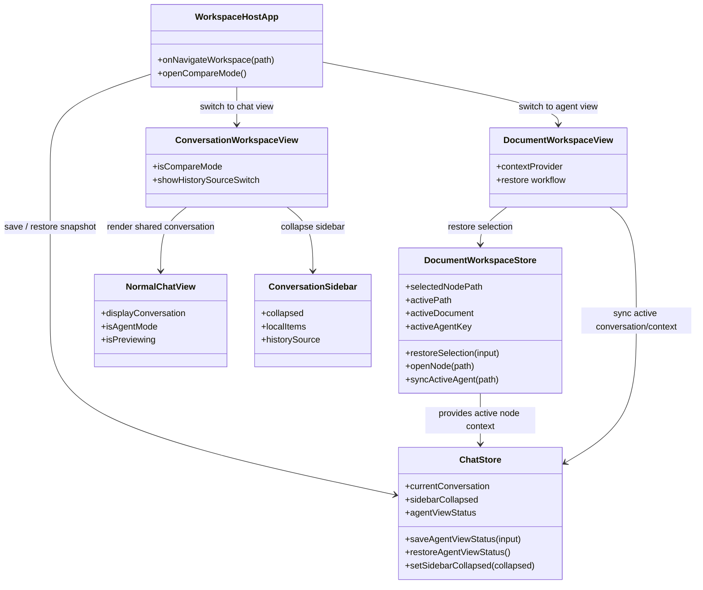

## Context

当前实现里，`chatStore.resetWorkspaceConversationState()` 会在工作区切换时清空当前会话，`ConversationWorkspaceView` 和 `DocumentWorkspaceView` 也各自承担了部分状态同步职责。这使得 Agent 模式和对话模式更像两套独立工作流，而不是同一份会话数据的两种视图。

这次改动要解决的是：把 Agent 主视图的当前节点、活动文档和当前会话作为一份可恢复的快照保存起来；切到对话模式时只改变展示方式，不破坏主视图状态；切回 Agent 模式时按快照恢复，而不是重建上下文。

设计意图上，`chat.ts` 只保存跨视图切换需要的恢复快照，也就是 `agentViewStatus`；`documentWorkspaceStore` 只维护 Agent 模式下的实时工作区状态，也就是当前选中节点、活动路径、活动文档和当前 Agent。换句话说，`chat.ts` 放“保存点”，`documentWorkspaceStore` 放“当前态”，两者不要互相替代。

## Goals / Non-Goals

**Goals:**

- 让 `/` 的 Agent 模式和 `/chat` 的对话模式共享同一份当前会话数据。
- 通过 `chatStore.agentViewStatus` 保存 Agent 主视图的恢复点。
- 从对话模式回到 Agent 模式时恢复选中节点、活动文档和当前会话。
- 对失效快照提供安全回退。
- 保持现有知识工作区与聊天工作台的边界，不引入新的持久化结构。

**Non-Goals:**

- 不改动 `Conversation` 的存储结构。
- 不引入新的全局路由状态管理库。
- 不改造对比模式 `/compare` 的语义。
- 不把对话模式升级为独立的会话工作流；它仍然只是主视图的辅助展示。

## Decisions

### 1. 用 `chatStore` 保存 Agent 主视图快照

原因：

- `chatStore` 已经是跨 `/` 和 `/chat` 共享的状态中心，最适合承载视图切换快照。
- 该状态只需要在工作区层面生效，不应下沉到文件树 store 或宿主 router。
- 复用现有 store 可以避免新增一层同步协议。

涉及文件与签名：

- [/Users/quanzhou/Workspace/JARVIS/packages/ui/src/store/chat.ts](/Users/quanzhou/Workspace/JARVIS/packages/ui/src/store/chat.ts)
  - 新增 `agentViewStatus`
  - 新增 `saveAgentViewStatus(input: { selectedNodePath: string | null; activePath: string | null; activeConversationId: string | null }): void`
  - 新增 `restoreAgentViewStatus(): { selectedNodePath: string | null; activePath: string | null; activeConversationId: string | null } | null`

变更描述：

- 只在 Agent -> 对话 切换前写入快照。
- 对话模式中的临时浏览或会话切换不反向改写该快照。
- 去掉工作区切换时清空 `currentConversation` 的旧语义。

### 2. 让对话模式只改视图，不改会话事实

原因：

- 用户希望看到的是“同一份当前对话详情的另一种展示”，而不是新开一个工作流。
- 当前会话已经由 `currentConversation` 表示，额外复制一份只会增加不一致风险。

涉及文件与签名：

- [/Users/quanzhou/Workspace/JARVIS/packages/ui/src/views/ConversationWorkspaceView.vue](/Users/quanzhou/Workspace/JARVIS/packages/ui/src/views/ConversationWorkspaceView.vue)
- [/Users/quanzhou/Workspace/JARVIS/packages/ui/src/views/NormalChatView.vue](/Users/quanzhou/Workspace/JARVIS/packages/ui/src/views/NormalChatView.vue)

变更描述：

- `/chat` 继续直接消费 `chatStore.currentConversation`。
- 切换到 `/chat` 时由宿主折叠左侧历史列表。
- 不再在进入 `/chat` 时调用任何会清空当前会话的重置逻辑。

### 3. 用 `documentWorkspaceStore` 恢复 Agent 视图选中态

原因：

- 选中节点、活动路径和活动文档的恢复逻辑属于知识工作区自身。
- `chatStore` 只保存恢复点，不负责重新打开文件树或重新解析节点。

涉及文件与签名：

- [/Users/quanzhou/Workspace/JARVIS/packages/ui/src/store/documentWorkspace.ts](/Users/quanzhou/Workspace/JARVIS/packages/ui/src/store/documentWorkspace.ts)
  - 新增 `async restoreSelection(input: { selectedNodePath: string | null; activePath?: string | null }): Promise<void>`

变更描述：

- 优先恢复目录选中态，再恢复文件打开态。
- 若路径已失效，则回退到父节点或根节点 `/`。
- 恢复完成后继续复用现有 `syncActiveAgent()`，不新增第二套 Agent 推导逻辑。

### 4. 把切换入口收敛到 `WorkspaceHostApp`

原因：

- 路由切换是视图切换的唯一入口，应该在这里保存快照和控制 sidebar 折叠状态。
- 把 save / restore 分散到子组件会让恢复链路难以验证。

涉及文件与签名：

- [/Users/quanzhou/Workspace/JARVIS/packages/ui/src/views/WorkspaceHostApp.vue](/Users/quanzhou/Workspace/JARVIS/packages/ui/src/views/WorkspaceHostApp.vue)

变更描述：

- 从 `/` 切到 `/chat` 前先调用 `saveAgentViewStatus(...)`，再折叠 sidebar，最后跳转。
- 从 `/chat` 回到 `/` 时不清空状态，由 Agent 视图在挂载后执行恢复。

## Risks / Trade-offs

- [快照恢复时节点或会话已删除] → 允许降级到父节点或根节点，并仅恢复可用的会话。
- [对话模式内的会话切换被误认为会改写 Agent 主视图] → 通过单向保存语义约束 `agentViewStatus` 只在进入对话前写入。
- [恢复逻辑分散在多个组件中] → 将保存动作集中在 `WorkspaceHostApp`，将打开与回退集中在 `documentWorkspaceStore`。
- [清空旧逻辑残留导致状态丢失] → 明确移除路由切换时对 `currentConversation` 的清空依赖，并用测试锁定。

## Migration Plan

- 不涉及存储结构迁移。
- 新逻辑上线后，旧会话和旧节点都继续按原数据读取。
- 如果需要回滚，只需恢复旧的 route 切换 reset 行为，但不需要处理数据回填。

## Open Questions

- 对话模式中如果用户主动新建或切换会话，返回 Agent 模式时是否始终恢复进入 `/chat` 前保存的会话，当前设计答案是“是”。

## Class Diagram

