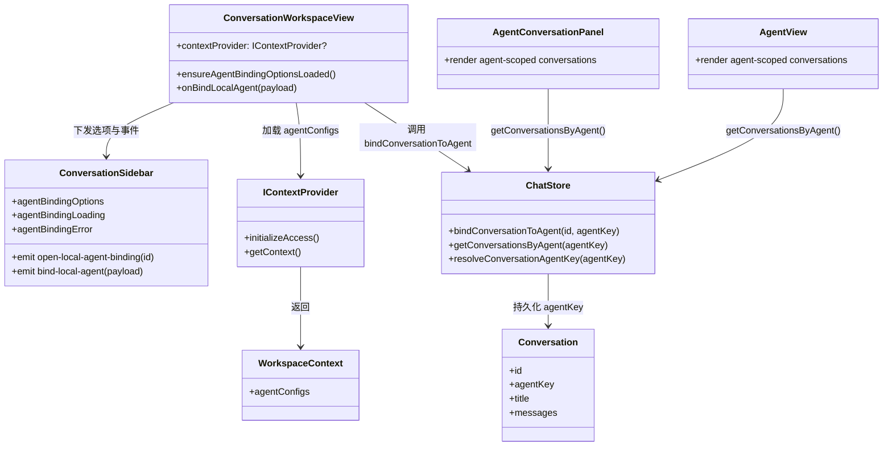

## Context

当前系统已经具备以下基础能力：

- `Conversation.agentKey` 已存在，并可通过 `chatStore.getConversationsByAgent(...)` 聚合出某个 Agent 作用域下的本地会话。
- 知识工作区的右侧 `AgentPane` 和中间 `AgentView` 都已经以 `agentKey` 为唯一过滤条件展示 Agent 会话列表。
- `chatStore.applyConversationAgentKey(...)` 仅用于自动补齐，会在会话已有 `agentKey` 时拒绝覆盖，因此不能承载“手动改绑现有会话”的需求。
- 普通对话工作台 `ConversationWorkspaceView` 当前没有接入 `contextProvider`，左侧 `ConversationSidebar` 也无法获取当前工作区可选 Agent 列表。

因此，这次改动的核心不是新增新的 Agent 解析逻辑，而是把已有的 `agentKey` 持久化字段和知识工作区会话聚合能力，向普通会话历史列表开放一个显式、可回退的人工归类入口。

## Goals / Non-Goals

**Goals:**

- 在普通对话工作台左侧本地历史项上提供手动绑定 Agent 的入口。
- 允许用户对本地普通会话进行绑定、改绑和解绑。
- 绑定候选项复用当前工作区 `agentConfigs`，避免引入并行的 Agent 列表来源。
- 绑定后立即反映到知识工作区 `AgentPane` 和 `AgentView` 的会话列表中。
- 复用现有 `Conversation.agentKey` 持久化字段，不新增新的映射表或同步协议。

**Non-Goals:**

- 不改变普通聊天页继续发送时实际使用的 Agent 执行链路。
- 不为外部历史、对比会话增加 Agent 绑定能力。
- 不新增新的核心接口字段，也不修改 `IContextProvider` 或 `Conversation` 结构。
- 不在本次改动中增加详情页工具栏绑定入口，只在左侧本地历史项提供入口。

## Decisions

### 1. 绑定入口放在 `ConversationSidebar` 的本地历史项操作区

原因：

- 用户需求明确指向“在对话记录上增加功能”，最贴近的入口就是左侧本地历史项。
- 与现有星标/删除按钮同层，能保持“对会话本身进行操作”的心智一致。
- 不需要改动 `NormalChatView` 的详情布局和工具栏职责。

备选方案：

- 放在详情工具栏：不符合“对话记录上”的直接入口，且操作路径更长。
- 侧边栏和详情页都提供：收益有限，但会扩大 UI 和测试面。

涉及文件与签名：

- [ConversationSidebar.vue](/Users/quanzhou/Workspace/JARVIS/packages/ui/src/components/ConversationSidebar.vue)
  - 新增 props:
    - `agentBindingOptions?: Array<{ key: string | null; label: string; title: string }>`
    - `agentBindingLoading?: boolean`
    - `agentBindingError?: string | null`
  - 新增 emits:
    - `(event: 'open-local-agent-binding', id: string): void`
    - `(event: 'bind-local-agent', payload: { conversationId: string; agentKey: string | null }): void`

变更描述：

- 每条本地会话记录增加一个“绑定 Agent”按钮。
- 点击后在当前历史项下方展开一个行内选择面板，不引入全局弹窗。
- 面板支持选择“不绑定”、根 Agent 和解析出的 scoped agents。

### 2. 候选 Agent 列表由 `ConversationWorkspaceView` 懒加载并下发，而不是让 `ConversationSidebar` 直接触达 Provider

原因：

- `ConversationSidebar` 是纯展示组件，不应直接承担 `contextProvider.initializeAccess()` / `getContext()` 这类副作用。
- `ConversationWorkspaceView` 已经是普通聊天工作台的装配层，最适合管理候选项加载、错误处理和事件转发。
- Web、Extension、Desktop 三个宿主已有可用 `contextProvider`，只需继续往下透传。

备选方案：

- 由 `ConversationSidebar` 直接读取 `contextProvider`：会把展示组件变成状态源，耦合过深。
- 在 `chatStore` 内维护 Agent 列表：会把工作区上下文缓存和普通聊天 store 混在一起，边界不清。

涉及文件与签名：

- [ConversationWorkspaceView.vue](/Users/quanzhou/Workspace/JARVIS/packages/ui/src/views/ConversationWorkspaceView.vue)
  - 新增 props:
    - `contextProvider?: IContextProvider | null`
  - 新增方法:
    - `async function ensureAgentBindingOptionsLoaded(): Promise<void>`
    - `async function onBindLocalAgent(payload: { conversationId: string; agentKey: string | null }): Promise<void>`
- [App.vue](/Users/quanzhou/Workspace/JARVIS/apps/web/src/App.vue)
- [App.vue](/Users/quanzhou/Workspace/JARVIS/apps/extension/src/App.vue)
- [App.vue](/Users/quanzhou/Workspace/JARVIS/apps/desktop/src/App.vue)

变更描述：

- 宿主把现有 `contextProvider` 传给 `ConversationWorkspaceView`。
- `ConversationWorkspaceView` 首次打开绑定面板时才调用 `initializeAccess()` 和 `getContext()`。
- 加载失败仅在绑定面板内暴露错误，不影响普通聊天工作台其他交互。

### 3. 手动绑定通过新的 store 动作覆盖 `conversation.agentKey`，与自动补齐逻辑分离

原因：

- 当前 `applyConversationAgentKey(...)` 的设计目标是“只在会话缺失 `agentKey` 时自动补齐”，保留它可以避免破坏现有知识工作区自动绑定流程。
- 手动绑定天然需要支持覆盖已有值和清空绑定，因此必须有单独的显式动作。

备选方案：

- 复用并放宽 `applyConversationAgentKey(...)`：会混淆“自动补齐”和“用户显式改绑”两种语义。
- 直接在组件里改 `Conversation` 对象再保存：会把持久化和活动会话同步细节散落到 UI 层。

涉及文件与签名：

- [chat.ts](/Users/quanzhou/Workspace/JARVIS/packages/ui/src/store/chat.ts)
  - 新增 `async bindConversationToAgent(id: string, agentKey: string | null): Promise<void>`
  - 继续复用 `resolveConversationAgentKey(agentKey: string | null): string | undefined`

变更描述：

- `bindConversationToAgent(...)` 支持三种结果：
  - 绑定到某个 scoped Agent
  - 绑定到根作用域默认 Agent
  - 清空 `agentKey`
- 保存后刷新本地会话列表，并同步更新 `currentConversation`。
- 不改 `sendDraft()` 的执行语义；后续继续发送仍然只依赖当前活动工作区 Agent 上下文。

### 4. Agent 相关列表继续以 `conversation.agentKey === 当前 agentKey` 作为唯一归类标准

原因：

- 当前 `AgentPane` 和 `AgentView` 已经共享这条规则，继续保持可以把行为变化控制在“数据来源变化”，而不是重新设计筛选规则。
- 手动绑定的目标就是把某条普通会话纳入某个 Agent 会话集合；只要写回 `agentKey`，现有聚合能力即可自然生效。

备选方案：

- 另加“手动绑定”专用标记字段：会让同一套会话归类逻辑出现双轨标准。
- 在列表层区分“自动绑定”和“手动绑定”：不是本次需求重点，会增加认知和实现复杂度。

涉及文件与签名：

- [chat.ts](/Users/quanzhou/Workspace/JARVIS/packages/ui/src/store/chat.ts)
  - `getConversationsByAgent(agentKey: string): Conversation[]`
- [AgentConversationPanel.vue](/Users/quanzhou/Workspace/JARVIS/packages/ui/src/components/AgentConversationPanel.vue)
- [AgentView.vue](/Users/quanzhou/Workspace/JARVIS/packages/ui/src/components/AgentView.vue)

变更描述：

- 不修改 `getConversationsByAgent(...)` 的过滤规则。
- 通过手动更新 `conversation.agentKey`，让知识工作区的 Agent 列表自动反映归属变化。

## Risks / Trade-offs

- [工作区 Provider 尚未初始化时打开绑定面板] → 在装配层显式调用 `initializeAccess()`，并在面板内显示局部错误。
- [用户把普通会话手动归入某个 Agent，误以为后续继续聊天会自动切换执行 Agent] → 文案明确使用“绑定到 Agent 列表”语义，不在详情页或列表中暗示发送链路改变。
- [行内展开面板与现有删除确认交互冲突] → 统一限制为单条历史项同时只打开一种二级操作态。
- [宿主忘记透传 `contextProvider`，导致功能在普通聊天页不可用] → 在三个宿主入口统一补齐透传，并补装配层测试。

## Migration Plan

- 该变更不涉及数据库 migration，也不修改会话 JSON 结构。
- 老会话保持原样；只有用户显式绑定后才写入或覆盖 `agentKey`。
- 若后续需要回滚，只需移除 UI 入口和 `bindConversationToAgent(...)` 调用，旧会话上的 `agentKey` 仍能被现有系统兼容读取。

## Open Questions

- 无。当前范围已固定为“只影响 Agent 列表归属，不改变继续聊天执行链路”。
