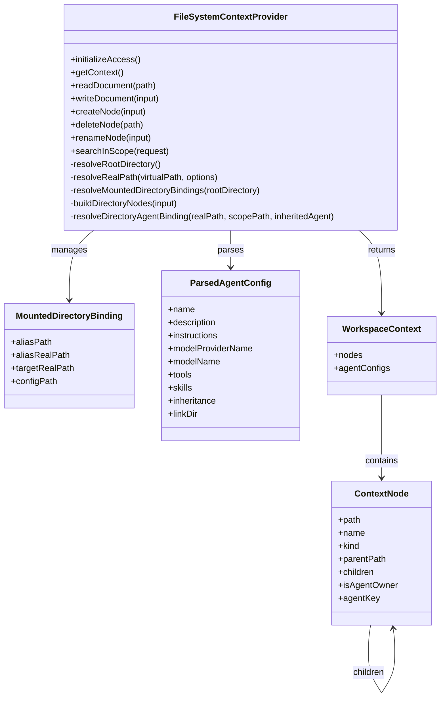

## Context

当前 `FileSystemContextProvider` 以一个真实根目录作为整个知识工作区的物理边界，`getContext()` 直接递归扫描该根目录并生成 `ContextNode` 树。这个模型足够支撑单一目录树，但无法把工作区外的其他目录以“顶层别名”的方式挂进来，也无法让读写、搜索、重命名等操作在虚拟路径和真实路径之间自动映射。

本次改动的目标是把 `linkDir` 这种“目录挂载”能力收敛到知识上下文 provider 内部，保持 `IContextProvider` 对外契约不变，同时让知识工作区能够把挂载目录当作普通顶层目录使用。这个能力会同时影响：

- `.agent.json` 的解析语义
- 目录树构建与 Agent 作用域解析
- 文档读写、节点操作、搜索
- UI 文件树展示与操作路径

## Goals / Non-Goals

**Goals:**

- 允许根目录下的空目录通过 `.agent.json` 的 `linkDir` 字段挂载外部目录。
- 让挂载目录在工作区里呈现为普通顶层目录，节点路径保持虚拟路径语义。
- 让读写、创建、删除、重命名和搜索都通过同一套路径映射工作。
- 保持现有 `IContextProvider` 方法签名不变，避免波及 Web、Extension、Desktop、Server 的调用面。
- 保持现有 Agent 继承和 `agentKey` 语义不变，只是让虚拟路径下的解析结果可覆盖挂载目录。

**Non-Goals:**

- 不支持一个目录同时挂载多个外部目录。
- 不新增独立的挂载管理 UI。
- 不在本次改动里引入新的核心接口字段或数据库结构。
- 不把挂载目录语义扩展到所有 provider；只处理本地文件系统 provider。

## Decisions

### 1. 挂载语义放在 `FileSystemContextProvider`，不扩展 `IContextProvider`

原因：

- 这个能力只对本地文件系统 provider 有意义。
- `IContextProvider` 已经足以表达上下文树、文档读写和节点操作，没有必要为了挂载再引入一层抽象。
- 保持核心接口不变，能把变更范围限制在 `packages/node` 与少量 server 测试。

涉及文件：

- [/Users/quanzhou/Workspace/JARVIS/packages/node/src/context/FileSystemContextProvider.ts](/Users/quanzhou/Workspace/JARVIS/packages/node/src/context/FileSystemContextProvider.ts)
- [/Users/quanzhou/Workspace/JARVIS/packages/node/src/context/FileSystemContextProvider.test.ts](/Users/quanzhou/Workspace/JARVIS/packages/node/src/context/FileSystemContextProvider.test.ts)
- [/Users/quanzhou/Workspace/JARVIS/apps/server/tests/local-file-context-provider.test.ts](/Users/quanzhou/Workspace/JARVIS/apps/server/tests/local-file-context-provider.test.ts)

签名变化：

- `type ParsedAgentConfig = AgentConfig & { inheritance?: AgentInheritanceMode; linkDir?: string }`
- `private async resolveMountedDirectoryBindings(rootDirectory: string): Promise<MountedDirectoryBinding[]>`
- `private async resolveRealPath(virtualPath: string | undefined, options: { expectExisting: boolean; expectDirectory?: boolean }): Promise<string>`
- `private async buildDirectoryNodes(input: { realPath: string; virtualPath?: string; inheritedAgent: EffectiveAgentBinding; agentConfigs: Map<string, ResolvedAgentConfig>; mountBindings: MountedDirectoryBinding[] }): Promise<ContextNode[]>`

变更描述：

- 解析 `.agent.json` 时读取可选 `linkDir`。
- 仅在根目录下的空目录里识别挂载入口。
- provider 内部维护一张“虚拟路径 -> 真实路径”的挂载表，所有后续操作都走这张表。

### 2. 挂载目录采用“虚拟路径优先”模型

原因：

- UI 和上层工作区只应看到 `/reports/...` 这类稳定路径，不应暴露真实物理目录。
- Agent 作用域解析、文档历史、搜索结果和 UI 选中态都依赖路径稳定性。
- 如果在返回值里混用真实路径和虚拟路径，后续的对话关联、文件重命名和搜索引用会变得不可控。

实现方式：

- `getContext()` 先识别根目录下的挂载入口，再递归构建节点树。
- 挂载目录节点的 `path`、`parentPath`、`agentKey`、`sourcePaths` 都使用虚拟路径。
- 真正的磁盘访问在 `resolveRealPath()` 中完成，调用方不需要知道真实目标目录。
- 对于挂载根 `/alias` 的删除或重命名，只处理别名目录本身，不同步改动真实目标目录的名称。

备选方案：

- 直接把真实目录内容拷贝到工作区根目录下：会破坏 local-first 和单一事实来源。
- 在 UI 层做软链接渲染：会把路径映射责任散落到多个宿主和组件中。

### 3. 只允许“根目录下的空目录 + `.agent.json`”作为挂载入口

原因：

- 这是最明确的用户心智模型：一个空目录就是一个入口，不会和本地已有内容混淆。
- 可以避免“本地文件 + 外部目录”混合展示，减少路径冲突和删除歧义。
- 根目录下挂载入口天然就是顶层目录，和需求一致。

实现方式：

- 扫描根目录时，忽略隐藏文件后检查每个顶层目录。
- 如果目录内只有 `.agent.json`，且其中声明了 `linkDir`，就注册为挂载入口。
- 如果目录里还有其他可见文件或子目录，视为非法挂载声明，直接报错。
- `linkDir` 按声明目录所在位置解析，通常是相对路径；解析后必须 realpath 到真实目录。

### 4. 所有文件操作统一通过路径解析层落到真实目标目录

原因：

- `readDocument`、`writeDocument`、`createNode`、`deleteNode`、`renameNode`、`searchInScope` 需要同一套路径语义。
- 如果每个方法各自处理 mount，容易出现“能读不能写”或“搜索路径与读写路径不一致”的偏差。

实现方式：

- `resolveRealPath()` 增加挂载前缀匹配逻辑，优先把 `/alias/...` 映射到挂载目标。
- `searchInScope()` 的遍历以虚拟 scope 为准，但落盘读取使用真实目录。
- `createNode()` 和 `renameNode()` 在挂载目录下照常工作，目标路径仍然是虚拟路径。
- `deleteNode()` 对挂载根节点仅删除别名目录入口，不触碰真实目标目录。

备选方案：

- 只让挂载目录可读不可写：与用户需求“编辑的不是实际目录名，而是链接目录名”不符。
- 只允许读写文件，不允许目录级操作：会让工作区操作语义不完整。

### 5. Agent 继承继续按虚拟路径解析，挂载目录不会改变作用域规则

原因：

- `agentKey` 已经是工作区内的核心归属键，不应因为目录来源变成外部挂载就改变。
- 用户在挂载目录里继续放置 `.agent.json`，本质上还是希望目录级作用域正常继承。

实现方式：

- `resolveDirectoryAgentBinding(realPath, scopePath, inheritedAgent)` 继续以虚拟 `scopePath` 生成 `agentKey` 与 `sourcePaths`。
- 读取配置文件时仍然从真实目录读取 `.agent.json`，但返回给上层的 `sourcePaths` 使用虚拟路径。
- 这样可以让挂载目录与普通目录在 Agent 语义上完全一致。

### 6. 变更不修改公共方法签名，但会增加内部辅助类型

原因：

- 对外契约不变是本次变更的主要约束。
- 通过内部辅助类型和私有方法，可以把实现复杂度留在 provider 内部。

涉及的内部辅助类型：

- `EffectiveAgentBinding`
- `MountedDirectoryBinding`
- `ParsedAgentConfig`

### 7. 需要补齐对挂载路径与非法声明的测试

原因：

- 这个特性最容易出错的地方是路径映射和边界条件，而不是普通目录遍历。
- 如果只测“正常能挂载”，后续很容易在重命名、搜索、删除根目录别名时出问题。

测试重点：

- 根目录下空目录声明 `linkDir` 后，`getContext()` 顶层出现挂载节点。
- 挂载目录中的读写、创建、删除、重命名都命中真实目标目录。
- 挂载根节点的删除 / 重命名只影响别名入口。
- 非法挂载声明会明确报错：非空目录、非法 `linkDir`、目标不存在、目标不是目录。

## Risks / Trade-offs

- [挂载目标形成环路] → 通过 `realpath` 规范化目标并限制重复挂载链，发现同一真实目录重复进入时直接报错。
- [根目录下非空目录误被当作挂载入口] → 在识别挂载前先检查可见文件和子目录，非法就失败，不做静默降级。
- [虚拟路径和真实路径混用导致搜索或重命名错位] → 所有对外返回统一使用虚拟路径，真实路径只在内部解析阶段出现。
- [删除挂载根时误删真实目标目录] → 将根节点删除语义限制为“删除别名入口”，并在测试里显式覆盖。
- [路径映射增加实现复杂度] → 把复杂度集中在 provider 内部，保持 UI 与宿主侧不感知挂载细节。

## Migration Plan

- 这次变更不需要数据库迁移，也不需要改会话存储结构。
- 旧的 `.agent.json` 继续兼容；只有显式声明 `linkDir` 的顶层空目录才会进入挂载逻辑。
- 先在 `packages/node` 中落地 provider 逻辑，再通过 server 测试验证 HTTP 暴露层没有行为偏差。
- 如果需要回滚，只需移除 `linkDir` 解析与 mount 表构建逻辑，旧工作区仍然能按普通目录树运行。

## Open Questions

- `linkDir` 是否允许绝对路径仍未在现有代码中硬编码；当前设计按“相对声明目录解析”实现。
- 后续是否需要支持多个挂载入口或更复杂的别名规则，当前范围不包含。
