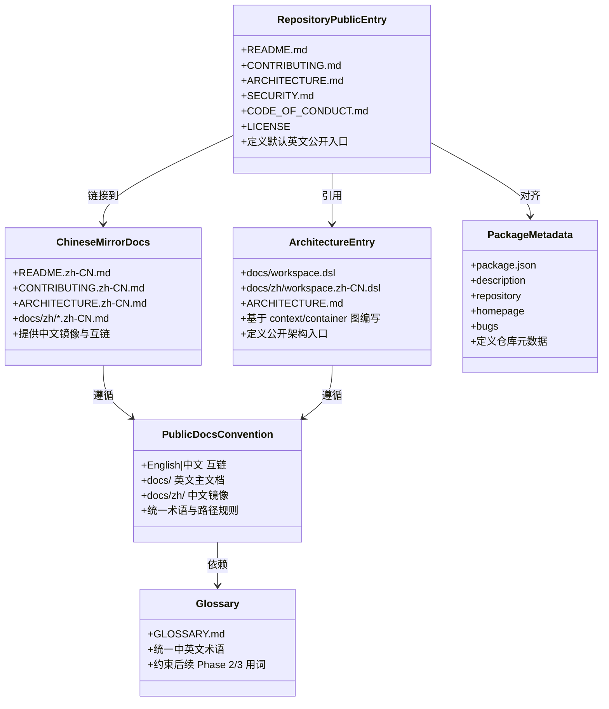

## Context

本次设计仅覆盖 `i18n-1` 的 Phase 1：仓库公开入口英文化。当前仓库存在以下问题：

- 根级公开文档缺少稳定的英文主入口，不利于 GitHub 开源展示。
- `docs/workspace.dsl` 作为全局设计入口仍以中文描述为主，不适合作为对外架构主入口。
- `docs/` 下公开文档缺少统一的英文主文档与中文镜像组织规则。
- `package.json` 尚未补齐对外仓库元数据。
- 仓库尚无统一术语表，后续 UI 国际化与异常英文统一缺少稳定术语基线。

这一阶段故意不触碰运行时代码和 UI 文案，以降低一次性失败风险。目标是在最小风险下，先把“仓库默认英文、中文保留镜像”的对外结构建立起来，为后续 Phase 2 UI 国际化和 Phase 3 异常英文统一提供稳定文档基线。

## Goals / Non-Goals

**Goals:**

- 建立仓库根级公开文档的英文默认入口。
- 将 `docs/workspace.dsl` 调整为英文主版本，并定义中文镜像路径。
- 为核心 `docs/` 文档建立英文主文档与中文镜像目录规则。
- 补齐 `package.json` 的对外仓库元数据。
- 在 `ARCHITECTURE.md` 中明确公开架构主入口，并基于 `workspace.dsl` 的 context 图和 container 图编写。
- 在 Phase 1 同步补一个仓库级术语表，约束后续 Phase 2/3 的中英文用词。

**Non-Goals:**

- 不在本阶段引入 UI i18n 基础设施。
- 不修改 Web、Extension、Desktop、Server 的运行时逻辑。
- 不在本阶段处理异常多语言或异常英文统一。
- 不在本阶段迁移 `docs/` 下历史性 phase 文档。
- 不在本阶段补齐 `openspec/changes/archive/**`。
- 不处理现有 `my-README.md`。

## Decisions

### 1. 先做“文档与入口治理”，不与 UI/异常治理混做

原因：

- 仓库公开入口英文化不依赖运行时改造，可以独立交付。
- 先把对外结构稳定下来，能降低后续 Phase 2/3 的上下文漂移。
- 如果将 UI i18n、异常英文化、OpenSpec 双语补齐同时推进，风险会集中在范围失控与验收标准不清。

备选方案：

- 一次性同时处理文档、UI、异常与 OpenSpec 双语。
- 放弃该方案，因为跨模块过多，容易在文案盘点与边界定义上反复返工。

涉及文件：

- `/Users/quanzhou/Workspace/JARVIS/README.md`
- `/Users/quanzhou/Workspace/JARVIS/README.zh-CN.md`
- `/Users/quanzhou/Workspace/JARVIS/CONTRIBUTING.md`
- `/Users/quanzhou/Workspace/JARVIS/CONTRIBUTING.zh-CN.md`
- `/Users/quanzhou/Workspace/JARVIS/ARCHITECTURE.md`
- `/Users/quanzhou/Workspace/JARVIS/ARCHITECTURE.zh-CN.md`
- `/Users/quanzhou/Workspace/JARVIS/SECURITY.md`
- `/Users/quanzhou/Workspace/JARVIS/CODE_OF_CONDUCT.md`
- `/Users/quanzhou/Workspace/JARVIS/LICENSE`
- `/Users/quanzhou/Workspace/JARVIS/GLOSSARY.md`
- `/Users/quanzhou/Workspace/JARVIS/package.json`

函数 / 方法签名变化：

- 无

变更说明：

- 新增或重构公开入口文档。
- 新增仓库级术语表，统一对外文档与后续阶段术语。
- 在仓库元数据中补充对外字段。

### 2. `docs/` 采用“英文主文档 + docs/zh 中文镜像”结构

原因：

- 保持英文路径稳定，便于外部引用和长期维护。
- 中文镜像集中到 `docs/zh/`，能显式区分公开主文档与镜像文档。
- 统一路径规范，避免后续 Phase 2/3 再次调整文档结构。

备选方案：

- 中英双语写在同一文件。
- 放弃该方案，因为会降低可读性，也不利于 GitHub 对外默认展示英文。

涉及文件：

- `/Users/quanzhou/Workspace/JARVIS/docs/overall.md`
- `/Users/quanzhou/Workspace/JARVIS/docs/context-provider.md`
- `/Users/quanzhou/Workspace/JARVIS/docs/workspace.dsl`
- `/Users/quanzhou/Workspace/JARVIS/docs/zh/overall.zh-CN.md`
- `/Users/quanzhou/Workspace/JARVIS/docs/zh/context-provider.zh-CN.md`
- `/Users/quanzhou/Workspace/JARVIS/docs/zh/workspace.zh-CN.dsl`
- `/Users/quanzhou/Workspace/JARVIS/docs/p2.13-i18n.md`

函数 / 方法签名变化：

- 无

变更说明：

- 英文文档保留在原路径。
- 中文镜像迁移或新增到 `docs/zh/`。
- 每份公开文档顶部统一增加 `English | 中文` 互链。
- `docs/` 下历史性 phase 文档暂不纳入 Phase 1。

### 3. 将 `docs/workspace.dsl` 作为对外架构主入口，中文 DSL 作为镜像

原因：

- 当前全局设计入口已经明确要求以 `docs/workspace.dsl` 作为了解系统设计的主要入口。
- 对外公开时，架构入口需要优先提供英文版本。
- 中文 DSL 保留镜像可兼顾本地协作和历史理解。

备选方案：

- 保留中文 `workspace.dsl`，另写英文说明文档。
- 放弃该方案，因为架构主入口会分裂成“图用中文、说明用英文”，不利于维护。

涉及文件：

- `/Users/quanzhou/Workspace/JARVIS/docs/workspace.dsl`
- `/Users/quanzhou/Workspace/JARVIS/docs/zh/workspace.zh-CN.dsl`
- `/Users/quanzhou/Workspace/JARVIS/ARCHITECTURE.md`
- `/Users/quanzhou/Workspace/JARVIS/ARCHITECTURE.zh-CN.md`

函数 / 方法签名变化：

- 无

变更说明：

- `docs/workspace.dsl` 改为英文主版本。
- 中文描述迁移到 `docs/zh/workspace.zh-CN.dsl`。
- `ARCHITECTURE.md` 以 `workspace.dsl` 的 context 图和 container 图为基础，补充英文职责说明作为主入口。

### 4. 本阶段只补文档与仓库元数据，不定义运行时兼容负担

原因：

- 本阶段没有运行时代码修改，不需要承担 API、宿主行为、数据兼容性风险。
- 通过将影响限制在文档与元数据，可以确保回滚简单。

备选方案：

- 顺手同步调整 UI 文案和错误提示。
- 放弃该方案，因为它会引入运行时验证、e2e 及宿主差异验证，超出 Phase 1 的风险控制目标。

涉及文件：

- `/Users/quanzhou/Workspace/JARVIS/package.json`
- `/Users/quanzhou/Workspace/JARVIS/GLOSSARY.md`
- `/Users/quanzhou/Workspace/JARVIS/docs/**`
- `/Users/quanzhou/Workspace/JARVIS/*.md`

函数 / 方法签名变化：

- 无

变更说明：

- 所有改动限定在文档、DSL、元数据层。
- 术语表与架构入口一并作为文档治理交付物。
- Phase 2/3 再分别处理 UI 文案和异常英文统一。

## Risks / Trade-offs

- [风险] 文档迁移后出现断链或相互引用不一致 → 缓解：统一在每份核心文档顶部加双向互链，并在完成后做一次全链路检查。
- [风险] 英文与中文镜像内容漂移 → 缓解：优先定义镜像命名规则和术语表，并在 `CONTRIBUTING.md` 中明确同步要求。
- [风险] `workspace.dsl` 英文化后，衍生产物未同步 → 缓解：在 Phase 1 中明确把架构图入口与 DSL 一并视为交付范围。
- [风险] `ARCHITECTURE.md` 与 `workspace.dsl` 图内容脱节 → 缓解：明确以 `workspace.dsl` 的 context 图和 container 图作为 `ARCHITECTURE.md` 的唯一结构基础。
- [风险] 本阶段不处理 UI/异常，用户可能误以为“i18n 已完成” → 缓解：在 proposal 和后续 specs 中显式声明本阶段仅为公开入口英文化。

## Migration Plan

1. 先新增或重构根级英文公开文档与中文镜像。
2. 新增仓库级术语表，先定义核心中英文术语。
3. 更新 `package.json` 的公开元数据字段。
4. 将 `docs/workspace.dsl` 英文化，并新增 `docs/zh/workspace.zh-CN.dsl`。
5. 将核心公开 `docs/` 文档整理为英文主文档，并补中文镜像路径与互链，不处理历史性 phase 文档。
6. 基于 `workspace.dsl` 的 context 图和 container 图编写 `ARCHITECTURE.md`。
7. 验证链接、路径和文档入口后再进入 Phase 2。

回滚策略：

- 由于本阶段仅修改文档和元数据，可按文件粒度回滚。
- 若镜像组织方案不满意，可保留英文主文档，单独调整 `docs/zh/` 结构，不影响运行时。

## Open Questions

- `GLOSSARY.md` 是放在仓库根目录，还是放在 `docs/` 下作为公开文档的一部分？
- `ARCHITECTURE.md` 是否只覆盖 context / container 两层，还是要在 Phase 1 里额外链接到更细的组件级设计材料？
