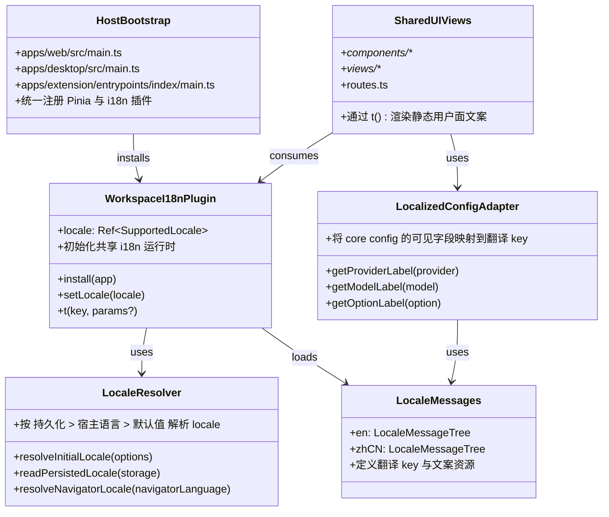

## Context

本次设计仅覆盖 `i18n-2` 的 Phase 2：UI 国际化基础设施与静态文案迁移。当前代码库已经完成 Phase 1 的公开文档英文化，但运行中的 UI 仍存在明显的多宿主硬编码问题：

- `packages/ui/src/components/**` 和 `packages/ui/src/views/**` 中存在大量中文静态文案。
- `packages/ui/src/routes.ts` 中的工作区标签是中文常量。
- `packages/core/config.ts` 中 provider / model / option 的可见 `name`、`label`、`description` 仍是硬编码文本。
- 三个宿主的应用入口都很薄，但目前没有统一的语言初始化机制。
- `currentError`、`analysisError`、`throw new Error(...)` 等错误文本目前与静态文案混杂在一起，但根据阶段计划，这些异常文本不属于 Phase 2 范围。

Phase 2 的目标是在不引入异常国际化的前提下，先将“静态用户可见文案”全部纳入共享 i18n 运行时，并让 Web、Extension、Desktop 宿主行为一致。这样可以把最容易批量治理的部分先收口，再把异常英文统一留给 Phase 3 处理。

## Goals / Non-Goals

**Goals:**

- 在 `packages/ui` 中建立宿主无关的共享 i18n 运行时。
- 在 Web、Extension、Desktop 三个宿主入口中统一初始化 locale。
- 支持 `en` 与 `zh-CN` 两种 locale，并遵循“用户显式选择 > 宿主语言 > 默认英文”的初始化顺序。
- 为共享组件、共享视图、路由标签及 provider/model/option 可见文本提供可本地化能力。
- 保持 Phase 1 定义的仓库级术语表作为用词来源，约束中英文翻译一致性。

**Non-Goals:**

- 不在本阶段处理 `currentError`、`analysisError`、`throw new Error(...)` 等异常文本国际化。
- 不在本阶段修改服务端返回消息或 Node-only 文本。
- 不在本阶段补正式 OpenSpec 双语文档。
- 不在本阶段引入第三方 i18n 依赖。
- 不在本阶段新增超出 `en` / `zh-CN` 的语言支持。

## Decisions

### 1. 在 `packages/ui` 内实现轻量共享 i18n 运行时，不引入第三方依赖

原因：

- 当前三个宿主入口都很薄，最适合通过共享插件一次性接入。
- Phase 2 的需求主要是静态文案切换、语言检测与持久化，不需要复杂 ICU 功能。
- 自研轻量运行时可以避免额外依赖、打包体积和跨宿主适配成本。

备选方案：

- 引入 `vue-i18n` 或其他第三方国际化框架。
- 放弃该方案，因为当前需求范围较窄，而额外依赖会扩大构建和维护面。

涉及文件：

- `/Users/quanzhou/Workspace/JARVIS/packages/ui/index.ts`
- `/Users/quanzhou/Workspace/JARVIS/packages/ui/src/i18n/index.ts`
- `/Users/quanzhou/Workspace/JARVIS/packages/ui/src/i18n/messages/en.ts`
- `/Users/quanzhou/Workspace/JARVIS/packages/ui/src/i18n/messages/zh-CN.ts`
- `/Users/quanzhou/Workspace/JARVIS/packages/ui/src/i18n/types.ts`

函数 / 方法签名变化：

- `export function createWorkspaceI18n(options?: WorkspaceI18nOptions): Plugin`
- `export function useWorkspaceI18n(): WorkspaceI18nApi`
- `export function resolveInitialLocale(options: ResolveInitialLocaleOptions): SupportedLocale`

变更说明：

- 新增共享 i18n 插件和 composable。
- 统一维护 locale、消息资源和 `t()` 能力。

### 2. 统一采用“持久化优先，其次宿主语言，默认英文”的 locale 初始化策略

原因：

- 三个宿主都运行在 renderer/browser 环境，具备统一读取 `localStorage` 和宿主语言的条件。
- 用户显式选择语言后，应优先恢复该选择，而不是每次随系统语言漂移。
- Phase 1 的对外默认英文已经明确，Phase 2 UI 也应以英文作为无偏配置的默认值。

备选方案：

- 永远跟随浏览器或系统语言，不记录用户选择。
- 放弃该方案，因为会导致用户切换语言后刷新丢失。

涉及文件：

- `/Users/quanzhou/Workspace/JARVIS/apps/web/src/main.ts`
- `/Users/quanzhou/Workspace/JARVIS/apps/desktop/src/main.ts`
- `/Users/quanzhou/Workspace/JARVIS/apps/extension/entrypoints/index/main.ts`
- `/Users/quanzhou/Workspace/JARVIS/packages/ui/src/i18n/index.ts`

函数 / 方法签名变化：

- `type WorkspaceI18nOptions = { storage?: Pick<Storage, 'getItem' | 'setItem'>; navigatorLanguage?: string; defaultLocale?: SupportedLocale }`
- `function setLocale(locale: SupportedLocale): void`

变更说明：

- 三个宿主在应用创建后、挂载前统一安装 i18n 插件。
- locale 持久化 key 在共享层统一定义，避免宿主分叉。

### 3. 静态用户可见文案全部通过 translation key 访问，异常文本明确排除

原因：

- Phase 2 的核心风险在于范围失控，需要把“静态文案”与“运行时异常”严格分层。
- 共享组件和视图中的文案密度最高，先迁移这些内容回报最大。
- 将异常文本排除，可以避免本阶段深入 `chat.ts`、`documentWorkspace.ts`、宿主登录恢复提示等错误链路。

备选方案：

- 顺手把 `currentError` 和 `analysisError` 一起迁移。
- 放弃该方案，因为它会把 Phase 3 的异常英文统一提前带进来。

涉及文件：

- `/Users/quanzhou/Workspace/JARVIS/packages/ui/src/components/**`
- `/Users/quanzhou/Workspace/JARVIS/packages/ui/src/views/**`
- `/Users/quanzhou/Workspace/JARVIS/packages/ui/src/routes.ts`
- `/Users/quanzhou/Workspace/JARVIS/packages/ui/src/store/chat.ts`
- `/Users/quanzhou/Workspace/JARVIS/packages/ui/src/store/compare.ts`
- `/Users/quanzhou/Workspace/JARVIS/packages/ui/src/store/documentWorkspace.ts`

函数 / 方法签名变化：

- 无强制公共 API 变更；组件内部统一改为通过 `useWorkspaceI18n().t()` 取静态文案。

变更说明：

- 仅迁移静态标签、按钮、占位符、空态、菜单、提示语、面板标题等。
- `currentError`、`analysisError` 等字段继续保留原结构，不纳入 locale 词条。

### 4. `packages/core/config.ts` 保留英文 fallback，同时新增可本地化 key

原因：

- `packages/core/config.ts` 属于共享配置层，不应直接依赖 `packages/ui` 的运行时。
- 但 provider / model / option 的名称与说明又是用户可见文本，必须能随 locale 切换。
- 最稳妥的方式是在配置结构中保留英文 fallback，并新增 translation key，交由 UI 层解释。

备选方案：

- 直接把所有可见字符串移出 `packages/core/config.ts`，完全放到 UI 层维护。
- 放弃该方案，因为这会把 provider 配置和 UI 展示映射拆散，增加维护成本。

涉及文件：

- `/Users/quanzhou/Workspace/JARVIS/packages/core/config.ts`
- `/Users/quanzhou/Workspace/JARVIS/packages/ui/src/i18n/messages/en.ts`
- `/Users/quanzhou/Workspace/JARVIS/packages/ui/src/i18n/messages/zh-CN.ts`
- `/Users/quanzhou/Workspace/JARVIS/packages/ui/src/components/ProviderModelSelector.vue`
- `/Users/quanzhou/Workspace/JARVIS/packages/ui/src/components/ModelOptionToggleGroup.vue`

函数 / 方法签名变化：

- `interface ProviderConfig { nameKey?: string }`
- `interface ModelConfig { nameKey?: string }`
- `interface ModelOptionDefinition { labelKey?: string; descriptionKey?: string }`

变更说明：

- `name` / `label` / `description` 作为英文 fallback 保留。
- UI 层优先读取 `*Key` 并通过 i18n 翻译，缺失时回退到英文原文。

### 5. Phase 2 的验证以组件测试、宿主初始化测试和最小 Playwright 回归为主

原因：

- 本阶段不改异常链路，重点是确保语言切换、持久化和主要界面渲染正确。
- Web/Extension/Desktop 三宿主都应至少有一层入口验证。
- 按仓库约束，extension 的 Playwright e2e 后续执行时需要提权，并走 `channel: 'chromium'`。

备选方案：

- 只依赖手工点页面验证。
- 放弃该方案，因为语言切换和持久化属于可自动化验证的确定性行为。

涉及文件：

- `/Users/quanzhou/Workspace/JARVIS/packages/ui/src/**/*.test.ts`
- `/Users/quanzhou/Workspace/JARVIS/apps/web/tests/e2e/**`
- `/Users/quanzhou/Workspace/JARVIS/apps/extension/tests/e2e/**`
- `/Users/quanzhou/Workspace/JARVIS/apps/desktop/tests/e2e/**`

函数 / 方法签名变化：

- 无

变更说明：

- 增加组件级 locale 切换测试。
- 增加宿主级初始化与持久化测试。
- 增加至少一条 Playwright 文案切换回归路径。

## Risks / Trade-offs

- [风险] 静态文案与异常文案边界不清，导致 Phase 2 范围膨胀 → 缓解：在实现和任务中明确仅迁移静态文案，错误链路全部留到 Phase 3。
- [风险] `packages/core/config.ts` 新增 translation key 后影响现有调用方 → 缓解：所有新增字段使用可选字段，保留英文 fallback，不改变现有运行时契约。
- [风险] 三宿主初始化路径不一致导致 locale 恢复表现分叉 → 缓解：把 locale 解析和持久化都收敛到 `packages/ui`，宿主入口只负责安装插件。
- [风险] 共享消息资源缺少术语约束，出现中英文不一致 → 缓解：翻译词条必须遵循 Phase 1 的术语表。
- [风险] Extension / Desktop 的 e2e 验证成本较高 → 缓解：先以共享组件测试和最小宿主冒烟覆盖，完整宿主 e2e 按仓库规则提权执行。

## Migration Plan

1. 在 `packages/ui` 中新增 i18n 模块、类型和消息资源。
2. 在 `packages/ui/index.ts` 暴露共享 i18n 插件和 composable。
3. 在 `apps/web/src/main.ts`、`apps/desktop/src/main.ts`、`apps/extension/entrypoints/index/main.ts` 统一安装 i18n 插件。
4. 为 `packages/core/config.ts` 增加 translation key 字段，并补英文 fallback。
5. 批量迁移 `packages/ui/src/components/**`、`packages/ui/src/views/**`、`packages/ui/src/routes.ts` 中的静态文案。
6. 补组件测试、宿主初始化测试和最小 Playwright 回归。
7. 验证 `lint`、类型、构建、最小回归后，再进入 Phase 3。

回滚策略：

- 若插件接入失败，可按宿主入口回退 i18n 安装，不影响已有运行时流程。
- 若 translation key 方案不稳定，可暂时回退为英文 fallback，不影响现有配置结构。

## Open Questions

- 语言切换入口最终放在顶栏、设置面板还是两者都保留？Phase 2 需要先选一个最小稳定入口。
- `packages/ui/src/store/chat.ts` 中少量静态 helper 文案是否全部视为“静态文案”，还是只迁移直接渲染到模板的部分？
