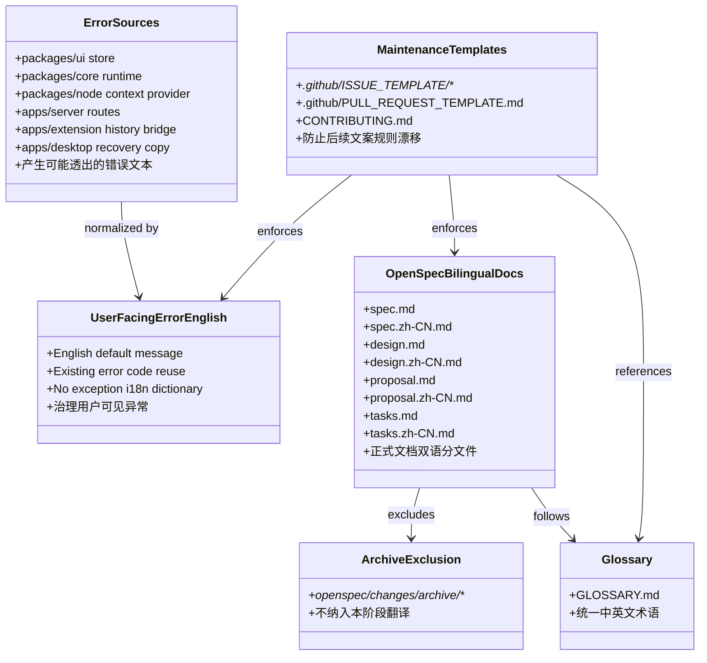

[English](design.md) | 中文

## 上下文

本次设计仅覆盖 `i18n-3` 的 Phase 3：异常英文统一与 OpenSpec 双语规范补齐。当前状态：

- Phase 1 已将仓库公开入口英文化，并引入术语表作为后续阶段的用词基线。
- Phase 2 已规划共享 UI i18n 运行时与静态文案迁移，但明确排除异常文本。
- 当前代码中仍有多处会透到 UI 或 API 响应的中文异常文本，分布在 extension history bridge、server routes、sync validation、node context provider、core agent runtime、desktop recovery copy、UI store 等位置。
- 正式 `openspec/specs/**` 当前只有英文主文件路径，尚未建立 `.zh-CN.md` 镜像文件约定。
- `.github` 目录当前不存在，issue / PR 模板和贡献规则尚未承载后续维护约束。

Phase 3 的目标是把最容易分散和返工的治理项单独收口：错误消息只做英文默认，不做多语言；OpenSpec 正式文档用分文件双语；维护模板和贡献规则负责防止后续回退。

## 目标 / 非目标

**目标：**

- 将用户可见异常和错误提示统一改为英文默认消息。
- 复用已有错误码链路，但不建立异常多语言词条。
- 为 `openspec/specs/**` 和活跃 change 建立英文主文件 + 中文镜像文件结构。
- 明确 `openspec/changes/archive/**` 不纳入本阶段处理。
- 新增 `.github` 模板，并在 `CONTRIBUTING.md` 中补充文案维护规则。
- 让正式 OpenSpec 双语文档和维护模板遵循 Phase 1 的术语表。

**非目标：**

- 不为异常消息提供 `en` / `zh-CN` 运行时切换。
- 不迁移或翻译 `openspec/changes/archive/**`。
- 不重新设计 UI i18n 运行时。
- 不改变现有错误码的语义集合，除非某个路径已有错误码但未复用。
- 不把内部日志强制改成双语或英文；仅治理用户可见和 API 透出路径。

## 决策

### 1. 用户可见异常统一英文，不做异常多语言

原因：

- 异常链路跨 UI、core、node、server、extension、desktop，若做多语言会牵涉错误码建模、上下文参数和远端响应格式。
- 当前目标是开源英文默认，异常统一英文即可消除中文泄漏。
- Phase 2 已覆盖静态 UI 文案，多语言异常会扩大本阶段复杂度。

备选方案：

- 为所有异常建立 `en` / `zh-CN` 字典并按 UI locale 展示。
- 放弃该方案，因为它会要求跨进程错误码协议与参数化消息重构，超出 Phase 3 的风险控制目标。

涉及文件：

- `/Users/quanzhou/Workspace/JARVIS/packages/ui/src/store/chat.ts`
- `/Users/quanzhou/Workspace/JARVIS/packages/ui/src/store/documentWorkspace.ts`
- `/Users/quanzhou/Workspace/JARVIS/packages/ui/src/store/compare.ts`
- `/Users/quanzhou/Workspace/JARVIS/packages/core/src/agents/runtime/createAgentRuntime.ts`
- `/Users/quanzhou/Workspace/JARVIS/packages/core/src/agents/augmentPromptWithAgentContext.ts`
- `/Users/quanzhou/Workspace/JARVIS/packages/node/src/context/FileSystemContextProvider.ts`
- `/Users/quanzhou/Workspace/JARVIS/apps/server/src/routes/context.ts`
- `/Users/quanzhou/Workspace/JARVIS/apps/server/src/routes/sync.ts`
- `/Users/quanzhou/Workspace/JARVIS/apps/server/src/types/sync.ts`
- `/Users/quanzhou/Workspace/JARVIS/apps/extension/src/history/GeminiHistoryTabBridge.ts`
- `/Users/quanzhou/Workspace/JARVIS/apps/web/src/modelProviderRuntime.ts`
- `/Users/quanzhou/Workspace/JARVIS/apps/extension/src/modelProviderRuntime.ts`
- `/Users/quanzhou/Workspace/JARVIS/apps/desktop/src/modelProviderRuntime.ts`
- `/Users/quanzhou/Workspace/JARVIS/apps/desktop/src/App.vue`

函数 / 方法签名变化：

- 无强制公共 API 变更。
- 若实现中需要辅助函数，可新增内部函数，例如 `formatHistoryErrorMessage(code: ExternalHistoryErrorCode): string`，返回英文默认消息。

变更说明：

- 中文错误消息直接改为英文默认消息。
- 已有错误码继续作为分支依据，不新增异常 i18n key。
- 内部日志仅在会透到用户或 API 响应时治理。

### 2. 正式 OpenSpec 文档采用分文件双语，archive 排除

原因：

- 英文主文件保持当前路径，利于 OpenSpec 工具和外部贡献者默认阅读。
- 中文镜像采用 `.zh-CN.md` 并列文件，避免同页双语降低可读性。
- archive 存量大且历史价值高，翻译成本与收益不匹配，继续排除。

备选方案：

- 在同一个 `spec.md` 中写中英双语。
- 放弃该方案，因为会让 diff、归档和工具解析变复杂。

涉及文件：

- `/Users/quanzhou/Workspace/JARVIS/openspec/specs/**/spec.md`
- `/Users/quanzhou/Workspace/JARVIS/openspec/specs/**/spec.zh-CN.md`
- `/Users/quanzhou/Workspace/JARVIS/openspec/changes/i18n-1/*.md`
- `/Users/quanzhou/Workspace/JARVIS/openspec/changes/i18n-2/*.md`
- `/Users/quanzhou/Workspace/JARVIS/openspec/changes/i18n-3/*.md`
- `/Users/quanzhou/Workspace/JARVIS/openspec/changes/*/specs/**/*.md`

函数 / 方法签名变化：

- 无

变更说明：

- 正式 specs 增加中文镜像 `spec.zh-CN.md`。
- 活跃 change 的 `proposal/design/tasks/specs` 增加中文镜像文件。
- 所有镜像文件顶部提供 `English | 中文` 互链。
- `openspec/changes/archive/**` 保持不变。

### 3. `.github` 模板和 `CONTRIBUTING.md` 承载维护规则

原因：

- Phase 1/2/3 结束后，如果没有贡献规则，后续新增文案很容易回到硬编码或中文异常。
- `.github` 模板能把检查项前移到 issue / PR 阶段。
- `CONTRIBUTING.md` 是规则归档点，适合明确静态 UI 文案、异常文案和 OpenSpec 双语要求。

备选方案：

- 只在计划文档里记录规则，不新增模板。
- 放弃该方案，因为计划文档不会自然出现在贡献流程中。

涉及文件：

- `/Users/quanzhou/Workspace/JARVIS/.github/ISSUE_TEMPLATE/**`
- `/Users/quanzhou/Workspace/JARVIS/.github/PULL_REQUEST_TEMPLATE.md`
- `/Users/quanzhou/Workspace/JARVIS/CONTRIBUTING.md`
- `/Users/quanzhou/Workspace/JARVIS/CONTRIBUTING.zh-CN.md`
- `/Users/quanzhou/Workspace/JARVIS/GLOSSARY.md`

函数 / 方法签名变化：

- 无

变更说明：

- 新增 `.github` 模板，英文优先。
- 在贡献文档中补充：静态 UI 文案必须进入 UI i18n；用户可见异常必须使用英文默认消息；正式 OpenSpec 文档必须中英成对提交。

### 4. 验证以静态扫描、文档结构检查和定向回归为主

原因：

- 本阶段包含大量文本治理，静态扫描能快速发现中文异常残留和缺失镜像。
- 运行时行为不应改变，定向回归重点验证错误路径仍能展示英文消息。
- OpenSpec 双语文件需要结构检查，而不是依赖完整 e2e。

备选方案：

- 只做人工审阅。
- 放弃该方案，因为错误文案和双语文件结构都适合自动化扫描。

涉及文件：

- `/Users/quanzhou/Workspace/JARVIS/package.json`
- `/Users/quanzhou/Workspace/JARVIS/openspec/**`
- `/Users/quanzhou/Workspace/JARVIS/packages/**`
- `/Users/quanzhou/Workspace/JARVIS/apps/**`

函数 / 方法签名变化：

- 可新增验证脚本命令，但不强制改变公共 API。

变更说明：

- 增加或记录中文异常扫描命令。
- 增加 OpenSpec 镜像文件完整性检查。
- 增加错误路径定向测试，确认英文默认消息输出。

## 风险 / 权衡

- [风险] 盲目替换中文会破坏 Gemini DOM 抓取中的中文 selector / regex -> 缓解：明确只治理用户可见消息，外部站点匹配用中文 selector、regex 可保留。
- [风险] OpenSpec 双语镜像规模较大导致一次性 diff 很大 -> 缓解：优先覆盖正式 specs 与活跃 changes，archive 明确排除。
- [风险] 异常改英文后既有测试断言失败 -> 缓解：同步更新测试断言，并增加错误路径英文消息测试。
- [风险] `.github` 模板无法完全防止后续违规 -> 缓解：在 `CONTRIBUTING.md` 中提供明确规则，并补静态扫描任务。
- [风险] 内部日志和用户可见错误边界不清 -> 缓解：只处理会被 UI 展示、API 返回或用户操作恢复入口使用的文本，纯 debug 日志不作为强制范围。

## 迁移计划

1. 扫描当前中文错误文本，按“用户可见 / API 透出 / 内部日志 / 外部站点 selector”分类。
2. 将用户可见和 API 透出的错误消息改为英文默认消息，保留外部站点中文 selector / regex。
3. 复用已有 `ExternalHistoryError` 错误码映射，避免新增异常 i18n 资源。
4. 为 `openspec/specs/**` 和活跃 changes 增加 `.zh-CN.md` 镜像与互链。
5. 新增 `.github` 模板，并更新 `CONTRIBUTING.md` / `CONTRIBUTING.zh-CN.md` 的维护规则。
6. 运行静态扫描、文档结构检查、lint/typecheck/build 和定向错误路径测试。

回滚策略：

- 错误消息改动可按模块回滚，不改变数据模型。
- OpenSpec 镜像文件可独立回滚，不影响英文主文件。
- `.github` 模板可单独调整，不影响运行时。

## 未决问题

- 是否需要为中文异常残留建立专门脚本，还是先在 `tasks.md` 中记录 `rg` 扫描命令作为人工门禁？
- OpenSpec 活跃 change 镜像是否应覆盖 `i18n-3` 自身，还是从本 change 完成后开始要求新 change 成对提交？
