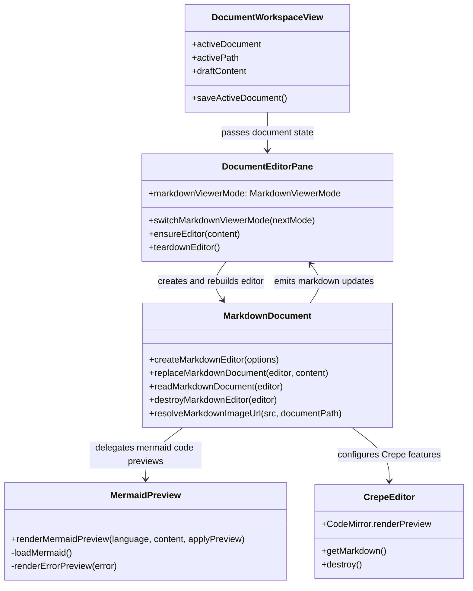

English | [中文](design.zh-CN.md)

## Context

The relevant global architecture entry is `docs/workspace.dsl`: the knowledge workspace belongs to the shared UI layer reused by Web, Extension, and Desktop, while document I/O is provided through `IContextProvider`. The current main document viewer path is:

- `packages/ui/src/views/DocumentWorkspaceView.vue` passes the active document, path, viewer id, and draft content into `DocumentEditorPane.vue`.
- `packages/ui/src/components/DocumentEditorPane.vue` owns the document header, save action, PDF fallback, text editor lifecycle, diff panel, and Markdown editor mount point.
- `packages/ui/src/utils/markdownDocument.ts` creates the Milkdown Crepe editor and currently enables `CrepeFeature.CodeMirror` without a custom preview renderer.
- `packages/ui/src/document-viewers/markdownViewer.ts` resolves `text/markdown` and `text/plain` to the shared text viewer id.

This change should stay inside the main workspace document viewer. `packages/ui/src/components/MarkdownContent.vue` and chat-message rendering are not part of the implementation.



## Goals / Non-Goals

**Goals:**

- Add a viewer/edit mode switch in the main Markdown viewer header, defaulting to `viewer`.
- Render fenced `mermaid` blocks as diagrams in `viewer` mode through the official `mermaid` package.
- Keep Mermaid source directly editable in `edit` mode.
- Display existing Markdown image links as images in `viewer` mode, including remote URL, `data:image/...`, and document-relative local image paths.
- In `viewer` mode, render wiki-style PDF embeds (`![[file.pdf]]`) and standard Markdown image syntax pointing to `.pdf` files as inline `<iframe>` PDF previews inside the document body.
- Preserve the existing editable Markdown flow, save button, autosave model updates, diff panel, PDF viewer, and unsupported viewer behavior.
- Keep the solution shared across Web, Extension, and Desktop because the target files live in `packages/ui`.

**Non-Goals:**

- Do not modify chat-message Markdown rendering or `MarkdownContent.vue`.
- Do not introduce image upload, paste-to-file, drag-and-drop image import, or image asset management.
- Do not replace Milkdown/Crepe with a separate read-only Markdown renderer.
- Do not add Mermaid syntax/layout implementation outside the official package.
- Do not make `text/plain` documents render Mermaid or Markdown images unless the existing viewer path already parses them as Markdown.

## Decisions

### 1. Keep one Milkdown editor and switch preview behavior by rebuilding it

Files:

- `/Users/quanzhou/Workspace/JARVIS/packages/ui/src/components/DocumentEditorPane.vue`
- `/Users/quanzhou/Workspace/JARVIS/packages/ui/src/utils/markdownDocument.ts`
- `/Users/quanzhou/Workspace/JARVIS/packages/ui/src/components/DocumentEditorPane.test.ts`

Changed or added signatures:

```ts
export type MarkdownViewerMode = 'viewer' | 'edit';

async function switchMarkdownViewerMode(nextMode: MarkdownViewerMode): Promise<void>;

export interface CreateMarkdownEditorOptions {
    root: HTMLElement;
    content: string;
    mode: MarkdownViewerMode;
    documentPath: string | null;
    onChange: (markdown: string) => void;
}
```

`DocumentEditorPane.vue` will own a local `markdownViewerMode` ref initialized to `viewer`. The header will render a compact toggle next to the save button when `activeViewerId === 'text'` and the active document is Markdown. Before switching mode, it will read the current editor Markdown, emit `update:modelValue`, destroy the editor, clear the mount root, update the mode, and recreate the editor with the same content.

Rationale: Crepe code block preview state is internal to the already-created editor view. Rebuilding the editor is simpler and safer than trying to mutate all existing code block views after mode changes. The rebuild cost is acceptable for a document viewer mode switch.

Alternative considered: Use an external read-only Markdown renderer for `viewer`. Rejected because it would split editing, autosave, diff, undo/redo, and document viewer registry behavior into two rendering paths.

### 2. Isolate Mermaid rendering in a small utility

Files:

- `/Users/quanzhou/Workspace/JARVIS/packages/ui/src/utils/mermaidPreview.ts`
- `/Users/quanzhou/Workspace/JARVIS/packages/ui/src/utils/markdownDocument.ts`
- `/Users/quanzhou/Workspace/JARVIS/packages/ui/package.json`

Changed or added signatures:

```ts
export function renderMermaidPreview(
    language: string,
    content: string,
    applyPreview: (value: null | string | HTMLElement) => void
): void | null;
```

`markdownDocument.ts` will configure `CrepeFeature.CodeMirror` with a `renderPreview` implementation. In `viewer` mode, Mermaid language blocks call `renderMermaidPreview`. In `edit` mode, Mermaid blocks return `null` so Crepe keeps the source editor visible. `mermaidPreview.ts` will lazily import and initialize the official `mermaid` package with:

```ts
{
    startOnLoad: false,
    securityLevel: 'strict'
}
```

Mermaid render failures will be converted to a small preview error element or a null preview fallback; they must not throw through the editor lifecycle.

Rationale: Mermaid is an external dependency with DOM and async behavior. Isolating it keeps the Milkdown adapter small, simplifies tests, and prevents render errors from crashing the workspace pane.

Alternative considered: Inline dynamic import and initialization directly in `markdownDocument.ts`. Rejected because it mixes editor construction, preview state, and Mermaid failure handling in one module.

### 3. Resolve Markdown images through the editor path, not a second parser

Files:

- `/Users/quanzhou/Workspace/JARVIS/packages/ui/src/utils/markdownDocument.ts`
- `/Users/quanzhou/Workspace/JARVIS/packages/ui/src/components/DocumentEditorPane.vue`
- `/Users/quanzhou/Workspace/JARVIS/packages/ui/src/components/DocumentEditorPane.test.ts`

Changed or added signatures:

```ts
export function resolveMarkdownImageUrl(src: string, documentPath: string | null): string;
```

The image display path should reuse Milkdown image node behavior where possible. For relative local images, `resolveMarkdownImageUrl` will treat the active Markdown document directory as the base path and convert the link into a URL the current UI/runtime can load. Remote `http:`/`https:` URLs and `data:image/...` URLs pass through unchanged.

If Milkdown requires a schema or node-view adjustment to render inline image syntax in preview mode, that adjustment should live in `markdownDocument.ts`, not in a wrapper parser around the editor.

Rationale: Images are part of the Markdown document. A second Markdown parser outside Milkdown would create divergent behavior and make edits harder to preserve.

Alternative considered: Render a full HTML preview outside the editor only for `viewer` mode. Rejected because normal Markdown must remain editable in `viewer` mode.

### 5. Inject PDF embed iframes via DOM post-processing, not a ProseMirror plugin

Files:

- `/Users/quanzhou/Workspace/JARVIS/packages/ui/src/utils/markdownDocument.ts`
- `/Users/quanzhou/Workspace/JARVIS/packages/ui/src/components/DocumentEditorPane.vue`

Changed or added signatures:

```ts
// private, called from attachMarkdownImageResolution
function injectPdfEmbeds(root: HTMLElement, documentPath: string | null): void;
```

After `editor.create()`, `attachMarkdownImageResolution` (viewer mode only) scans for `<a>` elements inside `root` whose `href` ends with `.pdf` (case-insensitive). For each anchor it:

1. Resolves the full URL via `resolveMarkdownAssetUrl(href, documentPath)`.
2. Checks `root.querySelector('.pdf-inline-embed[data-pdf-embed-src="<escaped-url>"]')` — skips if an embed for that URL already exists (deduplication by resolved URL, not by marking the anchor).
3. Creates a `.pdf-inline-embed` `<div>` with `data-pdf-embed-src` set to the resolved URL, containing a full-width `<iframe>`.
4. Determines the insertion target via `findPdfEmbedInsertionTarget`: if the anchor is inside a `[contenteditable]` element, the embed is inserted **after the `contenteditable` host** (i.e., after `.ProseMirror` itself, not inside it). This places the embed entirely outside ProseMirror's managed DOM, so it is never removed by ProseMirror reconciliation.
5. The original `<p>` containing the PDF link is hidden via a scoped CSS rule (`:deep(.milkdown .ProseMirror p:has(a[href$='.pdf' i])) { display: none }`), not via inline style.

A `MutationObserver` watches `root` for DOM changes (subtree, childList) and re-runs injection with a 100 ms `setTimeout` debounce. Any pending timer is cleared and the observer is disconnected when the shared `AbortController` is aborted.

Rationale: ProseMirror widget decorations (the idiomatic solution) require a bespoke Milkdown plugin, access to internal editor state, and a custom node schema. That approach adds significant complexity for a viewer-only feature. In `viewer` mode, ProseMirror does not reconcile the DOM in response to user input; the only trigger is `replaceAll` during external sync. Debounced re-injection after reconciliation covers this case reliably without coupling to ProseMirror internals.

Alternative considered: ProseMirror `Decoration.widget()` via a Milkdown `$prose` plugin. Rejected because it requires deep Milkdown plugin integration, accessing `editorStateCtx` and `editorViewCtx`, and maintaining a custom node schema — disproportionate cost for a feature that is viewer-only and never needs to round-trip through the Markdown model.

Alternative considered: Absolutely-positioned overlay layer outside `.ProseMirror`. Rejected because it requires coordinating `getBoundingClientRect` positions, scroll events, and `ResizeObserver` callbacks, and the overlaid iframes would not scroll naturally with document content.

### 4. Add focused styles and i18n labels without changing the layout model

Files:

- `/Users/quanzhou/Workspace/JARVIS/packages/ui/src/components/DocumentEditorPane.vue`
- `/Users/quanzhou/Workspace/JARVIS/packages/ui/src/i18n/messages/en.ts`
- `/Users/quanzhou/Workspace/JARVIS/packages/ui/src/i18n/messages/zh-CN.ts`

Change description:

- Add labels for `Viewer`, `Edit`, and mode-switch tooltip/aria text.
- Add styles for Mermaid preview containers, preview errors, and Markdown images inside `.editor-input`.
- Keep the existing dark editor surface and avoid adding nested card containers around the full editor.
- Ensure images have `max-width: 100%` and `height: auto`.
- Ensure Mermaid diagrams can scroll horizontally instead of overflowing the pane.

Rationale: The mode switch is user-facing copy and must follow the shared UI i18n runtime. Styling should preserve the existing editor visual language.

Alternative considered: Hard-code English labels in `DocumentEditorPane.vue`. Rejected because the UI already uses shared message dictionaries.

## Risks / Trade-offs

- [Risk] Mermaid rendering is async and may complete after the editor is rebuilt or destroyed -> Mitigation: gate preview writes through the `applyPreview` callback and keep render failures local to `mermaidPreview.ts`; the editor rebuild token in `DocumentEditorPane.vue` remains the lifecycle boundary.
- [Risk] `securityLevel: 'strict'` may block some Mermaid HTML features -> Mitigation: prefer safe rendering for workspace documents; document that raw interactive HTML in diagrams is out of scope.
- [Risk] Relative local image loading differs between Web, Extension, and Desktop hosts -> Mitigation: resolve relative paths from the active document path and route loading through existing workspace/context URL capabilities where available; add host-targeted regression coverage for at least Web and Extension if implementation touches host-specific URL handling.
- [Risk] Rebuilding the editor on mode switch may lose unsaved edits if the current Markdown is not read first -> Mitigation: always call `readMarkdownDocument(editor)` and emit `update:modelValue` before teardown.
- [Risk] Plain text documents share the text viewer id -> Mitigation: gate mode switch and Markdown preview behavior on `activeDocument.mimeType === 'text/markdown'`.
- [Risk] Injected PDF embed elements may be removed when ProseMirror reconciles the DOM -> Mitigation: `MutationObserver` detects removal and re-injects with a 100 ms debounce; `data-pdf-embed-processed` marks prevent injection loops; user input does not trigger reconciliation in viewer mode, so the only trigger is external content sync which occurs infrequently.

## Migration Plan

1. Add `mermaid` to `packages/ui` dependencies if it is absent.
2. Add `mermaidPreview.ts` and wire `renderMermaidPreview` from `markdownDocument.ts`.
3. Extend `CreateMarkdownEditorOptions` with `mode` and `documentPath`, then update `DocumentEditorPane.vue` calls.
4. Add mode switch state, rebuild behavior, labels, and styles in `DocumentEditorPane.vue`.
5. Add `injectPdfEmbeds` logic and `MutationObserver` inside `attachMarkdownImageResolution`, and add `.pdf-inline-embed` styles in `DocumentEditorPane.vue`.
6. Add or update component/unit tests for default `viewer`, mode switching, editor rebuild content preservation, Mermaid preview configuration, image URL handling, and PDF embed injection.
7. Run validation in the project order: `pnpm lint`, targeted `pnpm --filter @packages/ui test`, relevant builds, then E2E for the main document viewer. If extension E2E is used, request elevated permissions and run with Chromium channel; after extension E2E passes, run `pnpm --filter extension build`.

Rollback: remove the mode switch UI, revert the `CreateMarkdownEditorOptions` additions, remove Mermaid preview wiring and dependency, remove PDF embed injection and styles, and leave the existing Milkdown text editor path unchanged.

## Open Questions

- The exact URL form for document-relative local image links depends on the active host capability. During implementation, confirm whether an existing context-provider-backed URL endpoint is already available; if not, use the smallest host-compatible adapter rather than adding image asset management.
