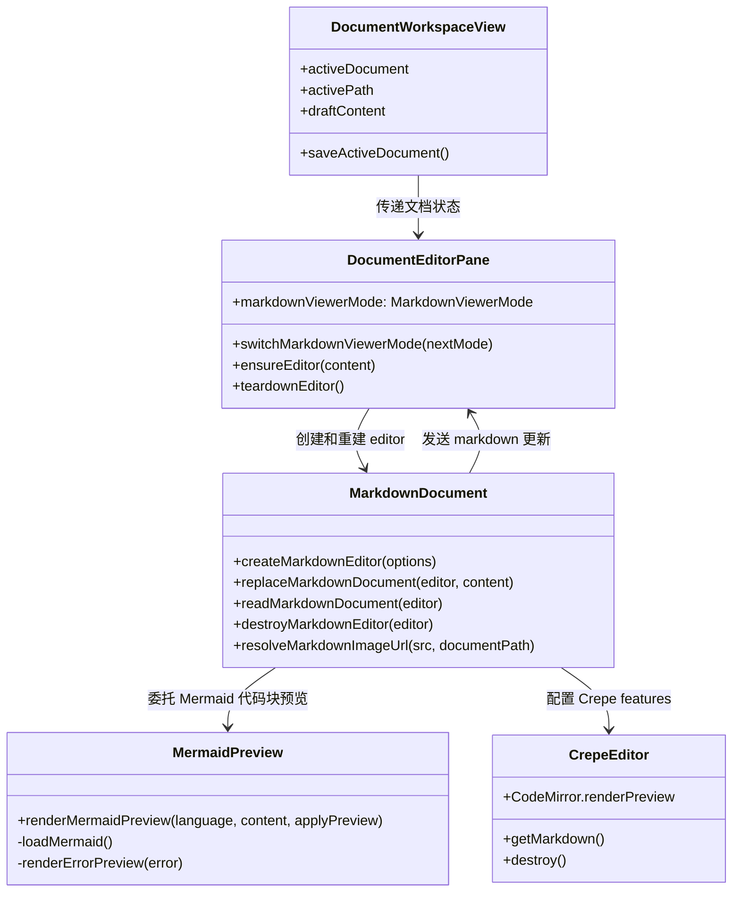

[English](design.md) | 中文

## 背景

相关全局架构入口是 `docs/workspace.dsl`：知识工作区属于共享 UI 层，由 Web、Extension、Desktop 复用；文档 I/O 通过 `IContextProvider` 提供。当前主文档 viewer 链路是：

- `packages/ui/src/views/DocumentWorkspaceView.vue` 将活动文档、路径、viewer id 和 draft content 传给 `DocumentEditorPane.vue`。
- `packages/ui/src/components/DocumentEditorPane.vue` 负责文档头部、保存动作、PDF fallback、文本 editor 生命周期、diff 面板和 Markdown editor 挂载点。
- `packages/ui/src/utils/markdownDocument.ts` 创建 Milkdown Crepe editor，目前启用了 `CrepeFeature.CodeMirror`，但没有自定义 preview renderer。
- `packages/ui/src/document-viewers/markdownViewer.ts` 将 `text/markdown` 和 `text/plain` 解析到共享 text viewer id。

本变更应保持在主工作区文档 viewer 内。`packages/ui/src/components/MarkdownContent.vue` 和聊天消息渲染不属于本次实现范围。



## 目标 / 非目标

**目标：**

- 在主 Markdown viewer 右上角增加 viewer/edit 模式开关，默认进入 `viewer`。
- `viewer` 模式下通过官方 `mermaid` 包把 fenced `mermaid` 代码块渲染为图。
- `edit` 模式下保持 Mermaid 源码可直接编辑。
- `viewer` 模式下将已有 Markdown 图片链接显示成图片，覆盖远程 URL、`data:image/...` 和基于当前文档位置解析的本地相对图片路径。
- `viewer` 模式下，wiki 式 PDF 嵌入（`![[file.pdf]]`）和指向 `.pdf` 文件的标准 Markdown 图片语法在文档正文中渲染为内嵌 `<iframe>` PDF 预览。
- 保持现有可编辑 Markdown 流程、保存按钮、自动保存 model 更新、diff 面板、PDF viewer 和 unsupported viewer 行为。
- 由于目标文件位于 `packages/ui`，该能力应在 Web、Extension、Desktop 间共享。

**非目标：**

- 不修改聊天消息 Markdown 渲染或 `MarkdownContent.vue`。
- 不引入图片上传、粘贴写入、拖拽导入图片或图片资源管理。
- 不用单独的只读 Markdown renderer 替换 Milkdown/Crepe。
- 不在官方包之外自行实现 Mermaid 语法或布局。
- 除非现有 viewer 路径已经把 `text/plain` 当 Markdown 解析，否则不让纯文本文件渲染 Mermaid 或 Markdown 图片。

## 决策

### 1. 保持单一 Milkdown editor，通过重建切换 preview 行为

文件：

- `/Users/quanzhou/Workspace/JARVIS/packages/ui/src/components/DocumentEditorPane.vue`
- `/Users/quanzhou/Workspace/JARVIS/packages/ui/src/utils/markdownDocument.ts`
- `/Users/quanzhou/Workspace/JARVIS/packages/ui/src/components/DocumentEditorPane.test.ts`

修改或新增 signature：

```ts
export type MarkdownViewerMode = 'viewer' | 'edit';

async function switchMarkdownViewerMode(nextMode: MarkdownViewerMode): Promise<void>;

export interface CreateMarkdownEditorOptions {
    root: HTMLElement;
    content: string;
    mode: MarkdownViewerMode;
    documentPath: string | null;
    onChange: (markdown: string) => void;
}
```

`DocumentEditorPane.vue` 维护本地 `markdownViewerMode` ref，初始值为 `viewer`。当 `activeViewerId === 'text'` 且活动文档是 Markdown 时，在 header 中于保存按钮旁渲染紧凑开关。切换前先读取当前 editor Markdown，发送 `update:modelValue`，销毁 editor，清空挂载节点，更新模式，再用同一份内容重建 editor。

原因：Crepe 代码块 preview 状态属于已创建 editor view 的内部状态。相比在模式变更后尝试逐个修改既有 code block view，重建 editor 更简单且更稳。对文档 viewer 模式切换来说，重建成本可接受。

备选方案：`viewer` 模式使用外部只读 Markdown renderer。放弃原因是会把编辑、自动保存、diff、undo/redo 和 document viewer registry 行为拆成两条渲染链路。

### 2. 将 Mermaid 渲染隔离到小工具模块

文件：

- `/Users/quanzhou/Workspace/JARVIS/packages/ui/src/utils/mermaidPreview.ts`
- `/Users/quanzhou/Workspace/JARVIS/packages/ui/src/utils/markdownDocument.ts`
- `/Users/quanzhou/Workspace/JARVIS/packages/ui/package.json`

修改或新增 signature：

```ts
export function renderMermaidPreview(
    language: string,
    content: string,
    applyPreview: (value: null | string | HTMLElement) => void
): void | null;
```

`markdownDocument.ts` 为 `CrepeFeature.CodeMirror` 配置 `renderPreview`。在 `viewer` 模式下，Mermaid 语言块调用 `renderMermaidPreview`；在 `edit` 模式下，Mermaid 块返回 `null`，让 Crepe 保持源码 editor 可见。`mermaidPreview.ts` 懒加载并初始化官方 `mermaid` 包，初始化参数为：

```ts
{
    startOnLoad: false,
    securityLevel: 'strict'
}
```

Mermaid 渲染失败时，转换成一个小型 preview 错误元素或 null fallback；不得把异常抛穿 editor 生命周期。

原因：Mermaid 是带 DOM 和异步行为的外部依赖。隔离它可以让 Milkdown adapter 保持小而清晰，简化测试，并避免渲染错误导致工作区 pane 崩溃。

备选方案：在 `markdownDocument.ts` 内直接写动态 import 和初始化。放弃原因是会把 editor 创建、preview 状态和 Mermaid 错误处理混在一个模块里。

### 3. 图片通过 editor 路径解析，不另造第二套 parser

文件：

- `/Users/quanzhou/Workspace/JARVIS/packages/ui/src/utils/markdownDocument.ts`
- `/Users/quanzhou/Workspace/JARVIS/packages/ui/src/components/DocumentEditorPane.vue`
- `/Users/quanzhou/Workspace/JARVIS/packages/ui/src/components/DocumentEditorPane.test.ts`

修改或新增 signature：

```ts
export function resolveMarkdownImageUrl(src: string, documentPath: string | null): string;
```

图片显示应尽量复用 Milkdown image node 行为。对于本地相对图片，`resolveMarkdownImageUrl` 将活动 Markdown 文档所在目录作为 base path，并将链接转换成当前 UI/runtime 可加载的 URL。远程 `http:`/`https:` URL 和 `data:image/...` URL 原样通过。

如果 Milkdown 需要 schema 或 node-view 调整才能在 preview 模式下显示 inline image syntax，该调整应放在 `markdownDocument.ts`，而不是在 editor 外包一层 Markdown parser。

原因：图片属于 Markdown 文档内容。editor 外的第二套 Markdown parser 会导致行为分叉，也会让编辑保全更复杂。

备选方案：`viewer` 模式在 editor 外渲染完整 HTML 预览。放弃原因是普通 Markdown 在 `viewer` 模式下仍必须可编辑。

### 5. 通过 DOM 后处理注入 PDF embed iframe，不使用 ProseMirror 插件

文件：

- `/Users/quanzhou/Workspace/JARVIS/packages/ui/src/utils/markdownDocument.ts`
- `/Users/quanzhou/Workspace/JARVIS/packages/ui/src/components/DocumentEditorPane.vue`

修改或新增 signature：

```ts
// 私有，由 attachMarkdownImageResolution 调用
function injectPdfEmbeds(root: HTMLElement, documentPath: string | null): void;
```

`editor.create()` 完成后，`attachMarkdownImageResolution`（仅 viewer 模式）扫描 `root` 内 `href` 以 `.pdf` 结尾（大小写不敏感）的所有 `<a>` 元素。对每个 anchor：

1. 通过 `resolveMarkdownAssetUrl(href, documentPath)` 解析完整 URL。
2. 检查 `root.querySelector('.pdf-inline-embed[data-pdf-embed-src="<escaped-url>"]')` — 若该 URL 的 embed 已存在则跳过（按解析后 URL 去重，而非在 anchor 上打标记）。
3. 创建带有 `data-pdf-embed-src` 属性的 `.pdf-inline-embed` `<div>`，内含全宽 `<iframe>`。
4. 通过 `findPdfEmbedInsertionTarget` 确定插入位置：若 anchor 在 `[contenteditable]` 元素内，embed 插入在 **`contenteditable` host 之后**（即 `.ProseMirror` 元素之后，而非内部）。这使 embed 完全在 ProseMirror 管辖域外，ProseMirror 重新协调时不会移除它。
5. 包含 PDF 链接的原始 `<p>` 通过 scoped CSS 规则隐藏（`:deep(.milkdown .ProseMirror p:has(a[href$='.pdf' i])) { display: none }`），而非 JS inline style。

`MutationObserver` 监听 `root` DOM 变化（subtree、childList），以 100 ms `setTimeout` 防抖重新执行注入。共享 `AbortController` abort 时 observer 断开，待执行的 timer 一并清理。

原因：ProseMirror widget decoration（最规范的方案）需要定制 Milkdown 插件、访问 editor 内部状态和自定义 node schema，对纯 viewer 功能而言成本过高。在 `viewer` 模式下，ProseMirror 不会因用户输入触发 DOM 重新协调；唯一触发点是外部同步时的 `replaceAll`。注入后用防抖重注入可可靠地覆盖此场景，且无需耦合 ProseMirror 内部机制。

备选方案：通过 Milkdown `$prose` 插件使用 ProseMirror `Decoration.widget()`。放弃原因是需要访问 `editorStateCtx` 和 `editorViewCtx`、维护自定义 node schema，对仅 viewer 使用的功能代价过高，且 embed 不需要回写到 Markdown 模型。

备选方案：在 `.ProseMirror` 外用绝对定位叠加层。放弃原因是需要协调 `getBoundingClientRect` 位置、滚动事件和 `ResizeObserver` 回调，且叠加的 iframe 不会随文档内容自然滚动。

### 4. 补充聚焦样式和 i18n 文案，不改变布局模型

文件：

- `/Users/quanzhou/Workspace/JARVIS/packages/ui/src/components/DocumentEditorPane.vue`
- `/Users/quanzhou/Workspace/JARVIS/packages/ui/src/i18n/messages/en.ts`
- `/Users/quanzhou/Workspace/JARVIS/packages/ui/src/i18n/messages/zh-CN.ts`

变更描述：

- 增加 `Viewer`、`Edit` 和模式切换 tooltip/aria 文案。
- 在 `.editor-input` 内增加 Mermaid preview 容器、preview 错误和 Markdown 图片样式。
- 保持现有深色 editor surface，不给整个 editor 额外套嵌套卡片容器。
- 图片设置 `max-width: 100%` 和 `height: auto`。
- Mermaid 图支持横向滚动，避免撑爆 pane。

原因：模式开关属于用户可见文案，必须遵循共享 UI i18n runtime。样式应保留现有 editor 视觉语言。

备选方案：在 `DocumentEditorPane.vue` 里硬编码英文 label。放弃原因是 UI 已经使用共享消息字典。

## 风险 / 权衡

- [风险] Mermaid 异步渲染可能在 editor 重建或销毁后才完成 -> 缓解：通过 `applyPreview` callback 约束 preview 写入，并将渲染失败限制在 `mermaidPreview.ts`；`DocumentEditorPane.vue` 现有 editor 重建 token 继续作为生命周期边界。
- [风险] `securityLevel: 'strict'` 可能阻止部分 Mermaid HTML 能力 -> 缓解：工作区文档优先安全渲染；明确原始交互 HTML 图能力不在本次范围。
- [风险] 本地相对图片加载在 Web、Extension、Desktop 间路径形态不同 -> 缓解：按活动文档路径解析相对路径，并在可用时走既有 workspace/context URL 能力；如实现触及宿主 URL 处理，至少补 Web 和 Extension 的定向回归覆盖。
- [风险] 模式切换重建 editor 时，如果未先读取当前 Markdown 会丢未保存编辑 -> 缓解：teardown 前必须调用 `readMarkdownDocument(editor)` 并发送 `update:modelValue`。
- [风险] 纯文本文件复用 text viewer id -> 缓解：模式开关和 Markdown preview 行为仅在 `activeDocument.mimeType === 'text/markdown'` 时启用。
- [风险] ProseMirror 重新协调后注入的 PDF embed 元素被移除 -> 缓解：`MutationObserver` 以 100 ms 防抖检测并重新注入，同时用 `data-pdf-embed-processed` 标记防止循环；viewer 模式下用户输入不触发重新协调，唯一触发点是外部内容同步，频率有限。

## 迁移计划

1. 如果尚未存在，在 `packages/ui` dependencies 中加入 `mermaid`。
2. 新增 `mermaidPreview.ts`，并从 `markdownDocument.ts` 接入 `renderMermaidPreview`。
3. 将 `CreateMarkdownEditorOptions` 扩展为包含 `mode` 和 `documentPath`，同步更新 `DocumentEditorPane.vue` 调用。
4. 在 `DocumentEditorPane.vue` 增加模式状态、重建行为、文案和样式。
5. 在 `attachMarkdownImageResolution` 中增加 `injectPdfEmbeds` 逻辑和 `MutationObserver`，并在 `DocumentEditorPane.vue` 补充 `.pdf-inline-embed` 样式。
6. 增加或更新组件/单元测试，覆盖默认 `viewer`、模式切换、editor 重建内容保全、Mermaid preview 配置、图片 URL 处理，以及 PDF embed 注入行为。
7. 按项目顺序验证：`pnpm lint`、定向 `pnpm --filter @packages/ui test`、相关 build，再执行主文档 viewer E2E。若执行 extension E2E，需申请提权并使用 Chromium channel；extension E2E 通过后执行 `pnpm --filter extension build`。

回滚方式：移除模式开关 UI，回退 `CreateMarkdownEditorOptions` 新字段，移除 Mermaid preview 接线和依赖，移除 PDF embed 注入和样式，保留原有 Milkdown text editor 链路。

## 开放问题

- 文档相对本地图片链接的最终 URL 形态取决于当前宿主能力。实现时需要确认是否已有 context-provider-backed URL 端点；如果没有，应采用最小的跨宿主 adapter，而不是新增图片资产管理。
