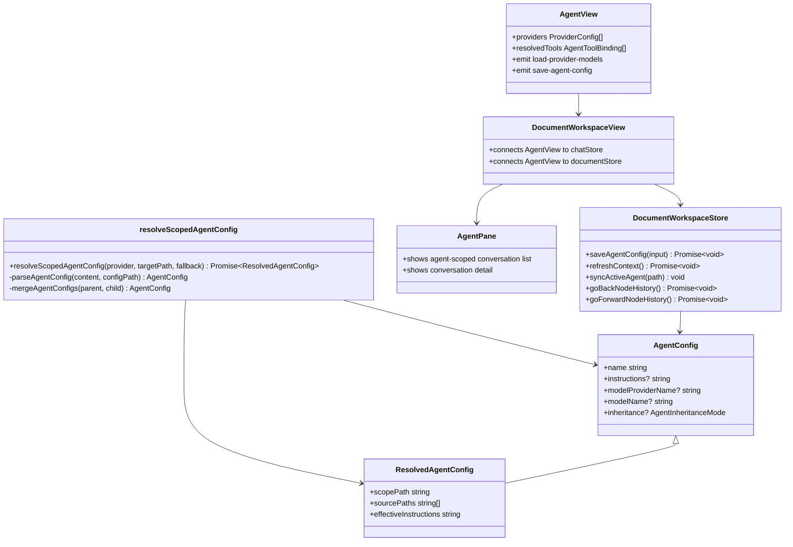

## Context

The workspace architecture routes knowledge-directory behavior through shared core contracts and shared Vue UI. `docs/workspace.dsl` identifies `IContextProvider` as the source of workspace context and resolved Agent configuration, while `AgentRuntime` consumes `ResolvedAgentConfig` during Agent execution.

Current implementation already has the main pieces needed for this change:

- `AgentView` renders in the middle pane for selected owner directories.
- `AgentPane` on the right already owns agent-scoped conversation list/detail behavior.
- `.agent.json` is read through `resolveScopedAgentConfig()`.
- Model provider catalogs are already loaded through `chatStore`.
- `IContextProvider.writeDocument()` can persist `.agent.json` edits.

The main gap is product ownership of behavior: `AgentView` duplicates conversations and cannot edit configuration or tool selection, while active specs still describe phase-one nearest-parent Agent resolution instead of default merge with explicit override.

## Goals / Non-Goals

**Goals:**

- Make `AgentView` the middle-pane editor for the selected owner directory's `.agent.json`.
- Remove middle-pane document and conversation listings from `AgentView`; keep document navigation in the left file tree and conversation list/detail in `AgentPane`.
- Add typed `inheritance: "merge" | "override"` support to Agent config.
- Make `merge` the default mode and merge system prompts from parent to child.
- Make `override` truncate parent/default inheritance and use only the current config level.
- Persist edits by patching the owner directory's existing `.agent.json` while preserving unrelated fields.

**Non-Goals:**

- Do not edit Agent name, skills, or `linkDir` in this change.
- Do not create `.agent.json` for non-owner directories.
- Do not add new provider runtime APIs or external dependencies.
- Do not move the right-side `AgentPane` conversation list implementation.

## Decisions

### 1. Keep `AgentView` owner-directory scoped

`AgentView` remains mounted only when the selected node is a directory with `isAgentOwner === true`. The editor writes the owner directory's direct config file, not an inherited parent config.

The workspace root `/` is a special owner boundary for the default Agent. Selecting the root mounts the same `AgentView` editor for the default Agent. Saving root edits writes `/.agent.json`; if that file does not exist yet, the store may create it during the save. This root-only bootstrap does not allow arbitrary non-owner directories to create `.agent.json` through the editor.

Files to change:

- `/Users/quanzhou/Workspace/JARVIS/packages/ui/src/components/AgentView.vue`
- `/Users/quanzhou/Workspace/JARVIS/packages/ui/src/views/DocumentWorkspaceView.vue`

Changed component interface:

```ts
type AgentConfigEditPayload = {
  description?: string;
  instructions?: string;
  modelProviderName?: string;
  modelName?: string;
  inheritance?: AgentInheritanceMode;
  tools?: AgentToolBinding[];
  inheritTools?: boolean;
};

defineProps<{
  agentKey: string;
  agent: ResolvedAgentConfig;
  ownerNode: ContextNode;
  providers: ProviderConfig[];
  modelLoadStates?: Record<string, { loading?: boolean; loaded?: boolean }>;
}>();

defineEmits<{
  (event: 'load-provider-models', providerId: string): void;
  (event: 'save-agent-config', payload: AgentConfigEditPayload): void;
}>();
```

Rationale: `AgentView` should not resolve or write arbitrary paths. The selected owner node is already the source of truth for the editable config boundary.

Alternative considered: allow editing any inherited active Agent from non-owner selections. Rejected because it makes write targets ambiguous and can accidentally modify parent directories from child contexts.

### 2. Patch `.agent.json` through the document workspace store

The document workspace store will provide one action for writing supported editable fields.

File to change:

- `/Users/quanzhou/Workspace/JARVIS/packages/ui/src/store/documentWorkspace.ts`

New method signature:

```ts
async saveAgentConfig(input: {
  ownerPath: string;
  patch: {
    description?: string;
    instructions?: string;
    modelProviderName?: string;
    modelName?: string;
    inheritance?: AgentInheritanceMode;
    tools?: AgentToolBinding[];
    inheritTools?: boolean;
  };
}): Promise<void>
```

Behavior:

- Resolve config path as `${ownerPath}/.agent.json`, with `/.agent.json` for root if needed.
- Read existing JSON via `contextProvider.readDocument()`.
- Patch only `description`, `instructions`, `modelProviderName`, `modelName`, `inheritance`, and `tools`.
- Preserve `name`, `skills`, `linkDir`, and unknown fields.
- When `description` is blank, remove that field from the saved JSON so the existing fallback behavior can apply.
- Remove `instructions`, `modelProviderName`, or `modelName` when the edited value is blank.
- Remove `inheritance` when the edited value is blank or `merge`, because merge is the default.
- When the tools inheritance switch is enabled, remove `tools` so the owner directory fully inherits the resolved parent/default tool set in read-only mode.
- When the tools inheritance switch is disabled, persist the selected tool list as the owner directory's direct `tools` value.
- Write formatted JSON using `contextProvider.writeDocument()`.
- Refresh workspace context and resync the active Agent for the owner path.

Rationale: keeping the save flow in the store centralizes context refresh and avoids duplicating document write concerns inside a presentational component. `description` stays editable because it is part of the agent identity presented in the same owner-bound configuration surface.

Alternative considered: open `.agent.json` in the normal document editor. Rejected because users need a focused Agent editor with controlled fields and model catalog integration.

### 3. Reuse existing provider/model catalog state

`DocumentWorkspaceView` will pass `chatStore.availableProviders`, provider model load state, and the builtin tool catalog into `AgentView`. `AgentView` will reuse `ProviderModelSelector.vue`, render the current resolved description and tools as the default selection, and switch the tools list into read-only mode when the user enables full inheritance.

Files to change:

- `/Users/quanzhou/Workspace/JARVIS/packages/ui/src/views/DocumentWorkspaceView.vue`
- `/Users/quanzhou/Workspace/JARVIS/packages/ui/src/components/ProviderModelSelector.vue` only if a minor prop/test-id adjustment is required
- `/Users/quanzhou/Workspace/JARVIS/packages/ui/src/store/chat.ts` only if current provider model state or builtin tool state is not exposed in a usable shape

Rationale: the chat workspace already owns runtime-specific model catalog loading, fallback, dynamic provider models, and the builtin tool registry. Agent config editing should not create a second source of truth.

Alternative considered: have `AgentView` call model provider runtime directly. Rejected because shared UI components should remain host-neutral.

### 4. Make inheritance explicit in core types and resolver

Files to change:

- `/Users/quanzhou/Workspace/JARVIS/packages/core/src/interfaces/IAgentConfig.ts`
- `/Users/quanzhou/Workspace/JARVIS/packages/core/src/agents/config/resolveScopedAgentConfig.ts`

Changed signatures and types:

```ts
export type AgentInheritanceMode = 'merge' | 'override';

export interface AgentConfig {
  name: string;
  description?: string;
  instructions?: string;
  modelProviderName?: string;
  modelName?: string;
  tools?: AgentToolBinding[];
  skills?: AgentSkillBinding[];
  inheritance?: AgentInheritanceMode;
}
```

Resolver behavior:

- Parse missing `inheritance` as `merge`.
- Reject non-`merge`/`override` values with a diagnostic config error.
- Process matched configs from root to leaf.
- For `merge`, combine with the accumulated config using existing merge rules, including parent-then-child prompt concatenation.
- For `override`, replace the accumulated config with the current config only, discarding parent and default fallback fields.
- After an override level, deeper child configs may still merge with that override result unless they also override.

Rationale: this gives users the requested default inheritance behavior while preserving an escape hatch for fully independent child agents.

Alternative considered: make override affect only prompts. Rejected because the requested behavior was confirmed as full configuration override.

### 5. Remove middle-pane document and conversation ownership from AgentView

Files to change:

- `/Users/quanzhou/Workspace/JARVIS/packages/ui/src/components/AgentView.vue`
- `/Users/quanzhou/Workspace/JARVIS/packages/ui/src/views/DocumentWorkspaceView.vue`
- `/Users/quanzhou/Workspace/JARVIS/packages/ui/src/components/AgentView.test.ts`
- `/Users/quanzhou/Workspace/JARVIS/packages/ui/src/views/DocumentWorkspaceView.test.ts`

Removed interface:

```ts
documents: ContextNode[];
conversations: Conversation[];
(event: 'open-document', path: string): void;
(event: 'open-conversation', conversationId: string): void;
```

Rationale: directory-level documents already have the left file tree, conversations already have a dedicated right-side list/detail surface in `AgentPane`, and tools should be surfaced as a focused agent configuration control rather than a separate navigation surface. Keeping additional middle-pane lists creates duplicate ownership.

Alternative considered: keep a compact read-only recent conversation preview in `AgentView`. Rejected because it still duplicates the right-side panel and does not advance config editing.

### 6. Add document workspace node access history

The document workspace store will own node access history so Web, Extension, and Desktop hosts share the same behavior.

Files to change:

- `/Users/quanzhou/Workspace/JARVIS/packages/ui/src/store/documentWorkspace.ts`
- `/Users/quanzhou/Workspace/JARVIS/packages/ui/src/components/AppTopBar.vue`
- `/Users/quanzhou/Workspace/JARVIS/packages/ui/src/views/WorkspaceHostApp.vue`
- `/Users/quanzhou/Workspace/JARVIS/packages/ui/src/views/DocumentWorkspaceView.vue`
- `/Users/quanzhou/Workspace/JARVIS/packages/ui/src/components/DocumentFileTree.vue`
- `/Users/quanzhou/Workspace/JARVIS/packages/ui/src/i18n/messages/en.ts`
- `/Users/quanzhou/Workspace/JARVIS/packages/ui/src/i18n/messages/zh-CN.ts`

Changed store state and signatures:

```ts
export interface DocumentWorkspaceState {
  nodeHistory: string[];
  nodeHistoryIndex: number;
}

openNode(path: string, options?: {
  selectedNodePath?: string | null;
  recordHistory?: boolean;
}): Promise<void>

goBackNodeHistory(): Promise<void>
goForwardNodeHistory(): Promise<void>
```

Behavior:

- User-initiated `openNode(path)` calls record distinct visited node paths.
- Opening a new node while the history index is not at the end truncates forward history before appending the new path.
- `restoreSelection()` and history back/forward calls open nodes with `recordHistory: false` so internal navigation does not create duplicate entries.
- History entries that no longer exist after refresh/delete are filtered or skipped so controls do not point at missing nodes.
- `DocumentFileTree` receives `canGoBack` and `canGoForward` props and emits `go-back` / `go-forward` from top toolbar buttons before the existing refresh/delete/create actions.
- `DocumentWorkspaceView` wires those events to the store and runs `syncWorkspaceConversationSelection()` after navigation, keeping the assistant pane aligned with the restored node.
- `AppTopBar` also exposes the history controls in the real application top bar while the knowledge workspace is active. `WorkspaceHostApp` wires those top-bar controls directly to the document workspace store.

Rationale: the selected node and active document already live in the document workspace store. Keeping history there avoids per-component state drift and makes history consistent across hosts.

Alternative considered: keep history only in `DocumentWorkspaceView`. Rejected because delete/refresh/restore logic already belongs to the store and must be able to sanitize history consistently.

### 7. Make asynchronous chat rendering scroll-aware

`NormalChatView` currently scrolls the message list to the bottom whenever rendered messages change. That interrupts users who scroll upward while assistant content streams in.

File to change:

- `/Users/quanzhou/Workspace/JARVIS/packages/ui/src/views/NormalChatView.vue`

New helper signatures:

```ts
function isMessagesNearBottom(): boolean
function scrollMessagesToBottom(): void
```

Behavior:

- Message updates only auto-scroll when the user is already near the bottom or when the current local interaction explicitly requires following the latest output.
- If the user scrolls upward, subsequent asynchronous assistant content updates preserve the current scroll position.
- Displayed conversation changes default the message list to the top; preview mode remains top-aligned.
- `syncActiveQuestionFromScroll()` still runs after scroll/layout changes so the question outline remains accurate.

Rationale: scroll position is user intent. Streaming content should not override that intent once the user has moved away from the bottom.

Alternative considered: add a visible "jump to latest" affordance. Rejected for this change because the requested behavior is only to stop forced scrolling; a new control can be considered separately if needed.

### Class Diagram



## Risks / Trade-offs

- [Risk] Existing configs may rely on implicit inherited default tools, and the new tools inheritance switch will hide direct editing when enabled. → Mitigation: the switch is explicit; the read-only display still shows the resolved tools set, and disabling the switch returns to editable direct selection.
- [Risk] Editing `.agent.json` through a form could drop unknown config fields. → Mitigation: read the existing JSON object and patch only supported keys.
- [Risk] Provider model catalogs may still be loading when the editor opens. → Mitigation: reuse existing loading state and disable model selection while the selected provider's models are loading.
- [Risk] Removing AgentView conversations may break tests or user muscle memory. → Mitigation: keep right-side `AgentPane` list visible for agent owner directory selections and update specs/tests accordingly.
- [Risk] Current active spec says `merge` is out of scope. → Mitigation: this change explicitly updates `agent-binding` requirements before implementation.
