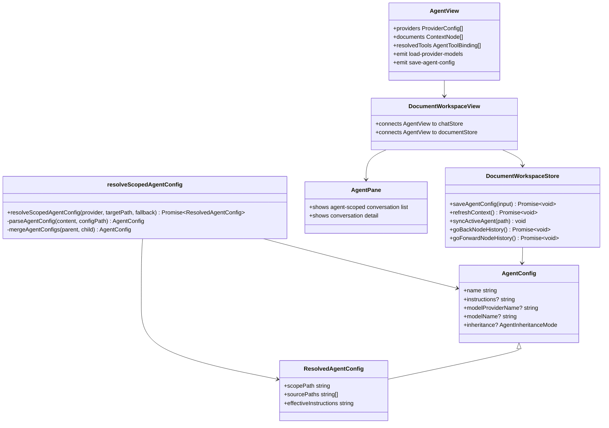

## Context

工作区架构通过共享 core contracts 和共享 Vue UI 来承载知识目录行为。`docs/workspace.dsl` 将 `IContextProvider` 标识为工作区上下文和已解析 Agent 配置的来源，而 `AgentRuntime` 在 Agent 执行时消费 `ResolvedAgentConfig`。

当前实现已经具备本变更所需的主要组件：

- `AgentView` 会在选中 owner directory 时渲染到中间栏。
- 右侧 `AgentPane` 已经负责 Agent 作用域 conversation list/detail 行为。
- `.agent.json` 通过 `resolveScopedAgentConfig()` 读取。
- 模型 Provider catalog 已经通过 `chatStore` 加载。
- `IContextProvider.writeDocument()` 可以持久化 `.agent.json` 编辑。

主要缺口在于产品行为归属：`AgentView` 重复展示对话且不能编辑配置或工具选择，而 active specs 仍描述 phase-one nearest-parent Agent resolution，而不是默认 merge 加显式 override。

## Goals / Non-Goals

**Goals:**

- 将 `AgentView` 做成选中 owner directory 的 `.agent.json` 中间栏编辑器。
- 从 `AgentView` 移除中间栏 conversation list；conversation list/detail 保留在 `AgentPane`。
- 为 Agent config 增加类型化 `inheritance: "merge" | "override"` 支持。
- 将 `merge` 作为默认模式，并按父到子顺序合并系统提示词。
- 将 `override` 定义为截断父级/默认继承，只使用当前配置层。
- 通过 patch owner directory 现有 `.agent.json` 持久化编辑，并保留无关字段。

**Non-Goals:**

- 本次不编辑 Agent name、skills 或 `linkDir`。
- 本次不为非 owner directory 创建 `.agent.json`。
- 本次不新增 provider runtime API 或外部依赖。
- 本次不迁移右侧 `AgentPane` conversation list 实现。

## Decisions

### 1. 保持 `AgentView` 绑定 owner directory

`AgentView` 仍然只在选中节点是 `isAgentOwner === true` 的 directory 时挂载。编辑器写入该 owner directory 的直接配置文件，而不是某个继承来的父级配置。

需要修改的文件：

- `/Users/quanzhou/Workspace/JARVIS/packages/ui/src/components/AgentView.vue`
- `/Users/quanzhou/Workspace/JARVIS/packages/ui/src/views/DocumentWorkspaceView.vue`

变更后的组件接口：

```ts
type AgentConfigEditPayload = {
  description?: string;
  instructions?: string;
  modelProviderName?: string;
  modelName?: string;
  inheritance?: AgentInheritanceMode;
  tools?: AgentToolBinding[];
  inheritTools?: boolean;
};

defineProps<{
  agentKey: string;
  agent: ResolvedAgentConfig;
  ownerNode: ContextNode;
  documents: ContextNode[];
  providers: ProviderConfig[];
  modelLoadStates?: Record<string, { loading?: boolean; loaded?: boolean }>;
}>();

defineEmits<{
  (event: 'open-document', path: string): void;
  (event: 'load-provider-models', providerId: string): void;
  (event: 'save-agent-config', payload: AgentConfigEditPayload): void;
}>();
```

理由：`AgentView` 不应该自行解析或写入任意路径。选中的 owner node 已经是可编辑配置边界的事实来源。

备选方案：允许在非 owner selection 中编辑任何继承生效的 Agent。拒绝原因是写入目标会变得含糊，并可能从子级上下文误修改父目录。

### 2. 通过 document workspace store patch `.agent.json`

document workspace store 提供一个 action，用于写入支持编辑的字段。

需要修改的文件：

- `/Users/quanzhou/Workspace/JARVIS/packages/ui/src/store/documentWorkspace.ts`

新增方法签名：

```ts
async saveAgentConfig(input: {
  ownerPath: string;
  patch: {
    description?: string;
    instructions?: string;
    modelProviderName?: string;
    modelName?: string;
    inheritance?: AgentInheritanceMode;
    tools?: AgentToolBinding[];
    inheritTools?: boolean;
  };
}): Promise<void>
```

行为：

- 将配置路径解析为 `${ownerPath}/.agent.json`，如果需要支持根目录，则根目录为 `/.agent.json`。
- 通过 `contextProvider.readDocument()` 读取现有 JSON。
- 只 patch `description`、`instructions`、`modelProviderName`、`modelName`、`inheritance` 和 `tools`。
- 保留 `name`、`skills`、`linkDir` 和未知字段。
- 当 `description` 为空白时，从保存后的 JSON 中删除该字段，使现有回退行为可以生效。
- 当编辑值为空白时删除 `instructions`、`modelProviderName` 或 `modelName`。
- 当 `inheritance` 为空或为 `merge` 时删除 `inheritance`，因为 merge 是默认值。
- 当 tools 继承开关开启时，删除 `tools`，让 owner directory 在只读模式下完全继承 resolved 的父级/默认工具集。
- 当 tools 继承开关关闭时，将所选工具列表持久化为该 owner directory 的直接 `tools` 值。
- 使用 `contextProvider.writeDocument()` 写入格式化 JSON。
- 刷新工作区上下文，并基于 owner path 重新同步 active Agent。

理由：将保存流程放在 store 中可以集中处理上下文刷新，避免在展示组件中重复文档写入职责。

备选方案：在普通文档编辑器中打开 `.agent.json`。拒绝原因是用户需要一个聚焦的 Agent 编辑器，且该编辑器需要受控字段和模型目录集成。

### 3. 复用现有 provider/model catalog 状态

`DocumentWorkspaceView` 将 `chatStore.availableProviders`、provider model load state 和内置 tools catalog 传入 `AgentView`。`AgentView` 复用 `ProviderModelSelector.vue`，默认按当前 resolved 的描述和 `agent.tools` 勾选工具，并在用户开启完全继承时将 tools 列表切换为只读。

需要修改的文件：

- `/Users/quanzhou/Workspace/JARVIS/packages/ui/src/views/DocumentWorkspaceView.vue`
- `/Users/quanzhou/Workspace/JARVIS/packages/ui/src/components/ProviderModelSelector.vue`，仅在需要小幅调整 prop 或 test-id 时修改
- `/Users/quanzhou/Workspace/JARVIS/packages/ui/src/store/chat.ts`，仅在当前 provider model state 或内置 tool state 不能以可用形态暴露时修改

理由：聊天工作区已经负责 runtime-specific model catalog loading、fallback、动态 provider models 和内置 tool registry。Agent 配置编辑不应创建第二个事实来源，描述也应保持在同一个 owner-bound 配置面板中。

备选方案：让 `AgentView` 直接调用 model provider runtime。拒绝原因是 shared UI components 应保持 host-neutral。

### 4. 在 core types 和 resolver 中显式表达继承

需要修改的文件：

- `/Users/quanzhou/Workspace/JARVIS/packages/core/src/interfaces/IAgentConfig.ts`
- `/Users/quanzhou/Workspace/JARVIS/packages/core/src/agents/config/resolveScopedAgentConfig.ts`

变更后的签名和类型：

```ts
export type AgentInheritanceMode = 'merge' | 'override';

export interface AgentConfig {
  name: string;
  description?: string;
  instructions?: string;
  modelProviderName?: string;
  modelName?: string;
  tools?: AgentToolBinding[];
  skills?: AgentSkillBinding[];
  inheritance?: AgentInheritanceMode;
}
```

Resolver 行为：

- 缺少 `inheritance` 时按 `merge` 解析。
- 对非 `merge`/`override` 值抛出可诊断配置错误。
- 从 root 到 leaf 处理匹配到的配置。
- 对 `merge`，使用现有合并规则与累计配置合并，包括父到子的提示词拼接。
- 对 `override`，将累计配置替换为当前配置本身，丢弃父级和默认 fallback 字段。
- 某个 override 层之后，更深层子配置仍可与该 override 结果合并，除非子配置也声明 override。

理由：这提供了用户需要的默认继承行为，同时保留完全独立子 Agent 的逃生口。

备选方案：让 override 只影响提示词。拒绝原因是用户已确认 override 应影响整个配置。

### 5. 从 AgentView 移除中间栏 conversation 归属

需要修改的文件：

- `/Users/quanzhou/Workspace/JARVIS/packages/ui/src/components/AgentView.vue`
- `/Users/quanzhou/Workspace/JARVIS/packages/ui/src/views/DocumentWorkspaceView.vue`
- `/Users/quanzhou/Workspace/JARVIS/packages/ui/src/components/AgentView.test.ts`
- `/Users/quanzhou/Workspace/JARVIS/packages/ui/src/views/DocumentWorkspaceView.test.ts`

移除的接口：

```ts
conversations: Conversation[];
(event: 'open-conversation', conversationId: string): void;
```

理由：directory 级 conversations 已经有专门的右侧 list/detail 表面，即 `AgentPane`，而 tools 应该作为聚焦的 Agent 配置控件而不是独立的导航表面。保留第二份列表会制造重复状态和不清晰的归属。

备选方案：在 `AgentView` 保留一个紧凑的只读 recent conversation preview。拒绝原因是它仍然重复右侧 panel，且无法推进配置编辑目标。

### 6. 增加 document workspace 节点访问历史

节点访问历史由 document workspace store 持有，这样 Web、Extension 和 Desktop 宿主可以共享同一套行为。

需要修改的文件：

- `/Users/quanzhou/Workspace/JARVIS/packages/ui/src/store/documentWorkspace.ts`
- `/Users/quanzhou/Workspace/JARVIS/packages/ui/src/components/AppTopBar.vue`
- `/Users/quanzhou/Workspace/JARVIS/packages/ui/src/views/WorkspaceHostApp.vue`
- `/Users/quanzhou/Workspace/JARVIS/packages/ui/src/views/DocumentWorkspaceView.vue`
- `/Users/quanzhou/Workspace/JARVIS/packages/ui/src/components/DocumentFileTree.vue`
- `/Users/quanzhou/Workspace/JARVIS/packages/ui/src/i18n/messages/en.ts`
- `/Users/quanzhou/Workspace/JARVIS/packages/ui/src/i18n/messages/zh-CN.ts`

变更后的 store 状态与签名：

```ts
export interface DocumentWorkspaceState {
  nodeHistory: string[];
  nodeHistoryIndex: number;
}

openNode(path: string, options?: {
  selectedNodePath?: string | null;
  recordHistory?: boolean;
}): Promise<void>

goBackNodeHistory(): Promise<void>
goForwardNodeHistory(): Promise<void>
```

行为：

- 用户主动调用 `openNode(path)` 时记录不同的访问节点路径。
- 如果当前历史 index 不在末尾，打开新节点时先截断前进历史，再追加新路径。
- `restoreSelection()` 以及历史前进/后退内部打开节点时传入 `recordHistory: false`，避免内部导航制造重复历史。
- refresh/delete 后过滤或跳过已经不存在的历史项，避免按钮指向失效节点。
- `DocumentFileTree` 接收 `canGoBack` 和 `canGoForward` props，并在现有 refresh/delete/create 操作之前的顶部工具栏发出 `go-back` / `go-forward` 事件。
- `DocumentWorkspaceView` 将这些事件接到 store，并在导航后运行 `syncWorkspaceConversationSelection()`，确保 assistant pane 跟随恢复后的节点。
- `AppTopBar` 同时在真正的应用顶栏暴露历史控件，仅在知识工作区激活时显示。`WorkspaceHostApp` 将这些顶栏控件直接接到 document workspace store。

理由：当前 selected node 和 active document 已经由 document workspace store 管理。将历史放在 store 中可以避免组件局部状态漂移，并使各宿主行为一致。

备选方案：只在 `DocumentWorkspaceView` 中保存历史。拒绝原因是 delete/refresh/restore 逻辑已经属于 store，并且需要在同一处清理历史有效性。

### 7. 让异步聊天渲染感知滚动位置

`NormalChatView` 目前在 rendered messages 变化时会把消息列表滚到底部。这会打断用户在 assistant 内容流式追加时向上查看旧消息的行为。

需要修改的文件：

- `/Users/quanzhou/Workspace/JARVIS/packages/ui/src/views/NormalChatView.vue`

新增 helper 签名：

```ts
function isMessagesNearBottom(): boolean
function scrollMessagesToBottom(): void
```

行为：

- 消息更新仅在用户仍位于底部附近，或当前本地交互明确需要跟随最新输出时，才自动滚到底部。
- 如果用户已经上滚，后续 assistant 内容异步追加应保持当前滚动位置。
- 当前显示的 conversation 切换时，消息列表默认定位到顶部；preview mode 继续保持顶部。
- `syncActiveQuestionFromScroll()` 仍在滚动/布局变化后执行，保证问题大纲状态准确。

理由：滚动位置代表用户意图。用户离开底部后，流式内容不应覆盖这个意图。

备选方案：增加可见的“跳到最新”控件。拒绝原因是本次需求只要求停止强制滚动；新控件可在后续单独评估。

### Class Diagram



## Risks / Trade-offs

- [Risk] 既有配置可能依赖隐式继承的默认工具，而新的 tools 继承开关会在开启时隐藏直接编辑。→ Mitigation：该开关是显式的；只读显示仍保留 resolved tools 集合，关闭开关即可返回可编辑的直接选择状态。
- [Risk] 通过表单编辑 `.agent.json` 可能丢失未知配置字段。→ Mitigation：读取现有 JSON object，并且只 patch 支持字段。
- [Risk] 编辑器打开时 Provider model catalog 可能仍在加载。→ Mitigation：复用现有 loading state，并在选中 Provider 模型加载时禁用模型选择。
- [Risk] 移除 AgentView conversations 可能破坏测试或用户习惯。→ Mitigation：对 Agent owner directory selection 保持右侧 `AgentPane` list 可见，并更新 specs/tests。
- [Risk] 当前 active spec 声明 `merge` out of scope。→ Mitigation：本变更在实现前显式更新 `agent-binding` requirements。
