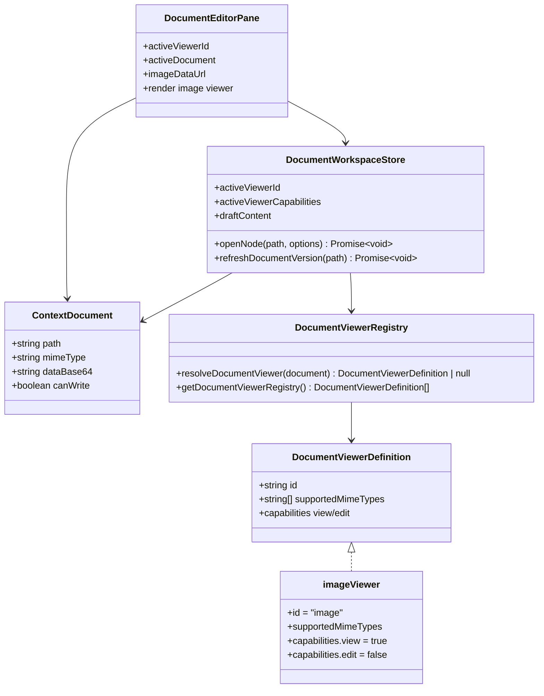

## Context

知识工作区的主面板已经通过 `DocumentViewer` registry 按 `ContextDocument.mimeType` 选择 viewer。当前 registry 包含可编辑文本 viewer 和只读 PDF viewer；`DocumentEditorPane.vue` 根据 `activeViewerId` 分支渲染文本编辑器、PDF iframe 或不支持状态。

底层文件读取契约无需扩展：`ContextDocument` 已包含 `path`、`mimeType`、`dataBase64` 与可选 `canWrite`，文件系统 provider 与 MIME 推断已覆盖 `png`、`jpg/jpeg`、`gif`、`svg`、`webp`。本次设计只补齐共享 UI 中图片 MIME 到只读 viewer 的解析与展示。

## Goals / Non-Goals

**Goals:**

- 知识工作区主面板能打开常见图片文件，并以图片原内容进行只读预览。
- 图片 viewer 复用现有 `readDocument()` 返回的 `mimeType + dataBase64`，不新增文件读取 API。
- 图片文件不参与文本编辑、自动保存、Markdown viewer/edit 切换、diff、undo/redo。
- Web、Extension、Desktop 通过共享 UI 获得一致行为。

**Non-Goals:**

- 不增加图片编辑、裁剪、旋转、缩放工具栏、下载按钮或另开标签页入口。
- 不改变 Markdown 文档中的图片内嵌渲染能力。
- 不扩展 agent 附件能力或模型 provider 的图片输入协商。
- 不调整后端 MIME 推断表之外的新图片格式。

## Decisions

### Decision 1: 新增只读 `image` viewer definition

新增文件：`packages/ui/src/document-viewers/imageViewer.ts`

新增导出：

```ts
export const imageViewer: DocumentViewerDefinition = {
  id: 'image',
  supportedMimeTypes: ['image/png', 'image/jpeg', 'image/gif', 'image/svg+xml', 'image/webp'],
  capabilities: {
    view: true,
    edit: false
  }
};
```

修改文件：`packages/ui/src/document-viewers/registry.ts`

- import `imageViewer`
- 将 `imageViewer` 加入 `DOCUMENT_VIEWERS`
- 保持现有 `resolveDocumentViewer(document: ContextDocument): DocumentViewerDefinition | null` 签名不变

理由：当前架构已经把 viewer 选择集中在 registry；图片文件只需要新增一个 viewer definition，不应在 store 或组件中按扩展名硬编码。备选方案是在 `DocumentEditorPane.vue` 中直接判断 `mimeType.startsWith('image/')`，但这会绕开 registry，使“不支持类型”与 capability 计算分裂。

### Decision 2: 在 `DocumentEditorPane.vue` 中增加图片渲染分支

修改文件：`packages/ui/src/components/DocumentEditorPane.vue`

新增 computed：

```ts
const imageDataUrl = computed(() => {
  const document = props.activeDocument;
  if (!document?.mimeType.startsWith('image/')) {
    return null;
  }

  return `data:${document.mimeType};base64,${document.dataBase64}`;
});
```

模板新增分支：

```vue
<div
  v-else-if="activeViewerId === 'image'"
  class="image-viewer-shell"
  data-testid="document-image-viewer"
>
  
</div>
```

样式新增：

- `.image-viewer-shell` 使用 flex 居中、占满主面板剩余空间、允许内容在面板内自适应。
- `.image-preview` 使用 `max-width: 100%`、`max-height: 100%`、`object-fit: contain`，避免大图撑破布局。

保留 `canSave` 现有逻辑：只有 `activeViewerId === 'text'` 才允许保存。因此图片 viewer 天然只读且不会触发写回。

### Decision 3: Store 继续完全依赖 viewer capabilities

修改文件：`packages/ui/src/store/documentWorkspace.ts`

不改变 action signature。`openNode(path: string, options?: { selectedNodePath?: string | null })` 和 `refreshDocumentVersion(path: string)` 继续通过 `resolveDocumentViewer(document)` 设置：

- `activeViewerId`
- `activeViewerCapabilities`
- `activePaneMode`
- `draftContent`

图片 viewer 的 `edit: false` 会让 `draftContent` 保持空字符串，并阻止 `updateActiveDocument()`、`flushActiveDocument()` 写入。

### Class Diagram



## Risks / Trade-offs

- [Risk] 大图片通过 data URL 可能增加渲染内存占用 → Mitigation：首版只复用现有 `readDocument()` 契约，不引入额外缓存；后续如有大文件问题再考虑 asset URL 流式展示。
- [Risk] SVG 作为 `data:image/svg+xml;base64,...` 会由浏览器渲染 → Mitigation：当前系统已经支持 Markdown 图片和 `document-asset` 的 SVG 展示，本次不扩大信任边界。
- [Risk] 某些图片 MIME 未在推断表中覆盖会继续进入 unsupported → Mitigation：本次只承诺现有已覆盖格式，避免引入未验证格式。
- [Risk] 图片只读行为可能让用户期待保存按钮可用 → Mitigation：保存按钮沿用只读 viewer 的 disabled 状态，与 PDF viewer 保持一致。
