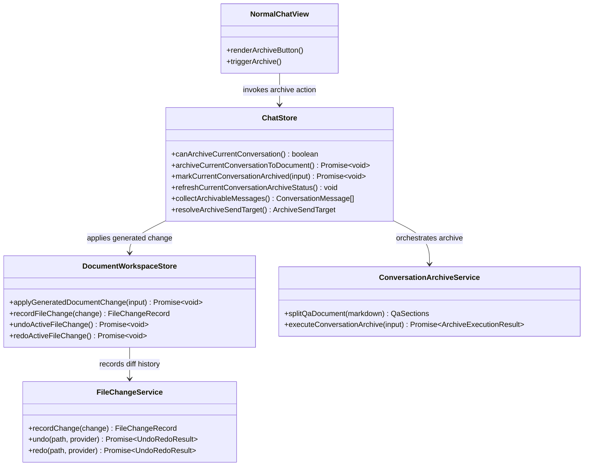

## Context

`docs/new_overall.md` already defines the product intent for archiving a conversation into a single Markdown Q/A document. The active codebase already has the primitives needed to implement this safely:

- `packages/ui/src/store/chat.ts` owns the current visible conversation, current workspace mode, model selection, and active workspace context.
- `packages/ui/src/store/documentWorkspace.ts` owns the active document, writable draft content, and the `FileChangeService` pipeline that powers diff, undo, and redo.
- `packages/ui/src/views/NormalChatView.vue` is the user-facing chat action surface in both normal and agent chat modes.

The change is cross-cutting because it touches chat orchestration, document persistence, UI visibility rules, and capability-level behavior. The implementation must also keep the archive action constrained to agent mode and to the currently selected Markdown document.

## Goals / Non-Goals

**Goals:**
- Let users archive the current agent conversation directly into the currently selected writable Markdown document.
- Split the active document into `Q` and `A` using the first Markdown standard divider, inserting `---` when missing.
- Route archive writes through the existing file change history so diff, undo, and redo work without a second versioning mechanism.
- Keep the archive action hidden or rejected outside agent mode or when the selected node is not the active Markdown document.
- Reuse the current effective provider/model selection so archive generation follows the active agent conversation context.
- Persist archive status on the local conversation so reloads and conversation switches preserve whether the current conversation is archived.
- Show a stable archive status in the chat workspace so users can distinguish archived, stale, and never-archived conversations.

**Non-Goals:**
- No archive preview or confirmation step.
- No archive support for normal chat mode, compare mode, external preview mode, or non-Markdown documents.
- No new server API, sync protocol, or separate archive-specific version browser.
- No cross-document archive target selection or partial-conversation archive selection.
- No per-message archive markers or cross-conversation archive dashboard in this change.

## Decisions

### 1. Archive orchestration lives in a new UI service and is triggered by `chat.ts`

We will add `/Users/quanzhou/Workspace/JARVIS/packages/ui/src/services/conversationArchive.ts` to keep Q/A parsing and archive prompt construction out of the stores.

Files to add/change:
- `/Users/quanzhou/Workspace/JARVIS/packages/ui/src/services/conversationArchive.ts`
- `/Users/quanzhou/Workspace/JARVIS/packages/ui/src/store/chat.ts`

Function and method signatures:
- `export type ArchiveExecutionResult = { originalQ: string; originalA: string; nextQ: string; nextA: string; nextDocument: string; changed: boolean; insertedDivider: boolean }`
- `export function splitQaDocument(markdown: string): { q: string; a: string; divider: string; inserted: boolean }`
- `export async function executeConversationArchive(input: ArchiveConversationInput): Promise<ArchiveExecutionResult>`
- `async archiveCurrentConversationToDocument(): Promise<void>`
- `canArchiveCurrentConversation(): boolean`

Change description:
- `chat.ts` remains the entry point because it owns conversation messages, workspace mode, active workspace document metadata, and effective model selection.
- The new service owns deterministic parsing and merge result synthesis so the stores do not carry markdown archive rules.
- User messages and assistant messages are separated from `chatStore.visibleMessages`, which already excludes soft-deleted items.

Alternative considered:
- Put all parsing and merge logic directly into `chat.ts`.
- Rejected because it would make the store harder to test and would couple markdown rules to UI state management.

### 2. Archive eligibility is a strict runtime guard, not a best-effort action

Files to add/change:
- `/Users/quanzhou/Workspace/JARVIS/packages/ui/src/store/chat.ts`
- `/Users/quanzhou/Workspace/JARVIS/packages/ui/src/views/NormalChatView.vue`

Function and method signatures:
- `canArchiveCurrentConversation(): boolean`

Change description:
- The archive button is rendered only when all of the following are true:
  - `chatStore.workspaceMode === 'agent'`
  - there is a current local conversation
  - there is an active workspace document
  - the selected node path matches the active document path
  - the active document MIME type is `text/markdown`
  - the active document is writable
- `archiveCurrentConversationToDocument()` repeats the same checks before doing any work so UI visibility is not the only protection.

Alternative considered:
- Show the action broadly and disable it with tooltip explanations.
- Rejected because the product requirement is narrower: archive is only meaningful for the agent-bound current Markdown document, and hiding invalid entry points keeps the workflow clear.

### 3. Archive writes must go through `documentWorkspace.ts` and `FileChangeService`

Files to add/change:
- `/Users/quanzhou/Workspace/JARVIS/packages/ui/src/store/documentWorkspace.ts`
- `/Users/quanzhou/Workspace/JARVIS/packages/ui/src/store/chat.ts`

Function and method signatures:
- `async applyGeneratedDocumentChange(input: { path: string; beforeContent: string; afterContent: string }): Promise<void>`

Change description:
- `chat.ts` must not call `contextProvider.writeDocument()` directly for archive writes.
- Instead it hands the before/after content to `documentWorkspace.ts`, which reuses `recordFileChange(...)` so the archive becomes a normal workspace file change.
- This keeps `latestFileChange`, line diff rendering, `undoActiveFileChange()`, and `redoActiveFileChange()` working with no archive-specific side channel.

Alternative considered:
- Directly overwrite the document from `chat.ts` and then manually refresh the document version.
- Rejected because it would bypass the existing diff and undo/redo history, which is a core requirement of this change.

### 4. Q/A boundary recognition is deterministic and intentionally narrow

Files to add/change:
- `/Users/quanzhou/Workspace/JARVIS/packages/ui/src/services/conversationArchive.ts`

Change description:
- The service recognizes only the first Markdown standard horizontal divider as the top-level `Q/A` separator.
- `***` is explicitly ignored because the product requirement says the archive separator should be a standard Markdown divider and not `***`.
- If no valid divider exists, the service appends `---` at the end of the document before building the merged result.

Alternative considered:
- Support multiple divider syntaxes and infer the best one.
- Rejected because it increases ambiguity and makes archive behavior harder to predict.

### 5. The model output is constrained to structured `Q/A`, not free-form markdown rewriting

Files to add/change:
- `/Users/quanzhou/Workspace/JARVIS/packages/ui/src/services/conversationArchive.ts`
- `/Users/quanzhou/Workspace/JARVIS/packages/ui/src/store/chat.ts`

Change description:
- The archive generation prompt asks the effective provider/model to return a structured result containing `q` and `a`.
- The service then reconstructs the final markdown as `Q block + --- + A block`.
- This keeps the model focused on rewriting and deduplicating the two sections instead of reformatting the entire document unpredictably.

Alternative considered:
- Ask the model to emit the full next markdown document.
- Rejected because it gives up control over the top-level divider rule and makes no-change detection less reliable.

### 6. User feedback stays lightweight and non-blocking

Files to add/change:
- `/Users/quanzhou/Workspace/JARVIS/packages/ui/src/views/NormalChatView.vue`
- `/Users/quanzhou/Workspace/JARVIS/packages/ui/src/i18n/messages/en.ts`
- `/Users/quanzhou/Workspace/JARVIS/packages/ui/src/i18n/messages/zh-CN.ts`

Change description:
- The chat view adds a single archive action in the secondary action area.
- While running, the action is disabled to prevent duplicate execution.
- Completion feedback uses lightweight status messaging:
  - archive succeeded
  - no new content
  - archive failed
  - divider was inserted automatically
- Users who want to inspect the result use the existing workspace diff panel, not a dedicated archive preview dialog.

Alternative considered:
- Introduce an archive preview modal or side panel.
- Rejected because the new product constraint explicitly removes confirmation and expects users to rely on later diff inspection and undo.

### 7. Archive status is persisted on the conversation, not derived only from transient UI state

Files to add/change:
- `/Users/quanzhou/Workspace/JARVIS/packages/core/src/interfaces/Conversation.ts`
- `/Users/quanzhou/Workspace/JARVIS/packages/ui/src/store/chat.ts`
- `/Users/quanzhou/Workspace/JARVIS/packages/ui/src/views/NormalChatView.vue`

Function and method signatures:
- `type ConversationArchiveStatus = { state: 'idle' | 'archived' | 'stale'; archivedAt?: number; documentPath?: string; sourceMessageCount?: number }`
- `markCurrentConversationArchived(input: { documentPath: string; sourceMessageCount: number; archivedAt: number }): Promise<void>`
- `refreshCurrentConversationArchiveStatus(): void`

Change description:
- A successful archive updates the current local conversation with persisted archive metadata so the state survives reload and conversation re-selection.
- The persisted state is `archived` immediately after a successful archive.
- When the current conversation later gains additional visible messages after the archived snapshot, the state becomes `stale`.
- Conversations with no archive metadata remain `idle`.
- The state is stored on the conversation object because that is the existing persistence unit already used by the local storage flow.

Alternative considered:
- Derive archive status only from in-memory flags in `chatStore`.
- Rejected because the user explicitly needs persistence, and in-memory state would be lost on refresh or workspace switches.

### 8. The chat UI shows persisted archive state near the archive action

Files to add/change:
- `/Users/quanzhou/Workspace/JARVIS/packages/ui/src/views/NormalChatView.vue`
- `/Users/quanzhou/Workspace/JARVIS/packages/ui/src/i18n/messages/en.ts`
- `/Users/quanzhou/Workspace/JARVIS/packages/ui/src/i18n/messages/zh-CN.ts`

Change description:
- `NormalChatView` shows a compact archive status label whenever the archive action is relevant to the current agent conversation.
- The label reflects the persisted state:
  - `idle`: not archived yet
  - `archived`: archived and up to date
  - `stale`: archived before, but new conversation turns have appeared since the last archive
- Lightweight completion feedback still exists, but the persisted status becomes the durable UI signal after reload.

Alternative considered:
- Show archive status only inside a toast or inline ephemeral message.
- Rejected because ephemeral feedback disappears and cannot satisfy the requirement to display persisted archive state.

### Mermaid class diagram

Responsibility split:
- `NormalChatView` only exposes the action and status feedback.
- `ChatStore` validates context, resolves model selection, orchestrates archive execution, and persists archive state on the conversation.
- `ConversationArchiveService` owns deterministic Q/A parsing and model-facing merge instructions.
- `DocumentWorkspaceStore` owns document write integration with diff and undo/redo history.
- `FileChangeService` remains the single source of truth for reversible document changes.

## Risks / Trade-offs

- [Risk] Model output may still introduce section phrasing that is valid but surprising. → Mitigation: constrain output to structured `q` and `a`, keep writes undoable, and reuse existing diff inspection.
- [Risk] Divider parsing could behave unexpectedly on unusual markdown content. → Mitigation: keep the parser narrow, use only the first standard divider, and normalize missing divider insertion to `---`.
- [Risk] Archive may be triggered while the draft document has unsaved local edits. → Mitigation: route the write through `documentWorkspace.ts`, which already owns active document content and file-change application semantics.
- [Risk] Button visibility and store guards may drift apart. → Mitigation: centralize eligibility in `canArchiveCurrentConversation()` and reuse it from the view and the action handler.
- [Risk] Persisted archive status may drift from the visible message list after later turns. → Mitigation: store the visible-message count used for the successful archive and recompute `stale` whenever the current conversation changes.

## Migration Plan

This is a UI-only additive feature with no server or storage schema migration.

1. Add the archive service and store methods.
2. Persist archive metadata on the conversation model and storage flow.
3. Expose the archive action and archive status in the agent-mode normal chat view.
4. Add delta specs and automated tests.
5. Rollback strategy: remove the archive status field handling and archive UI entry points; stored metadata is additive and can be safely ignored by older clients.

## Open Questions

- Whether archive success feedback should be a transient inline message in `NormalChatView` or reuse a workspace-level notification helper if one is introduced later.
- Whether future iterations should offer an archive-specific compare surface beyond the existing document diff view.
- Whether a future iteration should persist a document content hash instead of message count to detect stale archive state more precisely across conversation edits.
