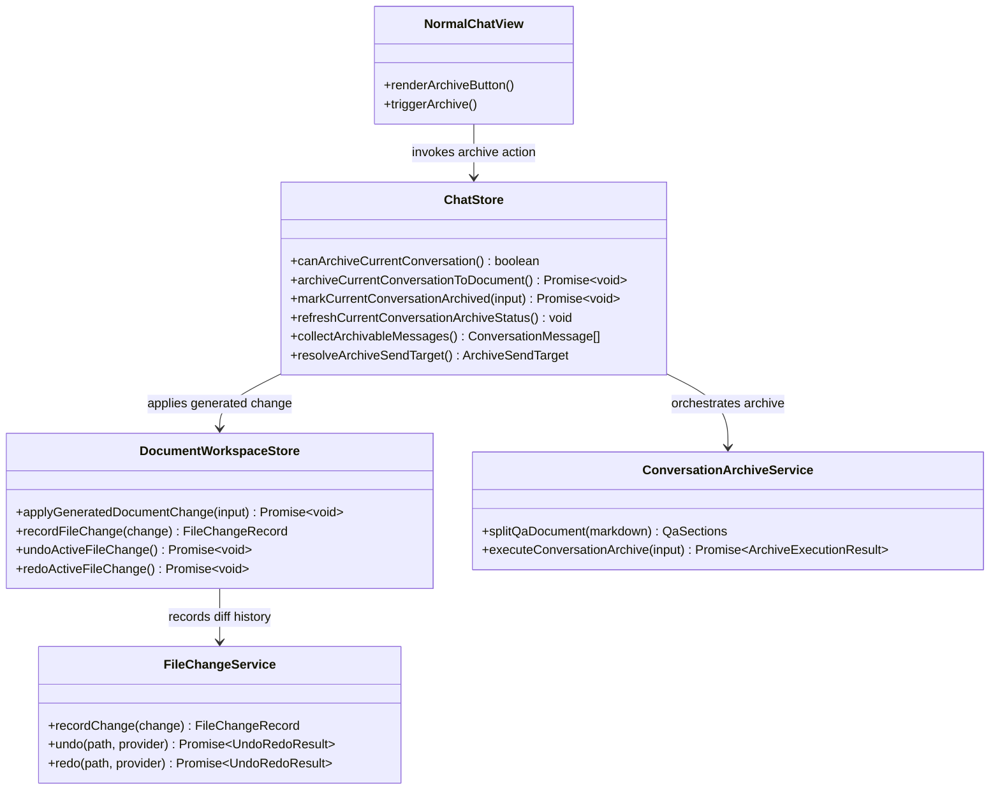

## Context

`docs/new_overall.md` 已经定义了“将对话归档到单个 Markdown Q/A 文档”的产品意图。当前代码库也已经具备实现该能力所需的关键基础设施：

- `packages/ui/src/store/chat.ts` 持有当前可见对话、工作区模式、模型选择和活动工作区上下文。
- `packages/ui/src/store/documentWorkspace.ts` 持有当前活动文档、可写草稿内容，以及支撑 diff、undo、redo 的 `FileChangeService` 链路。
- `packages/ui/src/views/NormalChatView.vue` 是普通聊天与 agent 聊天模式下的用户动作入口。

这个改动是一个跨模块变更，因为它同时涉及聊天编排、文档写回、UI 可见性规则和 capability 级行为约束。实现上还必须严格限制归档只在 agent 模式下、且仅作用于当前选中的 Markdown 文档。

## Goals / Non-Goals

**Goals:**
- 允许用户把当前 agent 对话直接归档到当前选中的可写 Markdown 文档。
- 按首个 Markdown 标准分割线将文档拆成 `Q` / `A`；缺失时自动补 `---`。
- 归档写回必须进入现有文件变更历史，以继续支持 diff、undo、redo。
- 在非 agent 模式或当前选中节点不是活动 Markdown 文档时，归档动作必须隐藏或拒绝执行。
- 复用当前有效 provider/model 选择，使归档整理与当前 agent 会话上下文保持一致。
- 在本地对话上持久化归档状态，使重载页面或切换会话后仍能保留当前对话是否已归档。
- 在聊天工作区中稳定显示归档状态，让用户区分已归档、过期和从未归档三种情况。

**Non-Goals:**
- 不提供归档预览或确认步骤。
- 不支持普通聊天模式、compare 模式、外部预览模式或非 Markdown 文档归档。
- 不新增服务端 API、同步协议或独立的归档版本浏览器。
- 不支持跨文档归档目标选择，也不支持仅归档部分会话。
- 不在本次变更中提供逐消息归档标记或跨会话归档总览面板。

## Decisions

### 1. 归档编排放在新的 UI service 中，由 `chat.ts` 触发

我们将新增 `/Users/quanzhou/Workspace/JARVIS/packages/ui/src/services/conversationArchive.ts`，把 Q/A 解析和归档 prompt 构造从 store 中拆出去。

需要新增或修改的文件：
- `/Users/quanzhou/Workspace/JARVIS/packages/ui/src/services/conversationArchive.ts`
- `/Users/quanzhou/Workspace/JARVIS/packages/ui/src/store/chat.ts`

函数和方法签名：
- `export type ArchiveExecutionResult = { originalQ: string; originalA: string; nextQ: string; nextA: string; nextDocument: string; changed: boolean; insertedDivider: boolean }`
- `export function splitQaDocument(markdown: string): { q: string; a: string; divider: string; inserted: boolean }`
- `export async function executeConversationArchive(input: ArchiveConversationInput): Promise<ArchiveExecutionResult>`
- `async archiveCurrentConversationToDocument(): Promise<void>`
- `canArchiveCurrentConversation(): boolean`

变更说明：
- `chat.ts` 继续作为入口，因为它持有对话消息、工作区模式、当前活动文档元信息以及有效模型选择。
- 新 service 负责确定性的 Markdown 解析与归档结果合成，避免 store 混入过多文档规则。
- 用户消息和助手消息都从 `chatStore.visibleMessages` 提取，该集合已经排除了软删除消息。

备选方案：
- 把所有解析和归并逻辑直接写进 `chat.ts`。
- 放弃原因：会让 store 更难测试，也会把 Markdown 归档规则和 UI 状态管理过度耦合。

### 2. 归档资格是严格运行时约束，而不是 best-effort 行为

需要新增或修改的文件：
- `/Users/quanzhou/Workspace/JARVIS/packages/ui/src/store/chat.ts`
- `/Users/quanzhou/Workspace/JARVIS/packages/ui/src/views/NormalChatView.vue`

函数和方法签名：
- `canArchiveCurrentConversation(): boolean`

变更说明：
- 只有以下条件全部满足时才渲染归档按钮：
  - `chatStore.workspaceMode === 'agent'`
  - 当前存在本地会话
  - 当前存在活动工作区文档
  - 当前选中节点路径与活动文档路径一致
  - 当前文档 MIME 类型是 `text/markdown`
  - 当前文档可写
- `archiveCurrentConversationToDocument()` 在执行前会重复校验同样条件，确保 UI 可见性不是唯一保护。

备选方案：
- 广泛显示按钮，再通过禁用态和 tooltip 解释原因。
- 放弃原因：产品要求很明确，归档只服务于 agent 绑定的当前 Markdown 文档，隐藏无效入口更清晰。

### 3. 归档写回必须经过 `documentWorkspace.ts` 和 `FileChangeService`

需要新增或修改的文件：
- `/Users/quanzhou/Workspace/JARVIS/packages/ui/src/store/documentWorkspace.ts`
- `/Users/quanzhou/Workspace/JARVIS/packages/ui/src/store/chat.ts`

函数和方法签名：
- `async applyGeneratedDocumentChange(input: { path: string; beforeContent: string; afterContent: string }): Promise<void>`

变更说明：
- `chat.ts` 不能直接调用 `contextProvider.writeDocument()` 完成归档写回。
- 它只负责把归档前后内容交给 `documentWorkspace.ts`，由后者复用 `recordFileChange(...)`，让本次归档成为一条标准的工作区文件变更。
- 这样 `latestFileChange`、line diff、`undoActiveFileChange()` 和 `redoActiveFileChange()` 都不需要新增归档专用分支。

备选方案：
- 直接从 `chat.ts` 覆盖文档内容，再手动刷新文档版本。
- 放弃原因：会绕过现有 diff 和 undo/redo 历史，不满足本次变更的核心要求。

### 4. Q/A 边界识别采用确定性且收敛的规则

需要新增或修改的文件：
- `/Users/quanzhou/Workspace/JARVIS/packages/ui/src/services/conversationArchive.ts`

变更说明：
- 只识别首个 Markdown 标准水平分割线作为顶层 `Q/A` 分隔。
- 如果文档中不存在合法分割线，则先在文档末尾补 `---`，再继续归档。

备选方案：
- 同时支持多种分割线写法并自动推断最佳边界。
- 放弃原因：会提高行为歧义，导致归档结果更难预测。

### 5. 模型输出限定为结构化 `Q/A`，而不是自由重写整份文档

需要新增或修改的文件：
- `/Users/quanzhou/Workspace/JARVIS/packages/ui/src/services/conversationArchive.ts`
- `/Users/quanzhou/Workspace/JARVIS/packages/ui/src/store/chat.ts`

变更说明：
- 归档生成 prompt 要求当前有效 provider/model 返回结构化结果，例如 `q` 和 `a` 两个字段。
- service 再基于这个结果重建最终 Markdown：`Q block + --- + A block`。
- 这样可以让模型专注于 `Q/A` 两段的整理，而不是不可控地重排整篇文档。

备选方案：
- 直接让模型输出完整的新文档。
- 放弃原因：会失去对顶层分割线规则的控制，也会让“无新增内容”判定更不稳定。

### 6. 用户反馈保持轻量且不阻塞

需要新增或修改的文件：
- `/Users/quanzhou/Workspace/JARVIS/packages/ui/src/views/NormalChatView.vue`
- `/Users/quanzhou/Workspace/JARVIS/packages/ui/src/i18n/messages/en.ts`
- `/Users/quanzhou/Workspace/JARVIS/packages/ui/src/i18n/messages/zh-CN.ts`

变更说明：
- 聊天视图在次级操作区增加一个归档动作。
- 执行过程中按钮禁用，避免重复提交。
- 完成后使用轻量状态反馈：
  - 归档成功
  - 无新增内容
  - 归档失败
  - 已自动补齐分割线
- 如果用户想核对结果，直接使用现有文档 diff，而不是额外引入归档预览弹层。

备选方案：
- 引入归档预览弹窗或专用侧栏。
- 放弃原因：新的产品约束已经明确去掉确认步骤，并希望用户依赖后续 diff 查看与 undo 撤销。

### 7. 归档状态持久化在对话对象上，而不是仅依赖瞬时 UI 状态

需要新增或修改的文件：
- `/Users/quanzhou/Workspace/JARVIS/packages/core/src/interfaces/Conversation.ts`
- `/Users/quanzhou/Workspace/JARVIS/packages/ui/src/store/chat.ts`
- `/Users/quanzhou/Workspace/JARVIS/packages/ui/src/views/NormalChatView.vue`

函数和方法签名：
- `type ConversationArchiveStatus = { state: 'idle' | 'archived' | 'stale'; archivedAt?: number; documentPath?: string; sourceMessageCount?: number }`
- `markCurrentConversationArchived(input: { documentPath: string; sourceMessageCount: number; archivedAt: number }): Promise<void>`
- `refreshCurrentConversationArchiveStatus(): void`

变更说明：
- 一次成功的归档会把归档元数据持久化到当前本地对话上，使状态在页面重载或重新选择会话后仍能保留。
- 归档刚完成时，持久化状态为 `archived`。
- 当该对话在归档快照之后又出现新的可见消息时，状态变为 `stale`。
- 没有归档元数据的对话维持为 `idle`。
- 之所以把状态落在对话对象上，是因为这就是当前本地存储流程已经使用的持久化单元。

备选方案：
- 仅在 `chatStore` 中用内存状态推导归档状态。
- 放弃原因：用户明确要求状态持久化，纯内存状态会在刷新或工作区切换后丢失。

### 8. 聊天 UI 在归档动作附近展示持久化归档状态

需要新增或修改的文件：
- `/Users/quanzhou/Workspace/JARVIS/packages/ui/src/views/NormalChatView.vue`
- `/Users/quanzhou/Workspace/JARVIS/packages/ui/src/i18n/messages/en.ts`
- `/Users/quanzhou/Workspace/JARVIS/packages/ui/src/i18n/messages/zh-CN.ts`

变更说明：
- 只要当前 agent 对话处于可归档上下文，`NormalChatView` 就展示一个紧凑的归档状态标签。
- 该标签反映持久化状态：
  - `idle`：尚未归档
  - `archived`：已归档且与当前会话保持一致
  - `stale`：曾经归档，但之后又新增了对话轮次
- 原有的轻量反馈仍然保留，但重载之后真正长期可见的信号是这个持久化状态。

备选方案：
- 仅通过 toast 或临时内联提示展示归档状态。
- 放弃原因：临时反馈会消失，不能满足“展示持久化归档状态”的需求。

### Mermaid class diagram

职责划分：
- `NormalChatView` 只暴露动作入口和状态反馈。
- `ChatStore` 负责上下文校验、模型选择解析、归档编排，并在对话上持久化归档状态。
- `ConversationArchiveService` 负责确定性的 Q/A 解析和模型侧归并指令。
- `DocumentWorkspaceStore` 负责将归档结果接入文档写回与 diff/undo/redo 历史。
- `FileChangeService` 继续作为可撤销文档变更的唯一事实来源。

## Risks / Trade-offs

- [Risk] 模型输出仍可能在语义上正确但措辞不符合用户预期。 → Mitigation：限制输出为结构化 `q` / `a`，并保证结果可撤销、可查看 diff。
- [Risk] 特殊 Markdown 内容可能让分割线识别出现边界情况。 → Mitigation：保持解析规则收敛，只识别首个标准分割线，并统一在缺失时补 `---`。
- [Risk] 归档时当前文档可能仍存在未持久化的本地编辑。 → Mitigation：写回统一经过 `documentWorkspace.ts`，复用其对当前活动文档内容和文件变更的管理语义。
- [Risk] 按钮显示条件和 store 校验条件可能发生漂移。 → Mitigation：将资格判断集中到 `canArchiveCurrentConversation()`，视图和动作处理都复用它。
- [Risk] 持久化归档状态可能在后续新增消息后与当前可见消息列表脱节。 → Mitigation：记录成功归档时的可见消息数量，并在当前会话变化时重新计算 `stale`。

## Migration Plan

这是一个纯前端增量能力，不涉及服务端或同步协议迁移。

1. 新增归档 service 和 store 方法。
2. 在对话模型与本地存储流程中增加归档元数据持久化。
3. 在 agent 模式下的普通聊天视图暴露归档动作和归档状态。
4. 补齐 delta specs 和自动化测试。
5. 回滚策略：移除归档状态字段处理与归档 UI 入口即可；已存元数据为向后兼容的附加字段，旧客户端可安全忽略。

## Open Questions

- 归档成功后的反馈最终应保留为 `NormalChatView` 内联提示，还是后续统一接入全局 workspace 级通知机制。
- 后续版本是否需要在现有文档 diff 之外，再提供一个专门的归档结果 compare 视图。
- 后续版本是否需要用文档内容哈希而不是消息数量来更精确地检测归档状态是否过期。
