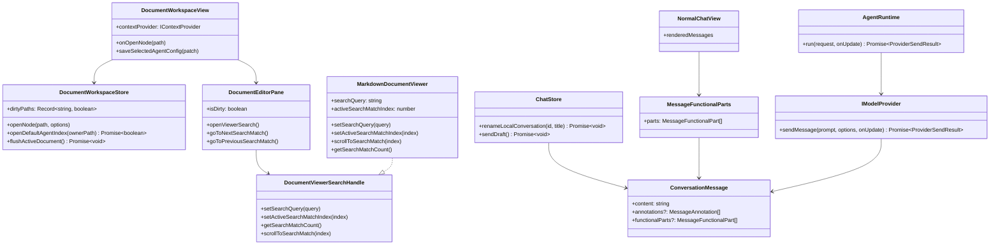

## Context

The requested change is a collection of shared workspace improvements across chat, document viewing, persistence feedback, provider metadata, and Agent folder navigation. The current architecture already routes Web, Extension, and Desktop hosts through shared UI packages and shared core contracts, so the implementation should live in `packages/ui` and `packages/core` rather than in host-specific entrypoints.

Relevant current state:
- `DocumentWorkspaceView` owns the three-pane knowledge workspace and passes active document state into `DocumentEditorPane`.
- `DocumentEditorPane` resolves document viewers and already hosts the save button, Markdown mode switch, and file-change controls.
- `MarkdownDocumentViewer` owns the Milkdown/Crepe document DOM for Markdown viewing and editing.
- `ConversationSidebar` renders local history rows and emits local star/delete/binding events.
- `NormalChatView` renders normal chat, Agent-pane chat, and previewed conversations through a single shared surface.
- `chatStore.sendDraft()` already contains the first-turn auto-attachment path for the active document, but it does not parse explicit file references from chat input.
- `ConversationMessage` supports text, attachments, request snapshots, and annotations, but not shared functional detail blocks.
- `AgentRuntime` currently renders Agent tool loop traces into assistant text, which makes details noisy and hard to collapse.
- Server-backed workspace calls are split across `FetchSyncTransport`, `HttpContextProvider`, and `GeminiHistoryConfigLoader`, each with its own fetch/error behavior.
- The current global unhandled-error fallback only catches leaked promise/window errors and is not a reliable primary mechanism for user-triggered server request failures.

## Goals / Non-Goals

**Goals:**
- Provide current-document Markdown keyword search with `Ctrl+F` / `Cmd+F`, visible match state, and navigation, behind a viewer-level search interface that future viewers can implement.
- Allow local conversation title editing from the shared history sidebar.
- Reflect document dirty/saving state through the save button visual treatment.
- Represent function/tool/search/trace details as shared structured message parts and render them collapsed in all chat surfaces using `NormalChatView`.
- Support explicit `@filename` references in chat input so workspace text files are appended as standalone filename-labeled prompt sections while leaving the original `@filename` text in the user's question.
- Show an existing `index.md` when selecting an Agent owner directory without losing the active Agent context.
- Normalize server-side HTTP failures behind one shared request layer so sync/context/provider-config calls expose the same error contract to stores and UI.
- Keep all new user-facing copy localized.

**Non-Goals:**
- No cross-file or workspace-wide search.
- No automatic creation of `index.md`.
- No external-history title mutation.
- No migration that rewrites old conversations.
- No `@` mention autocomplete popover or dropdown completion.
- No replacement of the main Markdown document viewer or chat Markdown renderer.

## Decisions

### 1. Define a viewer search interface and implement it only for Markdown now

Files to change:
- `packages/ui/src/document-viewers/types.ts`
- `packages/ui/src/document-viewers/registry.ts`
- `packages/ui/src/components/DocumentEditorPane.vue`
- `packages/ui/src/document-viewers/MarkdownDocumentViewer.vue`
- `packages/ui/src/utils/markdownSearch.ts`
- `packages/ui/src/views/DocumentWorkspaceView.vue`

Signatures:
```ts
export interface MarkdownSearchMatch {
  index: number;
  start: number;
  end: number;
  text: string;
}

export function normalizeSearchQuery(query: string): string;
export function findMarkdownSearchMatches(content: string, query: string): MarkdownSearchMatch[];

export interface DocumentViewerSearchHandle {
  setSearchQuery(query: string): void;
  setActiveSearchMatchIndex(index: number): void;
  getSearchMatchCount(): number;
  scrollToSearchMatch(index: number): void;
}

defineExpose<{
  setSearchQuery(query: string): void;
  setActiveSearchMatchIndex(index: number): void;
  getSearchMatchCount(): number;
  scrollToSearchMatch(index: number): void;
}>();
```

Decision: `DocumentEditorPane` owns the search box and keyboard shortcut, but interacts with the active viewer through a generic `DocumentViewerSearchHandle`. `MarkdownDocumentViewer` is the only viewer that implements this handle in this change; PDF, image, and unsupported viewers remain non-searchable and can implement the same handle later. This keeps the toolbar independent from Markdown-specific DOM details while avoiding speculative search behavior for other viewers.

Alternative considered: implement search directly as Markdown-only props on `MarkdownDocumentViewer`. Rejected because it would make future PDF/image/text viewer search require reshaping the document pane API.

### 2. Rename local conversations through chat store persistence

Files to change:
- `packages/ui/src/store/chat.ts`
- `packages/ui/src/components/ConversationSidebar.vue`
- `packages/ui/src/views/ConversationWorkspaceView.vue`

Signature:
```ts
async renameLocalConversation(id: string, title: string): Promise<void>;
```

Decision: keep rename as a local-history action emitted from the sidebar and persisted by `chatStore`, matching existing star/delete ownership. Empty titles normalize to `New Chat`.

Alternative considered: edit `ConversationSidebar` item state only and rely on later persistence. Rejected because title changes must survive reload and sync storage refresh.

### 2A. Edit and resend a prior human message from the transcript

Files to change:
- `packages/ui/src/store/chat.ts`
- `packages/ui/src/views/NormalChatView.vue`
- `packages/ui/src/i18n/messages/en.ts`
- `packages/ui/src/i18n/messages/zh-CN.ts`

Signatures:
```ts
startQuestionEdit(questionId: string): void;
cancelQuestionEdit(): void;
truncateConversationFromQuestion(questionId: string): void;
```

Decision: the edit entry point lives on each human/user message bubble inside `NormalChatView`, not in the question index sidebar. Clicking edit copies that question text into the bottom composer, focuses the textarea, and records an `editingQuestionId` in `chatStore`. No historical message is deleted at edit-start time.

When the user sends while `editingQuestionId` is active, `chatStore.sendDraft()` first truncates the visible conversation from the selected question onward by marking that user message, its paired assistant response, and every later message as `deleted = true`, then appends the newly edited question and the new assistant response through the existing send flow. Provider history is therefore rebuilt only from messages before the edited question, matching the user-visible conversation tail reset.

UI behavior:
- show an edit icon/button only on user messages in non-preview mode;
- show an inline composer notice while editing, warning that sending will delete later turns;
- provide a cancel action that exits edit mode without mutating conversation history.

Alternative considered: trigger edit from the question index sidebar. Rejected because the user explicitly wants the affordance on the human message itself, and the transcript location makes the consequence of “edit from here” clearer.

### 3. Save button state derives from existing dirtyPaths

Files to change:
- `packages/ui/src/components/DocumentEditorPane.vue`
- `packages/ui/src/views/DocumentWorkspaceView.vue`

Signature:
```ts
isDirty: boolean;
```

Decision: pass the active document dirty state from `documentStore.dirtyPaths` into `DocumentEditorPane`. The save button keeps current enabled behavior but changes title/class/color for clean, dirty, and saving states.

Alternative considered: compute dirty inside `DocumentEditorPane` by comparing content. Rejected because the store already owns the canonical dirty state and handles external writes, auto-save, and version metadata.

### 4. Functional message details become shared core message parts

Files to change:
- `packages/core/src/interfaces/Conversation.ts`
- `packages/core/src/interfaces/IModelProvider.ts`
- `packages/core/src/agents/runtime/createAgentRuntime.ts`
- `packages/core/src/providers/model/ChatGPTWebProvider.ts`
- `packages/core/src/providers/model/GeminiApiProvider.ts`
- `apps/desktop/src/utils/DesktopProxyProvider.ts`
- `apps/extension/src/utils/BackgroundProxyProvider.ts`
- `packages/ui/src/store/chat.ts`
- `packages/ui/src/components/MessageFunctionalParts.vue`
- `packages/ui/src/views/NormalChatView.vue`

Signatures:
```ts
export type MessageFunctionalPartKind =
  | 'tool_call'
  | 'tool_result'
  | 'function_call'
  | 'search'
  | 'trace';

export interface MessageFunctionalPart {
  id: string;
  kind: MessageFunctionalPartKind;
  title: string;
  content: string;
  collapsed?: boolean;
}

export interface ConversationMessage {
  functionalParts?: MessageFunctionalPart[];
}

export interface ProviderStreamUpdate {
  text: string;
  annotations?: MessageAnnotation[];
  toolCalls?: AgentToolCall[];
  functionalParts?: MessageFunctionalPart[];
}

export interface ProviderSendResult {
  text: string;
  conversationId: string;
  messageId: string;
  annotations?: MessageAnnotation[];
  toolCalls?: AgentToolCall[];
  modelTurn?: AgentModelTurn;
  requestSnapshot?: MessageRequestSnapshot;
  functionalParts?: MessageFunctionalPart[];
}
```

Decision: introduce functional parts at the shared `ConversationMessage` level, not as an Agent-only UI convention. Providers and runtimes can emit structured operational details when available, while old conversations remain valid with `functionalParts` absent. `NormalChatView` renders these via `MessageFunctionalParts`, so the behavior applies to normal chat, Agent pane, and preview/import flows.

Alternative considered: parse assistant markdown for `Function Call Request` sections in UI. Rejected because it is brittle, provider-specific, and would guess from rendered text instead of using structured data.

### 5. Agent folder `index.md` is a default document, not an AgentView replacement

Files to change:
- `packages/ui/src/store/documentWorkspace.ts`
- `packages/ui/src/views/DocumentWorkspaceView.vue`

Signatures:
```ts
function getDefaultAgentIndexPath(ownerPath: string): string;
function findDefaultAgentIndexNode(nodes: ContextNode[], ownerPath: string): ContextNode | null;
async openDefaultAgentIndex(ownerPath: string): Promise<boolean>;
```

Decision: when an Agent owner directory is selected, keep `selectedNodePath` at the directory for Agent resolution, but open an existing `index.md` as `activePath` and `activeDocument`. The middle pane shows the editor when `activePath` exists; otherwise it shows `AgentView`.

Alternative considered: render `index.md` inside `AgentView`. Rejected because it would duplicate document viewer, dirty state, save, search, diff, and undo behavior.

### 6. `@filename` uses standalone prompt sections and keeps the original question intact

Files to change:
- `packages/ui/src/store/chat.ts`
- `packages/ui/src/views/NormalChatView.vue`
- `packages/core/src/agents/augmentPromptWithAgentContext.ts`

Signatures:
```ts
function extractMentionedFileRefs(prompt: string): string[];
async function resolveMentionedContextDocuments(
  prompt: string
): Promise<Array<{ path: string; name: string; document: ContextDocument }>>;
function buildMentionedFilesPromptSections(
  files: Array<{ path: string; name: string; document: ContextDocument }>
): string;
function augmentPromptWithMentionedFiles(
  prompt: string,
  files: Array<{ path: string; name: string; content: string }>
): string;
```

Decision: keep the existing first-turn current-document behavior as-is and do not redefine that flow in this change. The new behavior only parses `@filename` references on every send, resolves them against the effective Agent context for that conversation, and appends safely readable text documents as standalone prompt sections. If the conversation is bound to an Agent, resolution uses that Agent scope; otherwise it uses the default active Agent scope rather than the entire workspace tree. The original user question remains unchanged, including the `@filename` markers, so the user can still distinguish cited files directly in the question body.

Section format is fixed and explicit, for example:
```text
[Referenced file: guide.md]
<file contents>

[Referenced file: api.md]
<file contents>
```

Matching rules:
- prefer exact basename matches;
- allow unique path-suffix matches when basename alone is ambiguous;
- block send with a clear error on missing or ambiguous matches;
- deduplicate repeated references to the same resolved path;
- only text-like documents may be injected as prompt sections.

Alternative considered: remove `@filename` tokens from the user's question and rely only on hidden context injection. Rejected because users often need the filename to stay visible in the question to distinguish multiple cited sources.

### 7. Server-backed HTTP failures use one shared request client and one typed error contract

Files to change:
- `packages/core/src/interfaces/HttpApiError.ts`
- `packages/core/src/providers/http/HttpApiClient.ts`
- `packages/core/src/providers/sync/FetchSyncTransport.ts`
- `packages/core/src/providers/context/HttpContextProvider.ts`
- `packages/core/src/providers/history/gemini/GeminiHistoryConfigLoader.ts`
- `packages/ui/src/utils/formatHttpApiError.ts`
- `packages/ui/src/store/chat.ts`
- `packages/ui/src/store/documentWorkspace.ts`
- `apps/server/src/routes/sync.ts`
- `apps/server/src/routes/context.ts`
- `apps/server/src/routes/providerConfigs.ts`

Signatures:
```ts
export type HttpApiErrorSource =
  | 'sync'
  | 'context'
  | 'provider-config'
  | 'unknown';

export class HttpApiError extends Error {
  status: number | null;
  code?: string;
  source: HttpApiErrorSource;
  endpoint?: string;
  isNetworkError: boolean;
  isAbortError: boolean;
  details?: unknown;
}

export interface HttpApiClientOptions {
  baseUrl?: string;
  fetchImpl?: typeof fetch;
  headers?: Record<string, string>;
  source?: HttpApiErrorSource;
}

export class HttpApiClient {
  async getJson<T>(path: string, init?: RequestInit): Promise<T>;
  async postJson<T>(path: string, body: unknown, init?: RequestInit): Promise<T>;
}

export function formatHttpApiError(error: unknown): string;
```

Decision: all ChatPrism-hosted HTTP endpoints must be normalized through a shared `HttpApiClient`, rather than relying on ad hoc `fetch()` calls plus the window-level unhandled-error fallback. The client is responsible for:
- issuing GET/POST requests with host-specific base URLs and headers;
- parsing non-2xx payloads into a typed `HttpApiError`, preserving `status`, `source`, `endpoint`, and server-returned `error` / `code`;
- classifying network aborts, transport failures, and malformed JSON into the same error family;
- returning typed JSON on success so higher layers do not duplicate status checking.

`FetchSyncTransport`, `HttpContextProvider`, and `GeminiHistoryConfigLoader` become thin wrappers around this client. `GeminiHistoryConfigLoader` still keeps its current remote -> cache -> builtin fallback order, but the remote failure it catches must now be a normalized `HttpApiError`.

UI/store handling remains layered:
- request/client layer standardizes all server failures into `HttpApiError`;
- store actions explicitly catch request failures for user-triggered flows and write a formatted message into `currentError`;
- the global `window.error` / `unhandledrejection` fallback stays in place only for leaked or unowned failures, not as the primary server-error surface.

Server routes should continue returning JSON, but should converge on an error shape that can be parsed consistently by the client, for example:
```json
{
  "error": "syncKey must not be empty.",
  "code": "SYNC_KEY_INVALID"
}
```

Alternative considered: keep existing endpoint-specific fetch helpers and depend on the global unhandled-error fallback to surface missed failures. Rejected because framework event handlers and caught async branches do not reliably become global unhandled rejections, which leaves user-triggered server failures silent and inconsistent.

### Class diagram



## Risks / Trade-offs

- [Risk] DOM-based Markdown search highlighting can conflict with Milkdown reconciliation. → Mitigation: apply highlights after viewer render, clear wrappers before reapplying, and never mutate markdown model content.
- [Risk] Provider metadata shapes vary and may not always expose reliable function/search details. → Mitigation: emit `functionalParts` only when structured data is confidently available; otherwise preserve current text rendering.
- [Risk] Keeping Agent tool traces in text plus `functionalParts` may duplicate content during transition. → Mitigation: preserve text compatibility initially; implementation can later remove generated trace text only after tests cover historical behavior.
- [Risk] Agent owner directory selection with `index.md` changes the main pane from AgentView to editor. → Mitigation: preserve `selectedNodePath` for Agent context and show AgentView only when no default document is opened.
- [Risk] Rename interactions can accidentally select the conversation row. → Mitigation: stop propagation while editing and test Enter/Escape/blur flows.
- [Risk] `@filename` may resolve to the wrong file when multiple files share the same basename. → Mitigation: fail fast on ambiguity and require a more specific reference instead of guessing.
- [Risk] Injecting non-text files into the prompt would degrade readability and behavior. → Mitigation: only allow text-like documents into standalone prompt sections and raise a validation error for other file types.
- [Risk] Migrating server-backed calls to a shared client can accidentally erase endpoint-specific fallback behavior. → Mitigation: keep `GeminiHistoryConfigLoader` remote/cache/builtin ordering unchanged and migrate wrappers one endpoint family at a time with targeted tests.
- [Risk] Overloading global fallback and store-local messaging can duplicate the same error in UI. → Mitigation: treat store-level catches as authoritative for owned user actions and reserve global fallback for leaked failures only.

## Migration Plan

- Add optional fields to conversation/provider types; existing stored conversations remain valid because missing `functionalParts` is allowed.
- No database or storage backfill is required.
- Proxy providers should pass through `functionalParts` when present and ignore it when absent.
- Rollback removes UI rendering and provider emission while old conversations continue to load because the field is optional.
- The shared HTTP client is additive first: migrate `sync`, `context`, and `provider-config` call sites without changing endpoint URLs or response success payloads.
- Server error responses may add optional `code` fields without requiring storage or data migration.

## Open Questions

None. The plan assumes `index.md` is display-only when present and is not automatically created, and that server-backed error normalization should preserve existing endpoint fallback semantics while standardizing the error contract.
