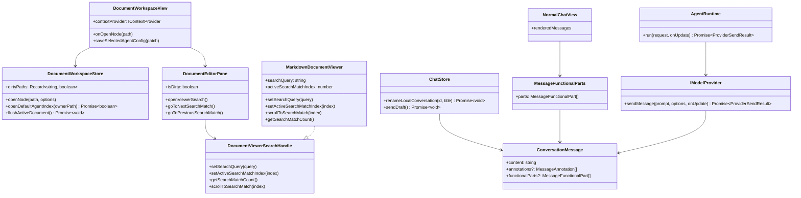

## 上下文

本次变更是一组共享工作区体验改进，横跨聊天、文档查看、保存反馈、provider 元数据和 Agent 文件夹导航。当前架构已经让 Web、Extension、Desktop host 复用 `packages/ui` 与 `packages/core`，因此实现应放在共享 UI/store 与核心契约层，而不是分散到各 host。

当前相关状态：
- `DocumentWorkspaceView` 管理知识工作区三栏，并把活动文档状态传给 `DocumentEditorPane`。
- `DocumentEditorPane` 负责解析文档 viewer，并承载保存按钮、Markdown 模式切换和文件变更控件。
- `MarkdownDocumentViewer` 负责 Markdown 查看/编辑的 Milkdown/Crepe DOM。
- `ConversationSidebar` 渲染本地历史行，并已提供 star/delete/binding 等事件。
- `NormalChatView` 同时渲染普通聊天、Agent pane 聊天和预览会话。
- `chatStore.sendDraft()` 已有“首轮自动附带当前活动文档”的链路，但不会解析输入中的显式文件引用。
- `ConversationMessage` 已支持文本、附件、请求快照和 annotations，但没有共享的功能详情块。
- `AgentRuntime` 当前会把 Agent 工具循环 trace 拼入 assistant 正文，导致详情噪音较大且无法折叠。
- 走服务端的调用目前分散在 `FetchSyncTransport`、`HttpContextProvider` 和 `GeminiHistoryConfigLoader` 中，各自维护自己的 fetch 与错误处理逻辑。
- 现有全局未处理错误兜底只覆盖泄漏到 `window` 的 promise/error，不能作为用户触发的服务端请求失败提示主路径。

## 目标 / 非目标

**目标：**
- 为当前 Markdown 文档提供 `Ctrl+F` / `Cmd+F` 搜索、命中状态和跳转，并通过 viewer 层搜索接口承载，供未来其他 viewer 实现。
- 允许在共享历史侧边栏中编辑本地会话标题。
- 通过保存按钮颜色反映文档 dirty/saving 状态。
- 把 function/tool/search/trace 详情表达为共享结构化消息块，并在所有使用 `NormalChatView` 的聊天表面默认折叠展示。
- 支持在聊天输入中通过 `@文件名` 显式引用工作区文本文件，把文件内容作为带文件名标签的独立段落拼入 prompt，同时保留用户问题中的 `@文件名` 原文。
- 选择 Agent owner 文件夹时显示已有 `index.md`，同时保持活动 Agent 上下文。
- 把 sync/context/provider-config 这类服务端 HTTP 失败统一收口到一个共享请求层，对 store 和 UI 暴露一致的错误契约。
- 新增用户可见文案全部进入 i18n。

**非目标：**
- 不做跨文件或全工作区搜索。
- 不自动创建 `index.md`。
- 不修改外部历史标题。
- 不迁移或重写旧会话。
- 不实现 `@` 文件联想弹层或下拉补全。
- 不替换主 Markdown 文档 viewer 或聊天 Markdown renderer。

## 决策

### 1. 定义 viewer 搜索接口，本次仅实现 Markdown

修改文件：
- `packages/ui/src/document-viewers/types.ts`
- `packages/ui/src/document-viewers/registry.ts`
- `packages/ui/src/components/DocumentEditorPane.vue`
- `packages/ui/src/document-viewers/MarkdownDocumentViewer.vue`
- `packages/ui/src/utils/markdownSearch.ts`
- `packages/ui/src/views/DocumentWorkspaceView.vue`

接口：
```ts
export interface MarkdownSearchMatch {
  index: number;
  start: number;
  end: number;
  text: string;
}

export function normalizeSearchQuery(query: string): string;
export function findMarkdownSearchMatches(content: string, query: string): MarkdownSearchMatch[];

export interface DocumentViewerSearchHandle {
  setSearchQuery(query: string): void;
  setActiveSearchMatchIndex(index: number): void;
  getSearchMatchCount(): number;
  scrollToSearchMatch(index: number): void;
}

defineExpose<{
  setSearchQuery(query: string): void;
  setActiveSearchMatchIndex(index: number): void;
  getSearchMatchCount(): number;
  scrollToSearchMatch(index: number): void;
}>();
```

决策：`DocumentEditorPane` 管理搜索框和快捷键，但通过通用 `DocumentViewerSearchHandle` 与当前 viewer 交互。`MarkdownDocumentViewer` 是本次唯一实现该 handle 的 viewer；PDF、图片和 unsupported viewer 保持不可搜索，未来可实现同一 handle。这样工具栏不依赖 Markdown DOM 细节，也避免为其他 viewer 猜测搜索行为。

备选方案：把搜索 props 直接做成 `MarkdownDocumentViewer` 专属 API。拒绝原因是未来 PDF/图片/文本 viewer 搜索会被迫重塑文档 pane API。

### 2. 通过 chat store 持久化本地会话更名

修改文件：
- `packages/ui/src/store/chat.ts`
- `packages/ui/src/components/ConversationSidebar.vue`
- `packages/ui/src/views/ConversationWorkspaceView.vue`

接口：
```ts
async renameLocalConversation(id: string, title: string): Promise<void>;
```

决策：重命名作为本地历史 action 从 sidebar 发出，由 `chatStore` 持久化，和现有 star/delete 职责一致。空标题归一化为 `New Chat`。

备选方案：只修改 `ConversationSidebar` 本地状态。拒绝原因是标题变更必须经过持久化并能在刷新后保留。

### 2A. 在对话流中编辑并重新发送历史 human 消息

修改文件：
- `packages/ui/src/store/chat.ts`
- `packages/ui/src/views/NormalChatView.vue`
- `packages/ui/src/i18n/messages/en.ts`
- `packages/ui/src/i18n/messages/zh-CN.ts`

接口：
```ts
startQuestionEdit(questionId: string): void;
cancelQuestionEdit(): void;
truncateConversationFromQuestion(questionId: string): void;
```

决策：编辑入口放在 `NormalChatView` 中每条 human/user 消息气泡上，而不是问题索引侧栏中。用户点击编辑后，系统会把该问题文本复制到底部输入框，聚焦输入框，并在 `chatStore` 中记录一个 `editingQuestionId`。此时不会立即删除任何历史消息。

当用户在 `editingQuestionId` 激活状态下再次发送时，`chatStore.sendDraft()` 会先从该问题开始截断当前可见对话：将该 user 消息、其对应的 assistant 回复，以及后续所有消息统一标记为 `deleted = true`；然后再沿用现有发送流程，追加新的 user 消息与 assistant 回复。这样 provider 在构造 history 时，只会看到被编辑问题之前的消息，和用户界面中的“从这里改写后续对话”语义保持一致。

UI 行为：
- 仅在非预览模式下的 user 消息上显示编辑按钮；
- 当处于编辑态时，在底部输入区附近展示一条提示，明确说明发送后会删除后续对话；
- 提供取消操作，退出编辑态且不修改现有历史消息。

备选方案：将编辑入口放在问题索引侧栏中。拒绝原因是用户明确要求入口位于 human 消息本身上，同时在对话流中操作更容易让用户理解“从这条消息开始重写后续内容”的范围。

### 3. 保存按钮状态来自现有 dirtyPaths

修改文件：
- `packages/ui/src/components/DocumentEditorPane.vue`
- `packages/ui/src/views/DocumentWorkspaceView.vue`

接口：
```ts
isDirty: boolean;
```

决策：从 `documentStore.dirtyPaths` 传入活动文档 dirty 状态。保存按钮保持现有启用逻辑，但根据 clean/dirty/saving 改变标题、class 和颜色。

备选方案：在 `DocumentEditorPane` 内比较内容计算 dirty。拒绝原因是 store 已经是 auto-save、外部写入、版本元数据下的唯一 dirty 状态来源。

### 4. 功能性消息详情成为共享核心消息块

修改文件：
- `packages/core/src/interfaces/Conversation.ts`
- `packages/core/src/interfaces/IModelProvider.ts`
- `packages/core/src/agents/runtime/createAgentRuntime.ts`
- `packages/core/src/providers/model/ChatGPTWebProvider.ts`
- `packages/core/src/providers/model/GeminiApiProvider.ts`
- `apps/desktop/src/utils/DesktopProxyProvider.ts`
- `apps/extension/src/utils/BackgroundProxyProvider.ts`
- `packages/ui/src/store/chat.ts`
- `packages/ui/src/components/MessageFunctionalParts.vue`
- `packages/ui/src/views/NormalChatView.vue`

接口：
```ts
export type MessageFunctionalPartKind =
  | 'tool_call'
  | 'tool_result'
  | 'function_call'
  | 'search'
  | 'trace';

export interface MessageFunctionalPart {
  id: string;
  kind: MessageFunctionalPartKind;
  title: string;
  content: string;
  collapsed?: boolean;
}
```

决策：在共享 `ConversationMessage` 层新增 `functionalParts`，而不是做成 Agent-only UI 约定。provider/runtime 在有可靠结构化数据时输出该字段；旧会话缺省该字段仍有效。`NormalChatView` 统一渲染，因此普通聊天、Agent pane、预览/导入流程都会共享。

备选方案：UI 解析 assistant markdown 中的 `Function Call Request`。拒绝原因是脆弱、provider 绑定强，并且会从渲染文本猜测结构。

### 5. Agent 文件夹 `index.md` 是默认文档，不替代 AgentView

修改文件：
- `packages/ui/src/store/documentWorkspace.ts`
- `packages/ui/src/views/DocumentWorkspaceView.vue`

接口：
```ts
function getDefaultAgentIndexPath(ownerPath: string): string;
function findDefaultAgentIndexNode(nodes: ContextNode[], ownerPath: string): ContextNode | null;
async openDefaultAgentIndex(ownerPath: string): Promise<boolean>;
```

决策：选中 Agent owner 目录时，`selectedNodePath` 仍保持目录以用于 Agent resolve；若存在 `index.md`，则作为 `activePath` / `activeDocument` 打开。中间栏在有 `activePath` 时显示文档编辑器，否则显示 `AgentView`。

备选方案：把 `index.md` 渲染进 `AgentView`。拒绝原因是会重复文档 viewer、dirty、保存、搜索、diff、undo 等能力。

### 6. `@文件名` 通过独立 prompt 段落引入，不改写用户问题正文

修改文件：
- `packages/ui/src/store/chat.ts`
- `packages/ui/src/views/NormalChatView.vue`
- `packages/core/src/agents/augmentPromptWithAgentContext.ts`

接口：
```ts
function extractMentionedFileRefs(prompt: string): string[];
async function resolveMentionedContextDocuments(
  prompt: string
): Promise<Array<{ path: string; name: string; document: ContextDocument }>>;
function buildMentionedFilesPromptSections(
  files: Array<{ path: string; name: string; document: ContextDocument }>
): string;
function augmentPromptWithMentionedFiles(
  prompt: string,
  files: Array<{ path: string; name: string; content: string }>
): string;
```

决策：保留现有“首轮自动附带当前选中文档”行为，不在本次变更中重写它。新增能力只负责解析每次输入中的 `@文件名`，并从当前对话实际使用的 Agent context 中解析唯一文件，再把可安全读取为文本的文件内容以独立段落追加到发给模型的 prompt。若对话已绑定 Agent，则使用该 Agent 的 scope；若未绑定，则使用默认活动 Agent 的 scope，而不是整棵 workspace 树。用户原始问题文本保持不变，`@文件名` 继续留在问题中，用于区分不同引文。

段落格式固定为显式命名的引用块，例如：
```text
[引用文件: guide.md]
<文件内容>

[引用文件: api.md]
<文件内容>
```

匹配规则：
- 先按 basename 精确匹配；
- basename 不唯一时允许唯一路径后缀匹配；
- 未命中或歧义命中时阻止发送并返回明确错误；
- 同一路径重复引用只注入一次；
- 仅文本类文档允许以 prompt 段落方式注入。

备选方案：把 `@文件名` 从用户问题中删除，再只通过隐藏上下文提供文件内容。拒绝原因是用户在问题中往往需要保留文件名来区分多个引用源，删除后会让问题和附加上下文失去对应关系。

### 7. 服务端 HTTP 失败统一走共享请求客户端和类型化错误契约

修改文件：
- `packages/core/src/interfaces/HttpApiError.ts`
- `packages/core/src/providers/http/HttpApiClient.ts`
- `packages/core/src/providers/sync/FetchSyncTransport.ts`
- `packages/core/src/providers/context/HttpContextProvider.ts`
- `packages/core/src/providers/history/gemini/GeminiHistoryConfigLoader.ts`
- `packages/ui/src/utils/formatHttpApiError.ts`
- `packages/ui/src/store/chat.ts`
- `packages/ui/src/store/documentWorkspace.ts`
- `apps/server/src/routes/sync.ts`
- `apps/server/src/routes/context.ts`
- `apps/server/src/routes/providerConfigs.ts`

接口：
```ts
export type HttpApiErrorSource =
  | 'sync'
  | 'context'
  | 'provider-config'
  | 'unknown';

export class HttpApiError extends Error {
  status: number | null;
  code?: string;
  source: HttpApiErrorSource;
  endpoint?: string;
  isNetworkError: boolean;
  isAbortError: boolean;
  details?: unknown;
}

export interface HttpApiClientOptions {
  baseUrl?: string;
  fetchImpl?: typeof fetch;
  headers?: Record<string, string>;
  source?: HttpApiErrorSource;
}

export class HttpApiClient {
  async getJson<T>(path: string, init?: RequestInit): Promise<T>;
  async postJson<T>(path: string, body: unknown, init?: RequestInit): Promise<T>;
}

export function formatHttpApiError(error: unknown): string;
```

决策：所有由 ChatPrism 自己服务端承载的 HTTP 接口都必须先经过共享 `HttpApiClient`，而不是继续在各处直接 `fetch()` 再依赖 window 级未处理错误兜底。该 client 负责：
- 发起 GET/POST 请求，并承载 host 侧 base URL 与 header 注入；
- 在非 2xx 返回时解析响应体，把 `status`、`source`、`endpoint` 以及服务端返回的 `error` / `code` 统一包装成 `HttpApiError`；
- 将网络中断、请求取消、传输失败和 JSON 解析失败归一到同一类错误模型；
- 在成功路径返回类型化 JSON，避免调用方重复写状态判断。

`FetchSyncTransport`、`HttpContextProvider` 和 `GeminiHistoryConfigLoader` 都收敛为该 client 之上的薄封装。`GeminiHistoryConfigLoader` 继续保留当前 remote -> cache -> builtin 的降级顺序，但其捕获的远端失败必须变成规范化的 `HttpApiError`。

UI/store 侧职责继续分层：
- 请求层负责把所有服务端失败标准化为 `HttpApiError`；
- store action 对用户主动触发的流程显式 catch，并将格式化后的错误写入 `currentError`；
- 全局 `window.error` / `unhandledrejection` 兜底仅保留给真正泄漏出来、没有明确归属的失败，不再承担主要的服务端错误提示职责。

服务端路由仍返回 JSON，但错误结构应逐步收敛为可被共享 client 一致解析的形态，例如：
```json
{
  "error": "syncKey must not be empty.",
  "code": "SYNC_KEY_INVALID"
}
```

备选方案：维持现有按 endpoint 各自实现的 fetch helper，再依赖全局未处理错误兜底补漏。拒绝原因是框架事件处理和已捕获的异步分支不会稳定转成全局 unhandled rejection，结果就是用户触发的服务端失败会继续出现静默和不一致提示。

### 类图



## 风险 / 权衡

- [风险] DOM 高亮可能与 Milkdown reconcile 冲突。→ 缓解：渲染后应用高亮，重建前清理 wrapper，绝不修改 markdown model 内容。
- [风险] provider 元数据形态不稳定。→ 缓解：只有在可靠识别结构化数据时才输出 `functionalParts`，否则保持当前正文渲染。
- [风险] 过渡期 Agent trace 可能同时出现在正文和折叠块。→ 缓解：先保留正文兼容；后续在测试覆盖历史行为后再移除正文 trace。
- [风险] Agent owner 目录存在 `index.md` 时中间栏不再显示 AgentView。→ 缓解：保留 `selectedNodePath` 用于 Agent 上下文；只有没有默认文档时显示 AgentView。
- [风险] 重命名输入可能误触发选中会话。→ 缓解：编辑态阻止事件冒泡，并覆盖 Enter/Escape/blur 测试。
- [风险] `@文件名` 命中多个同名文件时可能误引错误上下文。→ 缓解：遇到歧义直接阻止发送，不做静默猜测，并要求用户写得更具体。
- [风险] 把非文本文件强行拼进 prompt 会破坏可读性。→ 缓解：只允许文本类文档走 prompt 段落注入，其他类型直接报错。
- [风险] 将服务端调用迁移到共享 client 时，可能误伤某些 endpoint 现有的特例降级逻辑。→ 缓解：保持 `GeminiHistoryConfigLoader` 的 remote/cache/builtin 顺序不变，并按 endpoint 家族逐步迁移与补测试。
- [风险] 若同时走 store 本地报错和全局 fallback，可能在 UI 中重复展示同一错误。→ 缓解：对已归属的用户 action，以 store 层 catch 为准；全局兜底只处理漏网失败。

## 迁移计划

- 为 conversation/provider 类型增加可选字段；旧会话缺少 `functionalParts` 仍可正常读取。
- 不需要数据库或存储回填。
- Proxy provider 在字段存在时透传，不存在时忽略。
- 回滚时移除 UI 渲染和 provider 输出即可，旧数据因字段可选仍兼容。
- 共享 HTTP client 先以增量方式引入：优先迁移 `sync`、`context`、`provider-config` 调用点，不改变现有 endpoint URL 和成功响应结构。
- 服务端错误响应允许新增可选 `code` 字段，不涉及存储或数据迁移。

## 未决问题

无。计划默认 `index.md` 仅在已有时显示，不自动创建；同时要求服务端错误规范化在统一契约的前提下保留各 endpoint 既有的降级语义。
