## Context

JARVIS already routes normal chat and Agent-mode sends through the shared `packages/ui/src/store/chat.ts` pipeline. New conversations are created with the placeholder title `New Chat`, and the current implementation later replaces that title by truncating the first prompt in-place. That logic is shared by normal and Agent flows, but it is too literal, does not explicitly define overwrite rules, and does not allow providers to generate a concise title using a cheaper model than the active conversation model.

The knowledge workspace also already has the pieces needed for internal document linking, but they are not wired together into an authoring affordance:
- `packages/ui/src/store/documentWorkspace.ts` already exposes Markdown-document collection under the current workspace tree.
- `packages/ui/src/views/DocumentWorkspaceView.vue` already routes document-link opens through `open-document-link`.
- `packages/ui/src/components/DocumentEditorPane.vue` and `packages/ui/src/document-viewers/MarkdownDocumentViewer.vue` already own the middle-pane Markdown editing surface.
- `packages/ui/src/utils/markdownDocument.ts` already resolves relative Markdown document links back into workspace paths when users click them.

What is missing is an edit-time UI entry that uses the existing document collection to insert a correctly formed Markdown link at the cursor position.

The same Markdown viewer path already performs viewer-mode DOM enhancement in `packages/ui/src/utils/markdownDocument.ts` for document links and PDF embeds. What is still missing is a viewer-mode image-resize affordance that can visually resize local Markdown images using the existing Crepe/Milkdown ratio semantics, then persist the chosen ratio back into the source Markdown.

The Markdown edit path also needs a predictable pasted-image policy. Today there is no documented rule that turns clipboard images into workspace files before insertion, which risks bloating documents with inline payloads. We want pasted images to go through the existing writable document pipeline, land under a document-local `references/` directory, and produce a normal relative Markdown image reference in the source.

This change crosses shared UI state, shared core provider contracts, and host proxy layers:

- `packages/ui/src/store/chat.ts` owns conversation creation, first-turn send flow, and title persistence.
- `packages/ui/src/components/DocumentFileTree.vue`, `packages/ui/src/components/AgentDocumentTree.vue`, and `packages/ui/src/components/DocumentEditorPane.vue` own AgentMode file-name presentation and file-tree affordances.
- `packages/ui/src/utils/contextNodePresentation.ts` (or the equivalent shared presentation helper) centralizes Markdown display-name stripping, file-name normalization, and file-type icon selection for AgentMode views.
- `packages/core/src/interfaces/IModelProvider.ts` defines the shared model-provider contract used by web, extension, and desktop hosts.
- `packages/core/src/providers/model/ChatGPTWebProvider.ts` and `packages/core/src/providers/model/GeminiApiProvider.ts` are the two concrete providers that can generate titles directly.
- `apps/extension/src/utils/BackgroundProxyProvider.ts`, `apps/extension/src/utils/proxyProtocol.ts`, `apps/extension/entrypoints/background.ts`, `apps/desktop/src/utils/DesktopProxyProvider.ts`, and `apps/desktop/main/providerHost.ts` forward provider capabilities across host boundaries.

## Goals / Non-Goals

**Goals:**
- Generate a concise conversation title from the first user question for both normal chat and Agent-mode conversations.
- Keep title generation out of the critical path of the first assistant response as much as possible.
- Add a provider capability that is independent from normal `sendMessage(...)`.
- Require providers to use low-cost, non-thinking title models rather than the active conversation model and `reasoningEffort`.
- Preserve a deterministic local fallback so title-generation failure never blocks the main send flow.
- Persist generated titles consistently in local storage, sidebar lists, and restored detail views.
- Add a Markdown edit-mode affordance that inserts workspace document links without requiring users to type Markdown link syntax manually.
- Reuse the existing Agent-scope Markdown document collection instead of adding a new provider or backend API for link picking.
- Add a Markdown viewer-mode affordance that lets users drag local document images to a new size ratio and persists that ratio back into the document source.
- Reuse the existing Crepe / Milkdown native ratio semantics; keep resize behavior in the workspace viewer augmentation layer instead of introducing a new sizing contract.
- Materialize pasted clipboard images as files under `references/` instead of storing image bytes inline in Markdown.
- Reuse existing document-relative asset resolution rules so pasted-image references behave the same way as other local Markdown images.

**Non-Goals:**
- No change to compare-conversation title generation in `apps/extension/src/persistence/saveCompareConversation.ts`.
- No user-facing title-generation toggle or model selector.
- No background retry queue for failed title generation.
- No retitling of imported external history conversations.
- No spec or implementation change to the displayed `boundNodeName - title` formatting rule beyond replacing the underlying `title`.
- No external URL entry UI in this change; the new affordance only targets existing Markdown documents in the current Agent scope.

## Decisions

### 1. Keep title generation in the shared chat store, triggered after the first successful send

Files to change:
- `/Users/quanzhou/Workspace/JARVIS/packages/ui/src/store/chat.ts`
- `/Users/quanzhou/Workspace/JARVIS/packages/ui/src/utils/conversationTitle.ts`

Signatures:
```ts
function buildFallbackConversationTitle(prompt: string, maxLength?: number): string;

async function resolveConversationTitleFromPrompt(
  provider: IModelProvider | null,
  prompt: string
): Promise<string>;

function shouldRegenerateConversationTitle(
  conversation: Conversation,
  wasEditingFirstVisibleQuestion: boolean
): boolean;
```

Decision: keep the orchestration in `chat.ts`, because both normal chat and Agent-mode conversations already converge there. `sendDraft()` will keep the existing `New Chat` placeholder during request dispatch, then update the conversation title only after the main provider response succeeds. If the user edits and resends the first visible question, the same path regenerates the title. Follow-up turns do not overwrite an existing non-placeholder title unless the flow is explicitly the “edit first visible question” path.

Alternative considered: generate the title in `startNewConversation(...)` before the first real send. Rejected because the system would have to title an unsent draft, duplicate prompt preparation timing, and block the first interaction on an extra model call.

### 2. Add an optional provider capability dedicated to short title generation

Files to change:
- `/Users/quanzhou/Workspace/JARVIS/packages/core/src/interfaces/IModelProvider.ts`

Signatures:
```ts
export interface GenerateConversationTitleOptions {
  modelId?: string;
  maxLength?: number;
}

export interface IModelProvider {
  generateConversationTitle?(
    prompt: string,
    options?: GenerateConversationTitleOptions
  ): Promise<string>;
}
```

Decision: add `generateConversationTitle?` as an optional capability on `IModelProvider`, not as a required part of `sendMessage(...)`. This keeps old or proxy-only providers compatible and makes the title-generation semantics explicit. The options intentionally exclude `reasoningEffort` and `modelOptions` so callers cannot accidentally propagate expensive active-chat settings into the title path.

Alternative considered: reuse `sendMessage(...)` with a hidden prompt. Rejected because it can create extra remote conversations, couples title generation to normal conversation state, and makes proxy/host behavior harder to reason about.

### 3. Providers choose their own low-cost non-thinking title model internally

Files to change:
- `/Users/quanzhou/Workspace/JARVIS/packages/core/src/providers/model/ChatGPTWebProvider.ts`
- `/Users/quanzhou/Workspace/JARVIS/packages/core/src/providers/model/GeminiApiProvider.ts`

Signatures:
```ts
async generateConversationTitle(
  prompt: string,
  options?: GenerateConversationTitleOptions
): Promise<string>;
```

Decision: each provider implementation hardcodes a provider-appropriate low-cost title model and never inherits the active chat model, Agent model, `modelOptions`, or `reasoningEffort`. The request prompt is short and restrictive: return a concise standalone title only, no quotes, no punctuation wrapper, no explanation. Returned strings are normalized with trimming, quote stripping, newline collapse, and max-length truncation before they reach the store.

Alternative considered: let the UI pass an explicit title model id. Rejected because it leaks provider-specific tuning into shared UI and increases product surface for a non-user-configurable system concern.

### 4. Proxy providers forward the new title-generation capability as a first-class action

Files to change:
- `/Users/quanzhou/Workspace/JARVIS/apps/extension/src/utils/BackgroundProxyProvider.ts`
- `/Users/quanzhou/Workspace/JARVIS/apps/extension/src/utils/proxyProtocol.ts`
- `/Users/quanzhou/Workspace/JARVIS/apps/extension/entrypoints/background.ts`
- `/Users/quanzhou/Workspace/JARVIS/apps/desktop/src/utils/DesktopProxyProvider.ts`
- `/Users/quanzhou/Workspace/JARVIS/apps/desktop/main/providerHost.ts`

Signatures:
```ts
generateConversationTitle(
  prompt: string,
  options?: GenerateConversationTitleOptions
): Promise<string>;
```

Decision: proxies expose a dedicated `GENERATE_CONVERSATION_TITLE` request/response path instead of tunneling title generation through generic send actions. This keeps host forwarding aligned with the shared provider contract and avoids hidden side effects in extension and desktop environments.

Alternative considered: let only web hosts support provider-side title generation and make desktop/extension always use local fallback. Rejected because it would create inconsistent naming quality across hosts for the same feature.

### 5. Fallback naming is deterministic and non-blocking

Files to change:
- `/Users/quanzhou/Workspace/JARVIS/packages/ui/src/utils/conversationTitle.ts`
- `/Users/quanzhou/Workspace/JARVIS/packages/ui/src/store/chat.ts`

Signatures:
```ts
function sanitizeConversationTitle(raw: string, maxLength?: number): string;
function buildFallbackConversationTitle(prompt: string, maxLength?: number): string;
```

Decision: if a provider lacks `generateConversationTitle`, or the provider call fails, the store falls back to a local deterministic title builder. The fallback removes extra whitespace, strips wrapper punctuation/quotes, prefers the first meaningful clause, and truncates to a short fixed length. The main message send remains successful even when title generation fails.

Alternative considered: keep `New Chat` on failure. Rejected because the system would regress to inconsistent naming even when enough local signal exists to produce a useful title.

### 6. Title persistence remains conversation-local and reuses existing overwrite rules

Files to change:
- `/Users/quanzhou/Workspace/JARVIS/packages/ui/src/store/chat.ts`
- `/Users/quanzhou/Workspace/JARVIS/packages/ui/src/store/chat.test.ts`
- `/Users/quanzhou/Workspace/JARVIS/apps/web/tests/e2e/knowledge-workspace.spec.ts`
- `/Users/quanzhou/Workspace/JARVIS/apps/web/tests/e2e/normal-chat.spec.ts`

Decision: generated titles are written back through the existing `persistCurrentConversation(...)` path so local history, active conversation state, and restored views all see the same value. The overwrite rule is strict:
- replace `New Chat` after first successful send;
- replace the title when the user edits and resends the first visible question;
- otherwise preserve the existing title, including manual rename results.

Alternative considered: store a separate `autoTitle` field and choose between `title` / `autoTitle` at render time. Rejected because it complicates persistence, sync behavior, and rename semantics without a user-facing need.

## Mermaid Class Diagram

```mermaid
classDiagram
    class IModelProvider {
      <<interface>>
      +id: string
      +sendMessage(prompt, options, onUpdate) Promise~ProviderSendResult~
      +generateConversationTitle(prompt, options) Promise~string~*
      +abort() void
    }

    class GenerateConversationTitleOptions {
      +modelId?: string
      +maxLength?: number
    }

    class ChatStore {
      +startNewConversation(input?) Promise~void~
      +sendDraft() Promise~void~
      -resolveConversationTitleFromPrompt(provider, prompt) Promise~string~
      -shouldRegenerateConversationTitle(conversation, wasEditingFirstVisibleQuestion) boolean
    }

    class ConversationTitleUtils {
      +sanitizeConversationTitle(raw, maxLength) string
      +buildFallbackConversationTitle(prompt, maxLength) string
    }

    class ContextNodePresentation {
      +isMarkdownDisplayName(name) boolean
      +getContextNodeDisplayName(name) string
      +getContextNodeIconKind(node) string
      +normalizeCreatedFileName(name, kind) string
      +normalizeRenamedFileName(name, kind) string
    }

    class DocumentWorkspaceStore {
      +collectMarkdownDocuments(path) ContextNode[]
      +getLinkableMarkdownDocuments(path) ContextNode[]
    }

    class ChatGPTWebProvider {
      +generateConversationTitle(prompt, options) Promise~string~
    }

    class GeminiApiProvider {
      +generateConversationTitle(prompt, options) Promise~string~
    }

    class BackgroundProxyProvider {
      +generateConversationTitle(prompt, options) Promise~string~
    }

    class DesktopProxyProvider {
      +generateConversationTitle(prompt, options) Promise~string~
    }

    class DocumentFileTree {
      <<component>>
    }

    class AgentDocumentTree {
      <<component>>
    }

    class DocumentEditorPane {
      <<component>>
      +linkableMarkdownDocuments: ContextNode[]
      +insert selected link
    }

    class MarkdownDocumentViewer {
      <<component>>
      +insertMarkdownLink(input) void
    }

    class MarkdownDocumentUtils {
      +resolveMarkdownDocumentLinkPath(href, documentPath) string
      +buildRelativeMarkdownLinkPath(fromDocumentPath, toDocumentPath) string
    }

    ChatStore --> IModelProvider : uses optional capability
    ChatStore --> ConversationTitleUtils : fallback + sanitize
    DocumentFileTree --> ContextNodePresentation : file labels + icons
    AgentDocumentTree --> ContextNodePresentation : file labels + icons
    DocumentEditorPane --> ContextNodePresentation : path labels
    DocumentWorkspaceStore --> DocumentEditorPane : linkable markdown docs
    DocumentEditorPane --> MarkdownDocumentViewer : insert selected link
    MarkdownDocumentViewer --> MarkdownDocumentUtils : relative href helper
    IModelProvider <|.. ChatGPTWebProvider
    IModelProvider <|.. GeminiApiProvider
    IModelProvider <|.. BackgroundProxyProvider
    IModelProvider <|.. DesktopProxyProvider
    IModelProvider --> GenerateConversationTitleOptions
    ChatStore --> ContextNodePresentation : file-creation normalization
```



Key responsibility split:
- `ChatStore` decides when a title should be generated or regenerated.
- `IModelProvider` defines the optional cross-host capability boundary.
- `ContextNodePresentation` owns AgentMode filename display, icon choice, and create/rename normalization helpers.
- Concrete providers choose and invoke low-cost non-thinking title models.
- Proxy providers forward the capability without reinterpreting title logic.
- Title utility helpers own normalization and deterministic fallback behavior.

## Risks / Trade-offs

- [Low-cost title model quality may be weaker than the active chat model] → Keep a deterministic local fallback and enforce a short constrained prompt so output quality stays acceptable.
- [Post-send asynchronous title updates may briefly show `New Chat`] → Persist the generated title immediately after resolution and keep overwrite rules narrow so the UI settles quickly without changing the main send lifecycle.
- [Proxy protocol drift across web, extension, and desktop hosts] → Add request/response protocol coverage for the new capability in proxy-level tests.
- [Provider-specific low-cost model ids may change over time] → Keep model choice encapsulated in each provider implementation so updates stay local.
- [Large Agent scopes can make the link chooser noisy] → Reuse the existing Agent-scoped document subset, exclude the active document, and keep the initial UI lightweight rather than introducing a global workspace picker.
- [Incorrect authored link paths could open the wrong document later] → Centralize relative path generation in one helper and cover same-directory / nested / parent path cases with unit tests.
- [Viewer DOM may drift from source Markdown when image resize persists] → Resolve rendered images back to unique Markdown source spans before rewriting, and refuse to persist when the source match is ambiguous.
- [Resizing remote or data URL images can create inconsistent persistence semantics] → Limit v1 persistence to local document images only and leave remote / data URL images read-only.
- [Clipboard image persistence can fail partway through a paste flow] → Treat file creation and Markdown insertion as an ordered operation; if file persistence fails, keep the existing document text unchanged and do not fall back to giant inline payloads.
- [Pasted image filenames can collide or become noisy] → Generate filenames in a deterministic `Pasted image YYYYMMDDHHmmss.ext` style and de-duplicate within the target `references/` directory before insertion.

### 7. Normalize AgentMode file-tree display names without changing underlying paths

Files to change:
- `/Users/quanzhou/Workspace/JARVIS/packages/ui/src/components/DocumentFileTree.vue`
- `/Users/quanzhou/Workspace/JARVIS/packages/ui/src/components/AgentDocumentTree.vue`
- `/Users/quanzhou/Workspace/JARVIS/packages/ui/src/components/DocumentEditorPane.vue`
- `/Users/quanzhou/Workspace/JARVIS/packages/ui/src/store/documentWorkspace.ts`
- `/Users/quanzhou/Workspace/JARVIS/packages/ui/src/utils/contextNodePresentation.ts`

Signatures:
```ts
function isMarkdownDisplayName(name: string): boolean;
function getContextNodeDisplayName(name: string): string;
function getContextNodeIconKind(node: ContextNode): string | null;
function normalizeCreatedFileName(name: string, kind: 'file' | 'directory'): string;
function normalizeRenamedFileName(name: string, kind: 'file' | 'directory'): string;
```

Decision: keep AgentMode filename handling as a presentation-layer concern in the shared UI. The store and context provider continue to work with real paths, while the tree and related display surfaces hide `.md` by default and add icons for non-Markdown files. File creation and rename flows normalize names before calling the provider so newly created Markdown files are saved with `.md` even when the user entered a bare stem.

Alternative considered: change the provider layer to store a separate display name for Markdown files. Rejected because it adds persistence complexity without changing the underlying identity semantics.

### 8. Add a Markdown link insertion affordance in the middle-pane editor and keep document selection store-driven

Files to change:
- `/Users/quanzhou/Workspace/JARVIS/packages/ui/src/views/DocumentWorkspaceView.vue`
- `/Users/quanzhou/Workspace/JARVIS/packages/ui/src/store/documentWorkspace.ts`
- `/Users/quanzhou/Workspace/JARVIS/packages/ui/src/components/DocumentEditorPane.vue`
- `/Users/quanzhou/Workspace/JARVIS/packages/ui/src/document-viewers/MarkdownDocumentViewer.vue`
- `/Users/quanzhou/Workspace/JARVIS/packages/ui/src/utils/markdownDocument.ts`

Signatures:
```ts
function getLinkableMarkdownDocuments(path: string | null): ContextNode[];

function buildRelativeMarkdownLinkPath(
  fromDocumentPath: string,
  toDocumentPath: string
): string;

function insertMarkdownLink(input: { label: string; href: string }): void;
```

Decision: keep the document source in `documentWorkspace.ts`, using the existing Agent-scope Markdown collection as the chooser input. `DocumentWorkspaceView.vue` passes that read-only list into `DocumentEditorPane.vue`. The editor pane owns the button and lightweight chooser UI, while `MarkdownDocumentViewer.vue` owns the actual text insertion because it already controls the edit-mode textarea value and selection state. The inserted link defaults to `[filename](relative-path.md)` and wraps the current selection when text is selected.

Alternative considered: add a brand-new context-provider endpoint that returns “current directory Markdown files.” Rejected because the workspace store already has the needed tree data, and duplicating document listing semantics in another API would add drift without improving correctness.

### 9. Resolve inserted links as relative Markdown paths so authored text stays portable

Files to change:
- `/Users/quanzhou/Workspace/JARVIS/packages/ui/src/utils/markdownDocument.ts`
- `/Users/quanzhou/Workspace/JARVIS/packages/ui/src/utils/markdownDocument.test.ts`

Signatures:
```ts
function buildRelativeMarkdownLinkPath(
  fromDocumentPath: string,
  toDocumentPath: string
): string;
```

Decision: authored links use document-relative paths rather than workspace-absolute paths. This keeps Markdown portable and aligned with the existing `resolveMarkdownDocumentLinkPath(...)` click-time behavior, which already resolves relative paths against the active document location. The helper normalizes same-directory, nested-directory, and parent-directory cases and preserves `.md` / `.markdown` targets exactly as stored.

Alternative considered: always insert absolute workspace paths such as `/docs/guide.md`. Rejected because it leaks workspace-root assumptions into authored Markdown and makes exported or moved documents less portable.

### 10. Add viewer-mode local image resizing as a DOM enhancement and persist Crepe-compatible ratio back into Markdown

Files to change:
- `/Users/quanzhou/Workspace/JARVIS/packages/ui/src/components/DocumentEditorPane.vue`
- `/Users/quanzhou/Workspace/JARVIS/packages/ui/src/document-viewers/MarkdownDocumentViewer.vue`
- `/Users/quanzhou/Workspace/JARVIS/packages/ui/src/utils/markdownDocument.ts`
- `/Users/quanzhou/Workspace/JARVIS/packages/ui/src/utils/markdownDocument.test.ts`
- `/Users/quanzhou/Workspace/JARVIS/packages/ui/src/components/DocumentEditorPane.test.ts`
- `/Users/quanzhou/Workspace/JARVIS/apps/web/tests/e2e/knowledge-workspace.spec.ts`

Signatures:
```ts
function attachMarkdownImageEnhancements(
  editor: MarkdownEditor,
  root: HTMLElement,
  documentPath: string | null,
  mode: MarkdownViewerMode,
  onOpenDocumentLink?: (path: string) => void,
  onResizeMarkdownImage?: (payload: { src: string; ratio: number }) => void
): void;

function findResizableMarkdownImageSource(
  markdown: string,
  renderedSrc: string,
  documentPath: string | null
): {
  start: number;
  end: number;
  kind: 'markdown-image' | 'html-image' | 'wiki-image';
  raw: string;
} | null;

function rewriteMarkdownImageRatio(
  markdown: string,
  match: {
    start: number;
    end: number;
    kind: 'markdown-image' | 'html-image' | 'wiki-image';
    raw: string;
  },
  ratio: number
): string;

function applyViewerImageRatio(payload: { src: string; ratio: number }): void;
```

Decision: keep image resizing entirely in the knowledge-workspace viewer augmentation layer. `markdownDocument.ts` already owns viewer-only DOM enhancement for rendered Markdown; it now also owns image wrapper / resize-handle hydration and emits a resize callback only after drag end. `MarkdownDocumentViewer.vue` keeps the current `modelValue` and applies the Markdown rewrite through the same `update:modelValue` flow used by other editor interactions. `DocumentEditorPane.vue` remains a pass-through container and does not introduce a new persistence channel.

Persistence is intentionally source-oriented rather than node-oriented. On resize end, the system resolves the rendered image `src` back to a unique Markdown source span in the active document. For standard Markdown image syntax, the persisted representation becomes Crepe-compatible markdown image syntax of the form ``; for an existing HTML image, the source is normalized into the same ratio form rather than introducing a new width-attribute persistence path; for wiki-style embeds, the source is rewritten into the same ratio form instead of introducing a new custom size syntax. The ratio is clamped to a bounded range, the rendered width follows from the ratio at view time, and ambiguous matches are not persisted automatically.

Alternative considered: introduce an Obsidian-style `![[image.png|300]]` extension. Rejected for v1 because it would require a new custom Markdown syntax contract, parser updates, serializer updates, and compatibility decisions across existing wiki-embed normalization paths, while the existing Crepe ratio convention keeps persistence aligned with the current editor stack.

### 11. Materialize pasted clipboard images as `references/` files before inserting Markdown

Files to change:
- `/Users/quanzhou/Workspace/JARVIS/packages/ui/src/document-viewers/MarkdownDocumentViewer.vue`
- `/Users/quanzhou/Workspace/JARVIS/packages/ui/src/components/DocumentEditorPane.vue`
- `/Users/quanzhou/Workspace/JARVIS/packages/ui/src/utils/markdownDocument.ts`
- `/Users/quanzhou/Workspace/JARVIS/packages/ui/src/store/documentWorkspace.ts`
- `/Users/quanzhou/Workspace/JARVIS/packages/core/src/interfaces/IContextProvider.ts`
- `/Users/quanzhou/Workspace/JARVIS/packages/ui/src/utils/markdownDocument.test.ts`
- `/Users/quanzhou/Workspace/JARVIS/apps/web/tests/e2e/knowledge-workspace.spec.ts`

Signatures:
```ts
function buildPastedMarkdownImagePath(
  documentPath: string,
  mimeType: string,
  takenPaths?: Set<string>
): string;

function buildRelativeMarkdownImageReference(
  fromDocumentPath: string,
  targetImagePath: string,
  alt?: string
): string;

async function persistPastedMarkdownImage(
  input: {
    documentPath: string;
    mimeType: string;
    bytes: Uint8Array;
  }
): Promise<{
  imagePath: string;
  markdown: string;
}>;

function insertPastedMarkdownImage(
  markdown: string,
  selection: { start: number; end: number },
  imageMarkdown: string
): string;
```

Decision: handle pasted images in the Markdown edit path before they become document text. `MarkdownDocumentViewer.vue` intercepts image clipboard payloads while editing Markdown, extracts the image bytes, and delegates persistence to the workspace document pipeline. The resulting file is written under a `references/` directory relative to the active document, then inserted back into the source as ordinary Markdown image syntax using a relative path. This keeps the authored Markdown readable and aligns pasted assets with the same local-image resolution flow already used in viewer mode.

The flow is deliberately fail-closed with respect to document readability. If image-file persistence fails, the editor does not inject a fallback `data:` URL blob into the Markdown source. Existing document content remains unchanged, and the paste action simply does not insert the image. Filename generation is deterministic and collision-aware so repeated pastes do not overwrite prior assets.

Alternative considered: rely on editor-native inline image upload behavior and normalize later. Rejected because it allows the document to transiently contain large inline payloads or editor-specific embeds, complicates undo semantics, and makes source cleanliness dependent on a later rewrite step instead of enforcing it at paste time.

## Migration Plan

1. Add the optional core interface and proxy protocol support first so all hosts remain compatible.
2. Implement provider-side title generation in ChatGPT Web and Gemini API with internal low-cost model selection.
3. Update `chat.ts` to call the capability after successful first-turn sends and to fall back locally on failure.
4. Normalize AgentMode file-tree display names and file-creation inputs in the shared UI without changing underlying paths.
5. Add the knowledge-workspace Markdown link insertion UI on top of the existing document collection and link-opening path.
6. Add viewer-mode local Markdown image resizing and source-width persistence on top of the existing Markdown viewer enhancement path.
7. Add pasted-image persistence so clipboard images are written to document-local `references/` files and inserted as relative Markdown references.
8. Run unit, integration, and e2e coverage for normal chat and knowledge-workspace Agent flows, including image resize persistence and pasted-image file materialization.
9. If rollout reveals provider-side instability, keep the interface in place and temporarily rely on local fallback only.

## Open Questions

- None for this change. The low-cost non-thinking model requirement, async post-send timing, and fallback-on-failure behavior are all fixed by the agreed plan.
