## Context

JARVIS 当前已经把普通对话和 Agent 模式发送统一收敛到共享的 `packages/ui/src/store/chat.ts` 链路。新会话先以 `New Chat` 作为占位标题，之后再通过“首条问题截断”的方式替换标题。这个逻辑虽然覆盖了普通和 Agent 两条发送链路，但过于字面，没有明确覆盖规则，也无法保证 provider 在生成标题时使用比当前会话更便宜的模型。

知识工作区内部其实已经具备文档内链所需的大部分部件，但还没有把它们接成一个可用的编辑入口：
- `packages/ui/src/store/documentWorkspace.ts` 已经能在当前工作区树上收集 Markdown 文档。
- `packages/ui/src/views/DocumentWorkspaceView.vue` 已经能通过 `open-document-link` 打开文档链接。
- `packages/ui/src/components/DocumentEditorPane.vue` 和 `packages/ui/src/document-viewers/MarkdownDocumentViewer.vue` 已经负责中栏 Markdown 编辑面。
- `packages/ui/src/utils/markdownDocument.ts` 已经能在点击时把相对 Markdown 文档链接解析回工作区路径。

当前缺的是一个编辑时入口：利用已有文档集合，在光标位置插入正确的 Markdown 链接。

同一条 Markdown viewer 链路在 `packages/ui/src/utils/markdownDocument.ts` 里已经承担了 viewer 模式下的轻量 DOM 增强，例如文档链接跳转和 PDF embed 补水。当前仍然缺少的是一个 viewer 模式的图片缩放入口：它复用现有的 Crepe/Milkdown ratio 语义，在渲染视图中允许用户直接缩放本地 Markdown 图片，并把所选 ratio 持久化回源码。

Markdown 编辑链路本身也需要一条明确的“粘贴图片策略”。当前没有一条成文规则保证剪贴板图片会先落成工作区文件，这会让文档有机会被巨大的内嵌 payload 搞乱。我们希望图片粘贴时沿用现有可写文档链路，把图片写到活动文档附近的 `references/` 目录，再在源码里插入普通的相对 Markdown 图片引用。

本次变更会同时影响共享 UI 状态、共享核心 provider 契约，以及宿主代理层：

- `packages/ui/src/store/chat.ts` 负责会话创建、首轮发送流程和标题持久化。
- `packages/ui/src/components/DocumentFileTree.vue`、`packages/ui/src/components/AgentDocumentTree.vue`、`packages/ui/src/components/DocumentEditorPane.vue` 负责 AgentMode 下的文件名展示和文件树交互。
- `packages/ui/src/utils/contextNodePresentation.ts`（或等价的共享展示辅助工具）负责集中处理 Markdown 展示名裁剪、文件名规范化和文件类型图标选择。
- `packages/core/src/interfaces/IModelProvider.ts` 定义 Web、Extension、Desktop 三端共用的 model provider 契约。
- `packages/core/src/providers/model/ChatGPTWebProvider.ts` 与 `packages/core/src/providers/model/GeminiApiProvider.ts` 是两个可直接生成标题的具体 provider。
- `apps/extension/src/utils/BackgroundProxyProvider.ts`、`apps/extension/src/utils/proxyProtocol.ts`、`apps/extension/entrypoints/background.ts`、`apps/desktop/src/utils/DesktopProxyProvider.ts`、`apps/desktop/main/providerHost.ts` 负责跨宿主转发 provider 能力。

## Goals / Non-Goals

**Goals:**
- 为普通对话和 Agent 模式中新建的会话基于首条用户问题生成简洁标题。
- 尽量不把标题生成放进首轮主回复的关键路径里。
- 增加一个独立于正常 `sendMessage(...)` 的 provider 标题生成能力。
- 强制 provider 使用低成本、非思考模型生成标题，而不是复用当前会话模型。
- 保留确定性的本地回退规则，确保标题生成失败不影响主发送流程。
- 通过现有存储、侧边栏列表和恢复后的详情视图持久化生成标题。
- 为 Markdown 编辑态增加一个无需手写 Markdown 语法的工作区文档链接插入入口。
- 复用现有 Agent 作用域 Markdown 文档收集能力，而不是为链接选择器增加新的 provider 或后端接口。
- 增加一个 Markdown viewer 模式入口，允许用户拖拽本地文档图片到新的显示比例，并把该比例写回文档源码。
- 复用现有的 Crepe / Milkdown 原生 ratio 语义；图片缩放能力保持在工作区 viewer 的增强层实现，而不是引入新的尺寸契约。
- 把剪贴板图片实体化为 `references/` 目录下的文件，而不是把图片字节直接以内嵌形式写进 Markdown。
- 复用现有的文档相对资源解析规则，让粘贴后的图片引用与其他本地 Markdown 图片保持同一套行为。

**Non-Goals:**
- 不改 `apps/extension/src/persistence/saveCompareConversation.ts` 中 compare 会话的标题生成策略。
- 不增加用户可见的标题生成开关或模型选择入口。
- 不做标题生成失败后的后台重试队列。
- 不重新命名导入的外部历史会话。
- 不改变 `boundNodeName - title` 的展示规则，只替换底层 `title` 值。
- 本次不增加外部 URL 输入 UI；新入口只面向当前 Agent 作用域内已经存在的 Markdown 文档。

## Decisions

### 1. 标题生成仍放在共享 chat store 中，并在首轮主发送成功后触发

Files to change:
- `/Users/quanzhou/Workspace/JARVIS/packages/ui/src/store/chat.ts`
- `/Users/quanzhou/Workspace/JARVIS/packages/ui/src/utils/conversationTitle.ts`

Signatures:
```ts
function buildFallbackConversationTitle(prompt: string, maxLength?: number): string;

async function resolveConversationTitleFromPrompt(
  provider: IModelProvider | null,
  prompt: string
): Promise<string>;

function shouldRegenerateConversationTitle(
  conversation: Conversation,
  wasEditingFirstVisibleQuestion: boolean
): boolean;
```

决策：继续把编排逻辑放在 `chat.ts`，因为普通对话和 Agent 对话最终都走这里。`sendDraft()` 在主请求发出期间继续保留 `New Chat` 占位标题，等主 provider 返回成功后再异步更新标题。如果用户编辑并重发第一条可见问题，则沿用同一路径重新生成标题。普通后续追问不会覆盖一个已经存在的非占位标题，只有“编辑第一条可见问题重发”这一显式场景才允许覆盖。

备选方案：在 `startNewConversation(...)` 里、首轮真实发送之前就先生成标题。否决原因：会先给一个尚未发送的草稿命名，重复 prompt 准备时序，还会把第一次交互阻塞在额外模型调用上。

### 2. 在 `IModelProvider` 上增加可选的短标题生成能力

Files to change:
- `/Users/quanzhou/Workspace/JARVIS/packages/core/src/interfaces/IModelProvider.ts`

Signatures:
```ts
export interface GenerateConversationTitleOptions {
  modelId?: string;
  maxLength?: number;
}

export interface IModelProvider {
  generateConversationTitle?(
    prompt: string,
    options?: GenerateConversationTitleOptions
  ): Promise<string>;
}
```

决策：在 `IModelProvider` 上增加 `generateConversationTitle?` 可选能力，而不是把标题生成揉进 `sendMessage(...)`。这样旧 provider、仅代理 provider 仍然兼容，同时标题生成语义也被单独显式建模。该 options 故意不包含 `reasoningEffort` 和 `modelOptions`，避免调用方把昂贵的活动会话参数错误透传进标题生成链路。

备选方案：直接复用 `sendMessage(...)` 发一条隐藏请求。否决原因：可能产生额外远端会话，把标题生成和正常会话状态耦合起来，并且让代理/宿主行为更难推理。

### 3. 由各 provider 在内部固定选择低成本、非思考标题模型

Files to change:
- `/Users/quanzhou/Workspace/JARVIS/packages/core/src/providers/model/ChatGPTWebProvider.ts`
- `/Users/quanzhou/Workspace/JARVIS/packages/core/src/providers/model/GeminiApiProvider.ts`

Signatures:
```ts
async generateConversationTitle(
  prompt: string,
  options?: GenerateConversationTitleOptions
): Promise<string>;
```

决策：每个 provider 自己内置选择合适的低成本标题模型，绝不继承当前聊天模型、Agent 模型、`modelOptions` 或 `reasoningEffort`。标题请求 prompt 必须很短且限制严格：只返回标题，不加引号，不加解释，不输出包裹性标点。返回值在进入 store 前统一做 `trim`、去首尾引号、合并换行和超长截断。

备选方案：由 UI 显式传入标题模型 id。否决原因：这会把 provider 特定调优泄漏到共享 UI，也会为一个非用户可配置的系统级策略增加不必要的产品面。

### 4. 代理 provider 以一等 action 的形式转发标题生成能力

Files to change:
- `/Users/quanzhou/Workspace/JARVIS/apps/extension/src/utils/BackgroundProxyProvider.ts`
- `/Users/quanzhou/Workspace/JARVIS/apps/extension/src/utils/proxyProtocol.ts`
- `/Users/quanzhou/Workspace/JARVIS/apps/extension/entrypoints/background.ts`
- `/Users/quanzhou/Workspace/JARVIS/apps/desktop/src/utils/DesktopProxyProvider.ts`
- `/Users/quanzhou/Workspace/JARVIS/apps/desktop/main/providerHost.ts`

Signatures:
```ts
generateConversationTitle(
  prompt: string,
  options?: GenerateConversationTitleOptions
): Promise<string>;
```

决策：代理层新增独立的 `GENERATE_CONVERSATION_TITLE` 请求/响应路径，而不是复用通用 send action 隐式透传。这样宿主转发和共享 provider 契约保持一致，也避免在 Extension / Desktop 环境里引入隐藏副作用。

备选方案：只有 Web host 支持 provider 侧标题生成，Desktop / Extension 一律走本地回退。否决原因：同一能力在不同宿主下会产生不一致的命名质量。

### 5. 本地回退命名必须确定且不阻塞主流程

Files to change:
- `/Users/quanzhou/Workspace/JARVIS/packages/ui/src/utils/conversationTitle.ts`
- `/Users/quanzhou/Workspace/JARVIS/packages/ui/src/store/chat.ts`

Signatures:
```ts
function sanitizeConversationTitle(raw: string, maxLength?: number): string;
function buildFallbackConversationTitle(prompt: string, maxLength?: number): string;
```

决策：如果 provider 不支持 `generateConversationTitle`，或 provider 调用失败，store 立即退回本地确定性标题构造器。回退规则会清理多余空白、去掉包裹性标点/引号、优先取第一个有意义的短子句，并截断到固定短长度。主消息发送本身必须保持成功。

备选方案：失败时保留 `New Chat`。否决原因：即便本地已有足够信号生成可用标题，系统也会退化成不一致命名。

### 6. 标题持久化继续复用 conversation 级写回路径和现有覆盖规则

Files to change:
- `/Users/quanzhou/Workspace/JARVIS/packages/ui/src/store/chat.ts`
- `/Users/quanzhou/Workspace/JARVIS/packages/ui/src/store/chat.test.ts`
- `/Users/quanzhou/Workspace/JARVIS/apps/web/tests/e2e/knowledge-workspace.spec.ts`
- `/Users/quanzhou/Workspace/JARVIS/apps/web/tests/e2e/normal-chat.spec.ts`

决策：生成后的标题继续通过现有 `persistCurrentConversation(...)` 写回，这样本地历史、当前激活会话和恢复后的视图都看到同一个值。覆盖规则严格限定为：
- 首次发送成功后替换 `New Chat`；
- 编辑并重发第一条可见问题时覆盖标题；
- 其他场景保持已有标题，包括用户手动重命名结果。

备选方案：额外存一个 `autoTitle` 字段，渲染时在 `title` / `autoTitle` 之间切换。否决原因：会让持久化、同步和重命名语义都更复杂，但没有明确用户价值。

### 7. 规范 AgentMode 文件树的展示名，而不改变底层路径

Files to change:
- `/Users/quanzhou/Workspace/JARVIS/packages/ui/src/components/DocumentFileTree.vue`
- `/Users/quanzhou/Workspace/JARVIS/packages/ui/src/components/AgentDocumentTree.vue`
- `/Users/quanzhou/Workspace/JARVIS/packages/ui/src/components/DocumentEditorPane.vue`
- `/Users/quanzhou/Workspace/JARVIS/packages/ui/src/store/documentWorkspace.ts`
- `/Users/quanzhou/Workspace/JARVIS/packages/ui/src/utils/contextNodePresentation.ts`

Signatures:
```ts
function isMarkdownDisplayName(name: string): boolean;
function getContextNodeDisplayName(name: string): string;
function getContextNodeIconKind(node: ContextNode): string | null;
function normalizeCreatedFileName(name: string, kind: 'file' | 'directory'): string;
function normalizeRenamedFileName(name: string, kind: 'file' | 'directory'): string;
```

决策：把 AgentMode 的文件名处理保持为共享 UI 层展示规则。store 和 context provider 继续只处理真实路径，文件树和相关展示面默认隐藏 `.md`，非 Markdown 文件补充图标；文件创建和重命名在调用 provider 之前先规范化输入名，保证用户输入裸名时新建 Markdown 文件仍会保存为 `.md`。

备选方案：在 provider 层引入单独的 Markdown 显示名字段。否决原因：会增加持久化复杂度，却不会改变底层身份语义。

### 8. 在中栏编辑器增加 Markdown 链接插入入口，并保持文档选择由 store 驱动

Files to change:
- `/Users/quanzhou/Workspace/JARVIS/packages/ui/src/views/DocumentWorkspaceView.vue`
- `/Users/quanzhou/Workspace/JARVIS/packages/ui/src/store/documentWorkspace.ts`
- `/Users/quanzhou/Workspace/JARVIS/packages/ui/src/components/DocumentEditorPane.vue`
- `/Users/quanzhou/Workspace/JARVIS/packages/ui/src/document-viewers/MarkdownDocumentViewer.vue`
- `/Users/quanzhou/Workspace/JARVIS/packages/ui/src/utils/markdownDocument.ts`

Signatures:
```ts
function getLinkableMarkdownDocuments(path: string | null): ContextNode[];

function buildRelativeMarkdownLinkPath(
  fromDocumentPath: string,
  toDocumentPath: string
): string;

function insertMarkdownLink(input: { label: string; href: string }): void;
```

决策：文档来源继续放在 `documentWorkspace.ts`，直接复用现有 Agent 作用域 Markdown 集合作为选择器输入。`DocumentWorkspaceView.vue` 把这个只读列表下发给 `DocumentEditorPane.vue`。编辑器面板负责顶部按钮和轻量选择 UI，而 `MarkdownDocumentViewer.vue` 负责真正插入文本，因为它已经控制编辑态 `textarea` 的值和选区状态。默认插入 `[文件名](相对路径.md)`，如果当前有选中文本则包裹选区。

备选方案：新增一个 context-provider 接口，专门返回“当前目录 Markdown 文件”。否决原因：工作区 store 已经持有所需树数据，再复制一套文档枚举语义只会增加漂移风险，不会提高正确性。

### 9. 插入后的链接统一使用相对 Markdown 路径，保证文档内容可迁移

Files to change:
- `/Users/quanzhou/Workspace/JARVIS/packages/ui/src/utils/markdownDocument.ts`
- `/Users/quanzhou/Workspace/JARVIS/packages/ui/src/utils/markdownDocument.test.ts`

Signatures:
```ts
function buildRelativeMarkdownLinkPath(
  fromDocumentPath: string,
  toDocumentPath: string
): string;
```

决策：写入文档的链接统一采用“相对当前文档”的路径，而不是工作区绝对路径。这样既能保持 Markdown 可迁移性，也与现有 `resolveMarkdownDocumentLinkPath(...)` 的点击解析行为一致。该辅助函数需要统一处理同级目录、子目录、父目录三类路径关系，并且精确保留 `.md` / `.markdown` 目标。

备选方案：总是插入类似 `/docs/guide.md` 这样的工作区绝对路径。否决原因：这会把工作区根目录假设泄漏进 Markdown 内容中，降低文档导出或迁移后的可用性。

### 10. 以 viewer DOM 增强实现本地图片缩放，并把宽度持久化回 Markdown

修改文件：
- `/Users/quanzhou/Workspace/JARVIS/packages/ui/src/components/DocumentEditorPane.vue`
- `/Users/quanzhou/Workspace/JARVIS/packages/ui/src/document-viewers/MarkdownDocumentViewer.vue`
- `/Users/quanzhou/Workspace/JARVIS/packages/ui/src/utils/markdownDocument.ts`
- `/Users/quanzhou/Workspace/JARVIS/packages/ui/src/utils/markdownDocument.test.ts`
- `/Users/quanzhou/Workspace/JARVIS/packages/ui/src/components/DocumentEditorPane.test.ts`
- `/Users/quanzhou/Workspace/JARVIS/apps/web/tests/e2e/knowledge-workspace.spec.ts`

签名：
```ts
function attachMarkdownImageEnhancements(
  editor: MarkdownEditor,
  root: HTMLElement,
  documentPath: string | null,
  mode: MarkdownViewerMode,
  onOpenDocumentLink?: (path: string) => void,
  onResizeMarkdownImage?: (payload: { src: string; ratio: number }) => void
): void;

function findResizableMarkdownImageSource(
  markdown: string,
  renderedSrc: string,
  documentPath: string | null
): {
  start: number;
  end: number;
  kind: 'markdown-image' | 'html-image' | 'wiki-image';
  raw: string;
} | null;

function rewriteMarkdownImageRatio(
  markdown: string,
  match: {
    start: number;
    end: number;
    kind: 'markdown-image' | 'html-image' | 'wiki-image';
    raw: string;
  },
  ratio: number
): string;

function applyViewerImageRatio(payload: { src: string; ratio: number }): void;
```

决策：把图片缩放完整地放在知识工作区 viewer 增强层中实现。`markdownDocument.ts` 已经负责 viewer 专用的渲染后 DOM 增强；现在它继续负责图片 wrapper / resize handle 的补水，并且只在拖拽结束后回调一次缩放结果。`MarkdownDocumentViewer.vue` 继续持有当前 `modelValue`，并沿用现有 `update:modelValue` 流把 Markdown 改写结果写回；`DocumentEditorPane.vue` 只做透传，不新增独立持久化通道。

持久化策略以源码为中心，而不是以编辑器节点为中心。拖拽结束时，系统把渲染后的图片 `src` 反查到当前文档中唯一的 Markdown 源片段。对于标准 Markdown 图片语法，持久化结果改写为 Crepe 兼容的 ``；对于已存在的 HTML 图片，也会归一化到同样的 ratio 表达，而不是走一条新的 width 属性持久化路径；对于 wiki-style embed，则改写成同样的 ratio 形式，而不是引入新的自定义尺寸语法。ratio 会被限制在一个有边界的范围内，渲染宽度在视图层根据 ratio 计算；若匹配存在歧义，则不自动持久化。

备选方案：引入 Obsidian 风格的 `![[image.png|300]]` 扩展语法。拒绝原因是 v1 下这会引入新的自定义 Markdown 语法契约、解析器和序列化器改造，以及与现有 wiki-embed 规范化路径的兼容决策；而现有的 Crepe ratio 约定已经和当前编辑器栈保持一致。

### 11. 图片粘贴时先落盘到 `references/` 文件，再插入 Markdown 引用

修改文件：
- `/Users/quanzhou/Workspace/JARVIS/packages/ui/src/document-viewers/MarkdownDocumentViewer.vue`
- `/Users/quanzhou/Workspace/JARVIS/packages/ui/src/components/DocumentEditorPane.vue`
- `/Users/quanzhou/Workspace/JARVIS/packages/ui/src/utils/markdownDocument.ts`
- `/Users/quanzhou/Workspace/JARVIS/packages/ui/src/store/documentWorkspace.ts`
- `/Users/quanzhou/Workspace/JARVIS/packages/core/src/interfaces/IContextProvider.ts`
- `/Users/quanzhou/Workspace/JARVIS/packages/ui/src/utils/markdownDocument.test.ts`
- `/Users/quanzhou/Workspace/JARVIS/apps/web/tests/e2e/knowledge-workspace.spec.ts`

签名：
```ts
function buildPastedMarkdownImagePath(
  documentPath: string,
  mimeType: string,
  takenPaths?: Set<string>
): string;

function buildRelativeMarkdownImageReference(
  fromDocumentPath: string,
  targetImagePath: string,
  alt?: string
): string;

async function persistPastedMarkdownImage(
  input: {
    documentPath: string;
    mimeType: string;
    bytes: Uint8Array;
  }
): Promise<{
  imagePath: string;
  markdown: string;
}>;

function insertPastedMarkdownImage(
  markdown: string,
  selection: { start: number; end: number },
  imageMarkdown: string
): string;
```

决策：在图片真正进入文档文本之前处理粘贴链路。`MarkdownDocumentViewer.vue` 在 Markdown 编辑态拦截图片剪贴板 payload，提取图片字节后委托工作区文档写入链路持久化；图片文件写入到活动文档相对位置的 `references/` 目录，再以普通 Markdown 图片语法和相对路径插回源码。这样可以保证 Markdown 正文保持可读，同时让粘贴出来的图片与 viewer 模式现有本地图片解析逻辑保持一致。

这条链路在文档可读性上采用 fail-closed 策略。如果图片文件落盘失败，编辑器不会把 `data:` URL blob 当作回退写进 Markdown。现有文档内容保持不变，粘贴动作仅表现为“未插入图片”。文件名生成采用确定性且防冲突的策略，避免重复粘贴时覆盖已有资源。

备选方案：依赖编辑器原生的内嵌图片上传行为，后续再规范化。拒绝原因是这会让文档短时间内出现巨大内嵌 payload 或 editor-specific embed，增加 undo 语义复杂度，也让源码整洁性依赖后置清洗，而不是在粘贴时就强制保证。

## Mermaid Class Diagram

```mermaid
classDiagram
    class IModelProvider {
      <<interface>>
      +id: string
      +sendMessage(prompt, options, onUpdate) Promise~ProviderSendResult~
      +generateConversationTitle(prompt, options) Promise~string~*
      +abort() void
    }

    class GenerateConversationTitleOptions {
      +modelId?: string
      +maxLength?: number
    }

    class ChatStore {
      +startNewConversation(input?) Promise~void~
      +sendDraft() Promise~void~
      -resolveConversationTitleFromPrompt(provider, prompt) Promise~string~
      -shouldRegenerateConversationTitle(conversation, wasEditingFirstVisibleQuestion) boolean
    }

    class ConversationTitleUtils {
      +sanitizeConversationTitle(raw, maxLength) string
      +buildFallbackConversationTitle(prompt, maxLength) string
    }

    class ContextNodePresentation {
      +isMarkdownDisplayName(name) boolean
      +getContextNodeDisplayName(name) string
      +getContextNodeIconKind(node) string
      +normalizeCreatedFileName(name, kind) string
      +normalizeRenamedFileName(name, kind) string
    }

    class DocumentWorkspaceStore {
      +collectMarkdownDocuments(path) ContextNode[]
      +getLinkableMarkdownDocuments(path) ContextNode[]
    }

    class ChatGPTWebProvider {
      +generateConversationTitle(prompt, options) Promise~string~
    }

    class GeminiApiProvider {
      +generateConversationTitle(prompt, options) Promise~string~
    }

    class BackgroundProxyProvider {
      +generateConversationTitle(prompt, options) Promise~string~
    }

    class DesktopProxyProvider {
      +generateConversationTitle(prompt, options) Promise~string~
    }

    class DocumentFileTree {
      <<component>>
    }

    class AgentDocumentTree {
      <<component>>
    }

    class DocumentEditorPane {
      <<component>>
      +linkableMarkdownDocuments: ContextNode[]
      +insert selected link
    }

    class MarkdownDocumentViewer {
      <<component>>
      +insertMarkdownLink(input) void
    }

    class MarkdownDocumentUtils {
      +resolveMarkdownDocumentLinkPath(href, documentPath) string
      +buildRelativeMarkdownLinkPath(fromDocumentPath, toDocumentPath) string
    }

    ChatStore --> IModelProvider : uses optional capability
    ChatStore --> ConversationTitleUtils : fallback + sanitize
    DocumentFileTree --> ContextNodePresentation : file labels + icons
    AgentDocumentTree --> ContextNodePresentation : file labels + icons
    DocumentEditorPane --> ContextNodePresentation : path labels
    DocumentWorkspaceStore --> DocumentEditorPane : linkable markdown docs
    DocumentEditorPane --> MarkdownDocumentViewer : insert selected link
    MarkdownDocumentViewer --> MarkdownDocumentUtils : relative href helper
    IModelProvider <|.. ChatGPTWebProvider
    IModelProvider <|.. GeminiApiProvider
    IModelProvider <|.. BackgroundProxyProvider
    IModelProvider <|.. DesktopProxyProvider
    IModelProvider --> GenerateConversationTitleOptions
    ChatStore --> ContextNodePresentation : 文件创建规范化
```



职责分配：
- `ChatStore` 负责决定何时生成或重生成标题。
- `IModelProvider` 定义跨宿主可选能力边界。
- `ContextNodePresentation` 负责 AgentMode 文件名展示、图标选择和创建/重命名规范化辅助函数。
- 具体 provider 负责选择低成本、非思考标题模型并发起请求。
- 代理 provider 只转发能力，不重新解释标题逻辑。
- 标题工具函数负责归一化和确定性本地回退。

## Risks / Trade-offs

- [低成本标题模型的标题质量可能弱于当前聊天模型] → 保留确定性的本地回退，并使用严格短 prompt 约束输出格式，保证结果仍可用。
- [发送成功后异步更新标题，会导致 UI 短暂显示 `New Chat`] → 标题一旦解析完成立即持久化，同时把覆盖规则收窄，避免影响主发送生命周期。
- [Web / Extension / Desktop 三端代理协议可能漂移] → 为新增能力补代理协议层测试覆盖。
- [provider 内部使用的低成本模型 id 未来可能变化] → 把模型选择封装在各 provider 内部，未来更新只需本地调整。
- [Agent 作用域过大时，链接选择器可能过于嘈杂] → 继续限定在现有 Agent 作用域文档子集，排除当前文档自身，并保持初版 UI 轻量，不扩展成全局工作区选择器。
- [链接路径写错会导致后续打开错误文档] → 把相对路径生成集中到一个工具函数，并用单元测试覆盖同级/子级/父级路径场景。
- [viewer DOM 与 Markdown 源文档可能在图片缩放回写时发生漂移] → 先把渲染图片反查到唯一的 Markdown 源片段，再执行改写；若匹配不唯一则拒绝自动持久化。
- [远程图片或 data URL 图片的缩放会带来不一致的持久化语义] → v1 只支持本地文档图片的尺寸持久化，远程图和 data URL 保持只读。

## Migration Plan

1. 先补共享接口和代理协议支持，确保三端宿主兼容。
2. 在 ChatGPT Web 和 Gemini API 中实现 provider 侧标题生成，并固定内部低成本模型选择。
3. 更新 `chat.ts`，在首轮发送成功后调用标题能力，失败时走本地回退。
4. 在共享 UI 中规范 AgentMode 文件树的展示名和创建输入，但不改变底层路径。
5. 在现有文档集合和链接打开链路上叠加知识工作区 Markdown 链接插入 UI。
6. 在现有 Markdown viewer 增强链路上叠加 viewer 模式本地图片缩放和源码宽度持久化。
7. 增加图片粘贴落盘逻辑，把剪贴板图片写入文档相对 `references/` 文件并插入相对 Markdown 引用。
8. 运行普通对话和知识工作区 Agent 流程的单测、集成测试和 e2e，并覆盖图片缩放持久化与图片粘贴文件化。
9. 若 rollout 中发现 provider 侧标题生成不稳定，可以保留接口不变，临时只启用本地回退。

## Open Questions

- None。本次变更中“低成本非思考模型”“发送成功后异步生成标题”“失败后本地回退”均已固定。
