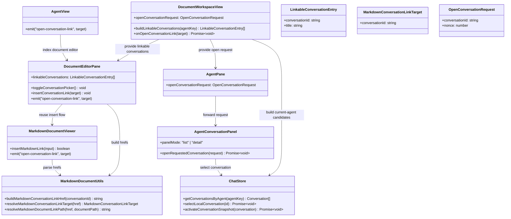

## Context

JARVIS already has most of the building blocks for internal workspace navigation, but they stop at document links:

- `packages/ui/src/components/DocumentEditorPane.vue` owns the middle-pane Markdown toolbar and currently exposes a document-link picker.
- `packages/ui/src/document-viewers/MarkdownDocumentViewer.vue` already forwards clicked Markdown document links upward.
- `packages/ui/src/utils/markdownDocument.ts` already parses workspace document hrefs and intercepts rendered anchor clicks.
- `packages/ui/src/views/DocumentWorkspaceView.vue` already coordinates middle-pane link events with the right-side workspace shell.
- `packages/ui/src/components/AgentConversationPanel.vue` already knows how to render either the Agent conversation list or the currently selected conversation detail.
- `packages/ui/src/store/chat.ts` already exposes current local conversations and `getConversationsByAgent(...)`.

What is missing is a workspace-native link type for conversations plus a reliable way to push the right-side Agent conversation surface into the correct detail state from a document click. The user explicitly narrowed this change to conversation-level navigation only, so the design must not introduce `questionId` deep links, question-index scroll targeting, or new transcript anchor semantics.

## Goals / Non-Goals

**Goals:**
- Let users insert a conversation link from Markdown documents through a dedicated toolbar action.
- Source chooser entries from local conversations in the current Agent scope.
- Persist conversation links in Markdown source with a stable application-managed href format.
- Open the linked conversation in the right-side Agent pane when the rendered Markdown link is clicked.
- Ensure the right-side panel can honor an external open request from either list mode or detail mode.
- Keep the active document selection and middle-pane state intact while opening a conversation link.

**Non-Goals:**
- No question-level deep links or transcript scroll-to-question behavior.
- No support for browsing or opening conversations outside the current Agent scope.
- No new persistence field on `Conversation` just for link metadata.
- No backend or provider API for conversation-link discovery; the picker will reuse existing local conversation state.
- No change to normal chat’s question index contract.

## Decisions

### 1. Represent Markdown conversation links with a dedicated app-managed href

Files to change:
- `/Users/quanzhou/Workspace/JARVIS/packages/ui/src/utils/markdownDocument.ts`
- `/Users/quanzhou/Workspace/JARVIS/packages/ui/src/utils/markdownDocument.test.ts`

Function / type signatures:
```ts
export interface MarkdownConversationLinkTarget {
  conversationId: string;
}

export function buildMarkdownConversationLinkHref(conversationId: string): string;

export function resolveMarkdownConversationLinkTarget(
  href: string
): MarkdownConversationLinkTarget | null;
```

Change description:
- Introduce a custom href format such as `chatprism://conversation/<conversationId>`.
- Keep the format conversation-scoped only: no `questionId`, hash fragment, or extra query fields.
- Parse this href before the existing external-link fallback in the rendered Markdown click handler.

Rationale:
- A dedicated scheme keeps workspace conversation links unambiguous and avoids overloading relative document-link parsing.
- Limiting the payload to `conversationId` matches the user’s narrowed scope and reduces coupling to transcript structure.

Alternatives considered:
- Reuse relative Markdown paths and map them to synthetic conversation files. Rejected because conversations are not workspace files and would leak fake filesystem semantics.
- Encode `conversationId` in a normal `https://` URL. Rejected because it would blur app-internal navigation with browser navigation and complicate desktop/extension handling.

### 2. Reuse the existing middle-pane link-insertion flow with a parallel conversation picker

Files to change:
- `/Users/quanzhou/Workspace/JARVIS/packages/ui/src/components/DocumentEditorPane.vue`
- `/Users/quanzhou/Workspace/JARVIS/packages/ui/src/document-viewers/MarkdownDocumentViewer.vue`
- `/Users/quanzhou/Workspace/JARVIS/packages/ui/src/components/AgentView.vue`
- `/Users/quanzhou/Workspace/JARVIS/packages/ui/src/views/DocumentWorkspaceView.vue`

Function / type signatures:
```ts
export interface LinkableConversationEntry {
  conversationId: string;
  title: string;
}

// DocumentEditorPane props
linkableConversations?: LinkableConversationEntry[];

function toggleConversationPicker(): void;
function insertConversationLink(target: LinkableConversationEntry): void;
```

Change description:
- Add a second toolbar action next to the existing document-link button for Markdown documents.
- Feed that picker from `DocumentWorkspaceView`, which computes linkable conversations using `chatStore.getConversationsByAgent(activeAgentKey)`.
- Reuse the existing `MarkdownDocumentViewer.insertMarkdownLink(...)` editing path, but pass a conversation href built from `buildMarkdownConversationLinkHref(...)`.
- Keep the control visible only on Markdown documents and disable it when the current Agent scope has no linkable local conversations.

Rationale:
- This keeps authoring behavior consistent with the existing document-link feature and minimizes new editing code.
- Computing entries in `DocumentWorkspaceView` avoids duplicating store knowledge inside low-level editor components.

Alternatives considered:
- Fetch conversation candidates directly inside `DocumentEditorPane`. Rejected because editor components should stay presentation-focused and not own workspace query logic.
- Insert raw href text without a picker. Rejected because it would reintroduce manual authoring errors and make the feature hard to discover.

### 3. Route clicked conversation links through a new explicit workspace event chain

Files to change:
- `/Users/quanzhou/Workspace/JARVIS/packages/ui/src/document-viewers/MarkdownDocumentViewer.vue`
- `/Users/quanzhou/Workspace/JARVIS/packages/ui/src/components/DocumentEditorPane.vue`
- `/Users/quanzhou/Workspace/JARVIS/packages/ui/src/components/AgentView.vue`
- `/Users/quanzhou/Workspace/JARVIS/packages/ui/src/views/DocumentWorkspaceView.vue`

Function / type signatures:
```ts
// MarkdownDocumentViewer emits
(event: 'open-conversation-link', target: MarkdownConversationLinkTarget): void;

async function onOpenConversationLink(
  target: MarkdownConversationLinkTarget
): Promise<void>;
```

Change description:
- Extend the Markdown viewer click interception path to emit `open-conversation-link` when a rendered anchor resolves to a conversation href.
- Bubble that event through `DocumentEditorPane` and `AgentView` to `DocumentWorkspaceView`.
- In `DocumentWorkspaceView`, keep the current document open and create a right-pane open request instead of routing through `documentStore.openNode(...)`.

Rationale:
- Document links and conversation links should remain distinct workspace actions even though they share rendered Markdown anchors.
- Handling the request at the workspace-shell level is the smallest place that knows both the middle pane and the right pane.

Alternatives considered:
- Let the Markdown viewer import `chatStore` and open conversations directly. Rejected because it would couple low-level rendering code to workspace shell state and break reuse.

### 4. Use an explicit right-pane “open conversation request” so list mode can be overridden safely

Files to change:
- `/Users/quanzhou/Workspace/JARVIS/packages/ui/src/components/AgentPane.vue`
- `/Users/quanzhou/Workspace/JARVIS/packages/ui/src/components/AgentConversationPanel.vue`
- `/Users/quanzhou/Workspace/JARVIS/packages/ui/src/views/DocumentWorkspaceView.vue`
- `/Users/quanzhou/Workspace/JARVIS/packages/ui/src/store/chat.ts`

Function / type signatures:
```ts
export interface OpenConversationRequest {
  conversationId: string;
  nonce: number;
}

// AgentPane / AgentConversationPanel props
openConversationRequest?: OpenConversationRequest | null;

async function openRequestedConversation(
  request: OpenConversationRequest
): Promise<void>;
```

Change description:
- Add an explicit request object from `DocumentWorkspaceView` into `AgentPane` and then `AgentConversationPanel`.
- `AgentConversationPanel` watches the request, resolves the target from current local conversations in the active Agent scope, selects it through `chatStore.selectLocalConversation(...)` or `activateConversationSnapshot(...)`, and forces `panelMode = 'detail'`.
- If the target conversation is missing, deleted, or outside the current Agent scope, the panel ignores the request and preserves the current UI state.

Rationale:
- Today the right pane derives list/detail mode mostly from node selection. A dedicated request channel prevents document-triggered conversation opening from fighting that default list behavior.
- The `nonce` keeps repeated clicks on the same conversation link observable even when `conversationId` does not change.

Alternatives considered:
- Mutate panel mode indirectly via shared store flags only. Rejected because `AgentConversationPanel` owns list/detail state locally and would still need an explicit synchronization edge.

### 5. Keep navigation conversation-scoped and non-destructive

Files to change:
- `/Users/quanzhou/Workspace/JARVIS/packages/ui/src/views/DocumentWorkspaceView.vue`
- `/Users/quanzhou/Workspace/JARVIS/packages/ui/src/components/AgentConversationPanel.vue`
- `/Users/quanzhou/Workspace/JARVIS/packages/ui/src/store/chat.ts`

Function / type signatures:
```ts
function buildLinkableConversations(agentKey: string | null): LinkableConversationEntry[];
```

Change description:
- Linkable entries come only from local, non-deleted conversations returned by `chatStore.getConversationsByAgent(...)`.
- Opening a link changes only the right-pane conversation selection; it does not change the active workspace document, selected tree node, or question-index state.
- No `requestScrollToQuestion(...)`, `setActiveQuestion(...)`, or question id parsing will be part of this flow.

Rationale:
- This enforces the narrowed requirement and avoids hidden coupling to question-index behavior.
- It also makes the link format durable even if transcript internals change later.

Alternatives considered:
- Automatically open the conversation and scroll to the latest user message. Rejected because it reintroduces transcript-position semantics the user explicitly removed from scope.

### 6. Verify the feature with unit coverage plus Playwright workspace navigation tests

Files to change:
- `/Users/quanzhou/Workspace/JARVIS/packages/ui/src/utils/markdownDocument.test.ts`
- `/Users/quanzhou/Workspace/JARVIS/packages/ui/src/components/DocumentEditorPane.test.ts`
- `/Users/quanzhou/Workspace/JARVIS/packages/ui/src/components/AgentConversationPanel.test.ts`
- `/Users/quanzhou/Workspace/JARVIS/packages/ui/src/views/DocumentWorkspaceView.test.ts`
- `/Users/quanzhou/Workspace/JARVIS/apps/web/tests/e2e/knowledge-workspace.spec.ts`
- `/Users/quanzhou/Workspace/JARVIS/apps/extension/tests/e2e/knowledge-workspace.spec.ts`

Change description:
- Add unit tests for href parsing, picker enable/disable behavior, inserted Markdown syntax, and right-pane request handling.
- Add Playwright coverage that inserts a conversation link into a Markdown document, saves it, clicks the rendered link, and verifies that the right pane shows the requested conversation detail while the current document stays open.
- Cover extension E2E with `channel: 'chromium'`, then run `pnpm --filter extension build` after extension verification.

Rationale:
- The feature crosses rendering, workspace coordination, and right-pane state, so unit tests alone are not enough.

## Mermaid Class Diagram



## Risks / Trade-offs

- [Custom scheme becomes visible in Markdown source] → Keep the href format short and stable, and constrain it to one responsibility: identifying a conversation.
- [Repeated clicks on the same link may be dropped as duplicate state] → Use a `nonce` on the open request so repeated requests remain observable.
- [Current Agent scope may not contain the referenced conversation anymore] → Treat missing or out-of-scope targets as a no-op and leave the current document and conversation view unchanged.
- [Conversation list state and detail state may fight each other] → Keep list/detail override logic in `AgentConversationPanel`, the component that already owns `panelMode`.

## Migration Plan

- No storage migration is required because the feature stores conversation links directly in Markdown source.
- Rollback is straightforward: removing the new parser and picker leaves existing source text readable as normal Markdown links, though app-internal navigation would stop working until the feature is restored.

## Open Questions

- No blocking open questions. The user already chose conversation-level navigation instead of question-level deep links, which removes the main ambiguity from the original request.
