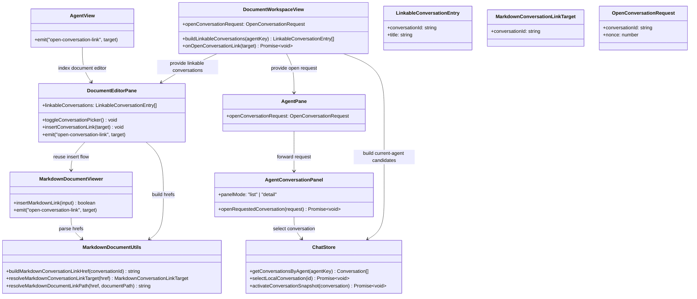

## Context

JARVIS 现在已经具备了工作区内部导航的大部分积木，但能力只覆盖到了“文档链接”：

- `packages/ui/src/components/DocumentEditorPane.vue` 已经拥有中栏 Markdown 工具栏，并且当前已提供文档链接选择器。
- `packages/ui/src/document-viewers/MarkdownDocumentViewer.vue` 已经会把点击后的 Markdown 文档链接向上层转发。
- `packages/ui/src/utils/markdownDocument.ts` 已经能解析工作区文档 href，并在渲染态拦截 anchor 点击。
- `packages/ui/src/views/DocumentWorkspaceView.vue` 已经负责协调中栏链接事件和右侧工作区壳层。
- `packages/ui/src/components/AgentConversationPanel.vue` 已经能在“Agent 会话列表”和“当前选中的会话详情”之间切换渲染。
- `packages/ui/src/store/chat.ts` 已经暴露当前本地会话数据和 `getConversationsByAgent(...)`。

当前缺的是一种“工作区原生的对话链接类型”，以及一条能从文档点击把右侧 Agent 对话面板可靠切到正确详情态的链路。用户已经明确把需求收窄到“只做对话级导航”，因此设计里不能再引入 `questionId` 深链、问题索引滚动定位或新的 transcript 锚点语义。

## Goals / Non-Goals

**Goals:**
- 让用户可以在 Markdown 文档中通过一个专门的工具栏入口插入对话链接。
- 让选择器从当前 Agent 作用域内的本地对话中取候选项。
- 用一个稳定的应用内 href 格式把对话链接持久化到 Markdown 源码里。
- 在点击渲染后的 Markdown 对话链接时，于右侧 Agent pane 打开对应对话。
- 确保右侧面板无论当前处于列表态还是详情态，都能响应外部打开请求。
- 在打开对话链接时保持当前文档选中状态和中栏编辑状态不变。

**Non-Goals:**
- 不做问题级 deep link，也不做 transcript 内的 scroll-to-question。
- 不支持浏览或打开当前 Agent 作用域之外的对话。
- 不为链接元数据新增专门的 `Conversation` 持久化字段。
- 不新增后端或 provider API 来发现可链接对话；选择器直接复用现有本地会话状态。
- 不修改 normal chat 的 question index 契约。

## Decisions

### 1. 用专门的应用内 href 表达 Markdown 对话链接

Files to change:
- `/Users/quanzhou/Workspace/JARVIS/packages/ui/src/utils/markdownDocument.ts`
- `/Users/quanzhou/Workspace/JARVIS/packages/ui/src/utils/markdownDocument.test.ts`

Function / type signatures:
```ts
export interface MarkdownConversationLinkTarget {
  conversationId: string;
}

export function buildMarkdownConversationLinkHref(conversationId: string): string;

export function resolveMarkdownConversationLinkTarget(
  href: string
): MarkdownConversationLinkTarget | null;
```

Change description:
- 引入类似 `chatprism://conversation/<conversationId>` 的自定义 href 格式。
- 该格式只承载 conversation 级目标：不带 `questionId`、hash fragment 或额外 query 字段。
- 在渲染态 Markdown click handler 中，先于现有外链回退逻辑识别这种 href。

Rationale:
- 专用 scheme 能把工作区对话链接和文档路径、普通外链明确区分开。
- 只保留 `conversationId` 与用户收窄后的需求一致，同时减少对 transcript 内部结构的耦合。

Alternatives considered:
- 复用相对 Markdown 路径并把对话映射成伪文件。拒绝，因为 conversation 不是工作区文件，这会泄漏错误的文件系统语义。
- 把 `conversationId` 编进普通 `https://` URL。拒绝，因为这会混淆应用内导航和浏览器导航，也会让 desktop/extension 处理更复杂。

### 2. 复用现有中栏插链流程，并平行增加一个对话选择器

Files to change:
- `/Users/quanzhou/Workspace/JARVIS/packages/ui/src/components/DocumentEditorPane.vue`
- `/Users/quanzhou/Workspace/JARVIS/packages/ui/src/document-viewers/MarkdownDocumentViewer.vue`
- `/Users/quanzhou/Workspace/JARVIS/packages/ui/src/components/AgentView.vue`
- `/Users/quanzhou/Workspace/JARVIS/packages/ui/src/views/DocumentWorkspaceView.vue`

Function / type signatures:
```ts
export interface LinkableConversationEntry {
  conversationId: string;
  title: string;
}

// DocumentEditorPane props
linkableConversations?: LinkableConversationEntry[];

function toggleConversationPicker(): void;
function insertConversationLink(target: LinkableConversationEntry): void;
```

Change description:
- 在 Markdown 文档场景下，于现有文档链接按钮旁新增一个对话链接按钮。
- 该选择器数据由 `DocumentWorkspaceView` 统一计算，来源是 `chatStore.getConversationsByAgent(activeAgentKey)`。
- 复用现有 `MarkdownDocumentViewer.insertMarkdownLink(...)` 编辑路径，只是把 href 换成 `buildMarkdownConversationLinkHref(...)` 生成的对话链接。
- 该入口仅在 Markdown 文档中显示；如果当前 Agent 作用域下没有可链接的本地对话，则按钮保持可见但禁用。

Rationale:
- 这样可以和现有文档链接插入行为保持一致，同时最大限度复用已有编辑代码。
- 由 `DocumentWorkspaceView` 计算候选项，可以避免让低层 editor 组件自己理解工作区 store 规则。

Alternatives considered:
- 在 `DocumentEditorPane` 内部直接查询会话列表。拒绝，因为 editor 组件应保持偏展示层，不应拥有工作区查询逻辑。
- 不做选择器，直接插入原始 href 文本。拒绝，因为这会重新引入手写错误，功能也不易发现。

### 3. 为点击后的对话链接增加一条显式 workspace 事件链

Files to change:
- `/Users/quanzhou/Workspace/JARVIS/packages/ui/src/document-viewers/MarkdownDocumentViewer.vue`
- `/Users/quanzhou/Workspace/JARVIS/packages/ui/src/components/DocumentEditorPane.vue`
- `/Users/quanzhou/Workspace/JARVIS/packages/ui/src/components/AgentView.vue`
- `/Users/quanzhou/Workspace/JARVIS/packages/ui/src/views/DocumentWorkspaceView.vue`

Function / type signatures:
```ts
// MarkdownDocumentViewer emits
(event: 'open-conversation-link', target: MarkdownConversationLinkTarget): void;

async function onOpenConversationLink(
  target: MarkdownConversationLinkTarget
): Promise<void>;
```

Change description:
- 扩展 Markdown viewer 的点击拦截链路：当渲染后的 anchor 被解析为 conversation href 时，发出 `open-conversation-link`。
- 该事件通过 `DocumentEditorPane` 和 `AgentView` 一路上抛到 `DocumentWorkspaceView`。
- `DocumentWorkspaceView` 处理时保持当前文档打开，不走 `documentStore.openNode(...)`，而是只向右侧面板发起“打开对话”的请求。

Rationale:
- 文档链接和对话链接虽然都表现为 Markdown anchor，但它们在工作区里的动作语义不同，应该分开处理。
- 在 workspace shell 这一层处理请求，是最小且最合适的协调点，因为这里只有它同时知道中栏和右栏状态。

Alternatives considered:
- 让 Markdown viewer 直接 import `chatStore` 并打开对话。拒绝，因为这会让底层渲染代码直接耦合到工作区壳层状态，破坏复用边界。

### 4. 通过显式的右栏“打开对话请求”覆盖列表态

Files to change:
- `/Users/quanzhou/Workspace/JARVIS/packages/ui/src/components/AgentPane.vue`
- `/Users/quanzhou/Workspace/JARVIS/packages/ui/src/components/AgentConversationPanel.vue`
- `/Users/quanzhou/Workspace/JARVIS/packages/ui/src/views/DocumentWorkspaceView.vue`
- `/Users/quanzhou/Workspace/JARVIS/packages/ui/src/store/chat.ts`

Function / type signatures:
```ts
export interface OpenConversationRequest {
  conversationId: string;
  nonce: number;
}

// AgentPane / AgentConversationPanel props
openConversationRequest?: OpenConversationRequest | null;

async function openRequestedConversation(
  request: OpenConversationRequest
): Promise<void>;
```

Change description:
- 从 `DocumentWorkspaceView` 向 `AgentPane` 再到 `AgentConversationPanel` 增加一个显式请求对象。
- `AgentConversationPanel` watch 该请求后，在当前 Agent 作用域的本地会话里解析目标，通过 `chatStore.selectLocalConversation(...)` 或 `activateConversationSnapshot(...)` 打开它，并强制 `panelMode = 'detail'`。
- 如果目标对话不存在、已删除或不属于当前 Agent 作用域，则忽略本次请求并保持当前 UI 不变。

Rationale:
- 当前右栏的 list/detail 主要还是由节点选择状态推导出来。增加一条专门请求链路，才能防止“从文档打开会话”与默认列表态互相打架。
- `nonce` 可以保证多次点击同一个 conversation link 时，请求仍然可被观察到。

Alternatives considered:
- 只通过共享 store flag 间接修改面板模式。拒绝，因为 `AgentConversationPanel` 的 `panelMode` 是本地状态，仍然需要一条明确的同步边界。

### 5. 导航严格限定为 conversation 级、且不产生破坏性副作用

Files to change:
- `/Users/quanzhou/Workspace/JARVIS/packages/ui/src/views/DocumentWorkspaceView.vue`
- `/Users/quanzhou/Workspace/JARVIS/packages/ui/src/components/AgentConversationPanel.vue`
- `/Users/quanzhou/Workspace/JARVIS/packages/ui/src/store/chat.ts`

Function / type signatures:
```ts
function buildLinkableConversations(agentKey: string | null): LinkableConversationEntry[];
```

Change description:
- 候选项只来自 `chatStore.getConversationsByAgent(...)` 返回的本地、未删除 conversation。
- 点击链接时只改变右栏 conversation 选择，不修改当前工作区文档、左树选中节点或问题索引状态。
- 整条链路不涉及 `requestScrollToQuestion(...)`、`setActiveQuestion(...)` 或任何问题 id 解析。

Rationale:
- 这能严格落实“只做对话级链接”的范围约束，避免再次耦合进 question index。
- 也让链接格式在未来 transcript 内部结构变化时仍然保持稳定。

Alternatives considered:
- 自动打开对话并滚动到最新用户消息。拒绝，因为这会重新引入用户已经明确排除的 transcript 位置语义。

### 6. 用单测加 Playwright 验证跨中栏/右栏的真实链路

Files to change:
- `/Users/quanzhou/Workspace/JARVIS/packages/ui/src/utils/markdownDocument.test.ts`
- `/Users/quanzhou/Workspace/JARVIS/packages/ui/src/components/DocumentEditorPane.test.ts`
- `/Users/quanzhou/Workspace/JARVIS/packages/ui/src/components/AgentConversationPanel.test.ts`
- `/Users/quanzhou/Workspace/JARVIS/packages/ui/src/views/DocumentWorkspaceView.test.ts`
- `/Users/quanzhou/Workspace/JARVIS/apps/web/tests/e2e/knowledge-workspace.spec.ts`
- `/Users/quanzhou/Workspace/JARVIS/apps/extension/tests/e2e/knowledge-workspace.spec.ts`

Change description:
- 为 href 解析、选择器禁用/启用、插入后的 Markdown 语法、右栏请求处理补齐单测。
- 增加 Playwright 用例：在 Markdown 文档中插入 conversation link、保存、再点击渲染态链接，并验证右栏打开了目标对话详情，同时当前文档保持打开。
- extension E2E 需使用 `channel: 'chromium'`，并在 extension 验证后运行 `pnpm --filter extension build`。

Rationale:
- 该能力横跨渲染、工作区协调和右栏状态，单靠单测不足以覆盖真实用户链路。

## Mermaid Class Diagram



## Risks / Trade-offs

- [自定义 scheme 会直接出现在 Markdown 源码里] → 保持 href 简短且稳定，并把它严格限制在“标识一个 conversation”这一个职责上。
- [多次点击同一个链接可能被当成重复状态而丢失] → 在打开请求里加入 `nonce`，保证重复请求也能被观察到。
- [当前 Agent 作用域里可能已经没有被引用的对话] → 对缺失或越界目标按 no-op 处理，并保持当前文档和右栏状态不变。
- [会话列表态和详情态可能互相争抢控制权] → 把列表/详情切换覆盖逻辑集中放在已经拥有 `panelMode` 的 `AgentConversationPanel` 中。

## Migration Plan

- 不需要存储迁移，因为该能力只是把 conversation link 直接写进 Markdown 源码。
- 回滚也很直接：移除新 parser 和新 picker 后，已有源码仍然是合法 Markdown 链接文本，只是应用内导航会停止工作，直到该功能恢复。

## Open Questions

- 没有阻塞性的开放问题。用户已经明确选择“对话级链接”而不是“问题级深链”，原始需求里最大的歧义已被消除。
