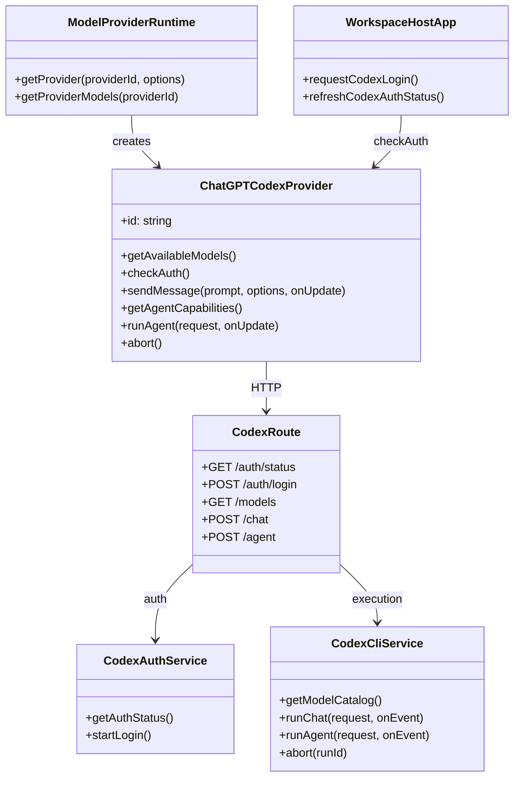

## Context

ChatPrism already has two provider families with different trust boundaries:

- `chatgpt-web` depends on host-managed browser sessions and private ChatGPT Web APIs.
- `gemini-api` depends on explicit API credentials and direct HTTPS calls.

The requested `chatgpt-codex` provider does not fit either pattern cleanly. It must work in `web`, `extension`, and `desktop`, support authenticated use through a ChatGPT subscription, and participate in Agent mode. Reusing the existing `chatgpt-web` host/session path would keep the provider unavailable in pure web mode and would duplicate auth behavior across hosts.

The installed `codex` CLI already provides the two missing pieces:

- authentication backed by ChatGPT login
- non-interactive execution through `codex exec --json`

This change therefore introduces a local server-backed Codex path that all three hosts consume uniformly.

## Goals / Non-Goals

**Goals:**

- Expose one unified `chatgpt-codex` provider in `web`, `extension`, and `desktop`.
- Keep auth and execution behind the local ChatPrism server instead of browser-only session tricks.
- Reuse the installed `codex` CLI for login state, model execution, and model discovery.
- Support `IAgentCapableProvider` so ChatPrism Agent mode can select Codex.
- Keep host-specific UI limited to auth recovery and runtime bootstrapping.

**Non-Goals:**

- No external history import for Codex.
- No migration of existing `chatgpt-web` history behavior to the CLI-backed path.
- No replacement of Gemini or existing compare/runtime behavior outside Codex-specific wiring.
- No remote multi-user auth broker; this design assumes the local ChatPrism server and local `codex` CLI belong to the same user workstation.

## Decisions

### 1. Introduce a new core provider instead of extending `ChatGPTWebProvider`

**Decision**

Create a new provider implementation:

- Add: `/Users/quanzhou/Workspace/JARVIS/packages/core/src/providers/model/ChatGPTCodexProvider.ts`
- Export from: `/Users/quanzhou/Workspace/JARVIS/packages/core/src/index.ts`
- Register in: `/Users/quanzhou/Workspace/JARVIS/packages/core/src/runtime/createModelProviderRuntime.ts`
- Extend provider options in: `/Users/quanzhou/Workspace/JARVIS/packages/core/src/providers/model/providerHostTypes.ts`

Key signatures:

- `constructor(options: ChatGPTCodexProviderOptions)`
- `getAvailableModels(): Promise<ProviderModelCatalog>`
- `checkAuth(): Promise<boolean>`
- `sendMessage(prompt: string, options: SendMessageOptions, onUpdate: (update: ProviderStreamUpdate) => void): Promise<ProviderSendResult>`
- `getAgentCapabilities(): AgentCapabilities`
- `runAgent(request: AgentRunRequest, onUpdate: (update: ProviderStreamUpdate) => void): Promise<ProviderSendResult>`
- `abort(): void`

**Rationale**

`ChatGPTWebProvider` is centered on host cookies, ChatGPT Web endpoints, and external history behavior. Codex has a different backend story and explicitly does not need history import. A separate provider keeps auth, runtime dependencies, and failure modes isolated.

**Alternatives considered**

- Extend `ChatGPTWebProvider` with a `mode = codex` switch: rejected because it would mix browser-session history logic with CLI-backed execution.
- Reuse `GeminiApiProvider`-style direct HTTPS calls: rejected because ChatGPT subscription Codex is not an API-key-only path in this request.

### 2. Use the local ChatPrism server as the only Codex execution boundary

**Decision**

Add server routes and services for Codex auth and execution:

- Add: `/Users/quanzhou/Workspace/JARVIS/apps/server/src/routes/codex.ts`
- Add: `/Users/quanzhou/Workspace/JARVIS/apps/server/src/services/codexCliService.ts`
- Add: `/Users/quanzhou/Workspace/JARVIS/apps/server/src/services/codexAuthService.ts`
- Update: `/Users/quanzhou/Workspace/JARVIS/apps/server/src/app.ts`
- Update: `/Users/quanzhou/Workspace/JARVIS/apps/server/src/config.ts`

Representative server methods:

- `getAuthStatus(): Promise<{ authenticated: boolean; providerId: 'chatgpt-codex' }>`
- `startLogin(): Promise<{ mode: 'device-auth'; verificationUri?: string; userCode?: string; message: string }>`
- `getModelCatalog(): Promise<ProviderModelCatalog>`
- `runChat(request: CodexChatRequest, onEvent: (event: CodexStreamEvent) => void): Promise<CodexFinalResult>`
- `runAgent(request: CodexAgentRequest, onEvent: (event: CodexStreamEvent) => void): Promise<CodexFinalResult>`

**Rationale**

All three hosts already trust the local ChatPrism server for sync and context access. Reusing that server avoids three separate auth implementations and keeps `codex` CLI execution outside renderer/browser sandboxes.

**Alternatives considered**

- Let each host shell out to `codex` directly: rejected because web cannot do that, and three different host bridges would recreate the current divergence.
- Build a direct reverse proxy to private ChatGPT Web endpoints: rejected due to higher protocol drift and login/session maintenance costs.

### 3. Use `codex login status` and `codex login --device-auth` as the auth contract

**Decision**

The server auth service will:

- treat `codex login status` success as the source of truth for auth availability
- expose a `startLogin()` flow that shells out to `codex login --device-auth`
- return device-auth instructions to the caller and let hosts poll auth status until login succeeds

Affected files:

- Add: `/Users/quanzhou/Workspace/JARVIS/apps/server/src/services/codexAuthService.ts`
- Add tests under: `/Users/quanzhou/Workspace/JARVIS/apps/server/tests/`

**Rationale**

The CLI already understands ChatGPT-backed login. Polling `login status` gives one normalized recovery condition across all hosts and keeps provider logic out of browser-specific cookie handling.

**Alternatives considered**

- Reuse desktop login windows from `chatgpt-web`: rejected because the user explicitly wants one unified server-backed path.
- Require the user to paste tokens/cookies manually: rejected because it is brittle and not a real login recovery flow.

### 4. Use `codex exec --json` as the provider transport for both chat and agent execution

**Decision**

`ChatGPTCodexProvider` will call server endpoints that wrap `codex exec --json` and convert CLI JSONL events into `ProviderStreamUpdate` / `ProviderSendResult`.

Affected files:

- Add: `/Users/quanzhou/Workspace/JARVIS/packages/core/src/providers/model/ChatGPTCodexProvider.ts`
- Add: `/Users/quanzhou/Workspace/JARVIS/apps/server/src/services/codexCliService.ts`

Representative internal helpers:

- `parseCodexJsonEvent(line: string): CodexStreamEvent | null`
- `toProviderUpdate(event: CodexStreamEvent): ProviderStreamUpdate | null`
- `toProviderResult(finalEvent: CodexCompletionEvent): ProviderSendResult`

`runAgent(...)` will also use the CLI-backed execution path. The provider will implement `IAgentCapableProvider`, but the tool loop remains provider-owned: if the CLI returns a final answer without ChatPrism-managed `toolCalls`, `createAgentRuntime()` will treat it as a completed native-agent turn.

**Rationale**

This preserves one execution backend and avoids maintaining separate Codex chat and Codex agent protocols inside ChatPrism.

**Alternatives considered**

- Build a fake application-managed tool loop around Codex: rejected because Codex already acts as an agent backend and does not naturally emit ChatPrism workspace tool calls.
- Support only normal chat first: rejected because the requested scope explicitly includes `IAgentCapableProvider`.

### 5. Keep runtime wiring host-agnostic and use direct HTTP provider instances on all three hosts

**Decision**

All three hosts will create the same provider via runtime options instead of host proxies:

- Update: `/Users/quanzhou/Workspace/JARVIS/apps/web/src/modelProviderRuntime.ts`
- Update: `/Users/quanzhou/Workspace/JARVIS/apps/extension/src/modelProviderRuntime.ts`
- Update: `/Users/quanzhou/Workspace/JARVIS/apps/desktop/src/modelProviderRuntime.ts`
- Update URL helpers in: `/Users/quanzhou/Workspace/JARVIS/packages/core/config.ts`

Representative additions:

- `resolveCodexBaseUrl(options?: ...): string`
- `providerOptionsResolver(providerId, runtimeOptions): ChatGPTCodexProviderOptions | undefined`

**Rationale**

Once execution is server-backed, the extension and desktop hosts no longer need `BackgroundProxyProvider` or `DesktopProxyProvider` for this provider. This reduces host-specific special cases while preserving proxy behavior for legacy providers that still need it.

**Alternatives considered**

- Keep background/desktop proxy wrappers and forward again to the server: rejected as redundant double-proxying.

### 6. Implement host auth recovery as a thin wrapper around `checkAuth()` plus server login start

**Decision**

Each host app will show Codex-specific recovery UI when the current provider is `chatgpt-codex` and auth is unavailable.

Affected files:

- Update: `/Users/quanzhou/Workspace/JARVIS/apps/web/src/App.vue`
- Update: `/Users/quanzhou/Workspace/JARVIS/apps/extension/src/App.vue`
- Update: `/Users/quanzhou/Workspace/JARVIS/apps/desktop/src/App.vue`

Representative methods:

- `refreshCodexAuthStatus(): Promise<boolean | null>`
- `requestCodexLogin(): Promise<void>`

The host UI only opens the local server login flow (for example, a device-auth instructions window or tab), then polls `checkAuth()` until the provider becomes ready.

**Rationale**

This keeps the shared workspace UI unchanged and localizes host-specific logic to bootstrapping and recovery messaging.

### 7. Validate the provider through unit tests plus host E2E coverage

**Decision**

Add or update tests in:

- `/Users/quanzhou/Workspace/JARVIS/packages/core/src/runtime/createModelProviderRuntime.test.ts`
- `/Users/quanzhou/Workspace/JARVIS/packages/core/src/providers/model/ChatGPTCodexProvider.test.ts`
- `/Users/quanzhou/Workspace/JARVIS/apps/server/tests/`
- `/Users/quanzhou/Workspace/JARVIS/apps/web/src/modelProviderRuntime.test.ts`
- `/Users/quanzhou/Workspace/JARVIS/apps/extension/src/App.test.ts`
- `/Users/quanzhou/Workspace/JARVIS/apps/desktop/src/App.test.ts`
- Playwright E2E coverage for `web`, `extension`, and `desktop`

The extension E2E path must run with escalated permissions and `channel: 'chromium'`.

## Risks / Trade-offs

- [Local `codex` CLI is missing or too old] → Detect early in server startup/auth checks and return actionable host-side error copy.
- [Device-auth output format changes] → Keep parsing isolated inside `CodexAuthService` and cover it with service tests using fixture output.
- [CLI JSON event format drifts] → Centralize JSONL parsing in `CodexCliService` and pin tests to representative event fixtures.
- [Codex Agent behavior does not emit ChatPrism-managed tool calls] → Treat Codex as provider-owned native agent execution and keep ChatPrism runtime tolerant of final-text-only native turns.
- [Three hosts now depend on the local server being reachable] → Reuse the existing local-server base URL conventions and show explicit recovery errors when the server is offline.

## Migration Plan

1. Add the new provider behind static runtime catalog support.
2. Add local server routes and CLI wrappers for auth, models, chat, and agent execution.
3. Wire `web`, `extension`, and `desktop` runtimes to create `chatgpt-codex` through direct server-backed provider options.
4. Add host auth recovery UI and polling behavior.
5. Run unit tests, then host-specific E2E tests for web, extension, and desktop.
6. Roll back by removing `chatgpt-codex` from static config and runtime registration if the CLI-backed path proves unstable.

## Open Questions

- Which exact Codex model IDs should be exposed as static fallback names before the CLI model catalog succeeds?
- Should the server keep long-running CLI processes addressable by run ID for future streaming abort support, or is request-scope abort enough for the first version?
- Do we want a dedicated server health endpoint for Codex CLI availability, or is provider auth/model failure sufficient for the first release?
