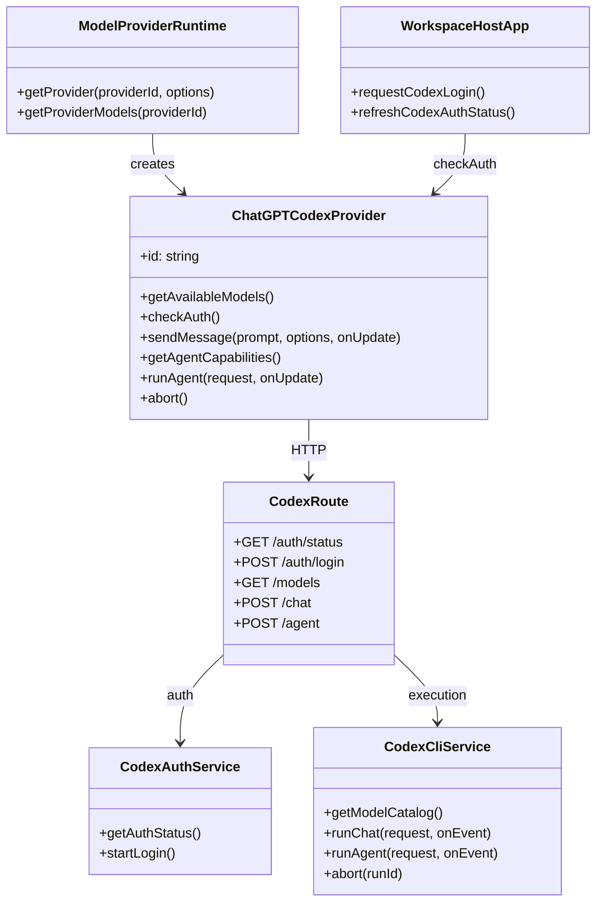

## Context

ChatPrism 当前已有两类 provider：

- `chatgpt-web` 依赖宿主管理的浏览器登录态和 ChatGPT Web 私有接口。
- `gemini-api` 依赖显式 API 凭证和直接 HTTPS 请求。

本次要新增的 `chatgpt-codex` 不能自然归入这两类。它必须同时支持 `web`、`extension`、`desktop`，要能通过 ChatGPT subscription 完成认证，还要接入 Agent mode。继续复用 `chatgpt-web` 的宿主 session 方案，会让它无法在纯 web mode 下成立，也会把三端认证逻辑继续割裂开。

本机已安装的 `codex` CLI 正好提供了两块核心能力：

- 基于 ChatGPT 登录的认证能力
- 通过 `codex exec --json` 进行非交互执行的能力

因此本次设计采用统一的本地 server-backed Codex 链路，由三端共同消费。

## Goals / Non-Goals

**Goals:**

- 提供一个统一的 `chatgpt-codex` provider，并在 `web`、`extension`、`desktop` 三端可用。
- 将认证和执行都收敛到本地 ChatPrism server，而不是依赖浏览器专属 session 技巧。
- 复用已安装的 `codex` CLI 完成登录状态判断、执行和模型目录读取。
- 支持 `IAgentCapableProvider`，使 ChatPrism Agent mode 可以直接选择 Codex。
- 将宿主差异收敛到认证恢复 UI 和 runtime 启动装配层。

**Non-Goals:**

- 不实现 Codex 的 external history import。
- 不把现有 `chatgpt-web` 的历史导入逻辑迁移到 CLI-backed 路径。
- 不改动 Gemini 或与 Codex 无关的 compare/runtime 行为。
- 不实现远程多用户认证代理；默认本地 ChatPrism server 与本地 `codex` CLI 属于同一台用户工作站。

## Decisions

### 1. 新建独立的 core provider，而不是扩展 `ChatGPTWebProvider`

**Decision**

新增独立 provider：

- 新增：`/Users/quanzhou/Workspace/JARVIS/packages/core/src/providers/model/ChatGPTCodexProvider.ts`
- 导出：`/Users/quanzhou/Workspace/JARVIS/packages/core/src/index.ts`
- 注册：`/Users/quanzhou/Workspace/JARVIS/packages/core/src/runtime/createModelProviderRuntime.ts`
- 扩展 provider options：`/Users/quanzhou/Workspace/JARVIS/packages/core/src/providers/model/providerHostTypes.ts`

关键方法签名：

- `constructor(options: ChatGPTCodexProviderOptions)`
- `getAvailableModels(): Promise<ProviderModelCatalog>`
- `checkAuth(): Promise<boolean>`
- `sendMessage(prompt: string, options: SendMessageOptions, onUpdate: (update: ProviderStreamUpdate) => void): Promise<ProviderSendResult>`
- `getAgentCapabilities(): AgentCapabilities`
- `runAgent(request: AgentRunRequest, onUpdate: (update: ProviderStreamUpdate) => void): Promise<ProviderSendResult>`
- `abort(): void`

**Rationale**

`ChatGPTWebProvider` 的中心是浏览器 cookie、ChatGPT Web endpoint 和 external history。Codex 的执行与认证边界完全不同，而且本次明确不需要历史导入。拆出独立 provider 可以把依赖、失败模式和行为边界保持清晰。

**Alternatives considered**

- 在 `ChatGPTWebProvider` 上加 `mode = codex` 开关：拒绝，因为会把浏览器 session/history 逻辑和 CLI 执行逻辑强行混合。
- 像 `GeminiApiProvider` 一样直接走 HTTPS：拒绝，因为本次需求不是 API key 模式，而是 ChatGPT subscription 的 Codex。

### 2. 将本地 ChatPrism server 作为唯一的 Codex 执行边界

**Decision**

新增 server 路由和服务：

- 新增：`/Users/quanzhou/Workspace/JARVIS/apps/server/src/routes/codex.ts`
- 新增：`/Users/quanzhou/Workspace/JARVIS/apps/server/src/services/codexCliService.ts`
- 新增：`/Users/quanzhou/Workspace/JARVIS/apps/server/src/services/codexAuthService.ts`
- 修改：`/Users/quanzhou/Workspace/JARVIS/apps/server/src/app.ts`
- 修改：`/Users/quanzhou/Workspace/JARVIS/apps/server/src/config.ts`

代表性服务方法：

- `getAuthStatus(): Promise<{ authenticated: boolean; providerId: 'chatgpt-codex' }>`
- `startLogin(): Promise<{ mode: 'device-auth'; verificationUri?: string; userCode?: string; message: string }>`
- `getModelCatalog(): Promise<ProviderModelCatalog>`
- `runChat(request: CodexChatRequest, onEvent: (event: CodexStreamEvent) => void): Promise<CodexFinalResult>`
- `runAgent(request: CodexAgentRequest, onEvent: (event: CodexStreamEvent) => void): Promise<CodexFinalResult>`

**Rationale**

三端现在都已经信任本地 ChatPrism server 去做 sync/context 访问。复用这层作为 Codex 的统一边界，可以避免三套独立认证实现，并把 `codex` CLI 的执行放在 renderer/browser sandbox 外面。

**Alternatives considered**

- 每个 host 都自己 shell out 到 `codex`：拒绝，因为 web 做不到，而且会重新制造三端分裂。
- 直接反向代理 ChatGPT Web 私有接口：拒绝，因为协议漂移和登录态维护成本更高。

### 3. 用 `codex login status` 和 `codex login --device-auth` 作为认证契约

**Decision**

server auth service 的行为：

- 用 `codex login status` 的结果作为是否已认证的唯一事实源
- 通过 `codex login --device-auth` 发起登录流程
- 将 device-auth 指令返回给宿主，并由宿主轮询 auth status 直到登录成功

涉及文件：

- 新增：`/Users/quanzhou/Workspace/JARVIS/apps/server/src/services/codexAuthService.ts`
- 新增对应测试：`/Users/quanzhou/Workspace/JARVIS/apps/server/tests/`

**Rationale**

CLI 本身已经支持 ChatGPT 登录。统一通过 `login status` 做恢复判定，可以让三端共用同一条认证恢复路径，而不必再去处理浏览器 cookie/session。

**Alternatives considered**

- 复用桌面 `chatgpt-web` 登录窗口：拒绝，因为用户已经明确希望新的 server-backed 统一路径。
- 让用户手动粘贴 token/cookie：拒绝，因为这不是真正的登录恢复流程，而且不稳。

### 4. 用 `codex exec --json` 作为普通聊天和 Agent 执行的统一传输层

**Decision**

`ChatGPTCodexProvider` 将通过 server endpoint 调用 `codex exec --json`，再把 CLI JSONL 事件转换成 `ProviderStreamUpdate` / `ProviderSendResult`。

涉及文件：

- 新增：`/Users/quanzhou/Workspace/JARVIS/packages/core/src/providers/model/ChatGPTCodexProvider.ts`
- 新增：`/Users/quanzhou/Workspace/JARVIS/apps/server/src/services/codexCliService.ts`

代表性内部 helper：

- `parseCodexJsonEvent(line: string): CodexStreamEvent | null`
- `toProviderUpdate(event: CodexStreamEvent): ProviderStreamUpdate | null`
- `toProviderResult(finalEvent: CodexCompletionEvent): ProviderSendResult`

`runAgent(...)` 同样走 CLI-backed 路径。provider 会实现 `IAgentCapableProvider`，但工具循环由 provider 自己承担：如果 CLI 最终只返回文本而没有生成 ChatPrism 管理的 `toolCalls`，`createAgentRuntime()` 会把它视为一次完成的 native-agent turn。

**Rationale**

这样可以保证普通聊天和 Agent 只维护一套 Codex 后端，不需要在 ChatPrism 内部额外维护两套协议。

**Alternatives considered**

- 围绕 Codex 伪造一个 ChatPrism application-managed tool loop：拒绝，因为 Codex 本身已经是 agent 执行后端，不天然输出 ChatPrism 工作区工具调用。
- 先只做普通聊天：拒绝，因为本次 scope 已明确包含 `IAgentCapableProvider`。

### 5. 三端 runtime 都直接创建同一个 server-backed provider

**Decision**

三端都通过 runtime options 创建同一个 provider，不再给它套额外 host proxy：

- 修改：`/Users/quanzhou/Workspace/JARVIS/apps/web/src/modelProviderRuntime.ts`
- 修改：`/Users/quanzhou/Workspace/JARVIS/apps/extension/src/modelProviderRuntime.ts`
- 修改：`/Users/quanzhou/Workspace/JARVIS/apps/desktop/src/modelProviderRuntime.ts`
- 修改 URL helper：`/Users/quanzhou/Workspace/JARVIS/packages/core/config.ts`

代表性新增：

- `resolveCodexBaseUrl(options?: ...): string`
- `providerOptionsResolver(providerId, runtimeOptions): ChatGPTCodexProviderOptions | undefined`

**Rationale**

既然执行已经 server-backed，extension 和 desktop 就不需要再通过 `BackgroundProxyProvider` 或 `DesktopProxyProvider` 去代理这一个 provider。这样可以减少宿主特殊分支，同时保留其他 legacy provider 继续走原有 proxy。

**Alternatives considered**

- 继续让 extension/desktop 先走 host proxy，再由 proxy 转发到 server：拒绝，因为这是不必要的双重代理。

### 6. 宿主认证恢复只做 `checkAuth()` + 登录发起

**Decision**

每个 host app 在当前 provider 为 `chatgpt-codex` 且认证失败时，显示 Codex 专属恢复 UI。

涉及文件：

- 修改：`/Users/quanzhou/Workspace/JARVIS/apps/web/src/App.vue`
- 修改：`/Users/quanzhou/Workspace/JARVIS/apps/extension/src/App.vue`
- 修改：`/Users/quanzhou/Workspace/JARVIS/apps/desktop/src/App.vue`

代表性方法：

- `refreshCodexAuthStatus(): Promise<boolean | null>`
- `requestCodexLogin(): Promise<void>`

宿主 UI 只负责打开本地 server 提供的登录流程（例如 device-auth 指令页或标签页），然后轮询 `checkAuth()` 直到 provider 可用。

**Rationale**

这样共享工作区 UI 不需要改结构，宿主差异可以收敛到启动和恢复提示。

### 7. 用单测加三端 E2E 做验证

**Decision**

新增或修改测试：

- `/Users/quanzhou/Workspace/JARVIS/packages/core/src/runtime/createModelProviderRuntime.test.ts`
- `/Users/quanzhou/Workspace/JARVIS/packages/core/src/providers/model/ChatGPTCodexProvider.test.ts`
- `/Users/quanzhou/Workspace/JARVIS/apps/server/tests/`
- `/Users/quanzhou/Workspace/JARVIS/apps/web/src/modelProviderRuntime.test.ts`
- `/Users/quanzhou/Workspace/JARVIS/apps/extension/src/App.test.ts`
- `/Users/quanzhou/Workspace/JARVIS/apps/desktop/src/App.test.ts`
- web / extension / desktop 的 Playwright E2E

extension E2E 需要提权运行，并使用 `channel: 'chromium'`。

## Risks / Trade-offs

- [本机没有安装 `codex` CLI，或版本过旧] → 在 server 启动/认证检查阶段尽早探测，并返回明确的宿主错误提示。
- [device-auth 的输出格式变化] → 把解析逻辑隔离在 `CodexAuthService`，并通过 fixture 测试锁定。
- [CLI JSON 事件格式漂移] → 在 `CodexCliService` 中集中做 JSONL 解析，并用代表性事件 fixture 做测试。
- [Codex Agent 不输出 ChatPrism 管理的 `toolCalls`] → 将 Codex 视为 provider-owned native agent，允许 native turn 只返回最终文本。
- [三端现在都依赖本地 server 在线] → 复用现有本地 server base URL 约定，并在 server 不可用时给出明确恢复错误。

## Migration Plan

1. 先把 `chatgpt-codex` provider 纳入静态 runtime catalog。
2. 增加本地 server 的 auth、models、chat、agent 路由和 CLI wrapper。
3. 让 `web`、`extension`、`desktop` 三端都通过 direct server-backed provider options 创建 `chatgpt-codex`。
4. 补三端认证恢复 UI 和轮询逻辑。
5. 先跑单测，再跑 web / extension / desktop 的 E2E。
6. 如果 CLI-backed 路径不稳定，回滚方式是从静态配置和 runtime 注册中移除 `chatgpt-codex`。

## Open Questions

- 在 CLI 模型目录成功之前，静态 fallback 应该暴露哪些 Codex model id/name？
- server 是否要为未来的 abort 支持维护可寻址的长生命周期 run ID，还是首版只做 request-scope abort 即可？
- 是否需要专门增加一个 Codex CLI availability health endpoint，还是首版让 provider auth/model 错误承担这部分可观测性就够了？
