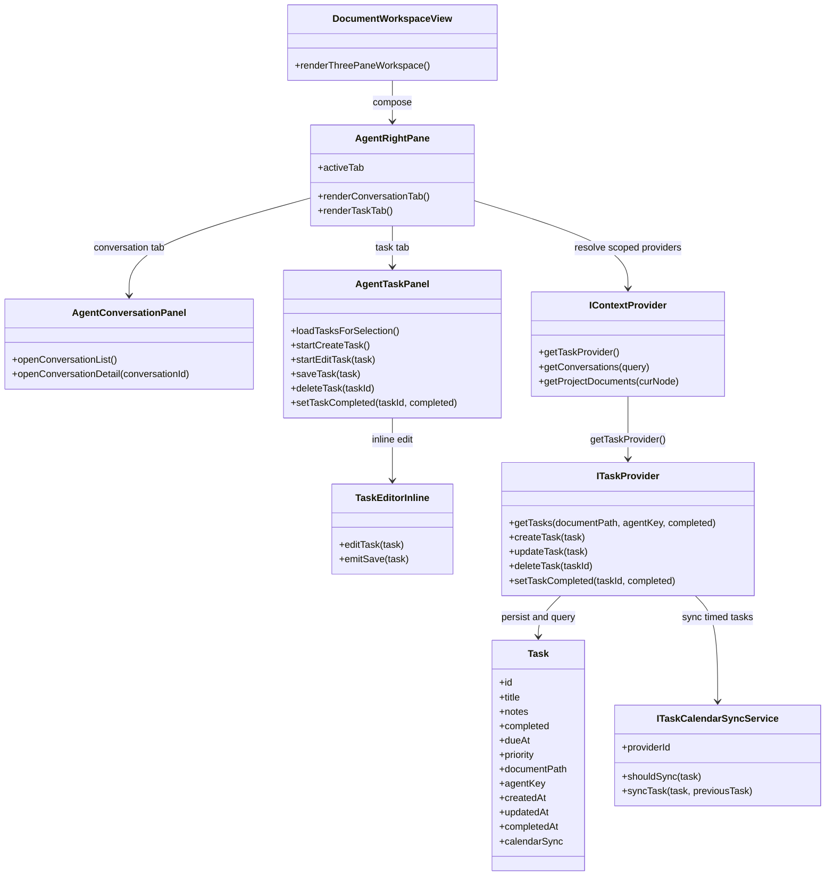

## Context

The current Agent-side workspace architecture has a clear split:

- `DocumentWorkspaceView` composes the three-pane workspace.
- `AgentPane` currently renders only `AgentConversationPanel`.
- `IContextProvider` exposes workspace/document/conversation capabilities through one context contract.

This change introduces a new right-panel concern that is related to the same document/project scope as conversations, but is not itself a conversation concern. The user also explicitly wants task-domain isolation through a dedicated `ITaskProvider`, while still resolving it from `IContextProvider`.

The design therefore needs to:

- preserve the current document-centric workspace composition
- keep conversation logic isolated in `AgentConversationPanel`
- add task behavior without mixing document- and project-scoped task lists
- carry the new task contract through local, desktop bridge, and HTTP-backed context implementations

## Goals / Non-Goals

**Goals:**

- Add a right-panel tabbed container that hosts both conversations and tasks.
- Introduce a dedicated `Task` / `ITaskProvider` contract resolved from `IContextProvider`.
- Support document-scoped and project-scoped tasks with mutually exclusive list resolution per active selection.
- Support inline task create/edit, explicit completion toggling, and collapsed completed-task rendering.
- Synchronize desktop-host timed tasks to Google Calendar with deterministic reminder rules and raw-note propagation.
- Keep the existing conversation list/detail behavior intact.

**Non-Goals:**

- No global task inbox or cross-project aggregation.
- No task rendering inside the middle document pane.
- No task ownership display, subtasks, recurrence, tags, attachments, or user-configurable reminder UI.
- No attempt to merge task data into the `Conversation` model or conversation persistence flow.
- No web-host implementation of Google Calendar sync in this change.

## Decisions

### 1. Replace `AgentPane` with a tabbed `AgentRightPane` container

**Decision**

Rename the existing right-panel container and widen its responsibility from “conversation mount point” to “right-side workspace container”.

Files to change:

- `/Users/quanzhou/Workspace/JARVIS/packages/ui/src/components/AgentPane.vue` → rename to `AgentRightPane.vue`
- `/Users/quanzhou/Workspace/JARVIS/packages/ui/src/components/AgentPane.test.ts` → rename to `AgentRightPane.test.ts`
- `/Users/quanzhou/Workspace/JARVIS/packages/ui/index.ts`
- `/Users/quanzhou/Workspace/JARVIS/packages/ui/src/views/DocumentWorkspaceView.vue`

Key component signature:

```ts
// Vue props shape
type AgentRightPaneProps = {
  activeAgent?: ResolvedAgentConfig | null;
  activeAgentKey?: string | null;
  activePath?: string | null;
  selectedNodePath?: string | null;
  activeDocument?: ContextDocument | null;
  showAgentConversationList?: boolean;
  contextProvider?: IContextProvider | null;
  onFileChanged?: ((change: {
    path: string;
    beforeContent: string;
    afterContent: string;
    alreadyPersisted?: boolean;
  }) => void | Promise<void>) | null;
  agentResolutionError?: string | null;
  restoreConversationId?: string | null;
  openConversationRequest?: OpenConversationRequest | null;
};
```

Change description:

- `AgentRightPane` becomes the owner of the active tab state: `conversations | tasks`.
- It continues to synchronize workspace context into `chatStore` exactly as `AgentPane` does today.
- It renders `AgentConversationPanel` when the conversation tab is active and `AgentTaskPanel` when the task tab is active.

**Rationale**

The current `AgentConversationPanel` already owns conversation-specific list/detail behavior and toolbar actions. Adding task behavior directly there would mix two unrelated interaction models and make right-panel state harder to reason about.

**Alternatives considered**

- Add task tabs directly inside `AgentConversationPanel`: rejected because it blurs conversation ownership and task ownership.
- Keep `AgentPane` name unchanged: rejected because the container stops being “just a pane for conversations”.

### 2. Add `Task` and `ITaskProvider` as a dedicated task-domain contract

**Decision**

Introduce a dedicated provider contract for tasks, and expose it from `IContextProvider` rather than flattening task methods into the context interface.

Files to change:

- `/Users/quanzhou/Workspace/JARVIS/packages/core/src/interfaces/IContextProvider.ts`
- `/Users/quanzhou/Workspace/JARVIS/packages/core/src/index.ts`
- `/Users/quanzhou/Workspace/JARVIS/packages/core/src/testing/createMockContextProvider.ts`
- new `/Users/quanzhou/Workspace/JARVIS/packages/core/src/interfaces/ITaskProvider.ts`

Key signatures:

```ts
export type TaskPriority = 'low' | 'medium' | 'high';

export interface Task {
  id: string;
  title: string;
  notes: string;
  completed: boolean;
  dueAt: number | null;
  priority: TaskPriority | null;
  documentPath: string | null;
  agentKey: string | null;
  createdAt: number;
  updatedAt: number;
  completedAt: number | null;
}

export interface ITaskProvider {
  getTasks(
    documentPath?: string | null,
    agentKey?: string | null,
    completed?: boolean
  ): Promise<Task[]>;
  createTask(task: Task): Promise<Task>;
  updateTask(task: Task): Promise<Task>;
  deleteTask(taskId: string): Promise<void>;
  setTaskCompleted(taskId: string, completed: boolean): Promise<Task>;
}

export interface IContextProvider {
  // existing members...
  getTaskProvider(): ITaskProvider;
}
```

Change description:

- `Task` is a first-class collaboration object parallel to `Conversation`.
- `ITaskProvider` owns task query and mutation methods.
- `IContextProvider` remains the entry point for workspace-scoped capabilities, but delegates task behavior through `getTaskProvider()`.
- The provider is allowed to normalize provider-managed fields such as `id`, `createdAt`, `updatedAt`, and `completedAt` even though `createTask` / `updateTask` accept `Task` objects.

**Rationale**

This matches the user requirement for domain isolation while preserving the existing “one resolved context entry” architecture.

**Alternatives considered**

- Add `getTasks/createTask/updateTask/deleteTask` directly to `IContextProvider`: rejected because it over-expands the general context contract.
- Create a task provider completely separate from context resolution: rejected because hosts would then need a second scope-resolution path.

### 3. Keep task scope explicit in data and exclusive in UI queries

**Decision**

Persist two task scope modes, but never mix them in a single active list:

- document task: `documentPath != null`
- project task: `documentPath == null && agentKey != null`

Files to change:

- `/Users/quanzhou/Workspace/JARVIS/packages/ui/src/components/AgentTaskPanel.vue`
- `/Users/quanzhou/Workspace/JARVIS/packages/core/src/interfaces/ITaskProvider.ts`
- `/Users/quanzhou/Workspace/JARVIS/packages/node/src/context/FileSystemContextProvider.ts`
- `/Users/quanzhou/Workspace/JARVIS/apps/server/src/providers/databaseContextProvider.ts`

Representative task-panel methods:

```ts
async function loadTasksForSelection(): Promise<void>;
function resolveTaskQueryScope(): { documentPath?: string; agentKey?: string };
```

Change description:

- When a document is active, `AgentTaskPanel` queries by `documentPath` only.
- When an agent-owner/project node is active without an active document, `AgentTaskPanel` queries by `agentKey` only.
- The UI hides scope fields, but task persistence keeps them explicit to prevent accidental mixed queries.

**Rationale**

The requirement explicitly rejects mixed document/project task views. Encoding scope cleanly in the task model makes those rules enforceable across all providers.

**Alternatives considered**

- Single “ownerPath” field for both scopes: rejected because project scope and document scope have different semantics in the workspace.
- Mixed query with post-filtering in UI: rejected because it makes the forbidden aggregation path too easy to reintroduce.

### 4. Thread task-provider access through HTTP, desktop bridge, and mock/local implementations

**Decision**

Every current context-provider implementation must expose task access through the same `getTaskProvider()` contract.

Files to change:

- `/Users/quanzhou/Workspace/JARVIS/packages/node/src/context/FileSystemContextProvider.ts`
- `/Users/quanzhou/Workspace/JARVIS/packages/core/src/providers/context/HttpContextProvider.ts`
- `/Users/quanzhou/Workspace/JARVIS/apps/server/src/services/httpContextService.ts`
- `/Users/quanzhou/Workspace/JARVIS/apps/server/src/routes/context.ts`
- `/Users/quanzhou/Workspace/JARVIS/apps/server/src/types/context.ts`
- `/Users/quanzhou/Workspace/JARVIS/apps/desktop/src/context/createDesktopContextProvider.ts`
- `/Users/quanzhou/Workspace/JARVIS/apps/desktop/src/env.d.ts`
- `/Users/quanzhou/Workspace/JARVIS/apps/desktop/main/preload.ts`
- `/Users/quanzhou/Workspace/JARVIS/apps/desktop/main/contextIpc.ts`
- `/Users/quanzhou/Workspace/JARVIS/packages/core/src/testing/createMockContextProvider.ts`

Representative signatures:

```ts
// packages/node/src/context/FileSystemContextProvider.ts
getTaskProvider(): ITaskProvider;

// packages/core/src/providers/context/HttpContextProvider.ts
getTaskProvider(): ITaskProvider;

// apps/server/src/services/httpContextService.ts
getTaskProvider(): ITaskProvider;
```

Change description:

- Local/mock providers can keep an in-memory task provider for tests and non-server flows.
- The HTTP context route surface adds task endpoints that mirror `ITaskProvider` operations behind `/api/context/...`.
- The desktop preload and IPC bridge expose matching task operations so renderer code still only deals with `IContextProvider`.

**Rationale**

This preserves the existing “all workspace capabilities come from the resolved context provider” design while still honoring task-domain isolation.

**Alternatives considered**

- Special-case tasks only for desktop: rejected because the workspace architecture already supports remote HTTP context mode.
- Put task HTTP endpoints under a completely different service root: rejected because it splits one logical context capability across multiple discovery paths.

### 5. Use inline editing and local completed-section state inside `AgentTaskPanel`

**Decision**

Implement task authoring as lightweight inline UI inside the task tab instead of opening modal or middle-pane flows.

Files to add:

- `/Users/quanzhou/Workspace/JARVIS/packages/ui/src/components/AgentTaskPanel.vue`
- `/Users/quanzhou/Workspace/JARVIS/packages/ui/src/components/TaskEditorInline.vue`
- `/Users/quanzhou/Workspace/JARVIS/packages/ui/src/components/AgentTaskPanel.test.ts`
- `/Users/quanzhou/Workspace/JARVIS/packages/ui/src/components/TaskEditorInline.test.ts`

Representative signatures:

```ts
// AgentTaskPanel internal methods
function startCreateTask(): void;
function startEditTask(task: Task): void;
async function saveTask(task: Task): Promise<void>;
async function deleteTask(taskId: string): Promise<void>;
async function setTaskCompleted(taskId: string, completed: boolean): Promise<void>;

// TaskEditorInline props
type TaskEditorInlineProps = {
  modelValue: Task;
  mode: 'create' | 'edit';
  saving?: boolean;
};
```

Change description:

- The task tab shows an add button, active inline editor, active task list, and a collapsed completed section.
- Completed tasks remain hidden by default until the user expands the completed section.
- Tasks with `dueAt` render visible date-time metadata in list rows.

**Rationale**

This matches the confirmed product behavior and keeps the interaction inside the right panel, where the user asked for it.

**Alternatives considered**

- Modal editing: rejected because it interrupts the workspace flow.
- Full detail mode like conversation detail: rejected because task editing is deliberately lightweight.

### 6. Extend `Task` with calendar-sync state and keep it in the shared task object

**Decision**

Store external calendar linkage and sync status directly on `Task` instead of keeping a separate mapping record.

Files to change:

- `/Users/quanzhou/Workspace/JARVIS/packages/core/src/interfaces/ITaskProvider.ts`
- `/Users/quanzhou/Workspace/JARVIS/packages/core/src/index.ts`
- `/Users/quanzhou/Workspace/JARVIS/packages/core/src/testing/createMockContextProvider.ts`
- `/Users/quanzhou/Workspace/JARVIS/packages/node/src/context/FileSystemTaskProvider.ts`

Key signatures:

```ts
type TaskCalendarSyncStatus = 'not_synced' | 'synced' | 'sync_failed';

interface TaskCalendarSyncState {
  provider: 'google-calendar' | null;
  status: TaskCalendarSyncStatus;
  externalEventId: string | null;
  lastSyncedAt: number | null;
  lastError: string | null;
}

interface Task {
  // existing fields...
  calendarSync: TaskCalendarSyncState;
}
```

Change description:

- The shared `Task` object now carries the external event id and sync status needed for future edits.
- Task persistence can update `calendarSync` during create/update without inventing a second lookup object.
- UI does not need new controls for this change, but the data is available for diagnostics and future recovery flows.

**Rationale**

The user explicitly wants sync metadata to belong to the task itself. That keeps task edits and external-event updates anchored to one object graph and reduces hidden coupling.

**Alternatives considered**

- Separate task-to-event mapping store: rejected because it hides essential task lifecycle state behind a second persistence structure.

### 7. Move the filesystem task-provider implementation into its own file and compose calendar sync there

**Decision**

Keep all filesystem task-provider logic in one dedicated implementation file and have `FileSystemContextProvider` only wire it up.

Files to change:

- `/Users/quanzhou/Workspace/JARVIS/packages/node/src/context/FileSystemContextProvider.ts`
- new `/Users/quanzhou/Workspace/JARVIS/packages/node/src/context/FileSystemTaskProvider.ts`

Representative signatures:

```ts
// packages/node/src/context/FileSystemTaskProvider.ts
export class FileSystemTaskProvider implements ITaskProvider {
  constructor(options: FileSystemTaskProviderOptions) {}

  getTasks(documentPath?: string | null, agentKey?: string | null, completed?: boolean): Promise<Task[]>;
  createTask(task: Task): Promise<Task>;
  updateTask(task: Task): Promise<Task>;
  deleteTask(taskId: string): Promise<void>;
  setTaskCompleted(taskId: string, completed: boolean): Promise<Task>;
}
```

Change description:

- Existing task storage helpers move out of `FileSystemContextProvider.ts` into one task-provider implementation file.
- The provider owns task persistence, task normalization, and task-to-calendar sync orchestration for desktop.
- This keeps the change small while still separating general context responsibilities from task lifecycle logic.

**Rationale**

The current context provider already carries too many responsibilities. One dedicated task-provider file is enough structure for this change without over-factoring it into multiple small modules.

**Alternatives considered**

- Keep task logic inline inside `FileSystemContextProvider.ts`: rejected because timed-task calendar sync would make that file harder to maintain.
- Split task logic into many sub-files immediately: rejected because the user asked to keep filesystem task-provider logic in one file.

### 8. Introduce `ITaskCalendarSyncService` with a desktop-only `GoogleCalendarSyncService`

**Decision**

Use a provider-internal calendar sync abstraction, with Google Calendar as the first implementation and desktop as the only supported host in this change.

Files to change:

- `/Users/quanzhou/Workspace/JARVIS/packages/node/src/context/FileSystemTaskProvider.ts`
- new `/Users/quanzhou/Workspace/JARVIS/packages/node/src/context/GoogleCalendarSyncService.ts` 
- `/Users/quanzhou/Workspace/JARVIS/apps/desktop/src/env.d.ts`
- `/Users/quanzhou/Workspace/JARVIS/apps/desktop/main/preload.ts`
- `/Users/quanzhou/Workspace/JARVIS/apps/desktop/main/contextIpc.ts`

Key signatures:

```ts
interface TaskCalendarSyncResult {
  provider: 'google-calendar';
  status: 'not_synced' | 'synced' | 'sync_failed';
  externalEventId: string | null;
  lastSyncedAt: number | null;
  lastError: string | null;
}

interface ITaskCalendarSyncService {
  readonly providerId: 'google-calendar' | string;
  shouldSync(task: Task): boolean;
  syncTask(task: Task, previousTask?: Task | null): Promise<TaskCalendarSyncResult>;
}
```

Change description:

- `FileSystemTaskProvider.createTask()` and `updateTask()` persist the task first, then coordinate timed-task sync through `ITaskCalendarSyncService`.
- The service uses Google Calendar REST API with OAuth 2.0 user authorization and offline access.
- Reminder generation applies three target reminder instants, skips the same-day 08:00 reminder when it is not earlier than the task time, and deduplicates overlapping reminder instants.
- Sync failures update `task.calendarSync` to `sync_failed` but do not roll back the task mutation.

**Rationale**

The abstraction leaves room for future calendar providers while keeping the current UI contract unchanged. Desktop-only support keeps OAuth credential handling inside a trusted local host instead of turning this change into a cross-host auth platform project.

**Alternatives considered**

- Use Codex connector or MCP-backed calendar access: rejected because product runtime behavior cannot depend on the current agent environment.
- Implement web and desktop hosts together: rejected because web-host OAuth and credential custody would significantly broaden the scope of this change.
- Delete external events when tasks lose their time or are deleted: rejected for this change because the user explicitly kept that behavior out of scope.



## Risks / Trade-offs

- [Right-panel complexity increases] → Keep conversation and task state isolated under separate child panels and a minimal tab container.
- [Provider proliferation across bridges] → Reuse `IContextProvider` as the single resolution entry and mirror `ITaskProvider` signatures consistently in HTTP and desktop bridges.
- [Scope bugs show wrong tasks] → Encode document-task vs project-task rules in both persistence constraints and panel query selection.
- [Inline editing can create local state conflicts] → Restrict editing to one active inline editor at a time and reload from provider after each mutation.
- [OAuth or token refresh failures break calendar sync] → Keep Google Calendar sync desktop-only, persist sync-failure state on `Task`, and never roll back the underlying task mutation.
- [Reminder rules become nondeterministic around edge times] → Centralize reminder derivation in `GoogleCalendarSyncService` and cover early-than-08:00 plus deduplication paths with tests.

## Migration Plan

1. Add the new task-domain interfaces and mock provider support in `packages/core`.
2. Extend local, HTTP, server, and desktop context-provider chains to expose `getTaskProvider()`.
3. Rename `AgentPane` to `AgentRightPane` and update all imports/exports.
4. Add `AgentTaskPanel` and `TaskEditorInline`, then wire the right-panel tab switch.
5. Add tests for provider behavior, UI scope selection, completed collapse, and inline editing flows.
6. Extend the desktop task-provider implementation with Google Calendar sync state, OAuth-backed sync service, and timed-task reminder derivation.
7. Add desktop verification for timed-task sync success/failure behavior and keep existing non-calendar task flows green.

Rollback strategy:

- Revert the `AgentRightPane` rename and remove the task tab wiring.
- Remove `getTaskProvider()` from context-provider implementations and leave existing conversation behavior untouched.

## Open Questions

- Whether first implementation persistence should live beside context data, in sync-backed storage, or in a dedicated task repository abstraction.
- Whether due-time display should include overdue/relative-time styling in the first implementation or stay purely absolute.
