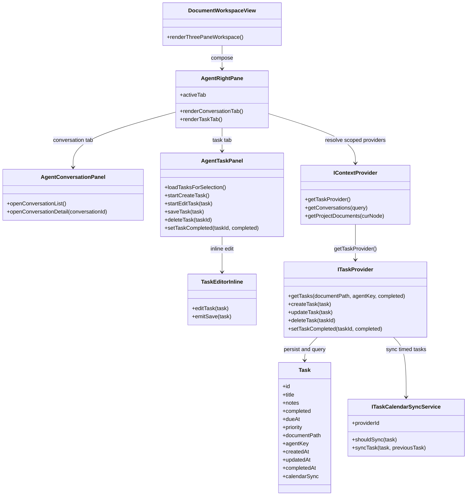

## Context

当前 Agent 工作区架构的职责边界比较清晰：

- `DocumentWorkspaceView` 负责三栏工作区装配。
- `AgentPane` 当前只渲染 `AgentConversationPanel`。
- `IContextProvider` 统一暴露工作区、文档与会话相关能力。

这次变更要引入一个与当前文档 / Project 作用域强相关、但又不属于“会话域”的新右侧面板能力。与此同时，用户明确要求通过独立的 `ITaskProvider` 隔离任务域，但仍然通过 `IContextProvider` 进行解析。

因此本次设计需要同时满足：

- 保持现有以文档为中心的工作区装配方式
- 让 `AgentConversationPanel` 继续只负责会话
- 新增任务能力，但不混合文档任务与 Project 任务列表
- 让新的任务契约贯穿本地、desktop bridge、HTTP context 三条实现链路

## Goals / Non-Goals

**Goals:**

- 为右侧面板增加一个同时承载对话和任务的 Tab 容器。
- 引入独立的 `Task` / `ITaskProvider` 契约，并通过 `IContextProvider` 获取。
- 支持文档级与 Project 级任务，但当前视图始终只解析一个作用域。
- 支持内联创建 / 编辑、显式完成切换，以及已完成任务折叠显示。
- 让 desktop 宿主中的带时间任务同步到 Google Calendar，并应用确定性的提醒规则。
- 保持现有对话列表 / 详情行为不变。

**Non-Goals:**

- 不做全局任务收件箱或跨 Project 聚合。
- 不在中间文档面板内渲染任务。
- 不支持任务归属展示、子任务、重复、标签、附件或用户可配置提醒 UI。
- 不把任务数据并入 `Conversation` 模型，也不复用会话持久化流程。
- 本次不实现 Web 宿主下的 Google Calendar 同步。

## Decisions

### 1. 用带 Tab 的 `AgentRightPane` 替换 `AgentPane`

**Decision**

将现有右侧容器改名，并把职责从“会话挂载点”扩展为“右侧工作区容器”。

需要修改的文件：

- `/Users/quanzhou/Workspace/JARVIS/packages/ui/src/components/AgentPane.vue` → 重命名为 `AgentRightPane.vue`
- `/Users/quanzhou/Workspace/JARVIS/packages/ui/src/components/AgentPane.test.ts` → 重命名为 `AgentRightPane.test.ts`
- `/Users/quanzhou/Workspace/JARVIS/packages/ui/index.ts`
- `/Users/quanzhou/Workspace/JARVIS/packages/ui/src/views/DocumentWorkspaceView.vue`

关键组件签名：

```ts
type AgentRightPaneProps = {
  activeAgent?: ResolvedAgentConfig | null;
  activeAgentKey?: string | null;
  activePath?: string | null;
  selectedNodePath?: string | null;
  activeDocument?: ContextDocument | null;
  showAgentConversationList?: boolean;
  contextProvider?: IContextProvider | null;
  onFileChanged?: ((change: {
    path: string;
    beforeContent: string;
    afterContent: string;
    alreadyPersisted?: boolean;
  }) => void | Promise<void>) | null;
  agentResolutionError?: string | null;
  restoreConversationId?: string | null;
  openConversationRequest?: OpenConversationRequest | null;
};
```

变更说明：

- `AgentRightPane` 成为 `conversations | tasks` 两个 Tab 的状态 owner。
- 它继续像今天的 `AgentPane` 一样把工作区上下文同步到 `chatStore`。
- 在对话 Tab 中渲染 `AgentConversationPanel`，在任务 Tab 中渲染 `AgentTaskPanel`。

**Rationale**

`AgentConversationPanel` 目前已经是会话列表 / 详情 / 工具条动作的专属 owner。如果把任务行为也塞进去，会把两个不同交互模型混在一起，右侧状态也更难维护。

**Alternatives considered**

- 直接在 `AgentConversationPanel` 内增加任务 Tab：拒绝，因为这会模糊会话组件的职责边界。
- 保留 `AgentPane` 名称不变：拒绝，因为它不再只是“会话面板”。

### 2. 增加独立的 `Task` 与 `ITaskProvider` 契约

**Decision**

引入独立任务 provider 契约，并通过 `IContextProvider` 暴露，而不是把任务方法直接平铺到 context 接口上。

需要修改的文件：

- `/Users/quanzhou/Workspace/JARVIS/packages/core/src/interfaces/IContextProvider.ts`
- `/Users/quanzhou/Workspace/JARVIS/packages/core/src/index.ts`
- `/Users/quanzhou/Workspace/JARVIS/packages/core/src/testing/createMockContextProvider.ts`
- 新增 `/Users/quanzhou/Workspace/JARVIS/packages/core/src/interfaces/ITaskProvider.ts`

关键签名：

```ts
export type TaskPriority = 'low' | 'medium' | 'high';

export interface Task {
  id: string;
  title: string;
  notes: string;
  completed: boolean;
  dueAt: number | null;
  priority: TaskPriority | null;
  documentPath: string | null;
  agentKey: string | null;
  createdAt: number;
  updatedAt: number;
  completedAt: number | null;
}

export interface ITaskProvider {
  getTasks(
    documentPath?: string | null,
    agentKey?: string | null,
    completed?: boolean
  ): Promise<Task[]>;
  createTask(task: Task): Promise<Task>;
  updateTask(task: Task): Promise<Task>;
  deleteTask(taskId: string): Promise<void>;
  setTaskCompleted(taskId: string, completed: boolean): Promise<Task>;
}

export interface IContextProvider {
  getTaskProvider(): ITaskProvider;
}
```

变更说明：

- `Task` 成为与 `Conversation` 平行的一类一等协作对象。
- `ITaskProvider` 负责任务查询与写入。
- `IContextProvider` 仍然是工作区能力的统一入口，但通过 `getTaskProvider()` 委托任务域能力。
- 尽管 `createTask` / `updateTask` 使用 `Task` 作为输入，provider 仍可规范化 `id`、`createdAt`、`updatedAt`、`completedAt` 等系统字段。

**Rationale**

这正好符合用户提出的“适度隔离任务域，同时保持统一 context 解析入口”的要求。

**Alternatives considered**

- 直接把 `getTasks/createTask/updateTask/deleteTask` 加到 `IContextProvider`：拒绝，因为会让通用 context 契约继续膨胀。
- 完全独立于 context 之外再建一套 task provider 解析链路：拒绝，因为各宿主将不得不维护第二套 scope 解析入口。

### 3. 在数据层保留任务作用域，在 UI 查询层保持互斥

**Decision**

持久化时保留两种任务作用域，但当前列表永远只解析一种：

- 文档任务：`documentPath != null`
- Project 任务：`documentPath == null && agentKey != null`

需要修改的文件：

- `/Users/quanzhou/Workspace/JARVIS/packages/ui/src/components/AgentTaskPanel.vue`
- `/Users/quanzhou/Workspace/JARVIS/packages/core/src/interfaces/ITaskProvider.ts`
- `/Users/quanzhou/Workspace/JARVIS/packages/node/src/context/FileSystemContextProvider.ts`
- `/Users/quanzhou/Workspace/JARVIS/apps/server/src/providers/databaseContextProvider.ts`

代表性方法：

```ts
async function loadTasksForSelection(): Promise<void>;
function resolveTaskQueryScope(): { documentPath?: string; agentKey?: string };
```

变更说明：

- 当前激活文档时，`AgentTaskPanel` 仅按 `documentPath` 查询。
- 当前激活 Agent owner / Project，且没有激活文档时，仅按 `agentKey` 查询。
- UI 不展示作用域字段，但数据层保留这种区分，以防止错误地重新引入混合聚合。

**Rationale**

需求已经明确拒绝文档 / Project 混合任务视图。把这种规则编码到任务模型中，能让所有 provider 都遵守同一约束。

**Alternatives considered**

- 用统一 `ownerPath` 同时表达两种归属：拒绝，因为 Project scope 和文档 scope 在工作区中的语义不同。
- 先混合查询，再在 UI 层过滤：拒绝，因为这会让不允许的聚合路径更容易被重新带回来。

### 4. 让 task provider 贯穿 HTTP、desktop bridge 与本地 / mock 实现

**Decision**

所有现有 context-provider 实现都需要通过同一个 `getTaskProvider()` 暴露任务能力。

需要修改的文件：

- `/Users/quanzhou/Workspace/JARVIS/packages/node/src/context/FileSystemContextProvider.ts`
- `/Users/quanzhou/Workspace/JARVIS/packages/core/src/providers/context/HttpContextProvider.ts`
- `/Users/quanzhou/Workspace/JARVIS/apps/server/src/services/httpContextService.ts`
- `/Users/quanzhou/Workspace/JARVIS/apps/server/src/routes/context.ts`
- `/Users/quanzhou/Workspace/JARVIS/apps/server/src/types/context.ts`
- `/Users/quanzhou/Workspace/JARVIS/apps/desktop/src/context/createDesktopContextProvider.ts`
- `/Users/quanzhou/Workspace/JARVIS/apps/desktop/src/env.d.ts`
- `/Users/quanzhou/Workspace/JARVIS/apps/desktop/main/preload.ts`
- `/Users/quanzhou/Workspace/JARVIS/apps/desktop/main/contextIpc.ts`
- `/Users/quanzhou/Workspace/JARVIS/packages/core/src/testing/createMockContextProvider.ts`

代表性签名：

```ts
// packages/node/src/context/FileSystemContextProvider.ts
getTaskProvider(): ITaskProvider;

// packages/core/src/providers/context/HttpContextProvider.ts
getTaskProvider(): ITaskProvider;

// apps/server/src/services/httpContextService.ts
getTaskProvider(): ITaskProvider;
```

变更说明：

- 本地 / mock provider 可以先使用内存型 task provider。
- HTTP context 路由增加与 `ITaskProvider` 对应的任务端点。
- desktop preload 与 IPC bridge 透传相同的任务操作，使 renderer 端依然只依赖 `IContextProvider`。

**Rationale**

这样可以保持“所有工作区能力都从 resolved context provider 获取”的既有架构，同时仍然满足任务域隔离。

**Alternatives considered**

- 只在 desktop 中特殊支持任务：拒绝，因为当前工作区已经支持 HTTP context mode。
- 把任务端点放到一个完全独立的 service root 下：拒绝，因为这会把一个逻辑上的 context 能力拆成两套发现路径。

### 5. 在 `AgentTaskPanel` 内使用内联编辑与本地已完成折叠状态

**Decision**

任务编辑使用右侧任务 Tab 内的轻量内联 UI，而不是 modal 或中间面板跳转。

新增文件：

- `/Users/quanzhou/Workspace/JARVIS/packages/ui/src/components/AgentTaskPanel.vue`
- `/Users/quanzhou/Workspace/JARVIS/packages/ui/src/components/TaskEditorInline.vue`
- `/Users/quanzhou/Workspace/JARVIS/packages/ui/src/components/AgentTaskPanel.test.ts`
- `/Users/quanzhou/Workspace/JARVIS/packages/ui/src/components/TaskEditorInline.test.ts`

代表性签名：

```ts
function startCreateTask(): void;
function startEditTask(task: Task): void;
async function saveTask(task: Task): Promise<void>;
async function deleteTask(taskId: string): Promise<void>;
async function setTaskCompleted(taskId: string, completed: boolean): Promise<void>;

type TaskEditorInlineProps = {
  modelValue: Task;
  mode: 'create' | 'edit';
  saving?: boolean;
};
```

变更说明：

- 任务 Tab 展示新增按钮、当前内联编辑区、未完成列表与已完成折叠区。
- 已完成任务默认隐藏，只有用户展开后才显示。
- 设置了 `dueAt` 的任务在列表项中明确展示日期时间信息。

**Rationale**

这与已经确认的产品交互完全一致，也能把任务操作严格限定在用户指定的右侧 panel 内。

**Alternatives considered**

- 使用 modal 编辑：拒绝，因为会打断工作区流。
- 做成类似会话详情的全屏 detail 模式：拒绝，因为任务编辑被明确要求保持轻量。

### 6. 扩展 `Task`，直接在共享任务对象上保存日历同步状态

**Decision**

将外部日历事件关联和同步状态直接保存在 `Task` 上，而不是维护一份单独的映射记录。

需要修改的文件：

- `/Users/quanzhou/Workspace/JARVIS/packages/core/src/interfaces/ITaskProvider.ts`
- `/Users/quanzhou/Workspace/JARVIS/packages/core/src/index.ts`
- `/Users/quanzhou/Workspace/JARVIS/packages/core/src/testing/createMockContextProvider.ts`
- `/Users/quanzhou/Workspace/JARVIS/packages/node/src/context/FileSystemTaskProvider.ts`

关键签名：

```ts
type TaskCalendarSyncStatus = 'not_synced' | 'synced' | 'sync_failed';

interface TaskCalendarSyncState {
  provider: 'google-calendar' | null;
  status: TaskCalendarSyncStatus;
  externalEventId: string | null;
  lastSyncedAt: number | null;
  lastError: string | null;
}

interface Task {
  // existing fields...
  calendarSync: TaskCalendarSyncState;
}
```

变更说明：

- 共享 `Task` 对象现在直接携带外部事件 id 和同步状态，供后续编辑沿用。
- 任务持久化层可在 create/update 过程中直接更新 `calendarSync`，不需要引入第二套查找对象。
- 本次不要求新增 UI 控件，但这些状态可用于诊断和后续恢复流程。

**Rationale**

用户明确要求同步元数据属于任务本身。这能让任务编辑与外部事件更新围绕同一个对象图展开，减少隐式耦合。

**Alternatives considered**

- 使用独立的 task-to-event 映射表：拒绝，因为这会把关键任务生命周期状态藏在第二份持久化结构后面。

### 7. 将 filesystem task-provider 实现移动到单独文件，并在其中组合日历同步

**Decision**

把 filesystem task-provider 的全部逻辑集中到一个独立实现文件中，`FileSystemContextProvider` 只负责装配。

需要修改的文件：

- `/Users/quanzhou/Workspace/JARVIS/packages/node/src/context/FileSystemContextProvider.ts`
- 新增 `/Users/quanzhou/Workspace/JARVIS/packages/node/src/context/FileSystemTaskProvider.ts`

代表性签名：

```ts
export class FileSystemTaskProvider implements ITaskProvider {
  constructor(options: FileSystemTaskProviderOptions) {}

  getTasks(documentPath?: string | null, agentKey?: string | null, completed?: boolean): Promise<Task[]>;
  createTask(task: Task): Promise<Task>;
  updateTask(task: Task): Promise<Task>;
  deleteTask(taskId: string): Promise<void>;
  setTaskCompleted(taskId: string, completed: boolean): Promise<Task>;
}
```

变更说明：

- 现有任务存储辅助逻辑从 `FileSystemContextProvider.ts` 移到一个 task-provider 实现文件。
- 该 provider 同时负责任务持久化、任务规范化，以及 desktop 宿主下的任务到日历同步编排。
- 这样可以在不过度拆分的前提下，把通用 context 职责和任务生命周期逻辑分开。

**Rationale**

当前 context provider 已经承担了较多职责。对本次 change 而言，一个独立 task-provider 文件已经足够，不必继续细拆为多个小模块。

**Alternatives considered**

- 继续把任务逻辑内联在 `FileSystemContextProvider.ts` 中：拒绝，因为带时间任务的日历同步会进一步放大这个文件的复杂度。
- 立刻把 task 逻辑拆成很多子文件：拒绝，因为用户明确要求 filesystem task-provider 逻辑保持在同一个文件中。

### 8. 引入 `ITaskCalendarSyncService`，并以 `GoogleCalendarSyncService` 作为 desktop-only 首个实现

**Decision**

采用 provider 内部的日历同步抽象，以 Google Calendar 作为首个实现，并将宿主范围收敛为 desktop。

需要修改的文件：

- `/Users/quanzhou/Workspace/JARVIS/packages/node/src/context/FileSystemTaskProvider.ts`
- 新增 `/Users/quanzhou/Workspace/JARVIS/packages/node/src/context/GoogleCalendarSyncService.ts`
- `/Users/quanzhou/Workspace/JARVIS/apps/desktop/src/env.d.ts`
- `/Users/quanzhou/Workspace/JARVIS/apps/desktop/main/preload.ts`
- `/Users/quanzhou/Workspace/JARVIS/apps/desktop/main/contextIpc.ts`

关键签名：

```ts
interface TaskCalendarSyncResult {
  provider: 'google-calendar';
  status: 'not_synced' | 'synced' | 'sync_failed';
  externalEventId: string | null;
  lastSyncedAt: number | null;
  lastError: string | null;
}

interface ITaskCalendarSyncService {
  readonly providerId: 'google-calendar' | string;
  shouldSync(task: Task): boolean;
  syncTask(task: Task, previousTask?: Task | null): Promise<TaskCalendarSyncResult>;
}
```

变更说明：

- `FileSystemTaskProvider.createTask()` 和 `updateTask()` 先完成任务持久化，再通过 `ITaskCalendarSyncService` 编排带时间任务同步。
- 该服务通过 Google Calendar REST API + OAuth 2.0 用户授权 + 离线访问工作。
- 提醒生成逻辑包含三组目标提醒时刻，并负责跳过无效的“当天 08:00”提醒以及去重重合提醒。
- 同步失败时只把 `task.calendarSync` 标成 `sync_failed`，不回滚任务写入。

**Rationale**

这个抽象为未来接入更多日历服务预留空间，同时保持当前 UI 契约不变。只支持 desktop，可以把 OAuth 凭据保管限制在可信的本地宿主里，避免把这次 change 扩大成跨宿主认证平台工程。

**Alternatives considered**

- 使用 Codex connector 或 MCP 提供的日历能力：拒绝，因为产品运行时行为不能依赖当前智能体环境。
- 同时实现 web 和 desktop：拒绝，因为 web 宿主下的 OAuth 与凭据托管会显著放大本次 change 范围。
- 当任务失去时间或被删除时立即删除外部事件：拒绝，因为用户已明确将这类行为排除在本次范围外。



## Risks / Trade-offs

- [右侧面板复杂度增加] → 通过最小 tab 容器 + 两个子面板隔离对话和任务状态。
- [provider 能力需要贯穿多条 bridge] → 保持 `IContextProvider` 为唯一解析入口，并在 HTTP / desktop 中复用同一组 `ITaskProvider` 签名。
- [作用域错误导致显示了错误任务] → 在持久化规则与 panel 查询选择中同时编码“文档任务 / Project 任务”约束。
- [内联编辑引入本地状态冲突] → 同一时刻只允许一个活跃编辑区，并在每次写入后重新从 provider 刷新。
- [OAuth 或 token 刷新失败导致日历同步失败] → 将 Google Calendar 同步限制在 desktop 宿主，并把失败状态持久化在 `Task` 上，且不回滚任务写入。
- [边界时间下提醒规则不稳定] → 在 `GoogleCalendarSyncService` 中集中生成提醒，并用测试覆盖“早于 08:00”与“重合去重”路径。

## Migration Plan

1. 在 `packages/core` 中增加任务领域接口与 mock provider 支持。
2. 扩展本地、HTTP、server 与 desktop context-provider 链路，暴露 `getTaskProvider()`。
3. 将 `AgentPane` 重命名为 `AgentRightPane`，并更新所有 import / export。
4. 增加 `AgentTaskPanel` 与 `TaskEditorInline`，接入右侧 Tab 切换。
5. 补充 provider 行为、UI 作用域选择、已完成折叠与内联编辑流程的测试。
6. 为 desktop task-provider 增加 Google Calendar 同步状态、基于 OAuth 的同步服务，以及带时间任务提醒推导逻辑。
7. 增加 desktop 宿主下带时间任务同步成功 / 失败的验证，并确保非日历任务路径保持通过。

回滚策略：

- 回退 `AgentRightPane` 重命名，并移除任务 Tab 接线。
- 从各 context-provider 实现中移除 `getTaskProvider()`，保留现有会话行为不变。

## Open Questions

- 第一版任务持久化究竟应放在 context 数据旁边、sync-backed storage 中，还是抽成单独 repository。
- `dueAt` 的列表呈现第一版是否只显示绝对时间，还是要同时引入 overdue / 相对时间样式。
