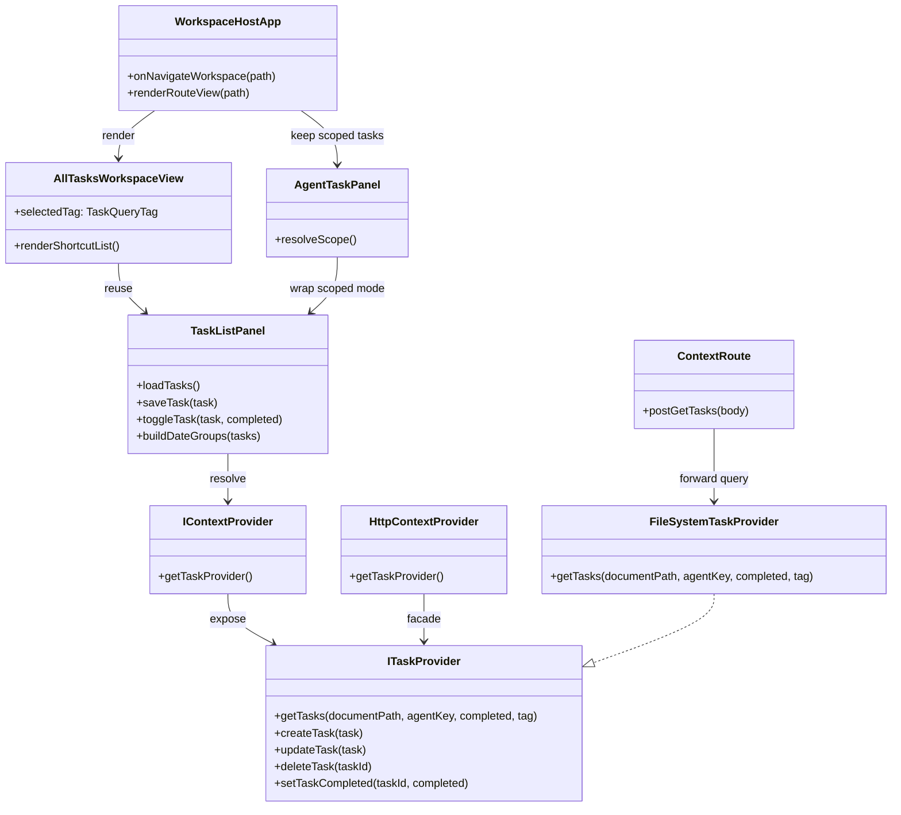

## Context

The current task experience is scoped to the Agent right panel. `AgentTaskPanel` owns both the query logic and the interaction model, and `ITaskProvider.getTasks(documentPath, agentKey, completed)` effectively treats `documentPath = null && agentKey = null` as a narrow ownership case instead of a global query. The requested change introduces a new top-level workspace and also changes the shared task-query semantics, so the implementation crosses `packages/core`, `packages/node`, `packages/ui`, the HTTP context server, and desktop/web/extension routing.

The repo already has an accepted task model and right-panel task interaction pattern. This design keeps those interactions intact, but separates “task-list presentation” from “task scope resolution” so the same list behavior can serve both scoped Agent tasks and the new global all-tasks workspace.

## Goals / Non-Goals

**Goals:**

- Add a top-level `all-tasks` workspace route and host view alongside the existing workspace/chat navigation.
- Define `documentPath = null && agentKey = null` as a global task query across all tasks.
- Extend the shared task query contract with a `tag` filter supporting `all`, `today`, and `planned`.
- Reuse the existing task create/edit/complete/delete interaction model in both Agent-scoped and global task views.
- Render the global `planned` view grouped by calendar date.

**Non-Goals:**

- No task claiming, assignment, ownership transfer, or workload-balancing model.
- No new task entity fields such as subtasks, recurrence, labels, or attachments.
- No rework of Google Calendar synchronization behavior beyond making new query semantics compatible with the existing task model.
- No redesign of the middle document pane or chat workflows.

## Decisions

### 1. Introduce a reusable `TaskListPanel` and make `AgentTaskPanel` a thin scope wrapper

**Decision**

Extract the current task list UI and mutations from `AgentTaskPanel.vue` into a reusable `TaskListPanel.vue`. `AgentTaskPanel.vue` remains as a thin wrapper that resolves the current document/agent scope and forwards it to the shared list component.

Files to add/change:

- Add `/Users/quanzhou/Workspace/JARVIS/packages/ui/src/components/TaskListPanel.vue`
- Change `/Users/quanzhou/Workspace/JARVIS/packages/ui/src/components/AgentTaskPanel.vue`
- Add or update tests under:
  - `/Users/quanzhou/Workspace/JARVIS/packages/ui/src/components/TaskListPanel.test.ts`
  - `/Users/quanzhou/Workspace/JARVIS/packages/ui/src/components/AgentTaskPanel.test.ts`

Key props / signatures:

```ts
type TaskQueryTag = 'all' | 'today' | 'planned';

type TaskListPanelProps = {
  contextProvider?: IContextProvider | null;
  documentPath?: string | null;
  agentKey?: string | null;
  tag?: TaskQueryTag | null;
  groupByDate?: boolean;
};

async function loadTasks(): Promise<void>;
async function saveTask(task: Task): Promise<void>;
async function toggleTask(task: Task, completed: boolean): Promise<void>;
```

Change description:

- `TaskListPanel` becomes the owner of loading, creating, editing, deleting, and completion toggling.
- `AgentTaskPanel` only resolves scope:
  - active document => `documentPath = activeDocument.path`, `agentKey = activeAgentKey`
  - active agent/project with no document => `documentPath = null`, `agentKey = activeAgentKey`
- `AllTasksWorkspaceView` uses the same `TaskListPanel` with `documentPath = null`, `agentKey = null`, and a selected `tag`.
- `groupByDate` is enabled only for the global `planned` view so the scoped Agent view stays visually stable.

**Rationale**

This keeps the interaction model in one place and avoids cloning task-row, editor, and completion behavior into a second screen.

**Alternatives considered**

- Keep `AgentTaskPanel` intact and build a second all-tasks list component: rejected because the task interaction code would drift immediately.
- Push date grouping down into a separate view-only wrapper: rejected because grouping changes how the same tasks are rendered and belongs naturally in the shared list component.

### 2. Redefine null/null as a global query and add tag-based filtering at the provider layer

**Decision**

Change the shared task-provider contract so `getTasks(null, null, completed, tag)` means “query all tasks”, and make provider implementations apply `today` / `planned` filtering before returning results.

Files to add/change:

- Change `/Users/quanzhou/Workspace/JARVIS/packages/core/src/interfaces/ITaskProvider.ts`
- Change `/Users/quanzhou/Workspace/JARVIS/packages/node/src/context/FileSystemTaskProvider.ts`
- Change `/Users/quanzhou/Workspace/JARVIS/packages/core/src/testing/createMockContextProvider.ts`
- Change `/Users/quanzhou/Workspace/JARVIS/packages/core/src/providers/context/HttpContextProvider.ts`
- Change `/Users/quanzhou/Workspace/JARVIS/apps/server/src/services/httpContextService.ts`
- Change `/Users/quanzhou/Workspace/JARVIS/apps/server/src/routes/context.ts`
- Change `/Users/quanzhou/Workspace/JARVIS/apps/desktop/src/context/createDesktopContextProvider.ts`
- Change `/Users/quanzhou/Workspace/JARVIS/apps/desktop/main/contextIpc.ts`
- Change `/Users/quanzhou/Workspace/JARVIS/apps/desktop/main/preload.ts`
- Change `/Users/quanzhou/Workspace/JARVIS/apps/desktop/src/env.d.ts`

Key signature:

```ts
export type TaskQueryTag = 'all' | 'today' | 'planned';

export interface ITaskProvider {
  getTasks(
    documentPath?: string | null,
    agentKey?: string | null,
    completed?: boolean,
    tag?: TaskQueryTag | null
  ): Promise<Task[]>;
}
```

Change description:

- Scope precedence remains:
  - `documentPath != null` => document-scoped query
  - `documentPath == null && agentKey != null` => agent/project-scoped query
  - `documentPath == null && agentKey == null` => global query
- Provider-side tag filtering:
  - `all`: no date subset filter
  - `today`: `dueAt` falls on the local current day
  - `planned`: `dueAt` is non-null and strictly greater than `Date.now()`
- Filtering stays in providers and facades so all hosts resolve the same subset from the same API contract.

**Rationale**

The user explicitly asked for a more general contract instead of a UI-only flag like `includeAllScopes`. Provider-side filtering also prevents each host from inventing slightly different interpretations of `today` and `planned`.

**Alternatives considered**

- Add a separate `getAllTasks(tag)` API: rejected because it splits one query model into special-case methods.
- Keep null/null behavior unchanged and add another boolean flag: rejected because it makes the main query semantics harder to reason about.

### 3. Add an `all-tasks` workspace route and keep it parallel to existing workspace/chat navigation

**Decision**

Introduce a dedicated top-level route and view for global tasks, managed by the same top-level workspace host and switcher used for Workspace/Chat/Compare.

Files to add/change:

- Add `/Users/quanzhou/Workspace/JARVIS/packages/ui/src/views/AllTasksWorkspaceView.vue`
- Change `/Users/quanzhou/Workspace/JARVIS/packages/ui/src/views/WorkspaceHostApp.vue`
- Change `/Users/quanzhou/Workspace/JARVIS/packages/ui/src/routes.ts`
- Change `/Users/quanzhou/Workspace/JARVIS/packages/ui/src/components/AppTopBar.vue`
- Change:
  - `/Users/quanzhou/Workspace/JARVIS/apps/web/src/router.ts`
  - `/Users/quanzhou/Workspace/JARVIS/apps/desktop/src/router.ts`
  - `/Users/quanzhou/Workspace/JARVIS/apps/extension/src/router.ts`

Key signatures:

```ts
export type ChatRoutePath = '/' | '/knowledge' | '/chat' | '/compare' | '/all-tasks';

function normalizeHash(hash: string): ChatRoutePath;
function onNavigateWorkspace(path: ChatRoutePath): Promise<void>;
```

Change description:

- `AllTasksWorkspaceView` is a two-pane workspace:
  - left shortcut pane for `today` and `planned`
  - main pane with `TaskListPanel`
- `WorkspaceHostApp` chooses this view when the active route is `/all-tasks`.
- `PRIMARY_WORKSPACE_ROUTES` includes the new route so the top switcher exposes it alongside the current primary workspace destinations.

**Rationale**

The user asked for a global task view “平级” to existing workspaces, so this belongs in the route-level host instead of being embedded under the Agent panel or Conversation workspace.

**Alternatives considered**

- Add a third tab inside `AgentRightPane`: rejected because that would still make all-tasks subordinate to Agent context.
- Reuse `/chat` with a different sidebar mode: rejected because task browsing is not a conversation-history variant.

### 4. Group planned tasks by day in the UI, not by introducing new persistence structure

**Decision**

Keep the persisted task shape flat and compute grouped planned-task sections in the UI render layer.

Files to add/change:

- Change `/Users/quanzhou/Workspace/JARVIS/packages/ui/src/components/TaskListPanel.vue`
- Add date-group rendering tests in `/Users/quanzhou/Workspace/JARVIS/packages/ui/src/components/TaskListPanel.test.ts`

Representative internal helpers:

```ts
type TaskDateGroup = {
  dateKey: string;
  label: string;
  tasks: Task[];
};

function buildDateGroups(tasks: Task[]): TaskDateGroup[];
function formatTaskGroupLabel(dateKey: string): string;
```

Change description:

- The all-tasks planned view computes day buckets from the already filtered future tasks.
- Sorting within groups remains time-first, then updated-at fallback.
- The flat task array from providers stays unchanged, which keeps create/update/delete and persistence logic simple.

**Rationale**

Grouping is a presentation concern. Putting grouped structures into providers would complicate every host and test surface for no data-model benefit.

**Alternatives considered**

- Return grouped tasks from providers: rejected because it leaks one screen’s view model into the shared contract.

## Risks / Trade-offs

- [Risk] `today` filtering can vary by host timezone if implemented inconsistently. → Mitigation: centralize the predicate shape in provider implementations and cover it with targeted tests using concrete local-time examples.
- [Risk] Reinterpreting null/null from “unowned tasks” to “all tasks” could change any hidden callers that depended on the old behavior. → Mitigation: update all known call sites in the repo and add explicit tests for global queries.
- [Risk] Date grouping could make the global planned list feel different from the Agent-scoped list. → Mitigation: keep grouping opt-in via `groupByDate` and only enable it for the all-tasks planned view.
- [Risk] Top-level route expansion can subtly break workspace-switch state assumptions. → Mitigation: cover `WorkspaceHostApp` route selection and top-bar route rendering with focused UI tests.

## Migration Plan

- No persisted task data migration is required because task records remain flat and keep the same fields.
- Roll out by landing the shared query-contract change first, then wiring the UI route/view against that contract in the same change.
- Rollback is straightforward:
  - remove `/all-tasks` route/view exposure
  - revert `getTasks(..., tag)` contract changes and facade forwarding
  - keep existing task records untouched

## Open Questions

- None for this proposal. The accepted semantics are:
  - `documentPath = null && agentKey = null` means global query
  - `planned` means `dueAt` exists and is in the future, including later today
  - `planned` is grouped by calendar day in the all-tasks workspace


