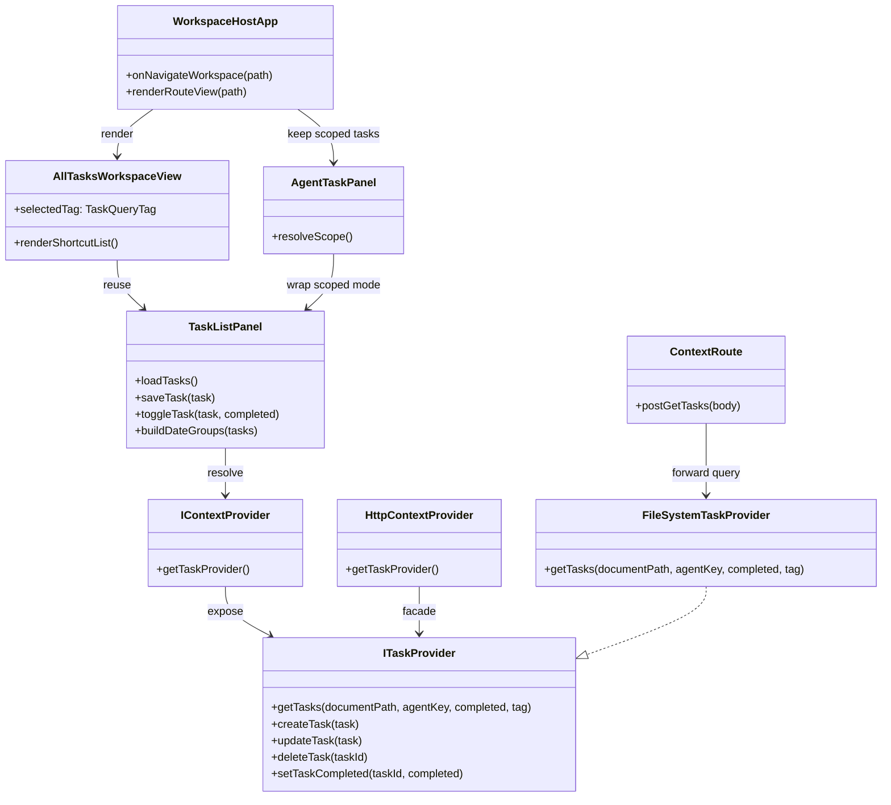

## Context

当前任务体验只存在于 Agent 右侧面板中。`AgentTaskPanel` 同时承担查询逻辑和交互逻辑，而 `ITaskProvider.getTasks(documentPath, agentKey, completed)` 目前实际上把 `documentPath = null && agentKey = null` 解释成一个狭义归属场景，而不是全局查询。此次需求同时引入新的顶层工作区，并改变共享任务查询语义，因此实现会横跨 `packages/core`、`packages/node`、`packages/ui`、HTTP context server 以及 desktop/web/extension 路由。

仓库里已经有已接受的任务模型和右侧面板任务交互模式。本设计保留这些交互，但把“任务列表展示”与“任务作用域解析”拆开，使同一套列表能力既能服务 Agent 作用域任务，也能服务新的全局 all-tasks 工作区。

## Goals / Non-Goals

**Goals:**

- 增加一个顶层 `all-tasks` 工作区路由和宿主视图，与现有 workspace/chat 导航平级。
- 将 `documentPath = null && agentKey = null` 定义为“查询全部任务”。
- 为共享任务查询契约增加 `tag` 过滤，支持 `all`、`today`、`planned`。
- 在 Agent 作用域视图和全局任务视图之间复用现有任务的创建、编辑、完成、删除交互模型。
- 将全局 `planned` 视图按日历日期分组展示。

**Non-Goals:**

- 不引入任务领取、分配、所有权转移或工作量均衡模型。
- 不增加子任务、重复、标签、附件等新的任务字段。
- 不改造 Google Calendar 同步行为，只保证新查询语义与现有任务模型兼容。
- 不重做中间文档 pane 或 chat 工作流。

## Decisions

### 1. 引入可复用的 `TaskListPanel`，让 `AgentTaskPanel` 退化为作用域包装层

**Decision**

把当前 `AgentTaskPanel.vue` 中的任务列表 UI 与任务变更逻辑抽到可复用的 `TaskListPanel.vue`。`AgentTaskPanel.vue` 保留为一层很薄的包装，只负责解析当前 document/agent scope 并传给共享列表组件。

Files to add/change:

- Add `/Users/quanzhou/Workspace/JARVIS/packages/ui/src/components/TaskListPanel.vue`
- Change `/Users/quanzhou/Workspace/JARVIS/packages/ui/src/components/AgentTaskPanel.vue`
- Add or update tests under:
  - `/Users/quanzhou/Workspace/JARVIS/packages/ui/src/components/TaskListPanel.test.ts`
  - `/Users/quanzhou/Workspace/JARVIS/packages/ui/src/components/AgentTaskPanel.test.ts`

Key props / signatures:

```ts
type TaskQueryTag = 'all' | 'today' | 'planned';

type TaskListPanelProps = {
  contextProvider?: IContextProvider | null;
  documentPath?: string | null;
  agentKey?: string | null;
  tag?: TaskQueryTag | null;
  groupByDate?: boolean;
};

async function loadTasks(): Promise<void>;
async function saveTask(task: Task): Promise<void>;
async function toggleTask(task: Task, completed: boolean): Promise<void>;
```

Change description:

- `TaskListPanel` 成为任务加载、创建、编辑、删除、完成切换的统一所有者。
- `AgentTaskPanel` 只负责解析 scope：
  - 有激活文档时 => `documentPath = activeDocument.path`，`agentKey = activeAgentKey`
  - 只有 agent/project 且无文档时 => `documentPath = null`，`agentKey = activeAgentKey`
- `AllTasksWorkspaceView` 复用同一个 `TaskListPanel`，但传入 `documentPath = null`、`agentKey = null` 和当前选中的 `tag`。
- `groupByDate` 只在全局 `planned` 视图开启，保证现有 Agent 作用域视图的视觉行为不被意外改变。

**Rationale**

这样可以把交互模型收敛在一个地方，避免在第二个屏幕中复制任务行、编辑器和完成状态逻辑。

**Alternatives considered**

- 保持 `AgentTaskPanel` 原样，再单独做第二个全局任务列表组件：拒绝，因为任务交互代码会立即分叉。
- 把日期分组放在单独的视图包装层里：拒绝，因为分组本身就是同一批任务的展示方式变化，天然属于共享列表组件。

### 2. 将 null/null 重新定义为全局查询，并在 provider 层增加 tag 过滤

**Decision**

修改共享 task provider 契约，使 `getTasks(null, null, completed, tag)` 表示“查询全部任务”，并由 provider 实现统一应用 `today` / `planned` 过滤。

Files to add/change:

- Change `/Users/quanzhou/Workspace/JARVIS/packages/core/src/interfaces/ITaskProvider.ts`
- Change `/Users/quanzhou/Workspace/JARVIS/packages/node/src/context/FileSystemTaskProvider.ts`
- Change `/Users/quanzhou/Workspace/JARVIS/packages/core/src/testing/createMockContextProvider.ts`
- Change `/Users/quanzhou/Workspace/JARVIS/packages/core/src/providers/context/HttpContextProvider.ts`
- Change `/Users/quanzhou/Workspace/JARVIS/apps/server/src/services/httpContextService.ts`
- Change `/Users/quanzhou/Workspace/JARVIS/apps/server/src/routes/context.ts`
- Change `/Users/quanzhou/Workspace/JARVIS/apps/desktop/src/context/createDesktopContextProvider.ts`
- Change `/Users/quanzhou/Workspace/JARVIS/apps/desktop/main/contextIpc.ts`
- Change `/Users/quanzhou/Workspace/JARVIS/apps/desktop/main/preload.ts`
- Change `/Users/quanzhou/Workspace/JARVIS/apps/desktop/src/env.d.ts`

Key signature:

```ts
export type TaskQueryTag = 'all' | 'today' | 'planned';

export interface ITaskProvider {
  getTasks(
    documentPath?: string | null,
    agentKey?: string | null,
    completed?: boolean,
    tag?: TaskQueryTag | null
  ): Promise<Task[]>;
}
```

Change description:

- 作用域优先级保持不变：
  - `documentPath != null` => 文档作用域查询
  - `documentPath == null && agentKey != null` => agent/project 作用域查询
  - `documentPath == null && agentKey == null` => 全局查询
- provider 层 tag 过滤：
  - `all`：不做日期子集过滤
  - `today`：`dueAt` 落在本地当前日期
  - `planned`：`dueAt` 非空且严格大于 `Date.now()`
- 过滤逻辑放在 provider 和 facade 中统一处理，保证各宿主行为一致。

**Rationale**

用户明确要求更通用的契约，而不是增加一个 UI 专用布尔开关如 `includeAllScopes`。同时，provider 层过滤可以避免不同宿主对 `today`、`planned` 做出略有差异的实现。

**Alternatives considered**

- 增加一个单独的 `getAllTasks(tag)` API：拒绝，因为这会把同一套查询模型拆成特殊方法。
- 保持 null/null 旧语义，再补一个 boolean flag：拒绝，因为主查询语义会变得更难理解。

### 3. 增加 `all-tasks` 工作区路由，并保持其与现有 workspace/chat 导航平级

**Decision**

引入一个专门的顶层路由和视图来承载全局任务，由现有顶层工作区宿主和切换器统一管理。

Files to add/change:

- Add `/Users/quanzhou/Workspace/JARVIS/packages/ui/src/views/AllTasksWorkspaceView.vue`
- Change `/Users/quanzhou/Workspace/JARVIS/packages/ui/src/views/WorkspaceHostApp.vue`
- Change `/Users/quanzhou/Workspace/JARVIS/packages/ui/src/routes.ts`
- Change `/Users/quanzhou/Workspace/JARVIS/packages/ui/src/components/AppTopBar.vue`
- Change:
  - `/Users/quanzhou/Workspace/JARVIS/apps/web/src/router.ts`
  - `/Users/quanzhou/Workspace/JARVIS/apps/desktop/src/router.ts`
  - `/Users/quanzhou/Workspace/JARVIS/apps/extension/src/router.ts`

Key signatures:

```ts
export type ChatRoutePath = '/' | '/knowledge' | '/chat' | '/compare' | '/all-tasks';

function normalizeHash(hash: string): ChatRoutePath;
function onNavigateWorkspace(path: ChatRoutePath): Promise<void>;
```

Change description:

- `AllTasksWorkspaceView` 是一个两栏工作区：
  - 左侧快捷过滤栏：`today`、`planned`
  - 主栏：`TaskListPanel`
- `WorkspaceHostApp` 在当前路由为 `/all-tasks` 时渲染该视图。
- `PRIMARY_WORKSPACE_ROUTES` 纳入新路由，使顶部切换器把它作为一级工作区入口展示。

**Rationale**

用户要求这是与现有工作区“平级”的视图，因此它应该属于 route-level host，而不是塞进 Agent 面板或 Conversation workspace。

**Alternatives considered**

- 在 `AgentRightPane` 里再加第三个 tab：拒绝，因为这仍然让 all-tasks 依附于 Agent 上下文。
- 复用 `/chat`，只切换不同 sidebar 模式：拒绝，因为任务浏览不是会话历史的一个变体。

### 4. `planned` 按天分组只在 UI 渲染层实现，不引入新的持久化结构

**Decision**

保持持久化的任务数据结构为平面数组，在 UI 渲染层计算 `planned` 的日期分组。

Files to add/change:

- Change `/Users/quanzhou/Workspace/JARVIS/packages/ui/src/components/TaskListPanel.vue`
- Add date-group rendering tests in `/Users/quanzhou/Workspace/JARVIS/packages/ui/src/components/TaskListPanel.test.ts`

Representative internal helpers:

```ts
type TaskDateGroup = {
  dateKey: string;
  label: string;
  tasks: Task[];
};

function buildDateGroups(tasks: Task[]): TaskDateGroup[];
function formatTaskGroupLabel(dateKey: string): string;
```

Change description:

- all-tasks 的 planned 视图从 provider 已过滤好的未来任务中计算按天 bucket。
- 组内排序保持“时间优先，其次 updatedAt 兜底”。
- provider 返回的任务数组仍保持平面结构，从而保持 create/update/delete 与持久化逻辑简单稳定。

**Rationale**

分组是展示层关注点。把 grouped structure 放进 provider 会把某一个页面的 view model 泄露到共享契约里。

**Alternatives considered**

- 让 provider 直接返回分组后的任务：拒绝，因为这会把单个页面的展示模型污染到共享接口。

## Risks / Trade-offs

- [Risk] 如果 `today` 过滤在不同宿主上实现不一致，会受到时区影响。 → Mitigation: 在 provider 实现中收敛谓词形态，并用具体本地时间样例补测试。
- [Risk] 把 null/null 从“无归属任务”改成“全部任务”，可能影响任何隐式依赖旧语义的调用方。 → Mitigation: 更新仓库内所有已知调用点，并补显式全局查询测试。
- [Risk] 日期分组会让全局 planned 列表与 Agent 作用域列表的视觉行为不同。 → Mitigation: 通过 `groupByDate` 显式控制，只在 all-tasks planned 视图开启。
- [Risk] 顶层路由扩展可能轻微破坏现有 workspace 切换状态假设。 → Mitigation: 用聚焦测试覆盖 `WorkspaceHostApp` 路由选择和 top bar 路由渲染。

## Migration Plan

- 不需要做任务持久化数据迁移，因为任务记录仍保持平面结构，字段也不变。
- 落地顺序是：先改共享查询契约，再在同一个 change 中接入新的 UI 路由/视图。
- 回滚也直接：
  - 去掉 `/all-tasks` 路由与视图暴露
  - 回退 `getTasks(..., tag)` 契约与各 facade 转发
  - 已有任务数据保持不动

## Open Questions

- 本提案没有未决问题。已确认的语义为：
  - `documentPath = null && agentKey = null` 表示全局查询
  - `planned` 表示 `dueAt` 存在且在未来，包含“今天稍后”
  - `planned` 在 all-tasks 工作区中按日历日期分组展示


