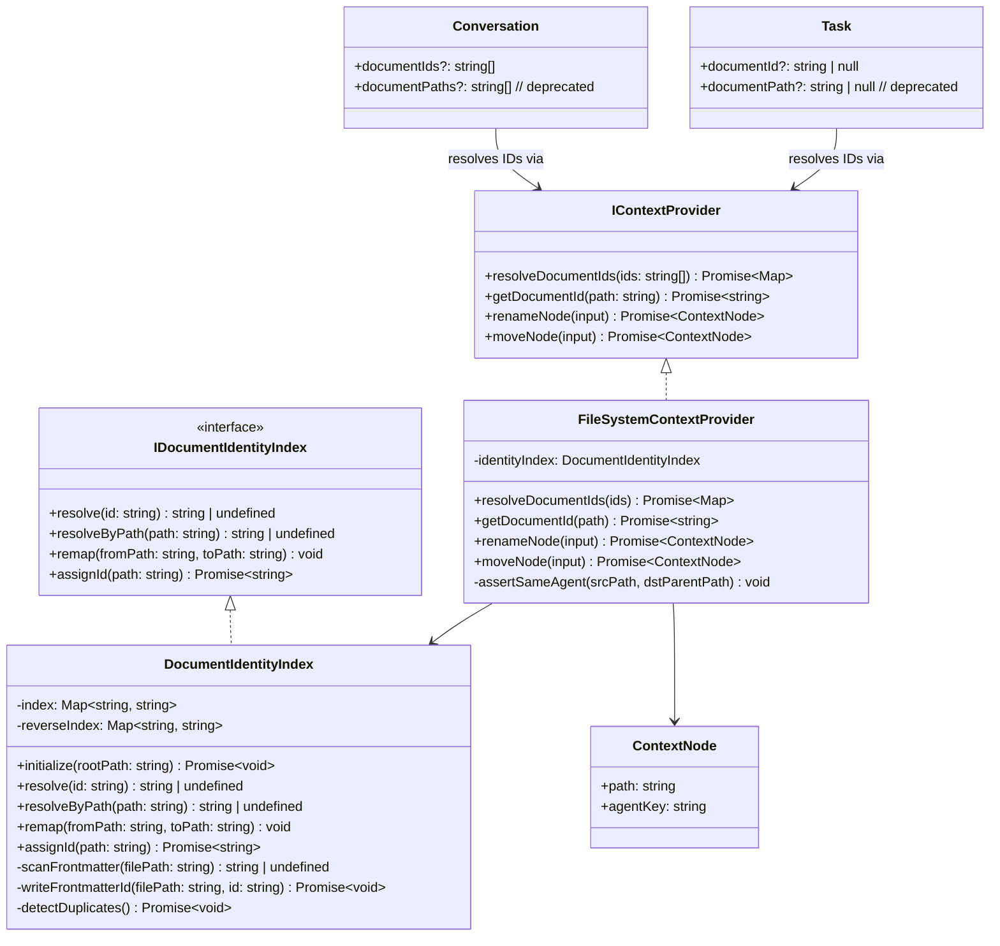

English | [Chinese](design.zh-CN.md)

## Context

Documents in the knowledge workspace are currently identified solely by their virtual path (e.g., `/docs/guide.md`). `Conversation.documentPaths`, `Conversation.archive.documentPath`, and `Task.documentPath` all store these paths as raw strings. When a document is renamed or moved within its agent, every persisted reference silently becomes invalid.

The solution is to assign each `.md` document a stable, immutable ID stored in YAML frontmatter. A lightweight in-memory index (`DocumentIdentityIndex`) maps ID → current path and is rebuilt from frontmatter scans at workspace initialization. Conversations and tasks then reference documents by ID, not path.

## Goals / Non-Goals

**Goals:**
- Stable identity: rename/move within an agent does not break conversation or task associations.
- Zero-cost rename/move: only the in-memory index needs updating; no relational data is rewritten.
- Agent-absolute paths for document-internal references (images, linked documents), so the referencing document can also move freely within its agent.
- Hard guard against cross-agent moves.
- `.md`-only scope; non-markdown files and directories are excluded.

**Non-Goals:**
- Cross-agent moves (deferred; ID system supports it, guard will be lifted in a future change).
- Non-markdown file identity (pdf, png, binary).
- Directory identity.
- Conflict-free distributed ID generation (single workspace, single writer assumed).
- Automatic link rewriting in document content when the *target* document moves (out of scope; agent-absolute paths mitigate this for resources, doc-to-doc links still depend on stable filenames).

---

## Decisions

### Decision 1 — ID storage: YAML frontmatter only, no persistent index file

**Chosen:** Store the ID in `---\njarvis_id: <ulid>\n---` at the top of each `.md` file. Build an in-memory `Map<id, path>` at workspace init by scanning all `.md` frontmatter. No `.jarvis/index.json` or sidecar files.

**Why over alternatives:**
- A persistent index adds a second source of truth and a class of sync-conflict bugs.
- Frontmatter travels with the file under `fs.rename` — the most reliable coupling available without OS-level inode tracking.
- In-memory rebuild is fast enough (a few hundred `.md` files at typical workspace scale) and avoids stale-index bugs.
- ULID prefix `jarvis_id` avoids collision with other tools' `id` fields (Obsidian, Hugo).

**Accepted limitation:** External `cp a.md b.md` creates two files with identical `jarvis_id`. Detected at init scan; the later-modified file gets a new ID assigned and its `jarvis_id` is rewritten.

---

### Decision 2 — Agent boundary definition for cross-agent guard

**Chosen:** The agent of a document is the **nearest ancestor directory that has an `agentKey` in `WorkspaceContext.nodes`**. This reuses the existing `agentKey` derivation in `FileSystemContextProvider` (see `buildContextNode`). A cross-agent move is one where `source.agentKey !== target.agentKey`.

**Why:** `agentKey` is already the canonical agent scope identifier throughout the codebase. Reusing it avoids a parallel "agent boundary" concept.

---

### Decision 3 — Migration strategy: lazy, single-pass, no double-write

**Chosen:** When the workspace provider initialises and scans frontmatter, any `.md` file without `jarvis_id` gets one assigned immediately (frontmatter rewrite). Conversation/task records still using `documentPaths`/`documentPath` are resolved to IDs at first load and migrated in-place (single pass, no double-write window).

**Why:** Double-write increases write surface and creates divergence risks. A single migration pass with a clear version stamp is simpler to reason about and roll back.

**Rollback:** A workspace schema version flag (`jarvis_schema: 1` in the workspace root `.jarvis-meta.json`) is written only after migration completes. On rollback, clear the flag and re-open with the previous app version, which reads `documentPaths` directly.

---

### Decision 4 — Outgoing link rewrite on move (standard relative paths, no custom syntax)

**Chosen:** Keep standard relative paths (`./`, `../`) for all Markdown image and document links. When a document is moved within its agent, rewrite only that document's outgoing relative references to reflect the new location using `path.relative(newDir, resolvedTarget)`. No new path syntax is introduced.

```
Before move:  /agent/docs/guide.md  →  
After move to /agent/notes/guide.md  →  
```

**Why over `@/` custom prefix:**
- `@/` renders as a broken image/link in GitHub, VSCode preview, Obsidian, and all standard Markdown tooling — a silent failure visible to collaborators.
- Outgoing link rewrite produces standard relative paths that are valid in every external tool.
- Rewrite scope is minimal: only the one moved document, not all files in the workspace. The calculation is pure `path.relative` arithmetic — no AST scanning of other files.

**`references/` directory constraint:** Moving `references/` in isolation is disallowed in the UI (it may only move as part of its parent directory). This prevents dangling references to assets that can only be fixed by full-tree rewriting.

**Existing paths unaffected:** Legacy documents with existing relative paths are never automatically rewritten; rewriting only occurs when the referencing document itself is explicitly moved or renamed.

---

## Files Added / Changed

### New files

| File | Description |
|---|---|
| `packages/core/src/interfaces/IDocumentIdentity.ts` | `DocumentIdentity { id, currentPath }` type; `IDocumentIdentityIndex` interface |
| `packages/node/src/context/DocumentIdentityIndex.ts` | In-memory index: scan, rebuild, update, resolve; frontmatter read/write via `gray-matter` or inline parser |
| `packages/node/src/context/DocumentIdentityIndex.test.ts` | Unit tests: init scan, duplicate-ID detection, cross-agent guard |

### Changed files

| File | Change |
|---|---|
| `packages/core/src/interfaces/IContextProvider.ts` | Add `resolveDocumentIds(ids: string[]): Promise<Map<string, ContextNode \| null>>` and `getDocumentId(path: string): Promise<string>` to `IContextProvider`; add `DocumentIdentityChanged` event |
| `packages/core/src/interfaces/Conversation.ts` | Add `documentIds?: string[]`; mark `documentPaths` deprecated; add `archive.documentId` alongside `archive.documentPath` |
| `packages/core/src/interfaces/ITaskProvider.ts` | Add `documentId?: string | null` to `Task`; mark `documentPath` deprecated |
| `packages/core/src/testing/createMockContextProvider.ts` | Implement `resolveDocumentIds`, `getDocumentId`; `remapNodeSubtree` also updates in-memory ID index |
| `packages/node/src/context/FileSystemContextProvider.ts` | Instantiate `DocumentIdentityIndex`; wire `renameNode`/`moveNode` to call `index.remap(from, to)` before returning; add cross-agent guard in `moveNode`; implement `resolveDocumentIds`, `getDocumentId` |
| `packages/node/src/context/FileSystemTaskProvider.ts` | `getTasks` accepts `documentId` param; `createTask`/`updateTask` accept `documentId` |
| `packages/ui/src/store/documentWorkspace.ts` | `renameNode`/`moveNode` receive cross-agent error and surface it as a user-facing error message |
| `packages/ui/src/store/chat.ts` | `currentConversation.documentIds`; `linkDocumentToConversation` uses ID; conversation list renders document name via `resolveDocumentIds` |
| `packages/ui/src/utils/markdownDocument.ts` | New helper `rewriteOutgoingLinks(markdown, fromDir, toDir): string` — rewrites all relative image/link paths using `path.relative` after a document move |
| `apps/server/src/repositories/syncRepository.ts` | Persist `documentIds` JSON column alongside deprecated `documentPaths`; migration query: back-fill IDs from paths using workspace file scan |
| `apps/server/src/types/sync.ts` | Add `documentIds?: string[]` to `SyncConversation`; deprecate `documentPaths` |
| `apps/desktop/main/contextIpc.ts` | Add IPC handlers for `resolveDocumentIds`, `getDocumentId` |
| `apps/desktop/shared/contextBridge.ts` | Expose `resolveDocumentIds`, `getDocumentId` through preload bridge |

---

## Class Diagram



---

## Risks / Trade-offs

| Risk | Mitigation |
|---|---|
| External `cp` creates duplicate `jarvis_id` | Detected at init scan; newer-mtime file gets re-assigned. Log warning. |
| `gray-matter` round-trip corrupts user-authored frontmatter (comments, ordering) | Use `gray-matter` with `{ engines: { yaml: ... } }` in stringify-only mode on the `data` section; preserve raw `content` body unchanged. Fallback: minimal regex-based insert that only prepends a `jarvis_id` line without touching existing YAML. |
| Large workspace cold-start scan latency | Benchmark at 1000 files. If >500 ms, scan lazily (open file → assign ID on demand) and skip pre-scan; reverse lookup then requires a lazy fallback scan scoped to agent directory. |
| Migration fails mid-run (crash, power loss) | Check `jarvis_schema` version flag; re-run migration is idempotent (skip files that already have `jarvis_id`). |
| Cross-agent guard too strict (nested agents, future restructure) | Guard is only in `IContextProvider.moveNode`. UI surfaces a clear error. Can be lifted per-agent-pair in a future change without touching ID system. |
| Outgoing link rewrite corrupts document content on write failure | Perform rewrite in-memory first; only call `writeDocument` after the new content is fully computed. On write failure the document stays at original content with the old relative paths (still valid at original location). |

---

## Migration Plan

1. **App startup** — `FileSystemContextProvider.initializeAccess()` calls `DocumentIdentityIndex.initialize(rootPath)`:
   - Scans all `.md` files in workspace.
   - Assigns `jarvis_id` to any file missing one (writes frontmatter).
   - Detects and resolves duplicate IDs.
2. **Conversation/task migration** — On first load, `syncRepository` / `IndexedDB` back-fill pass:
   - For each conversation with `documentPaths` and no `documentIds`: resolve paths → IDs via `getDocumentId`; write `documentIds`; clear `documentPaths`.
   - For each task with `documentPath` and no `documentId`: same.
   - Write `jarvis_schema: 1` to `.jarvis-meta.json` on completion.
3. **Rollback** — Remove `jarvis_schema: 1`; deploy previous app version. Old code reads `documentPaths` (still present during transition window if double-write is desired; otherwise accept conversations show no linked document until re-linked manually).

---

## Open Questions

1. **Workspace root `.jarvis-meta.json`** — Should this be a new file or extend the existing agent config? Needs agreement with the desktop team on where workspace-level metadata lives.
2. **`gray-matter` dependency** — Already used in the project? If not, evaluate vs. a minimal inline frontmatter parser to avoid adding a new npm dependency.
3. **ID assignment timing** — On every file open (noisy git diffs) or only on first association? Recommend "first association" (first time a conversation/task links the document) to minimise unexpected git noise.
