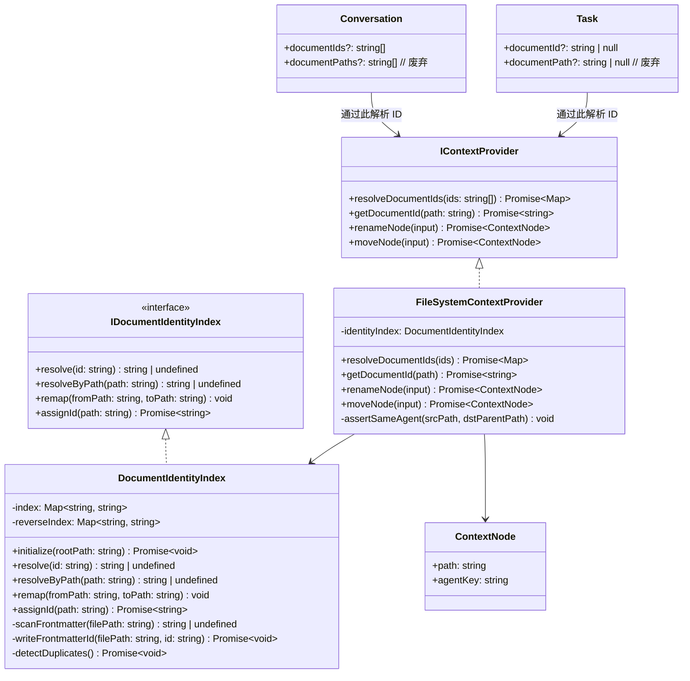

中文 | [English](design.md)

## 背景

知识工作区中的文档目前仅通过虚拟路径（如 `/docs/guide.md`）标识。`Conversation.documentPaths`、`Conversation.archive.documentPath` 和 `Task.documentPath` 都以原始字符串存储这些路径。当文档在其 agent 内改名或移动时，所有持久化引用都会静默失效。

解决方案是为每个 `.md` 文档分配一个存储在 YAML frontmatter 中的稳定不可变 ID。轻量级内存索引（`DocumentIdentityIndex`）映射 ID → 当前路径，在工作区初始化时通过扫描 frontmatter 重建。对话和任务通过 ID（而非路径）引用文档。

## 目标 / 非目标

**目标：**
- 稳定身份：agent 内改名/移动不会破坏对话或任务关联。
- 零成本改名/移动：只需更新内存索引，无需重写任何关系数据。
- 文档内部引用（图片、链接文档）使用 agent 绝对路径，使引用方文档也可在 agent 内自由移动。
- 对跨 agent 移动进行硬拦截。
- 仅限 `.md` 文件；非 markdown 文件和目录不在范围内。

**非目标：**
- 跨 agent 移动（延后；ID 体系支持，将在后续 change 中解除限制）。
- 非 markdown 文件身份（pdf、png、二进制）。
- 目录身份。
- 无冲突分布式 ID 生成（假设单工作区、单写入方）。
- 目标文档移动时自动重写文档内容中的链接（超出范围；agent 绝对路径可缓解资源类问题，文档间链接仍依赖文件名稳定性）。

---

## 决策

### 决策 1 — ID 存储：仅使用 YAML frontmatter，不使用持久化索引文件

**选择：** 将 ID 存储在每个 `.md` 文件顶部的 `---\njarvis_id: <ulid>\n---` 中。在工作区初始化时通过扫描所有 `.md` frontmatter 构建内存中的 `Map<id, path>`。不使用 `.jarvis/index.json` 或侧车文件。

**相比其他方案的优势：**
- 持久化索引会引入第二个真相来源，带来一类同步冲突 bug。
- Frontmatter 在 `fs.rename` 时随文件迁移——这是不依赖 OS 级 inode 追踪的最可靠耦合方式。
- 内存重建速度够快（典型工作区规模为数百个 `.md` 文件），避免索引过期 bug。
- ULID 前缀 `jarvis_id` 避免与其他工具（Obsidian、Hugo）的 `id` 字段冲突。

**已接受的限制：** 外部 `cp a.md b.md` 会创建两个具有相同 `jarvis_id` 的文件。在初始化扫描时检测；修改时间较新的文件会被分配新 ID 并重写其 `jarvis_id`。

---

### 决策 2 — 跨 agent 拦截的 agent 边界定义

**选择：** 文档所属 agent 是**在 `WorkspaceContext.nodes` 中具有 `agentKey` 的最近祖先目录**。这复用了 `FileSystemContextProvider` 中现有的 `agentKey` 派生逻辑（见 `buildContextNode`）。跨 agent 移动定义为 `source.agentKey !== target.agentKey`。

**原因：** `agentKey` 已是整个代码库中权威的 agent 作用域标识符，复用它避免引入并行的"agent 边界"概念。

---

### 决策 3 — 迁移策略：惰性、单次、不双写

**选择：** 工作区 provider 初始化并扫描 frontmatter 时，任何没有 `jarvis_id` 的 `.md` 文件立即被分配一个（frontmatter 重写）。仍使用 `documentPaths`/`documentPath` 的对话/任务记录在首次加载时解析为 ID 并原地迁移（单次，不双写）。

**原因：** 双写增加写入面，产生分歧风险。带明确版本标记的单次迁移更易推理和回滚。

**回滚：** 仅在迁移完成后写入工作区根目录的 `.jarvis-meta.json` 中的 schema 版本标记（`jarvis_schema: 1`）。回滚时清除该标记并用旧版本应用重新打开，旧版本直接读取 `documentPaths`。

---

### 决策 4 — 移动时重写出链（标准相对路径，不引入自定义语法）

**选择：** 所有 Markdown 图片和文档链接继续使用标准相对路径（`./`、`../`）。当文档在 agent 内移动时，仅对该文档的出链相对引用进行重写，通过 `path.relative(newDir, resolvedTarget)` 反映新位置。不引入任何新的路径语法。

```
移动前：/agent/docs/guide.md  →  
移动到 /agent/notes/guide.md  →  
```

**相比 `@/` 自定义前缀的优势：**
- `@/` 在 GitHub、VSCode 预览、Obsidian 及所有标准 Markdown 工具中渲染为断链图片/链接——对协作者可见的静默失败。
- 出链重写生成在所有外部工具中均有效的标准相对路径。
- 重写范围最小：仅被移动的那一个文档，不扫描工作区中的其他文件。计算是纯 `path.relative` 算术——无需 AST 扫描其他文件。

**`references/` 目录约束：** UI 层禁止单独移动 `references/` 目录（只能作为父目录的一部分整体移动），以防止产生只能通过全树重写才能修复的悬挂资源引用。

**现有路径不受影响：** 旧文档中现有的相对路径永不自动重写；重写仅在引用方文档本身被显式移动或改名时触发。

---

## 新增/修改的文件

### 新增文件

| 文件 | 描述 |
|---|---|
| `packages/core/src/interfaces/IDocumentIdentity.ts` | `DocumentIdentity { id, currentPath }` 类型；`IDocumentIdentityIndex` 接口 |
| `packages/node/src/context/DocumentIdentityIndex.ts` | 内存索引：扫描、重建、更新、解析；通过 `gray-matter` 或内联 parser 读写 frontmatter |
| `packages/node/src/context/DocumentIdentityIndex.test.ts` | 单元测试：初始化扫描、重复 ID 检测、跨 agent 拦截 |

### 修改文件

| 文件 | 变更 |
|---|---|
| `packages/core/src/interfaces/IContextProvider.ts` | 新增 `resolveDocumentIds(ids: string[]): Promise<Map<string, ContextNode \| null>>` 和 `getDocumentId(path: string): Promise<string>`；新增 `DocumentIdentityChanged` 事件 |
| `packages/core/src/interfaces/Conversation.ts` | 新增 `documentIds?: string[]`；标记 `documentPaths` 为废弃；新增 `archive.documentId` |
| `packages/core/src/interfaces/ITaskProvider.ts` | 新增 `documentId?: string \| null` 到 `Task`；标记 `documentPath` 废弃 |
| `packages/core/src/testing/createMockContextProvider.ts` | 实现 `resolveDocumentIds`、`getDocumentId`；`remapNodeSubtree` 同步更新内存 ID 索引 |
| `packages/node/src/context/FileSystemContextProvider.ts` | 实例化 `DocumentIdentityIndex`；`renameNode`/`moveNode` 在返回前调用 `index.remap(from, to)`；在 `moveNode` 中新增跨 agent 拦截；实现 `resolveDocumentIds`、`getDocumentId` |
| `packages/node/src/context/FileSystemTaskProvider.ts` | `getTasks` 接受 `documentId` 参数；`createTask`/`updateTask` 接受 `documentId` |
| `packages/ui/src/store/documentWorkspace.ts` | `renameNode`/`moveNode` 接收跨 agent 错误并以用户可见错误消息呈现 |
| `packages/ui/src/store/chat.ts` | `currentConversation.documentIds`；`linkDocumentToConversation` 使用 ID；对话列表通过 `resolveDocumentIds` 渲染文档名称 |
| `packages/ui/src/utils/markdownDocument.ts` | 新增辅助函数 `rewriteOutgoingLinks(markdown, fromDir, toDir): string`——文档移动后使用 `path.relative` 重写所有相对图片/链接路径 |
| `apps/server/src/repositories/syncRepository.ts` | 持久化 `documentIds` JSON 列（与废弃的 `documentPaths` 并存）；迁移查询：通过工作区文件扫描从路径回填 ID |
| `apps/server/src/types/sync.ts` | 在 `SyncConversation` 中新增 `documentIds?: string[]`；废弃 `documentPaths` |
| `apps/desktop/main/contextIpc.ts` | 新增 `resolveDocumentIds`、`getDocumentId` 的 IPC 处理器 |
| `apps/desktop/shared/contextBridge.ts` | 通过 preload bridge 暴露 `resolveDocumentIds`、`getDocumentId` |

---

## 类图



---

## 风险 / 权衡

| 风险 | 缓解措施 |
|---|---|
| 外部 `cp` 创建重复 `jarvis_id` | 初始化扫描时检测；修改时间较新的文件重新分配。记录警告日志。 |
| `gray-matter` round-trip 损坏用户编写的 frontmatter（注释、顺序） | 在 stringify-only 模式下使用 `gray-matter`；保持原始 `content` 正文不变。回退方案：最小化 regex 插入，仅在不触动现有 YAML 的情况下前置 `jarvis_id` 行。 |
| 大型工作区冷启动扫描延迟 | 以 1000 个文件为基准测试。若 >500ms，改为惰性扫描（打开文件时按需分配 ID），省略预扫描；反向查询需惰性回退扫描，作用域限于 agent 目录。 |
| 迁移中途失败（崩溃、断电） | 检查 `jarvis_schema` 版本标记；重新迁移具有幂等性（跳过已有 `jarvis_id` 的文件）。 |
| 跨 agent 拦截过严（嵌套 agent、未来重构） | 拦截仅在 `IContextProvider.moveNode` 中。UI 显示清晰的错误提示。未来可在不触动 ID 体系的情况下按 agent 对解除限制。 |
| 出链重写在写入失败时损坏文档内容 | 先在内存中完成重写计算；只有在新内容完全计算完毕后才调用 `writeDocument`。写入失败时文档保持原始内容和旧相对路径（在原始位置仍然有效）。 |

---

## 迁移计划

1. **应用启动** — `FileSystemContextProvider.initializeAccess()` 调用 `DocumentIdentityIndex.initialize(rootPath)`：
   - 扫描工作区所有 `.md` 文件。
   - 为缺少 `jarvis_id` 的文件分配 ID（写入 frontmatter）。
   - 检测并解决重复 ID。
2. **对话/任务迁移** — 首次加载时，`syncRepository` / `IndexedDB` 执行回填：
   - 对每个有 `documentPaths` 但没有 `documentIds` 的对话：通过 `getDocumentId` 解析路径 → ID；写入 `documentIds`；清除 `documentPaths`。
   - 对任务做同样处理。
   - 完成后在 `.jarvis-meta.json` 写入 `jarvis_schema: 1`。
3. **回滚** — 移除 `jarvis_schema: 1`；部署旧版本应用。旧代码直接读取 `documentPaths`。

---

## 待解决问题

1. **工作区根 `.jarvis-meta.json`** — 应该是新文件还是扩展现有 agent 配置？需要与 desktop 团队就工作区级元数据存储位置达成一致。
2. **`gray-matter` 依赖** — 项目中是否已使用？若未使用，评估与最小化内联 frontmatter parser 的取舍，以避免新增 npm 依赖。
3. **ID 分配时机** — 每次文件打开（产生大量 git diff 噪音）还是仅在首次关联时？建议"首次关联"（对话/任务首次链接该文档时），以最小化意外 git 噪音。
