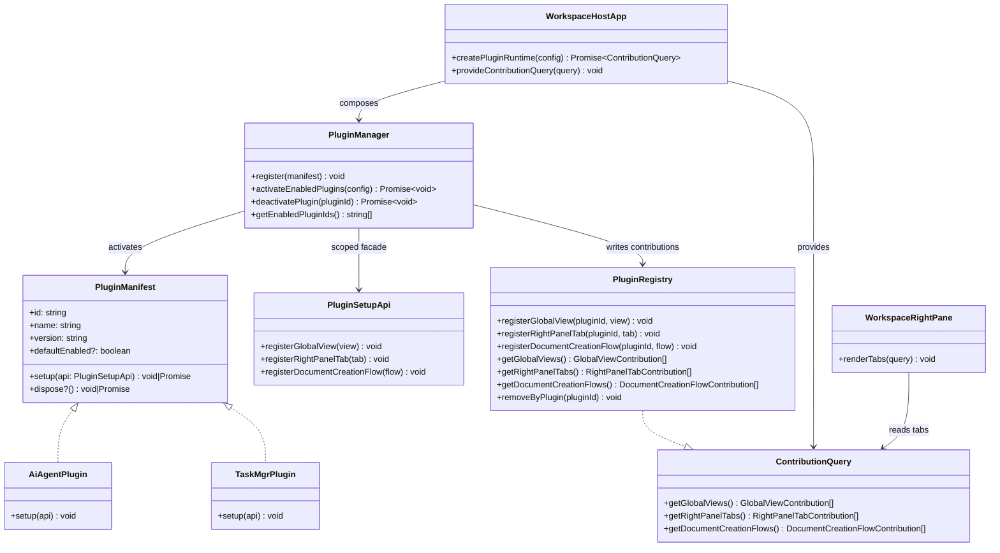

## Context

`docs/plugin-system.md` already fixes the architectural direction for this change: the Markdown document workspace remains the core product surface, while AI and task capabilities move behind a frontend-only plugin layer. The current hosts still hardcode route entries, right-panel tabs, and feature imports directly in app composition, so adding or disabling capabilities requires editing host code instead of changing plugin registration.

The new design must preserve these constraints:
- `packages/core` stays dependency-free at runtime and becomes the home of minimal plugin contracts.
- `packages/ui` may consume plugin contributions, but it must not import `packages/plugin-system` directly.
- `packages/plugin-system` owns runtime activation, contribution storage, duplicate checks, and plugin-scoped teardown.
- `plugins/*` implement concrete plugin surfaces and depend on `core + plugin-system`.
- `apps/*` are the only composition roots that know the builtin plugin list and wire plugin loading into shared UI.
- Backend-facing contracts such as `IContextProvider` and task persistence remain outside this refactor.
- Host-side context implementations should depend on the narrowest conversation-query contract they need rather than owning AI conversation-domain implementations directly.

## Goals / Non-Goals

**Goals:**
- Introduce a minimal frontend plugin contract for manifests, enablement config, setup APIs, and read-only contribution queries.
- Provide runtime activation and teardown for builtin plugins without introducing dynamic third-party loading in this phase.
- Move current AI global views, right-panel conversation tab, task global view, and task right-panel tab behind plugin contributions, with the owning plugin also owning the concrete feature implementation.
- Make top-level workspace navigation and Workspace right-panel tab assembly contribution-driven instead of hardcoded.
- Support the named workspace-core extension points already required by the extracted AI/task implementations: workspace-selection views, insert-link types, and node presentations.
- Reserve a controlled document-creation-flow extension point for future plugins that extend Markdown document creation.
- Keep plugin activation failures isolated so one broken plugin does not block the host shell from starting.

**Non-Goals:**
- No plugin marketplace, download flow, signing, sandboxing, or remote plugin discovery.
- No backend plugin API or extraction of `IContextProvider`, task providers, or server protocols.
- No plugin management UI in this phase; enablement comes from config only.
- No generic “catch-all” or token-based extension-point protocol; this change uses only an explicit finite set of named contribution types.
- No behavior redesign for enabled AI or task features; this change only alters how they are assembled.

## Decisions

### 1. Put plugin contracts in `packages/core` and keep them type-only

Files to add/change:
- `/Users/quanzhou/Workspace/JARVIS/packages/core/src/plugins/PluginManifest.ts`
- `/Users/quanzhou/Workspace/JARVIS/packages/core/src/plugins/PluginEnablementConfig.ts`
- `/Users/quanzhou/Workspace/JARVIS/packages/core/src/plugins/PluginSetupApi.ts`
- `/Users/quanzhou/Workspace/JARVIS/packages/core/src/plugins/ContributionQuery.ts`
- `/Users/quanzhou/Workspace/JARVIS/packages/core/src/plugins/contributions.ts`
- `/Users/quanzhou/Workspace/JARVIS/packages/core/src/index.ts`

Signatures:
```ts
export interface PluginManifest {
  id: string;
  name: string;
  version: string;
  defaultEnabled?: boolean;
  setup(api: PluginSetupApi): void | Promise<void>;
  dispose?(): void | Promise<void>;
}

export interface PluginEnablementConfig {
  enabledPluginIds: string[];
}

export interface PluginSetupApi {
  registerGlobalView(view: GlobalViewContribution): void;
  registerRightPanelTab(tab: RightPanelTabContribution): void;
  registerWorkspaceSelectionView(view: WorkspaceSelectionViewContribution): void;
  registerInsertLinkType(type: InsertLinkTypeContribution): void;
  registerDocumentCreationFlow(flow: DocumentCreationFlowContribution): void;
  registerNodePresentation(contribution: NodePresentationContribution): void;
}

export interface ContributionQuery {
  getGlobalViews(): readonly GlobalViewContribution[];
  getRightPanelTabs(): readonly RightPanelTabContribution[];
  getWorkspaceSelectionViews(): readonly WorkspaceSelectionViewContribution[];
  getInsertLinkTypes(): readonly InsertLinkTypeContribution[];
  getDocumentCreationFlows(): readonly DocumentCreationFlowContribution[];
  getNodePresentations(): readonly NodePresentationContribution[];
}
```

Change description:
- The plugin contract belongs in `core` because both host composition and shared UI need to understand contribution shapes without pulling in plugin-system runtime code.
- `core` exports only interfaces and generic contribution shapes, keeping Vue-specific component typing out of the contract package.
- The current finite contribution set includes host-shell surfaces and document-workspace extension points, while still avoiding a generic token registry.
- This preserves the `core <- ui` dependency direction and avoids a cycle where document-core UI can only compile if plugin-system exists.

Alternative considered:
- Put `PluginSetupApi` and `ContributionQuery` in `packages/plugin-system`.
- Rejected because `packages/ui` would then need a direct runtime dependency on `plugin-system`, violating the required DAG.

Additional boundary note:
- `packages/core` must not continue expanding into the AI feature domain. AI-specific contracts and implementations such as `Conversation`, `IModelProvider`, conversation persistence/sync, model-provider runtime, and external history/provider adapters belong to the AI plugin scope even when they are reused across multiple hosts.

### 2. Keep Vue-specific contribution typing in `packages/plugin-system`

Files to add/change:
- `/Users/quanzhou/Workspace/JARVIS/packages/plugin-system/src/types/vueContributions.ts`
- `/Users/quanzhou/Workspace/JARVIS/packages/plugin-system/src/index.ts`

Signatures:
```ts
import type { Component } from 'vue';
import type {
  GlobalViewContribution,
  WorkspaceSelectionViewContribution,
  RightPanelTabContribution,
} from '@jarvis/core';

export type VueGlobalViewContribution = GlobalViewContribution<Component>;
export type VueRightPanelTabContribution = RightPanelTabContribution<Component>;
export type VueWorkspaceSelectionViewContribution =
  WorkspaceSelectionViewContribution<Component>;
```

Change description:
- Plugin implementations need complete Vue typing for lazy component factories, but `core` must remain Vue-agnostic.
- `plugin-system` provides these aliases so plugin packages can author manifests with full component typing while the stored contract remains the generic `unknown`-based shape.

Alternative considered:
- Let `core` depend on Vue type imports only.
- Rejected because the documented target is zero Vue dependency in `core`, including type-level imports.

### 3. `PluginRegistry` is the single runtime source of truth for contributions

Files to add/change:
- `/Users/quanzhou/Workspace/JARVIS/packages/plugin-system/src/PluginRegistry.ts`
- `/Users/quanzhou/Workspace/JARVIS/packages/plugin-system/src/errors.ts`

Signatures:
```ts
export class PluginRegistry implements ContributionQuery {
  registerGlobalView(pluginId: string, view: GlobalViewContribution): void;
  registerRightPanelTab(pluginId: string, tab: RightPanelTabContribution): void;
  registerWorkspaceSelectionView(
    pluginId: string,
    view: WorkspaceSelectionViewContribution,
  ): void;
  registerInsertLinkType(
    pluginId: string,
    type: InsertLinkTypeContribution,
  ): void;
  registerDocumentCreationFlow(
    pluginId: string,
    flow: DocumentCreationFlowContribution,
  ): void;
  registerNodePresentation(
    pluginId: string,
    contribution: NodePresentationContribution,
  ): void;

  getGlobalViews(): readonly GlobalViewContribution[];
  getRightPanelTabs(): readonly RightPanelTabContribution[];
  getWorkspaceSelectionViews(): readonly WorkspaceSelectionViewContribution[];
  getInsertLinkTypes(): readonly InsertLinkTypeContribution[];
  getDocumentCreationFlows(): readonly DocumentCreationFlowContribution[];
  getNodePresentations(): readonly NodePresentationContribution[];

  removeByPlugin(pluginId: string): void;
}
```

Change description:
- `PluginRegistry` aggregates contributions per extension point, attaches `pluginId` ownership, validates duplicate contribution IDs, and exposes read-only getters to UI consumers.
- Contribution arrays are returned sorted by contribution `order` where applicable and otherwise kept stable by registration sequence.
- `removeByPlugin(pluginId)` enables deterministic cleanup if a plugin is disabled later or if activation must roll back a partially registered plugin across all named extension points.

Alternative considered:
- Store contributions directly inside `PluginManager`.
- Rejected because querying and lifecycle management become harder to separate, and UI would need a broader manager dependency instead of a narrow read-only query interface.

### 4. `PluginManager` activates builtin manifests from config and isolates failures

Files to add/change:
- `/Users/quanzhou/Workspace/JARVIS/packages/plugin-system/src/PluginManager.ts`
- `/Users/quanzhou/Workspace/JARVIS/packages/plugin-system/src/createScopedSetupApi.ts`
- `/Users/quanzhou/Workspace/JARVIS/packages/plugin-system/src/logger.ts`

Signatures:
```ts
export class PluginManager {
  register(manifest: PluginManifest): void;
  activateEnabledPlugins(config: PluginEnablementConfig): Promise<void>;
  deactivatePlugin(pluginId: string): Promise<void>;
  getEnabledPluginIds(): string[];
}

export function createScopedSetupApi(
  pluginId: string,
  registry: PluginRegistry,
): PluginSetupApi;
```

Change description:
- The manager owns builtin manifest registration, resolves enablement against `enabledPluginIds` plus `defaultEnabled`, and calls each plugin’s `setup()` with a plugin-scoped facade.
- Every activation runs inside `try/catch`; failures are logged with full stack traces and do not stop the rest of the host shell from loading.
- If activation fails after partial registration, the manager calls `registry.removeByPlugin(pluginId)` and skips that plugin from the enabled set.

Alternative considered:
- Fail fast when any plugin activation throws.
- Rejected because it couples the whole application shell to the weakest optional feature.

### 5. Hosts become the only composition roots that know builtin plugins and config

Files to add/change:
- `/Users/quanzhou/Workspace/JARVIS/apps/web/src/main.ts`
- `/Users/quanzhou/Workspace/JARVIS/apps/desktop/src/renderer/main.ts`
- `/Users/quanzhou/Workspace/JARVIS/apps/extension/src/main.ts`
- `/Users/quanzhou/Workspace/JARVIS/apps/web/src/pluginConfig.ts`
- `/Users/quanzhou/Workspace/JARVIS/apps/desktop/src/renderer/pluginConfig.ts`
- `/Users/quanzhou/Workspace/JARVIS/apps/extension/src/pluginConfig.ts`

Signatures:
```ts
export const builtinPlugins: PluginManifest[];
export async function createPluginRuntime(
  config: PluginEnablementConfig,
): Promise<ContributionQuery>;
```

Change description:
- Each host defines its builtin plugin list and enablement config source, creates a `PluginRegistry`, registers manifests with `PluginManager`, activates enabled plugins, and then provides the resulting `ContributionQuery` to shared UI.
- This keeps plugin discovery static and explicit in this phase and avoids leaking host-only config concerns into shared packages.
- The host may know plugin manifests, enablement rules, and plugin loading mechanics, but it should not hard-wire optional AI capabilities by directly importing concrete AI runtime/provider implementations for host assembly. Optional feature ownership must stay behind plugin activation boundaries.

Alternative considered:
- Put builtin plugin lists inside `packages/plugin-system`.
- Rejected because host availability can differ, and app roots are the correct place for composition-specific choices.

Alternative considered:
- Let hosts keep directly importing optional AI implementations and only wrap rendered views in plugin manifests.
- Rejected because that preserves compile-time coupling between hosts and optional feature internals, which defeats the goal of contribution-driven plugin assembly.

### 6. Shared UI consumes only `ContributionQuery` and renders plugin-driven surfaces

Files to add/change:
- `/Users/quanzhou/Workspace/JARVIS/packages/ui/src/plugins/injectionKeys.ts`
- `/Users/quanzhou/Workspace/JARVIS/packages/ui/src/views/WorkspaceHostApp.vue`
- `/Users/quanzhou/Workspace/JARVIS/packages/ui/src/views/DocumentWorkspaceView.vue`
- `/Users/quanzhou/Workspace/JARVIS/packages/ui/src/components/WorkspaceRightPane.vue`

Signatures:
```ts
export const contributionQueryKey: InjectionKey<ContributionQuery>;

function useGlobalViewContributions(): readonly GlobalViewContribution[];
function useRightPanelTabContributions(): readonly RightPanelTabContribution[];
```

Change description:
- `WorkspaceHostApp` reads global-view contributions and maps them into top-level workspace destinations and lazy view rendering.
- `WorkspaceRightPane` reads right-panel tab contributions and renders them in order instead of hardcoding conversation/task tabs.
- `DocumentWorkspaceView` remains the document-core host and consumes plugin-provided workspace-selection views and insert-link types in addition to document-creation-flow contributions.
- `DocumentFileTree` consumes plugin-provided node presentations to decorate nodes without moving file-tree ownership out of shared UI.
- `packages/ui` never imports plugin manifests or managers directly; it only consumes the injected read-only query.
- `packages/ui` is intentionally reduced to workspace-core and shared infrastructure responsibilities. It may host contribution containers, shared stores, common i18n, and reusable document-workspace UI, but it must not keep AI-specific or task-specific feature implementations once those capabilities are extracted into plugins.

Alternative considered:
- Let UI import `PluginRegistry` directly and read mutable state.
- Rejected because it leaks runtime implementation details into shared UI and weakens the contract boundary.

### 7. AI and task features become first-party plugins with preserved enabled behavior and ownership

Files to add/change:
- `/Users/quanzhou/Workspace/JARVIS/plugins/ai-agent/src/manifest.ts`
- `/Users/quanzhou/Workspace/JARVIS/plugins/ai-agent/src/index.ts`
- `/Users/quanzhou/Workspace/JARVIS/plugins/task-mgr/src/manifest.ts`
- `/Users/quanzhou/Workspace/JARVIS/plugins/task-mgr/src/index.ts`
- Existing AI/task feature modules currently under `/Users/quanzhou/Workspace/JARVIS/packages/ui/src/...`, moved into plugin-local directories as needed

Signatures:
```ts
export const aiAgentPlugin: PluginManifest;
export const taskMgrPlugin: PluginManifest;
```

Change description:
- The AI plugin registers the current chat/global view entry and the Workspace right-panel conversation tab.
- The task plugin registers the current all-tasks global view and the Workspace right-panel task tab.
- Ownership must move with the registration point: plugin manifests must register plugin-local feature implementations rather than re-exporting feature components from `packages/ui`.
- The AI plugin becomes the owning package for chat, compare, history, conversation-side panels, and related feature-specific helpers.
- The task plugin becomes the owning package for task list, task editor, task-side panels, and related feature-specific helpers.
- Shared infrastructure such as document workspace shells, shared i18n primitives, and generic workspace stores may remain in `packages/ui`, but feature-specific UI should no longer be exported there once extraction is complete.

Alternative considered:
- Split AI into multiple smaller plugins immediately.
- Rejected because the product requirement explicitly prefers one coarse-grained AI plugin in this phase.

### 8. Feature-ownership extraction boundaries

The extraction in this change is not limited to swapping registration entrypoints. The plugin boundary is only considered complete when feature implementation ownership also moves out of `packages/ui`.

Expected ownership targets:

- `packages/ui` keeps:
  - `WorkspaceHostApp`
  - `WorkspaceRightPane`
  - `DocumentWorkspaceView`
  - `DocumentEditorPane`
  - document tree, document viewers, plugin injection keys, and workspace-core shells
  - reusable primitives that are not AI-specific or task-specific
- `plugins/ai-agent` owns:
  - chat global view composition
  - compare view composition
  - conversation sidebar/history surfaces
  - Workspace right-panel conversation surfaces
  - AI-specific helpers and tests
- `plugins/task-mgr` owns:
  - all-tasks global view composition
  - Workspace right-panel task surfaces
  - task list/editor feature UI and tests

Expected first migration set for `plugins/ai-agent`:
- `ConversationWorkspaceView`
- `NormalChatView`
- `CompareChatView`
- `ConversationSidebar`
- `AgentConversationPanel`
- `AgentDocumentConversationList`
- `AnalysisGrid`
- `ExternalHistorySearchBox`
- `QuestionIndexPanel`
- AI-specific conversation helpers such as conversation-link/archive helpers as they are proven feature-owned

Expected first migration set for `plugins/task-mgr`:
- `AllTasksWorkspaceView`
- `AgentTaskPanel`
- `TaskListPanel`
- `TaskEditorInline`

The exact final placement of stores such as `chat.ts` and `compare.ts` may be staged, but the target direction is that AI-specific state management also belongs to `plugins/ai-agent` once the plugin boundary is stable.

### 9. Host and context dependencies must narrow to minimal AI-facing contracts

Files to add/change:
- `/Users/quanzhou/Workspace/JARVIS/packages/core/src/interfaces/IConversationPersistProvider.ts`
- `/Users/quanzhou/Workspace/JARVIS/packages/core/src/interfaces/IContextProvider.ts`
- `/Users/quanzhou/Workspace/JARVIS/packages/node/src/context/FileSystemContextProvider.ts`
- AI-plugin-local contract files that ultimately own `Conversation` and related query types

Signatures:
```ts
export interface IConversationQueryProvider {
  getConversations(query: ConversationQuery): Promise<Conversation[]>;
}
```

Change description:
- Host-side and context-side implementations should depend on the narrowest contract they actually need for conversation lookup.
- For example, a filesystem-backed context provider that only needs to delegate conversation lookup should depend on `IConversationQueryProvider`, not on broader AI runtime/provider/storage implementations.
- This keeps workspace/core ownership separate from AI feature ownership and reduces the blast radius when AI contracts move under the AI plugin package.

Alternative considered:
- Leave host/context code directly coupled to full AI conversation-domain contracts because those types are shared across multiple hosts.
- Rejected because shared usage does not make the domain `core`; it only means the AI plugin needs its own shared contract layer.

### 10. Keep the document-creation-flow extension point logic-only and host-mediated

Files to add/change:
- `/Users/quanzhou/Workspace/JARVIS/packages/core/src/plugins/contributions.ts`
- `/Users/quanzhou/Workspace/JARVIS/packages/ui/src/services/documentCreationFlows.ts`

Signatures:
```ts
export interface DocumentCreationFlowInput {
  targetParentPath?: string;
}

export interface DocumentCreationFlowResult {
  createdDocumentPath: string;
}

export interface DocumentCreationFlowContribution {
  id: string;
  title: string;
  run(input: DocumentCreationFlowInput): Promise<DocumentCreationFlowResult>;
}
```

Change description:
- The extension point is defined now so future plugins can add alternate “create document” flows without inventing private host hooks.
- The flow remains host-mediated: plugins request document creation through core-facing services already provided by the workspace runtime rather than replacing document I/O on their own.

Alternative considered:
- Defer the extension point until the first concrete plugin needs it.
- Rejected because `docs/plugin-system.md` names this as the one future-oriented extension point that should be reserved now.

### Mermaid class diagram



## Risks / Trade-offs

- [Risk] `packages/ui` may accidentally keep hardcoded AI/task imports alongside plugin assembly. → Mitigation: define one injection path for `ContributionQuery`, rename the shared right-panel host to `WorkspaceRightPane`, and remove direct host-specific feature imports from shared shell components as part of the same change.
- [Risk] Duplicate contribution IDs across plugins can produce unstable rendering keys or route collisions. → Mitigation: fail that plugin’s registration path early with explicit duplicate validation and log the offending `pluginId` plus contribution ID.
- [Risk] Moving feature assembly without moving underlying state can leave hidden compile-time couplings. → Mitigation: complete the ownership migration by moving plugin-owned feature implementations and their tests into plugin directories rather than stopping at manifest registration.
- [Risk] Config drift between hosts can produce inconsistent enabled plugin sets. → Mitigation: keep per-host config files minimal and document a common default builtin list with explicit host overrides.
- [Risk] The reserved document-creation-flow hook may be unused for some time. → Mitigation: keep it small and logic-only so the maintenance cost stays low.

## Migration Plan

1. Add plugin contracts to `packages/core` and runtime implementation to `packages/plugin-system`.
2. Introduce builtin AI and task plugin manifests for the initial extraction.
3. Rename the shared right-panel host to `WorkspaceRightPane` and make shared shells consume `ContributionQuery`.
4. Move AI feature implementations out of `packages/ui` and into `plugins/ai-agent`.
5. Move task feature implementations out of `packages/ui` and into `plugins/task-mgr`.
6. Remove shared-shell fallback implementations and validate plugin enable/disable behavior per host.

Rollback strategy:
- Hosts can temporarily revert to hardcoded assembly by removing plugin-runtime wiring while leaving contract files in place.
- Because no backend protocol or persisted user data changes, rollback is source-level only and does not require migration scripts.

## Open Questions

- Whether the first extraction should also move AI-specific stores (`chat.ts`, `compare.ts`) fully into `plugins/ai-agent`, or whether those stores remain temporarily shared while feature UI ownership is completed first.
- Whether hosts need different default enablement sets for the first rollout, especially the browser extension if some plugin surfaces are not yet available there.
