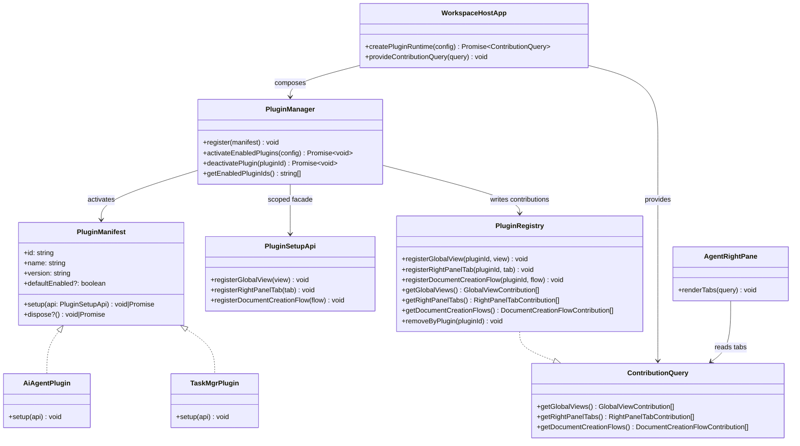

## Context

`docs/plugin-system.md` 已经明确了这次变更的架构方向：Markdown 文档工作区继续作为核心产品表面，AI 与任务能力通过仅前端的插件层接入。当前各宿主仍然把路由入口、右侧 panel tab 和功能导入硬编码在应用组合层里，因此新增或禁用能力都需要改宿主代码，而不是调整插件注册。

本次设计必须同时满足这些约束：
- `packages/core` 继续保持运行时零依赖，并承载最小插件契约。
- `packages/ui` 可以消费插件贡献，但不能直接依赖 `packages/plugin-system`。
- `packages/plugin-system` 负责运行时激活、贡献存储、重复校验与按插件回收。
- `plugins/*` 承载具体插件实现，依赖 `core + plugin-system`。
- `apps/*` 是唯一知道内置插件列表、并把插件加载接入共享 UI 的组合根。
- `IContextProvider`、任务持久化等后端向能力仍然不纳入这次重构。
- 宿主侧 context 实现应只依赖自己真正需要的最小会话查询契约，而不是直接拥有 AI 会话领域实现。

## Goals / Non-Goals

**Goals:**
- 引入一套最小前端插件契约，覆盖插件清单、启用配置、注册 API 与只读贡献查询。
- 为内置插件提供运行时激活与回收机制，本期不引入动态第三方加载。
- 将当前 AI 全局视图、右侧对话 tab、任务全局视图、右侧任务 tab 收敛为插件贡献。
- 将顶层工作区导航和 Agent 右侧 panel tab 的装配改为贡献驱动，而不是硬编码。
- 预留一个受控的文档创建流程扩展点，供未来插件增强 Markdown 文档创建链路。
- 保证单个插件激活失败不会阻断宿主外壳启动。

**Non-Goals:**
- 本期不做插件市场、下载、签名、沙箱或远程插件发现。
- 本期不做后端插件 API，也不拆 `IContextProvider`、任务 provider 或服务端协议。
- 本期不做插件管理 UI；启用状态仅来自配置。
- 本期不引入泛化的“万能扩展点协议”，只支持当前真实需要的三类扩展点。
- 本期不改变 AI/任务功能在启用状态下的用户行为，只改变它们如何被宿主装配。

## Decisions

### 1. 插件契约下沉到 `packages/core`，并保持 type-only

Files to add/change:
- `/Users/quanzhou/Workspace/JARVIS/packages/core/src/plugins/PluginManifest.ts`
- `/Users/quanzhou/Workspace/JARVIS/packages/core/src/plugins/PluginEnablementConfig.ts`
- `/Users/quanzhou/Workspace/JARVIS/packages/core/src/plugins/PluginSetupApi.ts`
- `/Users/quanzhou/Workspace/JARVIS/packages/core/src/plugins/ContributionQuery.ts`
- `/Users/quanzhou/Workspace/JARVIS/packages/core/src/plugins/contributions.ts`
- `/Users/quanzhou/Workspace/JARVIS/packages/core/src/index.ts`

Signatures:
```ts
export interface PluginManifest {
  id: string;
  name: string;
  version: string;
  defaultEnabled?: boolean;
  setup(api: PluginSetupApi): void | Promise<void>;
  dispose?(): void | Promise<void>;
}

export interface PluginEnablementConfig {
  enabledPluginIds: string[];
}

export interface PluginSetupApi {
  registerGlobalView(view: GlobalViewContribution): void;
  registerRightPanelTab(tab: RightPanelTabContribution): void;
  registerDocumentCreationFlow(flow: DocumentCreationFlowContribution): void;
}

export interface ContributionQuery {
  getGlobalViews(): readonly GlobalViewContribution[];
  getRightPanelTabs(): readonly RightPanelTabContribution[];
  getDocumentCreationFlows(): readonly DocumentCreationFlowContribution[];
}
```

Change description:
- 插件契约放在 `core`，因为宿主组合层与共享 UI 都需要理解这些贡献结构，同时又不能把 `plugin-system` 运行时引进来。
- `core` 只导出接口和泛型贡献结构，不把 Vue 特有组件类型带入这个契约包。
- 这样能继续保持 `core <- ui` 的依赖方向，避免文档核心 UI 因为缺失插件运行时而无法编译。

Alternative considered:
- 把 `PluginSetupApi` 与 `ContributionQuery` 放进 `packages/plugin-system`。
- 否决原因：`packages/ui` 会被迫直接依赖 `plugin-system`，违背既定 DAG 约束。

额外边界说明：
- `packages/core` 不应继续向 AI 功能域扩张。像 `Conversation`、`IModelProvider`、会话 persistence / sync、model-provider runtime、external history / provider adapter 这类 AI 专属契约与实现，即使被多个宿主复用，也应归入 AI plugin scope。

### 2. Vue 特化的贡献类型留在 `packages/plugin-system`

Files to add/change:
- `/Users/quanzhou/Workspace/JARVIS/packages/plugin-system/src/types/vueContributions.ts`
- `/Users/quanzhou/Workspace/JARVIS/packages/plugin-system/src/index.ts`

Signatures:
```ts
import type { Component } from 'vue';
import type {
  GlobalViewContribution,
  RightPanelTabContribution,
} from '@jarvis/core';

export type VueGlobalViewContribution = GlobalViewContribution<Component>;
export type VueRightPanelTabContribution = RightPanelTabContribution<Component>;
```

Change description:
- 插件实现需要完整的 Vue lazy component 类型，但 `core` 必须保持与 Vue 无关。
- `plugin-system` 提供这层别名后，插件包能用完整组件类型编写 manifest，而底层存储的契约仍然是泛型 `unknown` 版本。

Alternative considered:
- 让 `core` 只依赖 Vue 的 type import。
- 否决原因：文档明确要求 `core` 对 Vue 零依赖，包含类型层面。

### 3. `PluginRegistry` 作为贡献的唯一运行时事实来源

Files to add/change:
- `/Users/quanzhou/Workspace/JARVIS/packages/plugin-system/src/PluginRegistry.ts`
- `/Users/quanzhou/Workspace/JARVIS/packages/plugin-system/src/errors.ts`

Signatures:
```ts
export class PluginRegistry implements ContributionQuery {
  registerGlobalView(pluginId: string, view: GlobalViewContribution): void;
  registerRightPanelTab(pluginId: string, tab: RightPanelTabContribution): void;
  registerDocumentCreationFlow(
    pluginId: string,
    flow: DocumentCreationFlowContribution,
  ): void;

  getGlobalViews(): readonly GlobalViewContribution[];
  getRightPanelTabs(): readonly RightPanelTabContribution[];
  getDocumentCreationFlows(): readonly DocumentCreationFlowContribution[];

  removeByPlugin(pluginId: string): void;
}
```

Change description:
- `PluginRegistry` 负责按扩展点聚合贡献、记录 `pluginId` 归属、校验 contribution ID 冲突，并向 UI 暴露只读 getter。
- 对支持 `order` 的贡献类型，getter 返回时按 `order` 排序；未显式指定时保持注册顺序稳定。
- `removeByPlugin(pluginId)` 允许未来在运行时禁用插件，或在激活半途中回滚已注册贡献。

Alternative considered:
- 直接把贡献存进 `PluginManager`。
- 否决原因：查询与生命周期职责会耦合在一起，UI 也会被迫依赖更重的 manager，而不是窄接口的只读 query。

### 4. `PluginManager` 基于配置激活内置插件，并隔离失败

Files to add/change:
- `/Users/quanzhou/Workspace/JARVIS/packages/plugin-system/src/PluginManager.ts`
- `/Users/quanzhou/Workspace/JARVIS/packages/plugin-system/src/createScopedSetupApi.ts`
- `/Users/quanzhou/Workspace/JARVIS/packages/plugin-system/src/logger.ts`

Signatures:
```ts
export class PluginManager {
  register(manifest: PluginManifest): void;
  activateEnabledPlugins(config: PluginEnablementConfig): Promise<void>;
  deactivatePlugin(pluginId: string): Promise<void>;
  getEnabledPluginIds(): string[];
}

export function createScopedSetupApi(
  pluginId: string,
  registry: PluginRegistry,
): PluginSetupApi;
```

Change description:
- manager 负责注册内置 manifest，根据 `enabledPluginIds` 与 `defaultEnabled` 解析最终启用集，并向每个插件传入带作用域的 setup facade。
- 每次激活都必须包在 `try/catch` 中；失败时记录完整栈，不阻断其余插件与宿主外壳加载。
- 若插件在部分注册后抛错，manager 需要调用 `registry.removeByPlugin(pluginId)` 回滚这次激活。

Alternative considered:
- 任一插件激活失败就整体 fail fast。
- 否决原因：这会让整个应用外壳绑死在最脆弱的可选能力上。

### 5. 宿主成为唯一知道内置插件与配置来源的组合根

Files to add/change:
- `/Users/quanzhou/Workspace/JARVIS/apps/web/src/main.ts`
- `/Users/quanzhou/Workspace/JARVIS/apps/desktop/src/renderer/main.ts`
- `/Users/quanzhou/Workspace/JARVIS/apps/extension/src/main.ts`
- `/Users/quanzhou/Workspace/JARVIS/apps/web/src/pluginConfig.ts`
- `/Users/quanzhou/Workspace/JARVIS/apps/desktop/src/renderer/pluginConfig.ts`
- `/Users/quanzhou/Workspace/JARVIS/apps/extension/src/pluginConfig.ts`

Signatures:
```ts
export const builtinPlugins: PluginManifest[];
export async function createPluginRuntime(
  config: PluginEnablementConfig,
): Promise<ContributionQuery>;
```

Change description:
- 每个宿主负责定义自己的内置插件列表与启用配置来源，创建 `PluginRegistry`，把 manifest 注册进 `PluginManager`，激活已启用插件，再将 `ContributionQuery` 注入共享 UI。
- 这样可以把插件发现保持为静态、显式的组合逻辑，同时不把宿主自己的配置细节泄漏到共享包。
- 宿主可以认识插件 manifest、启用规则和插件加载机制，但不应继续通过直接 import 具体 AI runtime / provider 实现的方式完成可选能力装配。可选功能所有权必须留在插件激活边界之后。

Alternative considered:
- 把内置插件列表放进 `packages/plugin-system`。
- 否决原因：不同宿主的能力可用性可能不同，组合根才是合适的位置。

Alternative considered:
- 继续让宿主直接 import 可选 AI 实现，只在最外层套一层 plugin manifest。
- 否决原因：这会保留宿主与可选功能内部实现之间的编译期耦合，违背“通过贡献驱动插件装配”的目标。

### 6. 共享 UI 只消费 `ContributionQuery`，按贡献渲染插件表面

Files to add/change:
- `/Users/quanzhou/Workspace/JARVIS/packages/ui/src/plugins/injectionKeys.ts`
- `/Users/quanzhou/Workspace/JARVIS/packages/ui/src/views/WorkspaceHostApp.vue`
- `/Users/quanzhou/Workspace/JARVIS/packages/ui/src/views/DocumentWorkspaceView.vue`
- `/Users/quanzhou/Workspace/JARVIS/packages/ui/src/components/AgentRightPane.vue`

Signatures:
```ts
export const contributionQueryKey: InjectionKey<ContributionQuery>;

function useGlobalViewContributions(): readonly GlobalViewContribution[];
function useRightPanelTabContributions(): readonly RightPanelTabContribution[];
```

Change description:
- `WorkspaceHostApp` 读取全局视图贡献，将其装配为顶层工作区入口和懒加载视图。
- `AgentRightPane` 读取右侧 tab 贡献并按顺序渲染，而不是继续硬编码 conversation/task 两个 tab。
- `DocumentWorkspaceView` 继续作为文档核心宿主，并在未来“新建文档流程”入口出现时消费 document-creation-flow 贡献。
- `packages/ui` 不能直接 import 插件 manifest 或 manager，只能消费注入进来的只读 query。

Alternative considered:
- 让 UI 直接 import `PluginRegistry` 并读取可变状态。
- 否决原因：这会把运行时实现细节泄漏到共享 UI，削弱契约边界。

### 7. AI 与任务能力先收敛为一方插件，但保持启用时行为不变

Files to add/change:
- `/Users/quanzhou/Workspace/JARVIS/plugins/ai-agent/src/manifest.ts`
- `/Users/quanzhou/Workspace/JARVIS/plugins/ai-agent/src/index.ts`
- `/Users/quanzhou/Workspace/JARVIS/plugins/task-mgr/src/manifest.ts`
- `/Users/quanzhou/Workspace/JARVIS/plugins/task-mgr/src/index.ts`
- 现有 AI/任务视图模块，以及必要时的插件侧包装组件

Signatures:
```ts
export const aiAgentPlugin: PluginManifest;
export const taskMgrPlugin: PluginManifest;
```

Change description:
- AI 插件负责注册当前聊天/对话全局视图，以及 Agent 右侧对话 tab。
- 任务插件负责注册当前 all-tasks 全局视图，以及 Agent 右侧任务 tab。
- 现有 feature store 与 provider/context 依赖仍然由宿主或共享运行时注入；本次不重写功能内部逻辑，只把“由谁装配它们”迁移到 manifest。

Alternative considered:
- 立刻把 AI 再拆成多个更细插件。
- 否决原因：当前需求明确希望本期先收敛为一个大粒度 AI 插件。

### 8. 宿主与 context 侧依赖必须收窄到最小 AI 查询契约

Files to add/change:
- `/Users/quanzhou/Workspace/JARVIS/packages/core/src/interfaces/IConversationPersistProvider.ts`
- `/Users/quanzhou/Workspace/JARVIS/packages/core/src/interfaces/IContextProvider.ts`
- `/Users/quanzhou/Workspace/JARVIS/packages/node/src/context/FileSystemContextProvider.ts`
- 最终承载 `Conversation` 及相关查询类型的 AI 插件本地契约文件

Signatures:
```ts
export interface IConversationQueryProvider {
  getConversations(query: ConversationQuery): Promise<Conversation[]>;
}
```

Change description:
- 宿主侧与 context 侧实现，凡是只需要“查询会话”的地方，都应依赖自己真正需要的最小契约。
- 例如文件系统型 context provider 若只是把会话查询委托给外部能力，就应依赖 `IConversationQueryProvider`，而不是更宽的 AI runtime / provider / storage 实现。
- 这样可以把 workspace/core 的职责与 AI 功能所有权分开，并减少未来把 AI 契约迁入 AI 插件时的改动面。

Alternative considered:
- 因为这些类型被多个宿主复用，就继续让宿主 / context 代码直接依赖完整 AI 会话领域契约。
- 否决原因：被多个宿主复用并不等于它属于 `core`，只说明 AI 插件需要自己的共享契约层。

### 9. 文档创建流程扩展点保持为逻辑契约，并由宿主中介

Files to add/change:
- `/Users/quanzhou/Workspace/JARVIS/packages/core/src/plugins/contributions.ts`
- `/Users/quanzhou/Workspace/JARVIS/packages/ui/src/services/documentCreationFlows.ts`

Signatures:
```ts
export interface DocumentCreationFlowInput {
  targetParentPath?: string;
}

export interface DocumentCreationFlowResult {
  createdDocumentPath: string;
}

export interface DocumentCreationFlowContribution {
  id: string;
  title: string;
  run(input: DocumentCreationFlowInput): Promise<DocumentCreationFlowResult>;
}
```

Change description:
- 现在就定义这个扩展点，避免未来首个“增强新建文档流程”的插件不得不再私下发明一套宿主 hook。
- 流程依然由宿主中介：插件通过核心能力请求创建文档，而不是自己绕过工作区核心去接管文档 I/O。

Alternative considered:
- 等第一批真实插件需要时再加这个扩展点。
- 否决原因：`docs/plugin-system.md` 已明确把它列为本期唯一需要预留的未来扩展点。

### Mermaid class diagram



## Risks / Trade-offs

- [Risk] `packages/ui` 里可能残留硬编码的 AI/任务导入，与插件装配并存。 → Mitigation: 统一从 `ContributionQuery` 注入路径消费，并在同一次变更中移除共享外壳里的直接装配代码。
- [Risk] 不同插件贡献了重复 ID，导致渲染 key 或路由冲突。 → Mitigation: 注册阶段显式校验重复项，并记录冲突的 `pluginId` 与 contribution ID。
- [Risk] 只是迁移装配层、不迁移底层状态时，仍可能留下隐藏的编译期耦合。 → Mitigation: 先把现有表面包装成插件贡献，再针对剩余直接宿主导入做第二轮收敛。
- [Risk] 各宿主配置不一致会造成启用集漂移。 → Mitigation: 保持每个宿主的配置文件极简，并约定统一默认内置插件列表。
- [Risk] 预留的文档创建流程扩展点短期内可能没人使用。 → Mitigation: 把它控制在最小逻辑契约内，维护成本很低。

## Migration Plan

1. 先在 `packages/core` 增加插件契约，在 `packages/plugin-system` 增加运行时实现。
2. 引入 AI 与任务两个内置插件 manifest，先包裹现有视图与右侧 tab。
3. 各宿主改为创建插件运行时，并把 `ContributionQuery` 注入共享 UI。
4. 从共享外壳组件中移除硬编码的全局视图与右侧 tab 装配。
5. 按宿主验证启用/禁用行为，再决定是否继续做更深层的功能模块迁移。

Rollback strategy:
- 若需要回滚，宿主可以先去掉插件运行时接线，临时恢复到硬编码装配；新加的契约文件可以保留。
- 本期没有后端协议或持久化数据变化，因此回滚只涉及源码，不需要额外迁移脚本。

## Open Questions

- AI 插件在第一次抽离时是否应同时接管 compare 相关视图，还是先只接当前对话视图，把 compare 留到后续 follow-up。
- 不同宿主首轮是否需要不同默认启用集，尤其是 extension 端若某些插件表面尚未完全可用时。
