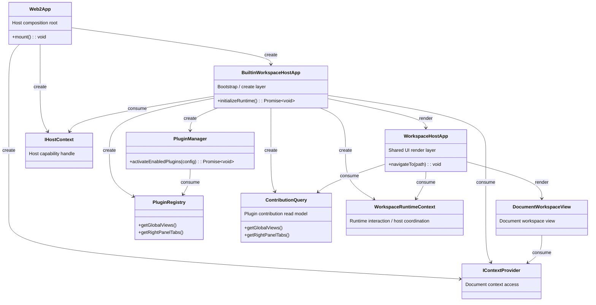

## Context

`apps/web` currently acts as both the active browser host and the place where host bootstrap, plugin-runtime assembly, and some feature-specific composition decisions still live. That makes app-layer simplification expensive because every extraction must happen inside the legacy runtime shell while preserving the current product surface.

The `app-web2` change introduces a parallel `apps/web2` host instead of continuing to peel the existing host in place. The new host must satisfy the dependency direction defined in `ARCHITECTURE.zh-CN-new.md`: app-layer code depends only on `packages/core` and `packages/ui`, while plugin activation remains reachable only through shared UI bootstrap surfaces. At the same time, any shared changes made in `packages/ui` or `packages/core` must not break the existing `apps/web` host.

The current code layout implies one important constraint:
- `packages/ui` already owns `WorkspaceHostApp` and routing helpers, but `apps/web` still directly assembles plugin runtime through `apps/web/src/pluginConfig.ts`.
- `packages/plugin-system` already knows how to assemble builtin plugins, but exposing that directly to `apps/web2` would violate the target dependency graph.
- `apps/web` must continue working as the transition baseline, so shared bootstrap extraction cannot be a web2-only shortcut that regresses the old host.

This change also follows a simplification rule: do not design for future abstractions unless current responsibilities are already different. That means removing containers that exist only to bundle results, while still keeping concepts separate when their current responsibilities are already distinct.

This change also follows a hard compatibility constraint: `apps/web2` is a parallel new host, not an immediate replacement for `apps/web`. Any shared-layer change introduced for `web2` must still allow the existing web app to start, build, and render its current runtime surface.

## Goals / Non-Goals

**Goals:**
- Add a new `apps/web2` host package that can boot the shared workspace and support the same core web flows needed for normal operation.
- Ensure `apps/web2` compiles with direct workspace-package dependencies limited to `@packages/core` and `@packages/ui`.
- Move builtin workspace-runtime bootstrap behind `packages/ui` exports so the app layer no longer imports `packages/plugin-system` directly.
- Default `apps/web2` to a non-task host composition, so the new app layer contains no task-specific logic.
- Preserve the runtime availability of `apps/web` while shared bootstrap logic is extracted.
- Provide isolated tests and build entries for `apps/web2` so the new host can be validated independently.
- Introduce `web2` through a compatibility layer rather than by breaking the old web host entry surface.

**Non-Goals:**
- Do not remove or replace `apps/web` in this change.
- Do not continue the deeper extraction of AI or other business logic that still lives inside `packages/ui`.
- Do not redesign server APIs, sync storage protocols, or provider capability contracts.
- Do not migrate desktop or extension hosts to the new bootstrap surface in this change.
- Do not introduce task support into `apps/web2` app-layer composition.

## Decisions

### 1. Introduce `apps/web2` as a parallel host instead of refactoring `apps/web` in place

Files to add/change:
- `/Users/quanzhou/Workspace/JARVIS/apps/web2/package.json`
- `/Users/quanzhou/Workspace/JARVIS/apps/web2/index.html`
- `/Users/quanzhou/Workspace/JARVIS/apps/web2/vite.config.ts`
- `/Users/quanzhou/Workspace/JARVIS/apps/web2/tsconfig.json`
- `/Users/quanzhou/Workspace/JARVIS/apps/web2/tsconfig.typecheck.json`
- `/Users/quanzhou/Workspace/JARVIS/apps/web2/vitest.config.ts`
- `/Users/quanzhou/Workspace/JARVIS/apps/web2/playwright.config.ts`
- `/Users/quanzhou/Workspace/JARVIS/apps/web2/src/main.ts`
- `/Users/quanzhou/Workspace/JARVIS/apps/web2/src/App.vue`
- `/Users/quanzhou/Workspace/JARVIS/apps/web2/src/router.ts`
- `/Users/quanzhou/Workspace/JARVIS/apps/web2/src/context/createWeb2HostContext.ts`
- `/Users/quanzhou/Workspace/JARVIS/apps/web2/src/context/createWeb2ContextProvider.ts`
- `/Users/quanzhou/Workspace/JARVIS/apps/web2/src/runtime/createWeb2RuntimeOptions.ts`

Signatures:
```ts
export function navigateTo(path: ChatRoutePath): void;
export function isRouteActive(path: ChatRoutePath): boolean;
export function createWeb2HostContext(): IHostContext;
export interface CreateWeb2ContextProviderOptions
  extends Pick<HttpContextProviderOptions, 'fetchImpl' | 'baseUrl'>,
    ResolveContextBaseUrlOptions {}
export function createWeb2ContextProvider(
  options?: CreateWeb2ContextProviderOptions,
): HttpContextProvider;
export function createWeb2RuntimeOptions(): CreateBuiltinWorkspaceRuntimeOptions;
```

Change description:
- `apps/web2` becomes a clean composition root whose job is limited to app bootstrap, host-context wiring, environment/config reading, and mounting the shared host shell.
- The app package reuses the routing and i18n patterns already proven in `apps/web`, but does not carry over direct plugin-system imports or task-specific composition.
- `apps/web2` ships with independent test/build/dev entrypoints so it can be introduced without destabilizing the existing web host.

Alternative considered:
- Keep refactoring `apps/web` until it matches the target boundary.
- Rejected because the legacy host remains the source of current coupling; using it as both migration target and transition shell makes app-layer cleanup slower and riskier.

### 2. Move builtin workspace-runtime bootstrap behind `packages/ui` and remove the result-wrapper object

Files to add/change:
- `/Users/quanzhou/Workspace/JARVIS/packages/ui/package.json`
- `/Users/quanzhou/Workspace/JARVIS/packages/ui/index.ts`
- `/Users/quanzhou/Workspace/JARVIS/packages/ui/src/bootstrap/loadPluginEnablementConfig.ts`
- `/Users/quanzhou/Workspace/JARVIS/packages/ui/src/bootstrap/createBuiltinWorkspaceRuntime.ts`
- `/Users/quanzhou/Workspace/JARVIS/packages/ui/src/views/BuiltinWorkspaceHostApp.vue`

Signatures:
```ts
export interface LoadPluginEnablementConfigOptions {
  storage?: Pick<Storage, 'getItem'>;
  storageKey?: string;
  defaultEnabledPluginIds: string[];
  fallbackToDefaultEnabled?: boolean;
}

export function loadPluginEnablementConfig(
  options: LoadPluginEnablementConfigOptions,
): PluginEnablementConfig;

export type WorkspaceHostRuntimeMode = 'web' | 'desktop' | 'extension';

export interface ContributionQuery {
  getGlobalViews(): readonly GlobalViewContribution[];
  getRightPanelTabs(): readonly RightPanelTabContribution[];
}

export interface CreateBuiltinWorkspaceRuntimeOptions {
  hostContext: IHostContext;
  runtimeMode: WorkspaceHostRuntimeMode;
  env?: Record<string, string | undefined>;
  isDevelopment?: boolean;
  storage?: Pick<Storage, 'getItem' | 'setItem'>;
  codexBaseUrl?: string;
  useMockRuntime?: boolean;
  useMockSync?: boolean;
  useMockHistoryProviders?: boolean;
  mockSyncKeyFallback?: string;
  createMockRuntime?: () => ModelProviderRuntime;
  createMockHistoryProvider?: (
    providerId: Exclude<ExternalHistoryProviderId, 'external-file'>,
  ) => IExternalConversationProvider;
  createProviderProxy?: (providerId: string) => IModelProvider | undefined;
  createHistoryProxy?: (
    providerId: Exclude<ExternalHistoryProviderId, 'external-file'>,
  ) => IExternalConversationProvider;
  pluginEnablement: PluginEnablementConfig;
}

export async function createBuiltinWorkspaceRuntime(
  options: CreateBuiltinWorkspaceRuntimeOptions,
): Promise<{
  contributionQuery: ContributionQuery;
  runtimeContext: WorkspaceRuntimeContext;
}>;
```

Change description:
- `packages/ui` becomes the host-facing bootstrap surface for builtin workspace runtime, while `packages/plugin-system` remains an internal dependency of that bootstrap path.
- This preserves the desired DAG: `apps/web2 -> packages/ui -> packages/plugin-system -> plugins/*`.
- The existing local-storage parsing for plugin enablement moves out of `apps/web` and becomes a reusable helper so hosts can share the same enablement rules without duplicating composition logic.
- `BuiltinWorkspaceHostApp.vue` is the layer responsible for bootstrap / create; `WorkspaceHostApp` remains the layer responsible for shared UI render. They stay separate because their current responsibilities are already different.
- `ContributionQuery` remains separate because its job is plugin-contribution read access, while `WorkspaceRuntimeContext` remains separate because its job is runtime interaction and host coordination. They may travel together, but their current responsibilities are already different.
- `BuiltinWorkspaceRuntime` is removed as a separate result container. Bootstrap now returns `{ contributionQuery, runtimeContext }` directly, avoiding an extra type that existed only to bundle two already-distinct objects.
- To preserve old-web compatibility, shared bootstrap must be introduced additively rather than by deleting the old entry shape. During migration, the existing `WorkspaceHostApp` consumption shape and the old web render chain of `contextProvider + contributionQuery + runtimeContext` must remain valid.

Alternative considered:
- Let `apps/web2` import `createBuiltinPluginRuntime()` directly from `packages/plugin-system`.
- Rejected because it would encode the exact dependency edge this change is meant to eliminate from the app layer.

### 3. Keep `apps/web` on the old entry surface while reusing the new shared bootstrap

Files to add/change:
- `/Users/quanzhou/Workspace/JARVIS/apps/web/src/App.vue`
- `/Users/quanzhou/Workspace/JARVIS/apps/web/src/pluginConfig.ts`
- `/Users/quanzhou/Workspace/JARVIS/apps/web/src/router.ts`
- `/Users/quanzhou/Workspace/JARVIS/apps/web/src/context/createWebHostContext.ts`
- `/Users/quanzhou/Workspace/JARVIS/apps/web/src/context/createWebContextProvider.ts`

Signatures:
```ts
export function loadPluginEnablementConfig(): PluginEnablementConfig;
export async function createPluginRuntime(
  config?: PluginEnablementConfig,
): Promise<{
  contributionQuery: ContributionQuery;
  runtimeContext: WorkspaceRuntimeContext;
}>;
```

Change description:
- `apps/web` remains available throughout the change, but may be rewired to call the new `packages/ui` bootstrap helpers instead of keeping host-local copies.
- The compatibility rule is strict: any shared bootstrap extraction must preserve the existing web app's ability to dev, build, typecheck, and pass its relevant tests.
- This keeps the transition honest. Shared code is not considered valid unless both hosts continue to function.
- Whether old `web` reuses the new helper is an implementation choice, but switching old `web` to the new entry must not be treated as a prerequisite for introducing `web2`; `web2` may adopt the new bootstrap first while old `web` keeps its current entry surface.

Alternative considered:
- Leave `apps/web` untouched and let `web2` use an entirely separate bootstrap stack.
- Rejected because it would duplicate composition logic and make the future host transition harder, not easier.

### 4. Make `apps/web2` explicitly non-task at the app layer

Files to add/change:
- `/Users/quanzhou/Workspace/JARVIS/apps/web2/src/runtime/createWeb2RuntimeOptions.ts`
- `/Users/quanzhou/Workspace/JARVIS/apps/web2/src/App.vue`
- `/Users/quanzhou/Workspace/JARVIS/apps/web2/src/App.test.ts`
- `/Users/quanzhou/Workspace/JARVIS/apps/web2/tests/e2e/smoke.spec.ts`

Signatures:
```ts
export function createWeb2RuntimeOptions(): CreateBuiltinWorkspaceRuntimeOptions;
```

Change description:
- `apps/web2` will provide a default enablement config that excludes `task-mgr`, so the host does not embed task-specific app composition.
- The app shell must still boot the knowledge workspace and the chat-related surfaces needed for the current normal web flow, but it does so through shared bootstrap options rather than host-owned business logic.
- Tests should assert both the positive surface (workspace boots, routes resolve, chat/knowledge shell renders) and the negative surface (no task workspace entry from default composition).

Alternative considered:
- Enable the same default plugin set as `apps/web` and simply avoid referencing tasks from app code.
- Rejected because the user explicitly wants the new app to be task-free at the app layer and to use the new host as the clean architectural baseline.

### 5. Validate both hosts while introducing `web2`

Files to add/change:
- `/Users/quanzhou/Workspace/JARVIS/apps/web2/src/App.test.ts`
- `/Users/quanzhou/Workspace/JARVIS/apps/web2/src/context/createWeb2ContextProvider.test.ts`
- `/Users/quanzhou/Workspace/JARVIS/apps/web2/playwright.config.ts`
- `/Users/quanzhou/Workspace/JARVIS/apps/web2/tests/e2e/smoke.spec.ts`
- `/Users/quanzhou/Workspace/JARVIS/apps/web/src/App.test.ts` (if assertions must be updated to follow shared bootstrap extraction)

Change description:
- Verification must cover both the new host and compatibility with the old one.
- At minimum, the implementation needs package-scoped unit/type/build checks for `web2`, plus targeted checks that `web` still starts and renders after shared bootstrap extraction.
- E2E for `web2` should focus on the minimal functional loop: boot host, enter workspace shell, navigate between knowledge/chat surfaces, and confirm no default task entry appears.

Alternative considered:
- Validate only `apps/web2` because it is the new host.
- Rejected because the user explicitly requires preserving the availability of `apps/web` while shared code changes are introduced.

### 6. Converge title generation and Agent-view rename behavior on shared workspace rules

Files to add/change:
- `/Users/quanzhou/Workspace/JARVIS/packages/core/src/config.ts`
- `/Users/quanzhou/Workspace/JARVIS/plugins/ai-agent/src/store/chat.ts`
- `/Users/quanzhou/Workspace/JARVIS/plugins/ai-agent/src/components/AgentConversationPanel.vue`
- `/Users/quanzhou/Workspace/JARVIS/plugins/ai-agent/src/components/AgentDocumentConversationList.vue`

Signatures:
```ts
export interface LightweightModelConfig {
  provider: string;
  model: string;
  think?: boolean;
}

async renameLocalConversation(id: string, title: string): Promise<void>
```

Change description:
- Automatic conversation titles converge on the shared workspace rule: derive the title from the first user question, keep it as short as reasonably possible, and cap Chinese titles at 10 Chinese characters.
- Title generation uses a configurable lightweight model selection rather than inheriting the primary chat model or thinking mode; the default lightweight choice is the non-thinking ChatGPT Web desktop model and the non-thinking Codex web2 model so the same config can serve other low-cost flows.
- In Agent view, conversation rename converges on a list-scoped interaction: the rename entry lives in the list toolbar, the detail header does not expose rename, and only the currently selected local conversation row enters inline edit mode.
- Manual rename updates the persisted title only and must not refresh `updatedAt`, so history timestamps keep reflecting the last real conversation activity.

Alternative considered:
- Inline-edit the conversation title directly in the detail header.
- Rejected because the user explicitly constrained the final interaction to a list-toolbar trigger and inline editing on the selected list row.

## Mermaid Class Diagram



Responsibility split:
- `apps/web2` owns only host bootstrap and host facts.
- `packages/ui` owns host-facing bootstrap and shared shell rendering.
- `packages/plugin-system` continues to own plugin activation internals.
- Plugins remain below the bootstrap layer and are never imported directly by `apps/web2`.
- This change intentionally keeps the type graph small by removing the `BuiltinWorkspaceRuntime` wrapper, while still preserving separate `ContributionQuery` and `WorkspaceRuntimeContext` objects because their current responsibilities are already different.
- In this split, `BuiltinWorkspaceHostApp` is the bootstrap / create layer, while `WorkspaceHostApp` is the shared UI render layer. `IHostContext` and `IContextProvider` remain app-created host dependencies that are consumed inside the UI bootstrap/render chain.

## Risks / Trade-offs

- [Shared bootstrap extraction regresses `apps/web`] → Keep `apps/web` on the verification matrix for typecheck, build, and targeted runtime tests before considering the change complete.
- [Replacing the old web entry surface in the name of a cleaner `web2`] → Introduce shared bootstrap additively; keep the existing old-web render chain of `contextProvider + contributionQuery + runtimeContext` intact until a later explicit migration change.
- [UI bootstrap surface grows too host-specific] → Keep new `packages/ui` exports narrowly scoped to runtime bootstrapping and shell rendering, not to host-specific env parsing beyond explicit options.
- [Task-free default composition removes more surface than intended] → Limit the first-phase exclusion to `task-mgr` default enablement and verify that chat/knowledge flows remain intact.
- [Duplicated bootstrap logic survives in both apps] → Rewire `apps/web` to reuse the new `packages/ui` helper path where practical, instead of keeping parallel copies indefinitely.
- [The new host appears architecture-clean but still inherits hidden business logic from `packages/ui`] → Treat that as accepted temporary debt for this change and capture later extraction in follow-up work rather than broadening this change.

## Migration Plan

1. Add the new `packages/ui` bootstrap helpers behind additive exports.
2. Keep the existing `apps/web` entry surface available; if it reuses shared helpers, do so without changing observable behavior.
3. Create `apps/web2` on top of the same shared bootstrap surface, with a task-free default enablement config.
4. Add isolated tests and e2e smoke coverage for `web2`.
5. Validate `web2` independently, then rerun the targeted `web` compatibility checks.
6. Keep `apps/web` as the existing active host until a later change explicitly switches product/default routing.

Rollback strategy:
- If shared bootstrap extraction breaks compatibility, revert `apps/web` to its current local bootstrap path first while retaining any isolated `web2` scaffolding that does not affect the old host.
- If `web2` itself is unstable, leave it unreferenced by product defaults and continue using `apps/web` as the primary host.

## Open Questions

- Should `apps/web2` initially keep the same user-facing route paths as `apps/web`, or use isolated ports/routes strictly for parallel development?
- Should `apps/web` be migrated fully onto `BuiltinWorkspaceHostApp` during this change, or is partial reuse of the new bootstrap helper sufficient as long as compatibility is preserved?
