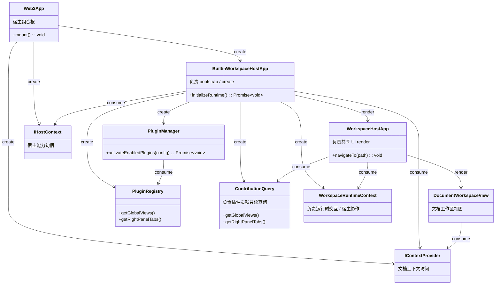

## Context

`apps/web` 目前既是现役浏览器宿主，又承载了宿主 bootstrap、plugin runtime 装配以及部分特性组合决策，因此 app 层每一次想要“变薄”，都必须在这个历史宿主内部完成，同时还要保证现有产品面不回退。

`app-web2` 不再继续在 `apps/web` 上原地做减法，而是新增一个并行的 `apps/web2` 宿主。这个新宿主必须满足 `ARCHITECTURE.zh-CN-new.md` 定义的依赖方向：app 层代码只能依赖 `packages/core` 与 `packages/ui`，plugin activation 只能通过共享 UI bootstrap surface 间接到达。同时，只要本次改动动到了 `packages/ui` 或 `packages/core`，就必须继续保证现有 `apps/web` 可用。

当前代码布局带来三个关键约束：
- `packages/ui` 已经拥有 `WorkspaceHostApp` 和路由 helper，但 `apps/web` 仍在 `apps/web/src/pluginConfig.ts` 中直接装配 plugin runtime。
- `packages/plugin-system` 已经具备 builtin plugin 装配能力，但如果直接暴露给 `apps/web2`，就会违反目标依赖图。
- `apps/web` 必须作为过渡期基线继续工作，因此共享 bootstrap 的抽取不能成为只服务 `web2`、却让旧 `web` 退化的捷径。

本 change 额外遵循一个收敛原则：**不为未来设计，需要时再重构拆分，否则按简单的来（类越少越好）**。因此，只删除当前仅用于打包结果的中间对象；但对于当前职责已经不同的对象，仍保留独立建模。

同时，这个 change 还遵循一条兼容性硬约束：`apps/web2` 是并行新增宿主，而不是对现有 `apps/web` 的立即替换。只要本次改动动到了共享层，就必须保证创建 `web2` 后原有 `web app` 仍可启动、构建并继续渲染当前运行面。

## Goals / Non-Goals

**Goals:**
- 新增 `apps/web2` 宿主包，使其能够启动共享 workspace，并覆盖正常 Web 运行所需的核心流程。
- 保证 `apps/web2` 在 workspace package 维度上的直接依赖仅限 `@packages/core` 与 `@packages/ui`。
- 将 builtin workspace runtime 的装配收敛到 `packages/ui` 导出的 bootstrap surface 后面，避免 app 层直接 import `packages/plugin-system`。
- 让 `apps/web2` 默认采用不包含任务宿主逻辑的组合方式，使新 app 层不再承载 task 特定逻辑。
- 在抽取共享 bootstrap 的同时，保持 `apps/web` 运行可用。
- 为 `apps/web2` 提供独立的测试与构建入口，便于单独验证新宿主。
- 以兼容迁移层的方式引入 `web2`，避免为了新宿主而破坏旧 `web` 的既有入口面。

**Non-Goals:**
- 本 change 不删除或替换 `apps/web`。
- 本 change 不继续深挖 `packages/ui` 中仍然属于业务逻辑的部分。
- 本 change 不重设计 server API、sync storage protocol 或 provider capability contract。
- 本 change 不把 desktop 或 extension 迁移到新的 bootstrap surface。
- 本 change 不为 `apps/web2` 加入 task 宿主逻辑。

## Decisions

### 1. 以并行宿主方式引入 `apps/web2`，而不是继续原地重构 `apps/web`

Files to add/change:
- `/Users/quanzhou/Workspace/JARVIS/apps/web2/package.json`
- `/Users/quanzhou/Workspace/JARVIS/apps/web2/index.html`
- `/Users/quanzhou/Workspace/JARVIS/apps/web2/vite.config.ts`
- `/Users/quanzhou/Workspace/JARVIS/apps/web2/tsconfig.json`
- `/Users/quanzhou/Workspace/JARVIS/apps/web2/tsconfig.typecheck.json`
- `/Users/quanzhou/Workspace/JARVIS/apps/web2/vitest.config.ts`
- `/Users/quanzhou/Workspace/JARVIS/apps/web2/playwright.config.ts`
- `/Users/quanzhou/Workspace/JARVIS/apps/web2/src/main.ts`
- `/Users/quanzhou/Workspace/JARVIS/apps/web2/src/App.vue`
- `/Users/quanzhou/Workspace/JARVIS/apps/web2/src/router.ts`
- `/Users/quanzhou/Workspace/JARVIS/apps/web2/src/context/createWeb2HostContext.ts`
- `/Users/quanzhou/Workspace/JARVIS/apps/web2/src/context/createWeb2ContextProvider.ts`
- `/Users/quanzhou/Workspace/JARVIS/apps/web2/src/runtime/createWeb2RuntimeOptions.ts`

Signatures:
```ts
export function navigateTo(path: ChatRoutePath): void;
export function isRouteActive(path: ChatRoutePath): boolean;
export function createWeb2HostContext(): IHostContext;
export interface CreateWeb2ContextProviderOptions
  extends Pick<HttpContextProviderOptions, 'fetchImpl' | 'baseUrl'>,
    ResolveContextBaseUrlOptions {}
export function createWeb2ContextProvider(
  options?: CreateWeb2ContextProviderOptions,
): HttpContextProvider;
export function createWeb2RuntimeOptions(): CreateBuiltinWorkspaceRuntimeOptions;
```

Change description:
- `apps/web2` 作为新的干净组合根，其职责只包括 app bootstrap、host context wiring、环境/配置读取，以及挂载共享 host shell。
- 新 app 复用 `apps/web` 已验证过的路由与 i18n 组织方式，但不再携带对 `plugin-system` 的直接 import，也不再承载 task 特定组合逻辑。
- `apps/web2` 提供独立的 test/build/dev 入口，以便在不扰动旧 Web 宿主的情况下逐步引入。

Alternative considered:
- 继续在 `apps/web` 上做减法，直到它满足目标边界。
- Rejected，因为旧宿主本身就是当前耦合的来源；让它同时承担“迁移目标”和“过渡宿主”两种角色，只会让 app 层清理更慢、更危险。

### 2. 将 builtin workspace runtime 装配收口到 `packages/ui`，并删除仅用于打包结果的中间对象

Files to add/change:
- `/Users/quanzhou/Workspace/JARVIS/packages/ui/package.json`
- `/Users/quanzhou/Workspace/JARVIS/packages/ui/index.ts`
- `/Users/quanzhou/Workspace/JARVIS/packages/ui/src/bootstrap/loadPluginEnablementConfig.ts`
- `/Users/quanzhou/Workspace/JARVIS/packages/ui/src/bootstrap/createBuiltinWorkspaceRuntime.ts`
- `/Users/quanzhou/Workspace/JARVIS/packages/ui/src/views/BuiltinWorkspaceHostApp.vue`

Signatures:
```ts
export interface LoadPluginEnablementConfigOptions {
  storage?: Pick<Storage, 'getItem'>;
  storageKey?: string;
  defaultEnabledPluginIds: string[];
  fallbackToDefaultEnabled?: boolean;
}

export function loadPluginEnablementConfig(
  options: LoadPluginEnablementConfigOptions,
): PluginEnablementConfig;

export type WorkspaceHostRuntimeMode = 'web' | 'desktop' | 'extension';

export interface ContributionQuery {
  getGlobalViews(): readonly GlobalViewContribution[];
  getRightPanelTabs(): readonly RightPanelTabContribution[];
}

export interface CreateBuiltinWorkspaceRuntimeOptions {
  hostContext: IHostContext;
  runtimeMode: WorkspaceHostRuntimeMode;
  env?: Record<string, string | undefined>;
  isDevelopment?: boolean;
  storage?: Pick<Storage, 'getItem' | 'setItem'>;
  codexBaseUrl?: string;
  useMockRuntime?: boolean;
  useMockSync?: boolean;
  useMockHistoryProviders?: boolean;
  mockSyncKeyFallback?: string;
  createMockRuntime?: () => ModelProviderRuntime;
  createMockHistoryProvider?: (
    providerId: Exclude<ExternalHistoryProviderId, 'external-file'>,
  ) => IExternalConversationProvider;
  createProviderProxy?: (providerId: string) => IModelProvider | undefined;
  createHistoryProxy?: (
    providerId: Exclude<ExternalHistoryProviderId, 'external-file'>,
  ) => IExternalConversationProvider;
  pluginEnablement: PluginEnablementConfig;
}

export async function createBuiltinWorkspaceRuntime(
  options: CreateBuiltinWorkspaceRuntimeOptions,
): Promise<{
  contributionQuery: ContributionQuery;
  runtimeContext: WorkspaceRuntimeContext;
}>;
```

Change description:
- `packages/ui` 成为面向宿主的 builtin workspace runtime bootstrap surface，而 `packages/plugin-system` 继续作为该 bootstrap path 的内部依赖。
- 这样可以保持目标 DAG：`apps/web2 -> packages/ui -> packages/plugin-system -> plugins/*`。
- 当前 `apps/web` 里读取 localStorage 中 plugin enablement 的逻辑，需要迁移为可复用 helper，避免宿主重复维护插件装配规则。
- `BuiltinWorkspaceHostApp.vue` 的定位是“负责 bootstrap / create”；`WorkspaceHostApp` 的定位是“负责共享 UI render”。二者保留分层，是因为当前职责已经不同。
- `ContributionQuery` 保持独立，因为它的职责是“负责插件贡献只读查询”；`WorkspaceRuntimeContext` 保持独立，因为它的职责是“负责运行时交互 / 宿主协作”。两者当前即使一起传递，也不应混成一个对象。
- `BuiltinWorkspaceRuntime` 不再单独保留为结果容器；bootstrap 直接返回 `{ contributionQuery, runtimeContext }`，避免为了单纯打包两个对象而引入额外类型。
- 为了保证旧 `web` 可用，共享 bootstrap 的引入方式必须是“新增兼容能力”而不是“删除旧入口面”。也就是说，现有 `WorkspaceHostApp` 的消费形状和旧 `web` 的 `contextProvider + contributionQuery + runtimeContext` 渲染链在过渡期必须继续成立。

Alternative considered:
- 让 `apps/web2` 直接 import `packages/plugin-system` 的 `createBuiltinPluginRuntime()`。
- Rejected，因为这会把本次需要消除的依赖边再次写回 app 层。

### 3. 抽取共享 bootstrap 时，继续维持 `apps/web` 走旧入口面但共享新能力

Files to add/change:
- `/Users/quanzhou/Workspace/JARVIS/apps/web/src/App.vue`
- `/Users/quanzhou/Workspace/JARVIS/apps/web/src/pluginConfig.ts`
- `/Users/quanzhou/Workspace/JARVIS/apps/web/src/router.ts`
- `/Users/quanzhou/Workspace/JARVIS/apps/web/src/context/createWebHostContext.ts`
- `/Users/quanzhou/Workspace/JARVIS/apps/web/src/context/createWebContextProvider.ts`

Signatures:
```ts
export function loadPluginEnablementConfig(): PluginEnablementConfig;
export async function createPluginRuntime(
  config?: PluginEnablementConfig,
): Promise<{
  contributionQuery: ContributionQuery;
  runtimeContext: WorkspaceRuntimeContext;
}>;
```

Change description:
- `apps/web` 在整个 change 期间保持可用，但它可以改为复用新的 `packages/ui` bootstrap helper，而不必继续保留宿主本地拷贝。
- 兼容性要求是硬约束：只要共享 bootstrap 被抽出，就必须继续保证旧 web app 能 dev、build、typecheck，并通过相关回归验证。
- 这样可以避免“为了新架构单开一条新逻辑，旧宿主却渐渐腐坏”的假性进展。
- 旧 `web` 是否复用新 helper 属于实现选择，但不能把“切到新入口”当成本 change 的前置条件；`web2` 可以先走新入口，旧 `web` 仍保留既有入口面，只要兼容性不被破坏即可。

Alternative considered:
- 完全不碰 `apps/web`，让 `web2` 维护一套独立 bootstrap stack。
- Rejected，因为这会制造组合逻辑重复，反而让后续宿主迁移更难。

### 4. 明确让 `apps/web2` 在 app 层默认不含 task

Files to add/change:
- `/Users/quanzhou/Workspace/JARVIS/apps/web2/src/runtime/createWeb2RuntimeOptions.ts`
- `/Users/quanzhou/Workspace/JARVIS/apps/web2/src/App.vue`
- `/Users/quanzhou/Workspace/JARVIS/apps/web2/src/App.test.ts`
- `/Users/quanzhou/Workspace/JARVIS/apps/web2/tests/e2e/smoke.spec.ts`

Signatures:
```ts
export function createWeb2RuntimeOptions(): CreateBuiltinWorkspaceRuntimeOptions;
```

Change description:
- `apps/web2` 默认提供排除 `task-mgr` 的 enablement config，从而保证新宿主不在 app 层嵌入 task 特定组合。
- 新宿主仍然要能启动 knowledge workspace 和当前 Web 正常运行所需的 chat 相关 surface，但这些都通过共享 bootstrap options 获取，而不是由宿主自己拼装业务逻辑。
- 测试既要覆盖正向 surface，也要覆盖负向约束：宿主能启动、路由可用、workspace shell 正常渲染，同时默认不出现 task workspace 入口。

Alternative considered:
- 使用与 `apps/web` 相同的默认插件集，只要求 app 代码里不显式引用 task。
- Rejected，因为用户已经明确要求新 app “完全不含任务也无逻辑”，因此默认组合必须把 task 从宿主层拿掉。

### 5. 引入 `web2` 时同时验证新旧两个 Web 宿主

Files to add/change:
- `/Users/quanzhou/Workspace/JARVIS/apps/web2/src/App.test.ts`
- `/Users/quanzhou/Workspace/JARVIS/apps/web2/src/context/createWeb2ContextProvider.test.ts`
- `/Users/quanzhou/Workspace/JARVIS/apps/web2/playwright.config.ts`
- `/Users/quanzhou/Workspace/JARVIS/apps/web2/tests/e2e/smoke.spec.ts`
- `/Users/quanzhou/Workspace/JARVIS/apps/web/src/App.test.ts`（如共享 bootstrap 抽取导致断言需要同步）

Change description:
- 验证矩阵必须同时覆盖新宿主与旧宿主兼容性。
- 至少需要对 `web2` 运行 package-scoped unit/type/build 检查，并对 `web` 做针对性的启动与渲染兼容验证。
- `web2` 的 e2e 先聚焦最小闭环：启动宿主、进入 workspace shell、在 knowledge/chat surface 间切换，并确认默认不出现 task 入口。

Alternative considered:
- 只验证 `apps/web2`，因为它才是新增宿主。
- Rejected，因为用户已明确要求：只要本次改动涉及 `apps` 之外的共享层，就必须保证原有 `apps/web` 等仍然可用。

### 6. 对话标题与 Agent 视图重命名交互收敛到共享工作区规则

Files to add/change:
- `/Users/quanzhou/Workspace/JARVIS/packages/core/src/config.ts`
- `/Users/quanzhou/Workspace/JARVIS/plugins/ai-agent/src/store/chat.ts`
- `/Users/quanzhou/Workspace/JARVIS/plugins/ai-agent/src/components/AgentConversationPanel.vue`
- `/Users/quanzhou/Workspace/JARVIS/plugins/ai-agent/src/components/AgentDocumentConversationList.vue`

Signatures:
```ts
export interface LightweightModelConfig {
  provider: string;
  model: string;
  think?: boolean;
}

async renameLocalConversation(id: string, title: string): Promise<void>
```

Change description:
- 自动标题生成最终收敛为共享会话规则：标题基于首条问题生成，目标是尽可能短的短标题，中文最长不超过 10 个汉字。
- 标题生成使用可配置的轻量模型配置，而不是继承当前主对话的重模型或 thinking 配置；默认选择 ChatGPT Web（desktop）与 Codex（web2）的非 think 模型，供标题生成及其他轻量场景复用。
- Agent 视图中的会话重命名交互最终收敛为：入口放在列表工具条，详情区不暴露重命名按钮；触发后仅让当前选中的本地会话项进入列表内联编辑。
- 手动重命名只更新标题，不刷新 `updatedAt`，避免污染列表中“最近活动时间 / 变更日期”的语义。

Alternative considered:
- 在详情区标题位置直接内联编辑当前会话。
- Rejected，因为用户明确要求入口位于列表工具条，且实际编辑应发生在列表中的当前选中项，而不是详情头部。

## Mermaid Class Diagram



职责划分：
- `apps/web2` 只拥有宿主 bootstrap 和 host facts。
- `packages/ui` 拥有面向宿主的 bootstrap surface 与共享壳层渲染。
- `packages/plugin-system` 继续拥有插件激活内部机制。
- 插件位于 bootstrap 层之下，`apps/web2` 不直接 import 它们。
- 当前遵循“类越少越好”的收敛原则，因此删除 `BuiltinWorkspaceRuntime` 这一层结果容器；但 `ContributionQuery` 与 `WorkspaceRuntimeContext` 由于职责已经不同，继续保持独立。
- 在这套分层里，`BuiltinWorkspaceHostApp` 明确是“负责 bootstrap / create”的层，`WorkspaceHostApp` 明确是“负责共享 UI render”的层；`IHostContext` 与 `IContextProvider` 仍然由 app 创建，并在 UI bootstrap/render 链路中被消费。

## Risks / Trade-offs

- [共享 bootstrap 抽取导致 `apps/web` 回退] → 将 `apps/web` 纳入 typecheck、build 和定向运行验证矩阵，在这些检查通过前不视为完成。
- [为了让 `web2` 更干净而直接替换旧 `web` 入口] → 共享层只新增兼容能力，不删除旧入口面；旧 `web` 继续保留其既有 `contextProvider + contributionQuery + runtimeContext` 渲染链，直到后续 change 显式迁移。
- [UI bootstrap surface 长成宿主特化接口] → 把 `packages/ui` 新增导出严格限制在 runtime bootstrapping 与 shared shell rendering，不在其中埋入额外宿主分支。
- [默认无 task 组合误伤正常 surface] → 第一阶段只排除 `task-mgr` 默认启用，并验证 chat/knowledge 主流程仍完整可用。
- [新旧 app 长期并存导致 bootstrap 逻辑重复] → 让 `apps/web` 尽量复用新的 `packages/ui` helper path，而不是长期保留两套平行实现。
- [表面上 app 层变干净，但 `packages/ui` 仍带着业务逻辑] → 视为本 change 接受的临时债务，后续用独立 change 继续拆，不在本次扩 scope。

## Migration Plan

1. 先在 `packages/ui` 中增加新的 bootstrap helper，且以增量导出的方式提供。
2. 保持 `apps/web` 既有入口面继续可用；如需复用共享 helper，也不得改变其可观察行为。
3. 基于同一套 shared bootstrap surface 新建 `apps/web2`，并让其默认不启用 `task-mgr`。
4. 为 `web2` 增加独立测试与 e2e smoke 覆盖。
5. 先单独验证 `web2`，再回跑 `web` 的兼容性检查。
6. 在后续 change 显式切换默认宿主前，继续保留 `apps/web` 作为现役 Web 宿主。

Rollback strategy:
- 如果共享 bootstrap 抽取导致兼容性回退，先把 `apps/web` 恢复到当前本地 bootstrap path，再保留不影响旧宿主的 `web2` 独立脚手架。
- 如果 `web2` 自身不稳定，则不把它接入任何产品默认入口，继续由 `apps/web` 充当主宿主。

## Open Questions

- `apps/web2` 初期是否应继续沿用 `apps/web` 的用户可见 route path，还是仅使用独立端口/路由做并行开发？
- 本 change 内是否要把 `apps/web` 完全迁到 `BuiltinWorkspaceHostApp`，还是只要复用新的 bootstrap helper、并保证兼容性即可？
