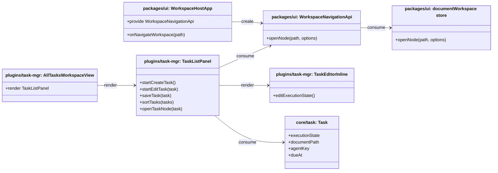

## Context

The current task UI already has a reusable data model and a shared list component path, but two gaps remain. First, the all-tasks workspace is still a dead-end review surface: users can inspect tasks globally, yet they cannot jump back into the corresponding workspace context and restore task-related panel state from the task itself. Second, task editing and prioritization are still optimized for a simple due-date list, not for daily execution flow. The current editor is panel-level rather than row-level, and the `Task` model has no persisted execution-state field.

This change touches multiple layers:

- `plugins/task-mgr` for task-row rendering, inline editing, ordering, and all-tasks behavior
- `packages/ui` for workspace-level navigation bridging
- `packages/core` and `packages/node` for the shared `Task` entity and persistence contract

The design must preserve current route ownership boundaries: route switching stays in the workspace host layer, while `documentWorkspace.openNode()` remains a workspace-state operation without route semantics.

## Goals / Non-Goals

**Goals:**

- Let users click a task in `/all-tasks` and reopen the corresponding workspace node with task-related tab/detail restoration.
- Keep task editing visually inline at the current row instead of moving the active editor to a panel-level slot.
- Default new tasks created from the all-tasks `today` shortcut to today's date without forcing a specific time.
- Persist a mutually exclusive execution-state field on `Task`.
- Sort tasks with execution-state values before tasks without one while preserving the existing due-date ordering inside each tier.
- Keep navigation ownership in `packages/ui` rather than pushing route semantics into the document workspace store.

**Non-Goals:**

- No generic tag system, multi-select state model, or user-defined execution states.
- No provider-side filtering based on execution state.
- No change to `today` / `planned` query semantics.
- No redesign of conversation routing or middle-pane document rendering.
- No `nodeId | path` dual navigation protocol in this change; the navigation bridge accepts workspace paths only.

## Decisions

### 1. Add a persisted `executionState` field to the shared `Task` contract

**Decision**

Extend the shared `Task` object with a mutually exclusive `executionState` field instead of introducing a separate UI-owned mapping.

Files to add/change:

- Change `/Users/quanzhou/Workspace/JARVIS/plugins/task-mgr/src/contracts/Task.ts`
- Change `/Users/quanzhou/Workspace/JARVIS/plugins/task-mgr/api.ts`
- Change `/Users/quanzhou/Workspace/JARVIS/packages/core/src/interfaces/ITaskProvider.ts`
- Change `/Users/quanzhou/Workspace/JARVIS/packages/node/src/context/FileSystemTaskProvider.ts`
- Change any task bridge/facade types that serialize or deserialize `Task`

Key signatures:

```ts
export type TaskExecutionState = 'doing' | 'morning' | 'afternoon' | 'evening' | null;

export interface Task {
  id: string;
  title: string;
  notes: string;
  executionState: TaskExecutionState;
}
```

Change description:

- `executionState` becomes part of the persisted task entity.
- The field is mutually exclusive and optional.
- Persistence and task bridges return the field directly on the `Task` object.

**Rationale**

Execution state is a stable task attribute, not transient UI state. Putting it on `Task` keeps sorting, rendering, persistence, and cross-host behavior aligned.

**Alternatives considered**

- Keep execution state in a separate mapping store: rejected because callers would need a second lookup path to sort and render tasks correctly.
- Treat execution state as a local all-tasks-only display flag: rejected because the requested behavior changes the shared task interaction model, not just one screen's decoration.

### 2. Keep route switching in `packages/ui` via `WorkspaceNavigationApi.openNode(path, options)`

**Decision**

Introduce a higher-level workspace navigation bridge that combines route restoration and node opening, but do not add route semantics to `documentWorkspace.openNode()`.

Files to add/change:

- Add `/Users/quanzhou/Workspace/JARVIS/packages/ui/src/plugins/injectionKeys.ts` or the appropriate UI injection module to expose a navigation API key
- Change `/Users/quanzhou/Workspace/JARVIS/packages/ui/src/views/WorkspaceHostApp.vue`
- Change `/Users/quanzhou/Workspace/JARVIS/packages/ui/src/store/documentWorkspace.ts`
- Change `/Users/quanzhou/Workspace/JARVIS/plugins/task-mgr/src/views/AllTasksWorkspaceView.vue`
- Change `/Users/quanzhou/Workspace/JARVIS/plugins/task-mgr/src/components/TaskListPanel.vue`

Key signatures:

```ts
interface WorkspaceNavigationApi {
  openNode(
    path: string,
    options?: {
      tab?: string | null;
      detailKey?: string | null;
    }
  ): Promise<void>;
}

async function openNode(path: string, options?: { selectedNodePath?: string | null; recordHistory?: boolean }): Promise<void>;
```

Change description:

- `WorkspaceHostApp` provides a `WorkspaceNavigationApi`.
- `WorkspaceNavigationApi.openNode(path, options)`:
  - navigates to `/`
  - restores the target workspace node
  - restores optional `tab` and `detailKey`
- `documentWorkspace.openNode()` remains a store-level node-opening method with no route switching behavior.
- Task rows consume only `WorkspaceNavigationApi`, not router/store sequencing directly.

**Rationale**

This keeps routing responsibilities in the workspace host while allowing plugins to request navigation in a stable, host-owned way.

**Alternatives considered**

- Extend `documentWorkspace.openNode()` to switch routes implicitly: rejected because it would mix app navigation concerns into a workspace-state store.
- Let the task plugin call router and store separately: rejected because it would leak host sequencing details into plugin code.

### 3. Move task editing from a panel-level editor slot to row-local rendering

**Decision**

Keep `TaskListPanel` as the owner of task mutations, but change its editing model so the active editor renders at the current task row.

Files to add/change:

- Change `/Users/quanzhou/Workspace/JARVIS/plugins/task-mgr/src/components/TaskListPanel.vue`
- Change `/Users/quanzhou/Workspace/JARVIS/plugins/task-mgr/src/components/TaskEditorInline.vue`
- Change `/Users/quanzhou/Workspace/JARVIS/plugins/task-mgr/src/components/TaskListPanel.test.ts`
- Change `/Users/quanzhou/Workspace/JARVIS/plugins/task-mgr/src/components/TaskEditorInline.test.ts`

Key signatures:

```ts
function startCreateTask(): void;
function startEditTask(task: Task): void;
function createDraftTask(): Task;
async function saveTask(task: Task): Promise<void>;
```

Change description:

- `TaskListPanel` still owns create/edit/save/delete/complete operations.
- The active draft or editing task is rendered inline in the list instead of above the list.
- Creating a task from all-tasks `today` initializes the draft with today's date and no concrete time.
- `TaskEditorInline` adds execution-state controls and keeps the date/time input split behavior.

**Rationale**

The requirement is specifically about entering edit mode without the list jumping away from the current row. This is a rendering-model change, not a new task-editing subsystem.

**Alternatives considered**

- Keep the existing panel-level editor and scroll back to the edited row: rejected because the user would still perceive a positional jump.
- Create a second editor component just for all-tasks: rejected because it would fork the shared task form behavior.

### 4. Apply execution-state-first ordering in `TaskListPanel`, not in providers

**Decision**

Treat execution-state ordering as list presentation logic implemented in `TaskListPanel`.

Files to add/change:

- Change `/Users/quanzhou/Workspace/JARVIS/plugins/task-mgr/src/components/TaskListPanel.vue`
- Change `/Users/quanzhou/Workspace/JARVIS/plugins/task-mgr/src/components/TaskListPanel.test.ts`

Key signatures:

```ts
function sortTasks(sourceTasks: Task[]): Task[];
function compareExecutionState(left: Task, right: Task): number;
```

Change description:

- Tasks are first partitioned by whether `executionState` is present.
- Tasks with an execution state come before tasks without one.
- Inside each tier, existing ordering remains:
  - dated tasks by ascending `dueAt`
  - same-date fallback by `updatedAt`
  - undated tasks last

**Rationale**

Execution state changes what users want to see first, not which tasks exist in a scope. That makes it a rendering concern rather than a provider concern.

**Alternatives considered**

- Add execution-state ordering in `ITaskProvider.getTasks(...)`: rejected because the provider contract is about scope and date subset semantics, not one screen's prioritization model.

## Risks / Trade-offs

- [Risk] Adding `executionState` to `Task` touches every serialization boundary. → Mitigation: update all task bridges together and add persistence/HTTP/mock coverage.
- [Risk] Route restoration and tab/detail restoration can race if the workspace host and task panel restore state independently. → Mitigation: centralize the sequencing in `WorkspaceNavigationApi.openNode(...)` so plugins make one request and the host owns ordering.
- [Risk] Row-local editing changes rendering structure and can invalidate existing task-row tests. → Mitigation: update tests around visible row ordering and editor placement before implementation proceeds.
- [Risk] Execution-state-first ordering may change expectations in scoped task views if the shared list is reused there. → Mitigation: make the requirement explicit in the modified task-management spec and update tests for both scoped and global surfaces.

## Migration Plan

- Add the `executionState` field in the shared `Task` type and persistence layer first. Old records without the field remain valid and normalize to `null`.
- Introduce `WorkspaceNavigationApi` in `packages/ui` before wiring task-row click behavior.
- Update `TaskListPanel` rendering and tests after the contract layer is in place.
- Rollback path:
  - remove `WorkspaceNavigationApi` usage from task views
  - ignore `executionState` on read/write while keeping older task data compatible
  - restore panel-level editor rendering if needed

## Open Questions

- None. This design intentionally fixes the navigation target protocol to workspace paths and keeps route ownership in `packages/ui`.


