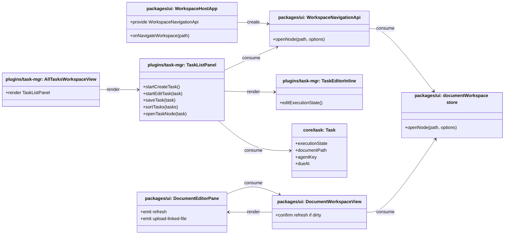

## Context

当前任务 UI 已经具备共享的数据模型和共享列表组件基础，但还存在两个明显缺口。第一，`/all-tasks` 仍然只是一个“查看列表”的聚合入口，用户在全局视图中看到任务后，无法从任务本身直接回到对应的 workspace 上下文，也无法恢复任务相关的面板状态。第二，任务编辑和排序仍然主要围绕“按截止时间展示的列表”设计，而不是围绕日常执行流设计；当前编辑器是面板级位置，`Task` 模型也没有持久化的执行状态字段。

这次修改会跨越多个层级：

- `plugins/task-mgr`：任务行渲染、内联编辑、列表排序、all-tasks 行为
- `packages/ui`：workspace 级导航桥接
- `packages/core` 和 `packages/node`：共享 `Task` 实体和持久化契约

本设计需要保持现有边界：路由切换仍归 `packages/ui` 的 workspace host 负责，`documentWorkspace.openNode()` 继续只是 workspace 内部状态操作，不承担路由语义。

## Goals / Non-Goals

**Goals:**

- 允许用户在 `/all-tasks` 点击任务后，重新打开对应 workspace 节点，并恢复任务相关的 tab/detail 状态。
- 保持任务编辑在当前 row 原地进入，而不是把编辑器移动到面板级位置。
- 在 all-tasks 的 `today` 快捷入口中新增任务时，默认填入今天日期，但不强制设置具体时间。
- 在 `Task` 上持久化一个互斥的执行状态字段。
- 让带执行状态的任务排在无执行状态任务之前，同时保持各分层内部沿用现有截止时间排序。
- 保持导航归属在 `packages/ui`，而不是把路由切换语义推给 document workspace store。

**Non-Goals:**

- 不引入通用标签体系、多选状态模型或用户自定义执行状态。
- 不在 provider 层增加基于执行状态的过滤。
- 不修改 `today` / `planned` 查询语义。
- 不重做 conversation 路由或中间文档 pane 渲染。
- 本次不引入 `nodeId | path` 双目标协议；导航桥接先只接受 workspace path。
- 不把 Markdown “上传新文件”扩展为完整资源管理器、批量上传器或任意目录上传能力。
- 不把“刷新当前文档”实现成单纯重新渲染编辑器，而必须是重新读取文件内容。

## Decisions

### 1. 在共享 `Task` 契约上增加持久化 `executionState` 字段

**Decision**

直接扩展共享 `Task` 对象，增加互斥的 `executionState` 字段，而不是额外引入一个 UI 专用映射表。

Files to add/change:

- Change `/Users/quanzhou/Workspace/JARVIS/plugins/task-mgr/src/contracts/Task.ts`
- Change `/Users/quanzhou/Workspace/JARVIS/plugins/task-mgr/api.ts`
- Change `/Users/quanzhou/Workspace/JARVIS/packages/core/src/interfaces/ITaskProvider.ts`
- Change `/Users/quanzhou/Workspace/JARVIS/packages/node/src/context/FileSystemTaskProvider.ts`
- Change 任何序列化 / 反序列化 `Task` 的 bridge/facade 类型

Key signatures:

```ts
export type TaskExecutionState = 'doing' | 'morning' | 'afternoon' | 'evening' | null;

export interface Task {
  id: string;
  title: string;
  notes: string;
  executionState: TaskExecutionState;
}
```

Change description:

- `executionState` 成为持久化任务实体的一部分。
- 该字段互斥且可为空。
- 持久化层与各 bridge 直接通过 `Task` 返回这个字段。

**Rationale**

执行状态是稳定的任务属性，而不是瞬时 UI 状态。放在 `Task` 上，可以让排序、渲染、持久化和跨宿主行为保持一致。

**Alternatives considered**

- 把执行状态放进独立映射 store：拒绝，因为排序和渲染都需要第二条查找链路。
- 把执行状态当作 all-tasks 局部显示标记：拒绝，因为需求改变的是共享任务交互模型，而不是单个页面的装饰。

### 2. 通过 `WorkspaceNavigationApi.openNode(path, options)` 承载路由 + 节点恢复，而不是扩展 `documentWorkspace.openNode()`

**Decision**

增加一个更高层的 workspace 导航桥接，用于组合“切回 workspace 路由”和“打开目标节点”，但不让 `documentWorkspace.openNode()` 获得隐式路由语义。

Files to add/change:

- Add `/Users/quanzhou/Workspace/JARVIS/packages/ui/src/plugins/injectionKeys.ts` 或对应的 UI 注入模块，暴露 navigation API key
- Change `/Users/quanzhou/Workspace/JARVIS/packages/ui/src/views/WorkspaceHostApp.vue`
- Change `/Users/quanzhou/Workspace/JARVIS/packages/ui/src/store/documentWorkspace.ts`
- Change `/Users/quanzhou/Workspace/JARVIS/plugins/task-mgr/src/views/AllTasksWorkspaceView.vue`
- Change `/Users/quanzhou/Workspace/JARVIS/plugins/task-mgr/src/components/TaskListPanel.vue`

Key signatures:

```ts
interface WorkspaceNavigationApi {
  openNode(
    path: string,
    options?: {
      tab?: string | null;
      detailKey?: string | null;
    }
  ): Promise<void>;
}

async function openNode(path: string, options?: { selectedNodePath?: string | null; recordHistory?: boolean }): Promise<void>;
```

Change description:

- `WorkspaceHostApp` 提供 `WorkspaceNavigationApi`。
- `WorkspaceNavigationApi.openNode(path, options)`：
  - 先切到 `/`
  - 再恢复目标 workspace 节点
  - 再恢复可选的 `tab` 和 `detailKey`
- `documentWorkspace.openNode()` 继续只是 store 级节点打开方法，不承担路由切换职责。
- 任务行只消费 `WorkspaceNavigationApi`，而不是直接拼 router/store 调用顺序。

**Rationale**

这样可以让路由职责继续留在 workspace host，同时让插件以稳定的宿主能力请求导航。

**Alternatives considered**

- 扩展 `documentWorkspace.openNode()`，让它隐式切路由：拒绝，因为这会把 app 级导航关注点混进 workspace state store。
- 让 task 插件分别调用 router 和 store：拒绝，因为这会把宿主时序细节泄露到插件里。

### 3. 把任务编辑从面板级编辑槽位改成 row 内渲染

**Decision**

继续让 `TaskListPanel` 统一拥有任务变更逻辑，但把编辑模型改成“当前 task row 原地渲染编辑器”。

Files to add/change:

- Change `/Users/quanzhou/Workspace/JARVIS/plugins/task-mgr/src/components/TaskListPanel.vue`
- Change `/Users/quanzhou/Workspace/JARVIS/plugins/task-mgr/src/components/TaskEditorInline.vue`
- Change `/Users/quanzhou/Workspace/JARVIS/plugins/task-mgr/src/components/TaskListPanel.test.ts`
- Change `/Users/quanzhou/Workspace/JARVIS/plugins/task-mgr/src/components/TaskEditorInline.test.ts`

Key signatures:

```ts
function startCreateTask(): void;
function startEditTask(task: Task): void;
function createDraftTask(): Task;
async function saveTask(task: Task): Promise<void>;
```

Change description:

- `TaskListPanel` 仍然负责 create/edit/save/delete/complete。
- 当前草稿或编辑中的 task 改为在列表中原地渲染，而不是显示在列表上方。
- 从 all-tasks `today` 新建任务时，草稿默认带“今天日期 + 无具体时间”。
- `TaskEditorInline` 新增执行状态选择，并继续保留日期/时间分离的输入模型。

**Rationale**

需求的关键是“进入编辑态时列表不要跳”。这本质上是渲染模型调整，而不是引入一个新的任务编辑子系统。

**Alternatives considered**

- 保持现有面板级编辑器，只在进入编辑后滚动回被编辑行：拒绝，因为用户仍然会感知到位置跳动。
- 为 all-tasks 单独做第二套编辑器：拒绝，因为共享任务表单行为会被分叉。

### 4. 在 `TaskListPanel` 中做执行状态优先排序，而不是下沉到 provider

**Decision**

把执行状态优先排序定义为列表展示逻辑，并在 `TaskListPanel` 中实现。

Files to add/change:

- Change `/Users/quanzhou/Workspace/JARVIS/plugins/task-mgr/src/components/TaskListPanel.vue`
- Change `/Users/quanzhou/Workspace/JARVIS/plugins/task-mgr/src/components/TaskListPanel.test.ts`

Key signatures:

```ts
function sortTasks(sourceTasks: Task[]): Task[];
function compareExecutionState(left: Task, right: Task): number;
```

Change description:

- 列表先按 `executionState` 是否存在分层。
- 有执行状态的任务排在无执行状态任务之前。
- 分层内部继续沿用现有排序：
  - 有日期任务按 `dueAt` 升序
  - 同日期兜底按 `updatedAt`
  - 无日期任务排在有日期任务之后

**Rationale**

执行状态改变的是“用户想先看到什么”，而不是“某个作用域里有哪些任务”，因此它属于渲染关注点，而不是 provider 关注点。

**Alternatives considered**

- 在 `ITaskProvider.getTasks(...)` 中做执行状态优先排序：拒绝，因为 provider 契约负责作用域和日期子集语义，不负责单个页面的优先级视图模型。

### 5. 通过新增 task query tag 承载“已规划 / backlog”，但不重定义现有 `planned`

**Decision**

为共享 `TaskQueryTag` 增加新的过滤语义，以复用现有 all-tasks 左侧快捷入口到 `TaskListPanel` 的数据流；保留现有 `planned` 继续表示“未来日期任务”，避免与新的“已规划”产品文案冲突。

Files to add/change:

- Change `/Users/quanzhou/Workspace/JARVIS/plugins/task-mgr/src/contracts/Task.ts`
- Change `/Users/quanzhou/Workspace/JARVIS/apps/server/src/routes/context.ts`
- Change `/Users/quanzhou/Workspace/JARVIS/packages/node/src/context/FileSystemTaskProvider.ts`
- Change `/Users/quanzhou/Workspace/JARVIS/plugins/ai-agent/src/testing/createMockContextProvider.ts`
- Change `/Users/quanzhou/Workspace/JARVIS/plugins/task-mgr/src/views/AllTasksWorkspaceView.vue`
- Change `/Users/quanzhou/Workspace/JARVIS/packages/ui/src/i18n/messages/en.ts`
- Change `/Users/quanzhou/Workspace/JARVIS/packages/ui/src/i18n/messages/zh-CN.ts`

Key signatures:

```ts
export type TaskQueryTag = 'all' | 'today' | 'planned' | 'scheduled' | 'backlog';

function matchesTaskTag(task: Task, tag: TaskQueryTag | null | undefined, now: number): boolean;
```

Change description:

- 新增内部 tag：
  - `scheduled`：`executionState !== null`
  - `backlog`：`dueAt === null && executionState === null`
- UI 文案层：
  - `scheduled` 显示为 `已规划`
  - `backlog` 显示为 `未规划 / backlog`
- `AllTasksWorkspaceView` 继续作为左侧 panel 的筛选入口拥有者。
- `TaskListPanel` 继续只消费 `tag`，不直接拥有筛选入口 UI。

**Rationale**

当前 all-tasks 视图已经用 `TaskQueryTag` 驱动左侧入口到列表的过滤链路。沿用这条链路可以最小化改动，并确保 server/provider/mock/provider 测试语义一致。

**Alternatives considered**

- 在前端先拉全量任务再本地过滤：拒绝，因为会让现有共享任务查询语义分裂成“有的入口走 provider，有的入口走 UI”。
- 复用 `planned` 表示“已规划”：拒绝，因为当前 `planned` 已经表示未来日期任务，重用会制造语义冲突。

### 6. 在 `DocumentEditorPane` 保持“插入链接”单入口，并把上传新文件归入资源链接流程

**Decision**

保留现有 Markdown 编辑器的“插入链接”单入口，在现有插链面板内增加“上传新文件”操作；上传能力由工作区视图/文档 store 提供，编辑器只负责触发和插链闭环。

Files to add/change:

- Change `/Users/quanzhou/Workspace/JARVIS/packages/ui/src/components/DocumentEditorPane.vue`
- Change `/Users/quanzhou/Workspace/JARVIS/packages/ui/src/views/DocumentWorkspaceView.vue`
- Change `/Users/quanzhou/Workspace/JARVIS/packages/ui/src/store/documentWorkspace.ts`

Key signatures:

```ts
type UploadLinkedFileInput = {
  sourceDocumentPath: string;
  file: File;
};

async function uploadLinkedFile(input: UploadLinkedFileInput): Promise<{ path: string }>;
```

Change description:

- 在 `DocumentEditorPane` 的现有插链弹层中增加“上传新文件”操作入口。
- 该入口归入资源链接语义，而不是新增独立工具栏按钮。
- 上传成功后，工作区树与可链接资源列表刷新。
- 编辑器立即将新文件对应的链接插入当前光标位置。

**Rationale**

当前 `DocumentEditorPane` 已经区分 Markdown 文档链接和 reference 资源链接。上传新文件本质上是“新增一个资源后立即插入链接”，因此应归入现有资源插链流程。

**Alternatives considered**

- 为上传新文件单独新增一个工具栏按钮：拒绝，因为会把同一类“插入链接目标”的交互拆成两条入口。
- 让 `DocumentEditorPane` 直接承担文件写入与树刷新：拒绝，因为组件不应直接拥有工作区持久化职责。

### 7. 在 `documentWorkspace` 中新增“重读当前文档” action，而不是复用 `openNode(activePath)`

**Decision**

新增一个明确表达“丢弃内存草稿并从文件系统重新读取当前文档”的 store action；`DocumentWorkspaceView` 负责 dirty 判断与确认交互，`DocumentEditorPane` 仅渲染按钮和发出事件。

Files to add/change:

- Change `/Users/quanzhou/Workspace/JARVIS/packages/ui/src/store/documentWorkspace.ts`
- Change `/Users/quanzhou/Workspace/JARVIS/packages/ui/src/views/DocumentWorkspaceView.vue`
- Change `/Users/quanzhou/Workspace/JARVIS/packages/ui/src/components/DocumentEditorPane.vue`

Key signatures:

```ts
async reloadActiveDocument(options?: { force?: boolean }): Promise<void>;
```

Change description:

- `reloadActiveDocument()` 读取 `activePath` 对应文件，更新 `activeDocument` 与 `draftContent`。
- 对当前 path 清除 dirty 状态，并同步 file-change / diff 展示状态。
- `DocumentWorkspaceView` 在触发刷新前先检查 `dirtyPaths[activePath]`：
  - 无未保存修改：直接重读
  - 有未保存修改：先弹确认，确认后以 `force: true` 执行
- `DocumentEditorPane` 新增“刷新当前文档”按钮，并向上发出 `refresh` 事件。

**Rationale**

现有 `openNode(activePath)` 会先 `flushActiveDocument()`，这与“放弃未保存草稿并重读文件”相冲突，因此需要独立 action 表达新的用户意图。

**Alternatives considered**

- 直接复用 `openNode(activePath)`：拒绝，因为它会优先保存，而不是刷新。
- 只重新渲染当前编辑器：拒绝，因为需求明确要求重新从文件系统读入当前文档。

## Risks / Trade-offs

- [Risk] 给 `Task` 增加 `executionState` 会触及所有序列化边界。 → Mitigation: 一次性更新所有 task bridge，并为 persistence / HTTP / mock 增补覆盖。
- [Risk] 路由恢复和 tab/detail 恢复可能发生时序竞争。 → Mitigation: 在 `WorkspaceNavigationApi.openNode(...)` 中集中管理顺序，让插件只发一次导航请求。
- [Risk] row 内编辑会改变渲染结构，导致现有任务行测试失效。 → Mitigation: 先更新围绕任务行可见顺序和编辑器位置的测试，再进入实现。
- [Risk] 如果共享列表同时用于 scoped task view，执行状态优先排序会改变这些视图的默认顺序。 → Mitigation: 在修改后的 task-management spec 中显式定义这项行为，并同步更新 scoped/global 两类测试。
- [Risk] 新增 task tag 可能造成 provider / server / mock 语义不一致。 → Mitigation: 以 `TaskQueryTag` 为单一契约源，一次性补齐真实 provider、server normalize、mock provider 和组件测试。
- [Risk] 上传新文件后如果树与可链接资源列表刷新时序不稳，插链可能指向旧列表。 → Mitigation: 将上传结果直接返回新路径，并在插链前显式等待工作区刷新完成。
- [Risk] “刷新当前文档”可能意外丢失未保存内容。 → Mitigation: dirty 时强制确认，且刷新逻辑集中在 store action 中，避免组件各自实现。

## Migration Plan

- 先在共享 `Task` 类型和持久化层中加入 `executionState` 字段。旧数据没有该字段时，一律归一化为 `null`。
- 在 `packages/ui` 先引入 `WorkspaceNavigationApi`，再接上任务行点击导航行为。
- 在契约层完成后，再修改 `TaskListPanel` 的渲染和测试。
- 在新增 task query tag 后，再扩 all-tasks 左侧 panel 文案与筛选入口，确保旧 `planned` 语义保持不变。
- 在 Markdown 编辑器侧，先补工作区 store/view 能力，再接入 `DocumentEditorPane` 按钮和插链交互。
- 回滚路径：
  - 去掉 task view 对 `WorkspaceNavigationApi` 的使用
  - 读写层忽略 `executionState`，保持旧任务数据兼容
  - 必要时恢复到面板级编辑渲染
  - 去掉新增 task tag，并恢复 all-tasks 左侧 panel 到既有入口集合
  - 去掉文档刷新/上传入口，保留现有插链与保存逻辑

## Open Questions

- 无。本设计明确把导航目标协议固定为 workspace path，并保持路由归属在 `packages/ui`。


