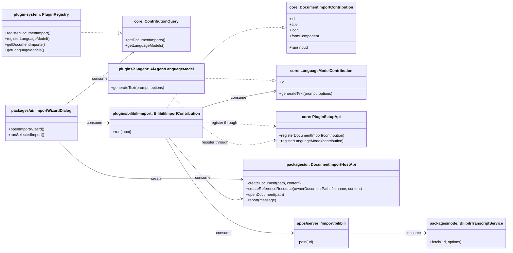

## Context

JARVIS already has the foundations needed to host a document import feature, but they are not yet composed into a real import workflow. The workspace can create and edit Markdown documents, the plugin system can inject feature-owned UI and workflows, the server can expose thin data-source APIs, and the knowledge workspace already has a protected `references/` resource pattern. What is missing is a capability that turns an external resource into one or more Markdown documents through a plugin-owned import pipeline.

This change crosses multiple layers:

- `packages/core`: shared plugin contribution contracts
- `packages/plugin-system`: contribution registration/query runtime
- `packages/ui`: import button, wizard host, and host-side document/reference helpers
- `packages/node` + `apps/server`: thin Bilibili transcript-fetching backend
- `plugins/ai-agent`: language-model contribution provider
- `plugins/bilibili-import`: first real import-source plugin

The design must preserve the repo's existing boundaries:

- Hosts stay thin and do not own import business rules.
- `packages/ui` may host the generic workspace shell and import wizard host, but not Bilibili-specific logic or summary-generation policy.
- Import orchestration, source-specific parameter handling, and summary writing belong to plugins.
- Server remains a thin data-source boundary and MUST NOT become the owner of summary generation or document organization.

## Goals / Non-Goals

**Goals:**

- Add a generic import wizard that can host plugin-provided import sources.
- Deliver Bilibili import as the first real source, with transcript required and summary optional.
- Add a shared language-model contribution contract so import plugins can discover summary capability without hardcoding `ai-agent`.
- Reuse the existing `references/` resource pattern when transcript and summary are generated together.
- Keep Bilibili subtitle fetching behind a thin Node/server boundary backed by `yt-dlp`.

**Non-Goals:**

- No batch import or import history in this change.
- No timed subtitle artifact or subtitle editor workflow.
- No server-owned import orchestration, summary generation, or document writing.
- No generic multi-model ranking or prompt-management system for the new language-model contract.
- No Bilibili source beyond single-video URL import.

## Decisions

### 1. Replace document-creation-flow with a dedicated document-import contribution contract

**Decision**

Rename the existing document-creation flow extension point to `DocumentImportContribution` and reshape it around import-specific metadata and execution.

Files to add/change:

- Change `/Users/quanzhou/Workspace/JARVIS/packages/core/src/plugin` contribution contract files that define `DocumentCreationFlowContribution`, `PluginSetupApi`, and `ContributionQuery`
- Change `/Users/quanzhou/Workspace/JARVIS/packages/plugin-system/src/PluginRegistry.ts`
- Change `/Users/quanzhou/Workspace/JARVIS/packages/plugin-system/src/createScopedPluginSetupApi.ts`
- Change `/Users/quanzhou/Workspace/JARVIS/packages/plugin-system/src/createContributionQuery.ts`
- Change all current call sites and tests that still reference document-creation flows

Key signatures:

```ts
export interface DocumentImportContribution<TParams = unknown> {
  id: string;
  title: string;
  icon?: string;
  formComponent: Component;
  run(input: DocumentImportRunInput<TParams>): Promise<DocumentImportResult>;
}

export interface DocumentImportRunInput<TParams = unknown> {
  params: TParams;
  targetParentPath: string;
  hostApi: DocumentImportHostApi;
  signal?: AbortSignal;
}

export interface DocumentImportResult {
  primaryDocumentPath: string;
  createdPaths: string[];
}
```

Change description:

- The old “create a document” semantics become “import external content into documents”.
- Each contribution supplies a source-specific form component and a `run()` executor.
- The host owns generic lifecycle and document-opening behavior; the plugin owns source-specific import logic.

**Rationale**

The original document-creation-flow hook was scaffolding. This feature is its first real consumer, and the new contract should describe import semantics directly instead of stretching a generic “creation flow” abstraction.

**Alternatives considered**

- Keep the old name and only reinterpret it in documentation: rejected because the new workflow is not a generic “new document” variant; it is an external-resource import boundary.
- Put import source discovery directly in `packages/ui`: rejected because it would move plugin-owned capability registration into shared UI code.

### 2. Add a shared language-model contribution contract and let consumers use the first available model

**Decision**

Introduce `LanguageModelContribution` in `packages/core`, register it through the plugin system, and let import plugins consume `getLanguageModels()` and use the first available implementation.

Files to add/change:

- Change `/Users/quanzhou/Workspace/JARVIS/packages/core/src/plugin` contribution contracts
- Change `/Users/quanzhou/Workspace/JARVIS/packages/plugin-system/src/PluginRegistry.ts`
- Change `/Users/quanzhou/Workspace/JARVIS/packages/plugin-system/src/createScopedPluginSetupApi.ts`
- Change `/Users/quanzhou/Workspace/JARVIS/packages/plugin-system/src/createContributionQuery.ts`
- Change `/Users/quanzhou/Workspace/JARVIS/plugins/ai-agent/src/...` setup entry to register the contribution

Key signatures:

```ts
export interface LanguageModelContribution {
  id: string;
  generateText(
    prompt: string,
    options?: {
      system?: string;
      signal?: AbortSignal;
    }
  ): Promise<string>;
}

interface PluginSetupApi {
  registerLanguageModel(contribution: LanguageModelContribution): void;
}

interface ContributionQuery {
  getLanguageModels(): LanguageModelContribution[];
}
```

Change description:

- `ai-agent` becomes one provider of generic text-generation capability.
- Consumers such as the Bilibili import plugin ask the plugin system for language models instead of importing `ai-agent` internals.
- If no model is registered, summary generation is unavailable but transcript import still works.

**Rationale**

The requirement is not “Bilibili import depends on ai-agent”; it is “summary generation depends on a generic model capability”. This keeps model ownership inside plugins and keeps `packages/ui` and other plugins decoupled from AI implementation details.

**Alternatives considered**

- Call `ai-agent` directly from the import plugin: rejected because it creates a compile-time plugin-to-plugin dependency.
- Put summary generation in the server: rejected because summarization is business logic and should remain in the plugin boundary.

### 3. Host the wizard in `packages/ui` and inject a narrow document-import host API into plugins

**Decision**

Implement the modal wizard shell in `packages/ui`, but keep it generic by injecting a narrow host API into each import contribution's `run()` method.

Files to add/change:

- Add `/Users/quanzhou/Workspace/JARVIS/packages/ui/src/components/import/ImportWizardDialog.vue`
- Add `/Users/quanzhou/Workspace/JARVIS/packages/ui/src/components/import/ImportDocumentButton.vue`
- Change `/Users/quanzhou/Workspace/JARVIS/packages/ui/src/views/DocumentWorkspaceView.vue`
- Change `/Users/quanzhou/Workspace/JARVIS/packages/ui/src/store/documentWorkspace.ts`
- Add or change `/Users/quanzhou/Workspace/JARVIS/packages/ui/src/plugins/injectionKeys.ts` for import host access if needed

Key signatures:

```ts
export interface DocumentImportHostApi {
  createDocument(path: string, content: string): Promise<void>;
  createReferenceResource(
    ownerDocumentPath: string,
    filename: string,
    content: string
  ): Promise<{ resourcePath: string; relativePathFromOwner: string }>;
  openDocument(path: string): Promise<void>;
  report(message: { type: 'success' | 'error'; text: string }): void;
}

function openImportWizard(initialTargetPath?: string | null): void;
```

Change description:

- `packages/ui` owns the modal, step indicator, source selection, and generic execution-state rendering.
- The host API centralizes document writing, reference-resource creation, final document opening, and user feedback.
- The plugin receives only the abilities it needs and does not reimplement workspace write/open behavior.

**Rationale**

The wizard shell is workspace-core UI, but import-specific business logic is not. A narrow host API lets shared UI remain the host while keeping orchestration inside plugins.

**Alternatives considered**

- Let each plugin open its own modal and write documents directly: rejected because it duplicates shared flow structure and weakens workspace consistency.
- Put the full import orchestration in `packages/ui`: rejected because it would make shared UI own source-specific business rules.

### 4. Keep Bilibili transcript fetching as a thin server route backed by `yt-dlp`

**Decision**

Implement transcript fetching in Node/server through a focused service and HTTP route that returns only `{ title, transcript }`.

Files to add/change:

- Add `/Users/quanzhou/Workspace/JARVIS/packages/node/src/import/BilibiliTranscriptService.ts`
- Change `/Users/quanzhou/Workspace/JARVIS/packages/node/src/index.ts` or the node export barrel if needed
- Change `/Users/quanzhou/Workspace/JARVIS/apps/server/src/routes/...` to add `POST /import/bilibili`
- Change server startup wiring/tests that register routes

Key signatures:

```ts
export interface BilibiliTranscriptFetchResult {
  title: string;
  transcript: string;
}

export class BilibiliTranscriptService {
  async fetch(url: string, options?: { signal?: AbortSignal }): Promise<BilibiliTranscriptFetchResult>;
}
```

Change description:

- The Node service shells out to `yt-dlp`, retrieves title and subtitle data, and normalizes the output into plain transcript text.
- The server route exposes only a thin fetch API and does not decide whether summary generation happens or how documents are organized.
- Desktop hosts still use the same HTTP boundary through `environment.contextBaseUrl`.

**Rationale**

Fetching subtitles is an external-process/data-source concern that belongs on the Node side. Keeping the response thin avoids pushing import business logic into the server.

**Alternatives considered**

- Fetch Bilibili transcript directly in the browser/plugin: rejected because `yt-dlp` is a Node/external binary workflow.
- Return “ready-made Markdown documents” from the server: rejected because document organization and summary policy belong to the plugin layer.

### 5. Implement Bilibili as a standalone import plugin and reuse `references/` only for transcript-as-resource

**Decision**

Create a dedicated `plugins/bilibili-import` plugin that registers one import contribution. When summary is selected, the summary document becomes the primary document and the transcript is written under `references/` as a referenced resource; otherwise only the transcript document is created directly in the target directory.

Files to add/change:

- Add `/Users/quanzhou/Workspace/JARVIS/plugins/bilibili-import/` plugin package files
- Change builtin plugin lists in affected hosts under `/Users/quanzhou/Workspace/JARVIS/apps/*`
- Change `/Users/quanzhou/Workspace/JARVIS/plugins/ai-agent/src/...` only for language-model registration, not for Bilibili logic

Key signatures:

```ts
type BilibiliImportParams = {
  url: string;
  includeSummary: boolean;
  title: string;
};

async function run(input: DocumentImportRunInput<BilibiliImportParams>): Promise<DocumentImportResult>;
```

Change description:

- The plugin owns URL validation, source-specific form state, transcript fetch invocation, summary prompt composition, and document content assembly.
- Transcript-only path:
  - write `<title>.md` under the chosen directory
  - return it as `primaryDocumentPath`
- Transcript + summary path:
  - write transcript into the summary document's `references/`
  - write `<title>.md` as the summary document
  - link the transcript resource from the summary body

**Rationale**

This keeps the feature aligned with the architecture rule that optional business capability belongs to plugins, while also reusing the existing document-relative protected-resource model.

**Alternatives considered**

- Put Bilibili import inside `packages/ui`: rejected because it would make shared UI own a concrete external-source workflow.
- Always create both transcript and summary documents side by side: rejected because the requirement explicitly wants transcript to become a referenced resource when summary exists.

## Risks / Trade-offs

- [Risk] Renaming an existing extension point can break current plugin setup/query call sites. → Mitigation: change all contract, registry, and consumer sites in one refactor and keep names aligned across core, runtime, and UI.
- [Risk] `yt-dlp` availability differs by runtime environment. → Mitigation: keep the failure stage explicit (`fetch transcript`) and require environment setup documentation plus route-level error reporting.
- [Risk] The first-available language-model policy may be simplistic when multiple model providers exist. → Mitigation: keep the initial contract minimal and document that model selection policy is out of scope for this change.
- [Risk] Creating transcript resources under `references/` can produce partial files if later summary generation fails. → Mitigation: stage the flow so summary text is prepared before final writes, and only persist files once all required generation steps have succeeded.

## Migration Plan

- Step 1: refactor the shared plugin contracts and runtime registry from document-creation-flow to document-import, and add language-model contribution support.
- Step 2: add the import wizard host UI in `packages/ui`.
- Step 3: add `BilibiliTranscriptService` and the server route.
- Step 4: register `LanguageModelContribution` from `ai-agent`.
- Step 5: add and enable the new `bilibili-import` plugin in frontend hosts.
- Rollback:
  - remove the new builtin plugin from hosts
  - hide the import button/wizard UI
  - keep old workspaces functional because the feature is additive
  - if needed, temporarily keep a compatibility alias for renamed contribution APIs during rollback or partial deploy windows

## Open Questions

- None for proposal readiness. Prompt wording for summary generation and the exact transcript Markdown formatting can be finalized during implementation without changing the architectural boundary.


