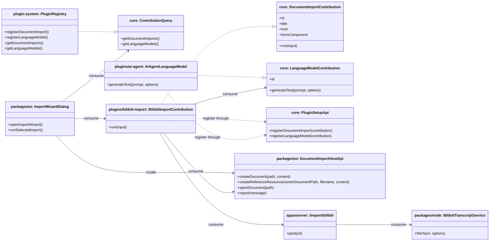

## Context

JARVIS 已经具备承载文档导入能力所需的几块基础：workspace 可以创建和编辑 Markdown 文档，插件系统可以注入能力归属明确的 UI 和工作流，server 可以暴露轻量数据源 API，knowledge workspace 也已经有受保护的 `references/` 资源组织模式。当前缺的不是单个底层能力，而是一条“通过插件拥有的导入流水线，把外部资源转成一个或多个 Markdown 文档”的完整能力。

这次改动会跨越多个层级：

- `packages/core`：共享插件贡献契约
- `packages/plugin-system`：贡献注册 / 查询运行时
- `packages/ui`：导入按钮、向导宿主、宿主侧文档 / 引用资源 helper
- `packages/node` + `apps/server`：轻量 B 站文字稿抓取后端
- `plugins/ai-agent`：大模型能力贡献提供者
- `plugins/bilibili-import`：第一个真实导入来源插件

本设计必须保持现有边界：

- host 继续保持薄壳，不拥有 import 业务规则。
- `packages/ui` 可以承载通用 workspace shell 和导入向导宿主，但不能拥有 B 站特定逻辑或总结策略。
- 导入编排、来源参数处理、总结文档写入属于插件。
- server 继续是薄数据源边界，不能演化成总结生成或文档组织的拥有者。

## Goals / Non-Goals

**Goals:**

- 新增一个可承载插件导入来源的通用导入向导。
- 落地 B 站导入作为第一个真实来源：文字稿必选、总结稿可选。
- 新增共享的 `LanguageModelContribution` 契约，使导入插件可以发现总结能力而不是写死依赖 `ai-agent`。
- 在“文字稿 + 总结稿”路径下复用现有 `references/` 受保护资源模式。
- 通过 `yt-dlp` 把 B 站文字稿抓取保持在薄 Node/server 边界内。

**Non-Goals:**

- 本次不做批量导入或导入历史。
- 不做带时间轴的字幕产物或字幕编辑流。
- 不把导入编排、总结生成、文档写入下沉到 server。
- 不为新的大模型契约引入通用多模型排序或 prompt 管理系统。
- 不扩展到 B 站以外来源，当前仅支持单视频 URL。

## Decisions

### 1. 用专门的 `DocumentImportContribution` 契约替换 document-creation-flow

**Decision**

将现有 document-creation flow 扩展点重命名为 `DocumentImportContribution`，并把契约形状直接调整为导入语义。

Files to add/change:

- Change `/Users/quanzhou/Workspace/JARVIS/packages/core/src/plugin` 下定义 `DocumentCreationFlowContribution`、`PluginSetupApi`、`ContributionQuery` 的贡献契约文件
- Change `/Users/quanzhou/Workspace/JARVIS/packages/plugin-system/src/PluginRegistry.ts`
- Change `/Users/quanzhou/Workspace/JARVIS/packages/plugin-system/src/createScopedPluginSetupApi.ts`
- Change `/Users/quanzhou/Workspace/JARVIS/packages/plugin-system/src/createContributionQuery.ts`
- Change 所有仍引用 document-creation flow 的调用点和测试

Key signatures:

```ts
export interface DocumentImportContribution<TParams = unknown> {
  id: string;
  title: string;
  icon?: string;
  formComponent: Component;
  run(input: DocumentImportRunInput<TParams>): Promise<DocumentImportResult>;
}

export interface DocumentImportRunInput<TParams = unknown> {
  params: TParams;
  targetParentPath: string;
  hostApi: DocumentImportHostApi;
  signal?: AbortSignal;
}

export interface DocumentImportResult {
  primaryDocumentPath: string;
  createdPaths: string[];
}
```

Change description:

- 旧的“创建一个文档”语义，改成“把外部内容导入为文档”。
- 每个 contribution 提供来源特定的表单组件和 `run()` 执行入口。
- host 负责通用生命周期和打开文档，插件负责来源特定的导入逻辑。

**Rationale**

原来的 document-creation-flow 只是脚手架。本需求是它的第一个真实消费方，新的契约应该直接表达 import 语义，而不是继续拉伸一个泛化但失真的“创建流程”抽象。

**Alternatives considered**

- 保留旧名称，只在文档里重新解释：拒绝，因为这个新工作流不是泛化“新建文档”的一个变种，而是一个清晰的外部资源导入边界。
- 让 `packages/ui` 直接拥有导入来源发现：拒绝，因为这会把插件能力注册逻辑移回共享 UI。

### 2. 新增共享 `LanguageModelContribution` 契约，消费方只取第一个可用模型

**Decision**

在 `packages/core` 中引入 `LanguageModelContribution`，通过 plugin system 注册，并让导入插件通过 `getLanguageModels()` 消费第一个可用实现。

Files to add/change:

- Change `/Users/quanzhou/Workspace/JARVIS/packages/core/src/plugin` 贡献契约
- Change `/Users/quanzhou/Workspace/JARVIS/packages/plugin-system/src/PluginRegistry.ts`
- Change `/Users/quanzhou/Workspace/JARVIS/packages/plugin-system/src/createScopedPluginSetupApi.ts`
- Change `/Users/quanzhou/Workspace/JARVIS/packages/plugin-system/src/createContributionQuery.ts`
- Change `/Users/quanzhou/Workspace/JARVIS/plugins/ai-agent/src/...` 的 setup 入口，用于注册该 contribution

Key signatures:

```ts
export interface LanguageModelContribution {
  id: string;
  generateText(
    prompt: string,
    options?: {
      system?: string;
      signal?: AbortSignal;
    }
  ): Promise<string>;
}

interface PluginSetupApi {
  registerLanguageModel(contribution: LanguageModelContribution): void;
}

interface ContributionQuery {
  getLanguageModels(): LanguageModelContribution[];
}
```

Change description:

- `ai-agent` 成为通用文本生成能力的一个提供者。
- B 站导入插件这类消费方通过 plugin system 查询 language model，而不是直接 import `ai-agent` 内部实现。
- 如果没有任何模型注册，则总结稿不可用，但文字稿导入仍可正常执行。

**Rationale**

这里的需求不是“B 站导入依赖 ai-agent”，而是“总结依赖一个通用的大模型能力”。这样可以保持模型能力仍然归插件所有，同时让 `packages/ui` 和其他插件不依赖 AI 具体实现。

**Alternatives considered**

- 让导入插件直接调用 `ai-agent`：拒绝，因为会形成插件到插件的编译期依赖。
- 把总结放到 server 做：拒绝，因为总结属于业务逻辑，应该留在插件边界内。

### 3. 在 `packages/ui` 中承载向导壳层，并向插件注入窄接口 `DocumentImportHostApi`

**Decision**

在 `packages/ui` 中实现模态向导壳层，但通过一个窄的 host API 保持其通用性，并把这个 API 注入到各 import contribution 的 `run()` 中。

Files to add/change:

- Add `/Users/quanzhou/Workspace/JARVIS/packages/ui/src/components/import/ImportWizardDialog.vue`
- Add `/Users/quanzhou/Workspace/JARVIS/packages/ui/src/components/import/ImportDocumentButton.vue`
- Change `/Users/quanzhou/Workspace/JARVIS/packages/ui/src/views/DocumentWorkspaceView.vue`
- Change `/Users/quanzhou/Workspace/JARVIS/packages/ui/src/store/documentWorkspace.ts`
- Add 或 Change `/Users/quanzhou/Workspace/JARVIS/packages/ui/src/plugins/injectionKeys.ts`，如需要用于暴露 import host 能力

Key signatures:

```ts
export interface DocumentImportHostApi {
  createDocument(path: string, content: string): Promise<void>;
  createReferenceResource(
    ownerDocumentPath: string,
    filename: string,
    content: string
  ): Promise<{ resourcePath: string; relativePathFromOwner: string }>;
  openDocument(path: string): Promise<void>;
  report(message: { type: 'success' | 'error'; text: string }): void;
}

function openImportWizard(initialTargetPath?: string | null): void;
```

Change description:

- `packages/ui` 拥有模态框、步骤指示器、来源选择和通用执行态渲染。
- Host API 统一封装建文档、创建 `references/` 资源、最终打开文档和消息反馈。
- 插件只拿到所需能力，不需要自己重写 workspace 的写盘 / 打开逻辑。

**Rationale**

向导壳层属于 workspace-core UI，但 import-specific 业务逻辑不属于。通过窄 host API，可以让共享 UI 保持“宿主”角色，同时把编排逻辑仍留在插件中。

**Alternatives considered**

- 让每个插件自己弹 modal、自己写文档：拒绝，因为会重复通用流程结构，也会削弱 workspace 一致性。
- 把完整导入编排写进 `packages/ui`：拒绝，因为这会让共享 UI 拥有来源特定业务规则。

### 4. 把 B 站文字稿抓取保持在薄 server 路由，底层由 `yt-dlp` 驱动

**Decision**

在 Node/server 侧通过一个聚焦服务和 HTTP 路由实现文字稿抓取，仅返回 `{ title, transcript }`。

Files to add/change:

- Add `/Users/quanzhou/Workspace/JARVIS/packages/node/src/import/BilibiliTranscriptService.ts`
- Change `/Users/quanzhou/Workspace/JARVIS/packages/node/src/index.ts` 或 node export barrel（如需要）
- Change `/Users/quanzhou/Workspace/JARVIS/apps/server/src/routes/...` 以新增 `POST /import/bilibili`
- Change server 启动 wiring / 测试中与该路由注册相关的部分

Key signatures:

```ts
export interface BilibiliTranscriptFetchResult {
  title: string;
  transcript: string;
}

export class BilibiliTranscriptService {
  async fetch(url: string, options?: { signal?: AbortSignal }): Promise<BilibiliTranscriptFetchResult>;
}
```

Change description:

- Node service 通过 `yt-dlp` 子进程抓标题和字幕，再归一化为纯文本文字稿。
- Server 路由只暴露一个薄抓取 API，不决定是否要做总结，也不决定文档如何组织。
- Desktop 形态也继续通过 `environment.contextBaseUrl` 走同一条 HTTP 边界。

**Rationale**

抓字幕是一个外部进程 / 数据源访问问题，属于 Node 侧职责。保持返回值足够薄，可以避免导入业务逻辑滑入 server。

**Alternatives considered**

- 在浏览器 / 插件侧直接抓 B 站字幕：拒绝，因为 `yt-dlp` 是 Node / 外部二进制链路。
- 让 server 返回“拼好的 Markdown 文档”：拒绝，因为文档组织和总结策略属于插件层。

### 5. 用独立 `bilibili-import` 插件承载首个来源，并仅在“总结存在”时复用 `references/`

**Decision**

创建独立的 `plugins/bilibili-import` 插件，注册一个 import contribution。当勾选总结稿时，总结稿是主文档，文字稿写入其 `references/` 目录作为引用资源；否则只在目标目录直接创建文字稿文档。

Files to add/change:

- Add `/Users/quanzhou/Workspace/JARVIS/plugins/bilibili-import/` 插件包文件
- Change `/Users/quanzhou/Workspace/JARVIS/apps/*` 下受影响宿主的 builtin plugin list
- Change `/Users/quanzhou/Workspace/JARVIS/plugins/ai-agent/src/...` 仅用于 language-model 注册，不承载 B 站导入逻辑

Key signatures:

```ts
type BilibiliImportParams = {
  url: string;
  includeSummary: boolean;
  title: string;
};

async function run(input: DocumentImportRunInput<BilibiliImportParams>): Promise<DocumentImportResult>;
```

Change description:

- 该插件拥有 URL 校验、来源表单状态、文字稿抓取调用、总结 prompt 组装、文档内容拼装。
- 仅文字稿路径：
  - 在目标目录写入 `<title>.md`
  - 将其作为 `primaryDocumentPath` 返回
- 文字稿 + 总结稿路径：
  - 先把文字稿写入总结文档的 `references/`
  - 再写 `<title>.md` 作为总结稿主文档
  - 在总结正文中以资源引用链接文字稿

**Rationale**

这符合仓库的架构原则：可选业务能力归插件所有。同时也复用了现有文档相对路径的受保护资源模型。

**Alternatives considered**

- 把 B 站导入放进 `packages/ui`：拒绝，因为这会让共享 UI 拥有一个具体外部来源工作流。
- 无论是否总结都并排创建两份普通文档：拒绝，因为需求明确要求“有总结稿时，文字稿应作为引用资源”。

## Risks / Trade-offs

- [Risk] 重命名一个现有扩展点可能打断当前 plugin setup/query 调用点。 → Mitigation: 一次性联动修改 core、runtime 和 consumer，并保持命名在各层严格一致。
- [Risk] `yt-dlp` 在不同运行环境中的可用性不同。 → Mitigation: 把失败阶段明确标记为 `fetch transcript`，并要求补环境说明和路由级错误反馈。
- [Risk] “取第一个可用 language model”在多模型存在时可能过于简单。 → Mitigation: 先保持第一版契约最小化，并明确把模型选择策略排除在本 change 之外。
- [Risk] 在 `references/` 下创建文字稿资源时，如果后续总结失败，可能留下半成品文件。 → Mitigation: 让总结文本先准备完成，再进入最终写盘阶段；只在所需生成步骤都成功后统一落盘。

## Migration Plan

- Step 1：先把共享插件契约和运行时注册表从 document-creation-flow 重构为 document-import，并补上 language-model contribution 支持。
- Step 2：在 `packages/ui` 加入导入向导宿主 UI。
- Step 3：新增 `BilibiliTranscriptService` 与 server 路由。
- Step 4：让 `ai-agent` 注册 `LanguageModelContribution`。
- Step 5：新增并启用 `bilibili-import` 插件到前端宿主。
- Rollback：
  - 从宿主中移除新的 builtin plugin
  - 隐藏导入按钮 / 向导 UI
  - 现有 workspace 仍可正常工作，因为该能力是增量式的
  - 如需处理中途回滚窗口，可临时保留重命名 contribution API 的兼容别名

## Open Questions

- 对 proposal 阶段而言没有阻塞问题。总结 prompt 的具体措辞，以及文字稿 Markdown 的具体格式，可以在实现阶段细化，而不改变当前架构边界。


