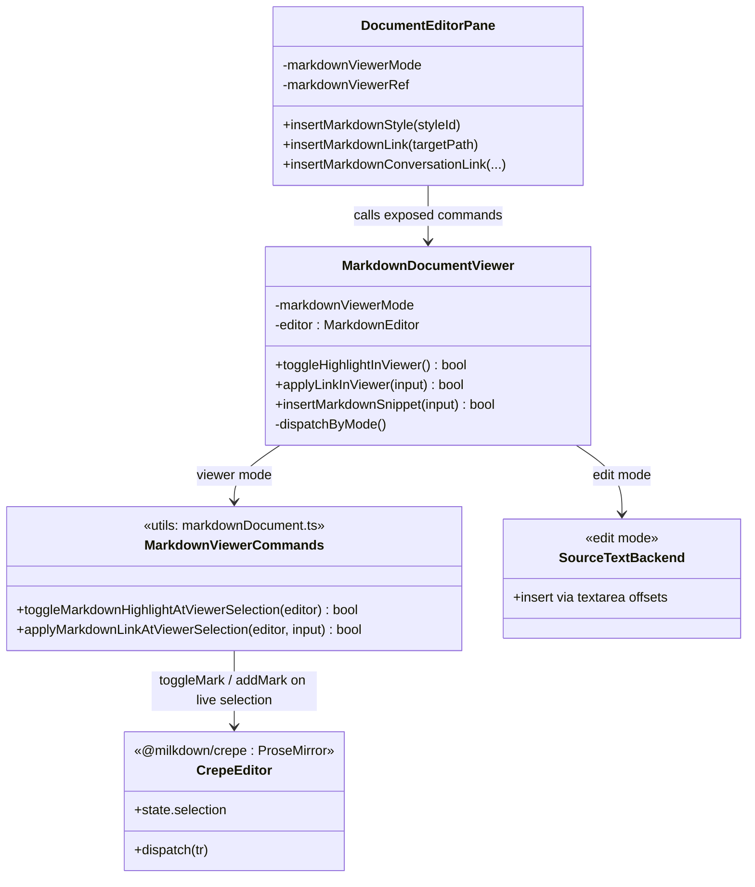

> **Language**: English | [中文](design.zh-CN.md)

## Context

The Markdown surface in the knowledge workspace has two editing modes backed by different models:
- **viewer** mode renders a live, editable Crepe/Milkdown (ProseMirror) document. The selection is a ProseMirror selection.
- **edit** mode shows the raw Markdown source in a `<textarea>`. The selection is string offsets.

All insert/format features (link, conversation link, resource/image, highlight) are currently authored against the **source-string** model. To make them work while the user is in viewer mode, `DocumentEditorPane` does a hidden `viewer → edit → viewer` round-trip (`runMarkdownInsertion`) and maps the rendered DOM selection back to source offsets (`prepareMarkdownSelectionFromViewer` → `captureRenderableMarkdownSelection` → `resolveMarkdownSourceSelection` + empty-block fallbacks).

This bridge is the shared root cause of two defects: the viewport jumps to the top after a successful edit (the mode round-trip rebuilds the editor and the scroll-restore hack captures the wrong value), and inserted links land inaccurately (DOM→offset mapping is lossy). A prototype already proved that toggling the highlight mark directly on the live ProseMirror selection eliminates the scroll jump entirely.

## Goals / Non-Goals

**Goals:**
- Make viewer-mode formatting/link operations apply directly to the live editor selection, in place, with no mode round-trip and no editor rebuild.
- Guarantee viewport preservation for viewer-mode operations.
- Make viewer-mode link insertion land at the user's actual selection accurately.
- Keep the serialized Markdown identical to today (`==...==`, `[label](href)`).
- Keep raw-source (edit) mode behavior unchanged.

**Non-Goals:**
- No change to raw-source edit-mode insertion mechanics.
- No new user-facing toolbar actions (bold/italic etc.) in this change — only highlight and link/conversation-link migrate; the architecture leaves room for them later.
- Block-level node insertion (PDF embed, image) full migration is out of scope here; it remains on the source path until a follow-up (the inline/block-aware node insertion is noted as a risk/open item).

## Decisions

### Decision 1: One semantic command, two native backends, dispatch by active surface
Each editing feature is expressed once as a semantic operation and applied by the backend native to the current mode. Viewer mode uses ProseMirror commands on the live `EditorView`; edit mode keeps the existing textarea source-string path. The dispatch lives in `MarkdownDocumentViewer` keyed on `props.markdownViewerMode`.

**Alternative considered:** keep the source-string round-trip and only patch the scroll-capture watcher. Rejected as long-term: it leaves the lossy offset mapping (link position bug) in place and keeps the mode-flicker.

### Decision 2: Highlight via `toggleMark` on the live selection (prototype, already merged)
- File: `packages/ui/src/utils/markdownDocument.ts`
  - Added: `export function toggleMarkdownHighlightAtViewerSelection(editor: MarkdownEditor): boolean` — resolves `editorViewCtx`, gets `schema.marks.highlight`, runs `toggleMark(markType)(view.state, view.dispatch, view)`.
  - Import: `toggleMark` from `@milkdown/kit/prose/commands`.
- File: `packages/ui/src/document-viewers/MarkdownDocumentViewer.vue`
  - Added: `function toggleHighlightInViewer(): boolean` + exposed via `defineExpose`.
- File: `packages/ui/src/components/DocumentEditorPane.vue`
  - `insertMarkdownStyleSnippetIntoDocument`: in viewer mode call `toggleHighlightInViewer()` and close the picker; do not round-trip.

### Decision 3: Link / conversation-link via link mark on the live selection
- File: `packages/ui/src/utils/markdownDocument.ts`
  - Added: `export function applyMarkdownLinkAtViewerSelection(editor: MarkdownEditor, input: { label: string; href: string }): boolean` — resolves `editorViewCtx`, gets `schema.marks.link`; if the selection is non-empty, `addMark` the link (attrs `{ href }`) over the range (selected text becomes the label); if collapsed, insert a text node `label` and apply the link mark to it; dispatch a single transaction.
- File: `packages/ui/src/document-viewers/MarkdownDocumentViewer.vue`
  - Change `insertMarkdownLink` / `insertMarkdownConversationLink` so that in viewer mode they delegate to `applyMarkdownLinkAtViewerSelection` instead of the source path. Keep edit-mode behavior via the existing source insertion.
- File: `packages/ui/src/components/DocumentEditorPane.vue`
  - Route the document-link and conversation-link insertion in viewer mode to the in-place command (drop `prepareMarkdownSelectionFromViewer` + `runMarkdownInsertion` for those viewer paths).

### Decision 4: Centralized dispatch + viewport-preservation cleanup
- File: `packages/ui/src/document-viewers/MarkdownDocumentViewer.vue`
  - Introduce a single dispatch surface (e.g. extend `defineExpose` with `toggleHighlightInViewer` / `applyLinkInViewer`) and ensure no exposed viewer command triggers a mode switch.
  - Once viewer operations no longer switch modes, simplify the mode-switch scroll-capture watcher (the `pendingModeSwitchViewerScrollTop` overwrite that caused the jump) — capture only when leaving viewer.
- File: `packages/ui/src/components/DocumentEditorPane.vue`
  - Remove the viewer branches of `runMarkdownInsertion` for migrated operations; edit-mode keeps using it.

### Decision 5: Retire the source-offset mapping for viewer operations
Once link insertion is migrated, the viewer-only helpers become dead: `prepareMarkdownSelectionFromViewer`, `captureRenderableMarkdownSelection`, `resolveMarkdownSourceSelection`, `resolveEmptyBlockMarkdownOffset`, `resolveEmptyBlockAnchorFallback`. Remove them and their tests. Keep `insertMarkdownAtViewerSelection` only if reused by the (deferred) block-node path; otherwise replace it with the inline/block-aware version.

### Class diagram

## Risks / Trade-offs

- [Link mark attrs / schema mismatch in Crepe] → Verify the Crepe link mark name (`link`) and required attrs at runtime; guard with `schema.marks.link` presence check and fall back to a no-op + warning (mirrors the highlight command's defensive style).
- [Collapsed-selection link semantics differ from source path] → Define explicitly: collapsed caret inserts `label` text carrying the link mark; covered by a spec scenario and an e2e case.
- [Block-level snippets (PDF/image) still on source path] → Out of scope; keep the source path for those until a follow-up adds inline/block-aware node insertion. Document as an open item so the offset-mapping removal does not break them.
- [Removing offset-mapping helpers breaks tests/imports] → Remove in the same step as the last viewer consumer; run the full unit + e2e suite to confirm no regression.
- [markdownUpdated echo loop] → Rely on the existing `lastKnownMarkdown`-guarded `syncEditorContent`; the same path already supports typing directly in the viewer, so in-place commands reuse a proven sync route.

## Migration Plan

1. P1 (done as prototype): highlight via `toggleMark`, new+old coexisting; old viewer fallback temporarily commented for verification.
2. P2: link / conversation-link via `applyMarkdownLinkAtViewerSelection`; new+old coexisting behind the mode dispatch.
3. P3 (optional/follow-up): inline/block-aware node insertion for resource/image; migrate those viewer paths.
4. P4: delete the source-offset mapping subsystem + viewer round-trip; simplify the scroll watcher.
5. Update `workspace.dsl` global class diagram and `ARCHITECTURE.zh-CN.md` to reflect the command/backend split (at archive time, merge the class diagram into the global one).

Rollback: each phase keeps the source path until its viewer path is verified; reverting a phase restores the previous behavior because the dispatch is keyed per operation.

## Open Questions

- Should conversation-link and document-link share one `applyMarkdownLinkAtViewerSelection`, or stay as thin wrappers building `{ label, href }`? (Leaning: one shared command, wrappers build the href.)
- Is the deferred block-node path (P3) needed before removing offset mapping (P4), or can block snippets keep a minimal source path indefinitely?
